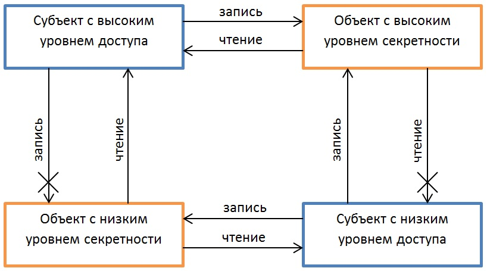

# Лабораторная работа №1. Тема: "Введение в ОС Astra Linux 1.7. Использование справочных ресурсов."
Цель работы
----------
познакомиться с операционной системой AstraLinux 1.7;

познакомиться с основной справочной базой данной ОС.

Оборудование, ПО:
----------
Доступ к сайтам в домене *.astralinux.ru.

Ход работы:
----------
ОС Astra Linux 1.7 предназначена для применения в составе информационных (автоматизированных)
систем в цели обработки и защиты информации любой категории доступа.
В состав операциионной системы входит:

* Ядро ОС с подддержкой технлогии виртуализации;

* средства установки и настройки ОС;

* системные и сервисные утилиты;

* базовые сетевые службы;

* средства организации единого пространства пользователей (механизм, позволяющий обеспечить сквозную аутентификацию, интеграцию в доменные службы);

* программы защиты графической системы, комплексы печати;

* офисное ПО;

* И все-все, что есть в репозитории Astra Linux.


# Это нужно знать!


---------------


**Информация о репозиториях  Astra Linux x.7 (релиз 1.7 для x86_64-битной архитектур и 4.7 для ARM-архитектуры )**

# Основной репозиторий
deb https://dl.astralinux.ru/astra/stable/1.7_x86-64/repository-main/     1.7_x86-64 main contrib non-free

**Что содержит?**
Основной репозиторий AstraLinux, реализующий все функциональные возможности и параметры безопасности. Проходит сертификацию, имеет только крупные обновления.

# Оперативные обновления основного репозитория
deb https://dl.astralinux.ru/astra/stable/1.7_x86-64/repository-update/   1.7_x86-64 main contrib non-free

**Что содержит?**
Обновленный основной репозиторий AstraLinux, развивается быстрее, чем ветка main, содержит новые пакеты.  Сертифицирован.

# Базовый репозиторий
deb https://dl.astralinux.ru/astra/stable/1.7_x86-64/repository-base/     1.7_x86-64 main contrib non-free

**Что содержит?**
Все пакеты основного репозитория, пакеты с библиотеками и средства разработки ПО. В целом, зачастую для выполнения административных работ достаточно подключить только этот репозиторий. Сертифицирован.

# Расширенный репозиторий
deb https://dl.astralinux.ru/astra/stable/1.7_x86-64/repository-extended/ 1.7_x86-64 main contrib non-free

**Что содержит?**
Содержит дополнительное ПО, которое может функционировать в среде Astra Linux.
Данное ПО не дорабатывается для реализации функций безопасности и может быть несовместимо с последними оперативными обновлениями основного/базового репозиториев. Такая несовместимость фиксируется в бюллетене оперативного обновления и устраняется по мере обновления расширенного репозитория.

# Расширенный репозиторий (компонент astra-ce)
deb https://dl.astralinux.ru/astra/stable/1.7_x86-64/repository-extended/ 1.7_x86-64 astra-ce

**Что содержит?**
Содержит ПО, которое имеет возможность запускаться на AstraLinux 1.7 в режиме без поддержки политик безопасности Astra Linux. Например, Java приложения или СУБД PostgreSQL без мандатного контроля доступа. В данный момент в репозиторий входит:
  * СУБД PostgreSQL-11
  * Почтовая служба Exim4 - 4.92
  * MariaDB - 10.3
  * Java OpenJDK - 11 версии
  * LibreOffice - основная часть офисного ПО входит в репозиторий base\main, но часть пакетов LibreOffice может требовать Java для корректного отображения.
Данный репозиторий подключается следующими шагами:
в /etc/apt/sources.list или в файл c именем *.list в директории /etc/apt/sources.list.d/ добавьте строчку подключения репозитория.
Или воспользуйтесь командой:

```console
$ sudo astra-ce deb https://dl.astralinux.ru/astra/stable/1.7_x86-64/repository-extended/
```
И выполните команду переключения в режим Common Edition
```console
$ sudo astra-ce on
```

Если режим совместимости вам более не требуется, выполните команду:
```console
$ sudo astra-ce off
```

Проверить состояние совместимости ОС можно командой:
```console
$ sudo astra-ce status
```
При этом, в зависимости от текущего состояния ОС, на экран выводится сообщение:

**CE репозиторий подключен**

или

**CE репозиторий не подключен**

В дальнейшем, при оперативном обновлении системы, чтобы не заменялись пакеты, которые вы устанавливали через режим совместимости можете зафиксировать версию установленной программы командой:
```console
$ sudo apt-mark hold postgresql-11
```
---------------

# Для выполнения своих основных задач AstraLinux использует следующие модули

**Индентификация и аутентификация**

Для задачи индентификации и аутентификации используется механизм PAM (Pluggable Authentication Modules), который представляет собой набор разделяемых библиотек, с помощью которых реализуется вход пользователей в систему. Параметры входа в систему описывается через файлы в директории /etc/pam.d. Например, система контролирует Kerberos-ключи, если компьютер был введен в домен LDAP. PAM может выполнять процедуру монтирования файловых ресурсов, исходя из прав доступа пользователя, контролировать функциональные возможности пользователя в системе, организовывать систему сквозной аутентификации.


**Дискреционное управление доступом**

Решение задачи дискреционного управления доступом выполняется стандартным механизмом для Linux-систем.
В системе присутствуют индентификаторы субъектов - индентификатор пользователя (UID) и индентификатор группы (GID), имеющих доступ к сущностям (чтение, запись, исполнение). Используя данный способ можно назначать права доступа на различных файлы и директории ФС.

**Мандатное управление доступом и мандатный контроль целостности**

Для понимания механизма мандатного управления доступом определены следующие термины:
 - Субьект доступа - тот, кто выполняет операцию (например, пользователь или процесс)
 - Объект доступа - то, с чем выполняется операция, которую контролирует мандатный контроль целостности (например, файл, архив и т.д.)
 - Контейнер - сущность доступа, который состоит из множества объектов доступа внутри (например, каталог с файлами).

 Каждому объекту и контейнеру могут быть присвоены определенные мандатные атрибуты:
 * Уровень конфиденциальности - определяет степень секретности документа (файла или каталога)  и уровень доступа у пользователя, который обращается к этому файлу. Субъекту с определенным уровнем целостности разрешено читать документы с таким же уровнем целостности или ниже.
 Уровни конфиденциальности бывают (размещено в порядке возрастания конфиденциальности):
   + Не секретно
   + ДСП (для служебного пользования)
   + Секретно
   + Совершенно секретно


Данный механизм называется "Модель безопасности Белла-ЛаПадулы".


Её визуализация представлена на рисунке ниже.

 

Как можно заметить, система несовершенна и имеет ряд недостатков.

С целью сделать её более гибкой, в AstraLinux внедрена система категорий конфиденциальности.

Постараемся привести  пример данной модели, из документа "Руководство по КСЗ. Часть 1 РУСБ.10015-01 97 01-1".

Представим, что у нас есть две категории "Яблоки" и "Апельсины". Мы наделили персонал, с уровнем доступа "Секретно"", полномочиями работать только с документами категории "Яблоки". Обращаться к документами категории "Апельсины", с тем же уровнем доступа "Секретно", данный персонал не сможет, ровно также как и передавать данные о документах "Яблоки" тем пользователям, кто работает с "Апельсинами". При этом, вероятно нам нужно дать универсальный доступ пользователю "Начальник", который может работать с документами любых категорий.

Итак, с помощью параметров  уровень конфиденциальности и категории конфиденциальности AstraLinux обеспечивает защиту от несанкционированной передачи информации:

* Невозможность прочитать информацию, к которой не предоставлен доступ:
  +  "нижним" уровням запрещено читать информацию с "верхних" уровней;
  +   всем запрещено читать информацию, на которую нет разрешенной категории конфиденциальности;
* Невозможность  передать информацию тому, кому не предоставлен доступ:
  +  "верхним" уровням запрещено записывать свою информацию на "нижние" уровни;
  +  всем запрещено передавать информацию тем, у кого нет соответствующей категории конфиденциальности.

**Целостность**

Атрибут Целостности в AstraLinux был применен на основе аналогичной модели 2007 года - MIC (Mandatory Integrity Control) всех ОС семейства Microsoft.

В общем, требование защиты целостности выглядит так:

**Субъект (процесс или пользователь), работающий на некотором уровне целостности, может записывать (изменять) только сущности (объекты) своего, или более низкого уровня (запись "вверх" запрещена).**

Чем-то похоже на уже описанный выше механизм уровней целостности, правда?

Основное отличие лишь в сфере применения. Атрибут целостности в AstraLinux призван защищать не информацию, хранимую на этом компьютере, а вычислительную машину в целом и её внутренние компоненты.

Классификацию уровней целостности легко представить в виде таблицы.

| Порядковый номер | Значение | Битовая маска | Комментарий
| -----------------| -------- | ------------- | -----------
| 0  | 000 | 0000 0000 | Нулевой уровень. "Низкий" |
| 1  | 001 | 0000 0001 | Уровень для сетевых сервисов |
| 2  | 002 | 0000 0010 | Уровень для Виртуализации |
| 3  | 004 | 0000 0100 | Уровень для специального ПО |
| 4  | 008 | 0000 1000 | Уровень графического сервера |
| 5  | 016 | 0001 0000 | По-умолчанию свободен, может быть использован для СУБД |
| 6  | 032 | 0010 0000 | Свободен |
| 7  | 064 | 0100 0000 | Высокий уровень. Уровень администратора |
| 8  | 128 | 1000 0000 | Высокий уровень. Уровень администратора в системах виртуалиации Брест |

**Внедрение ЭЦП**

Инструменты замкнутой программной среды позволяют использовать в AstraLinux  ЭЦП - электронную цифровую подпись.
В ядро Linux, применяемое в данном дистрибутиве, реализован модуль ядра digsig_verif, который поддерживает функционал загрузки, чтения и аутентификации в информационных системах черех ЭЦП (RuToken, Jacarta и т.п.)

**Системные ограничения и блокировки**

В операционной системе есть механизм блокировки действий пользователя. Основные настройки:
- Запрет установки ключа (бита) исполнения;
- блокировка консоли для пользователей;
- блокировка интерпретаторов;
- блокировка макросов;
- блокировка strace и ptrace;

Полный перечень ограничивающих функций безопасности и их описание приведены в РУСБ.10015-01 97 01-1.

**Фильтрация сетевого трафика**

В ОС AstraLinux в качестве межсетевого экрана используется UFW, с поддержкой следующего функционала:
- Фильтрация входящего и исходящего трафика
- Работа с протоколами IPv4 и IPv6
- Журналирование трафика
- NAT
- Маркировка трафика
- Приоретизация трафика, лимиты

**Виртуализация**

AstraLinux 1.7 поддерживает виртуализацию KVM.
Также возможно развернуть систему виртуализации Брест, в составе OpenNebula + KVM.


На этом первая работа из расширенного курса AstraLinux завершена.


Пожалуйста, выполните чистую установку AstraLinux 1.7 в режиме защищенности "Воронеж" или выше.

В случае, если у вас уже есть Astra Linux - убедитесь, что вы работаете в системе в режиме защищенности "Воронеж", а также включите Мандатный контроль целостности"

Приступим к практической работе **Работа с текстовой информацией в ОС Astra Linux**


# Практическая работа

1) На полученной виртуальной машине, включите режим поддержки Astra Common Edition, а затем установите пакет PosgreSQL-Server с Astra CE. 

2) Заблокируйте PosgreSQL-Server от удаления. 

3) Включите режим защищенности "Воронеж"


# Дополнительная информация:
1) Информация о репозиториях Astra Linux [Ссылка](https://wiki.astralinux.ru/pages/viewpage.action?pageId=158598882)
2) Информация о уровнях конфиденциальности [Ссылка](https://wiki.astralinux.ru/pages/viewpage.action?pageId=27362553)
3) Подборка материалов по Системам защиты информации в Astra Linux [Ссылка](https://telegra.ph/Podborka-materialov-po-SZI-Astra-Linux-11-25)
4) Документация [Ссылка](https://wiki.astralinux.ru/pages/viewpage.action?pageId=137563555)
5) Как переключать режимы защищенности в Astra Linux? [Ссылка](https://wiki.astralinux.ru/pages/viewpage.action?pageId=109020865)
