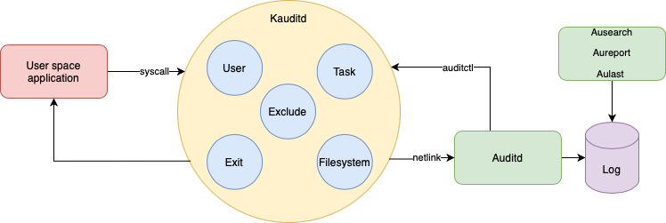
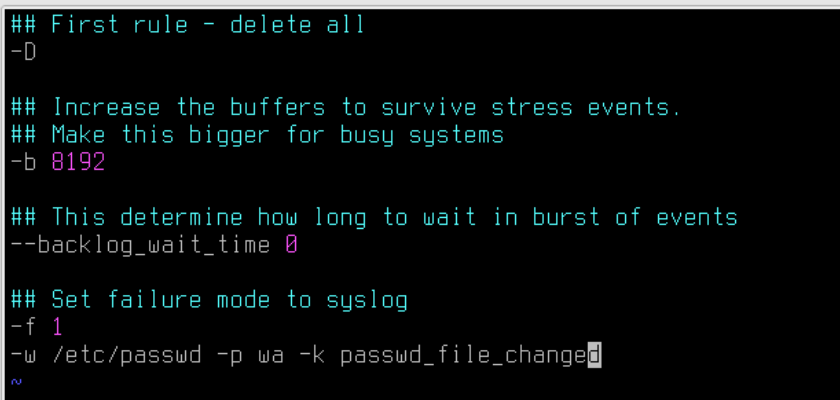
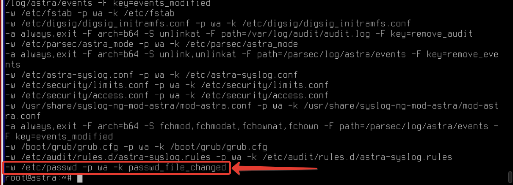
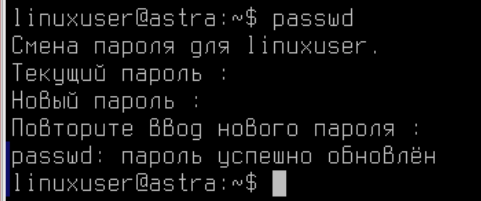
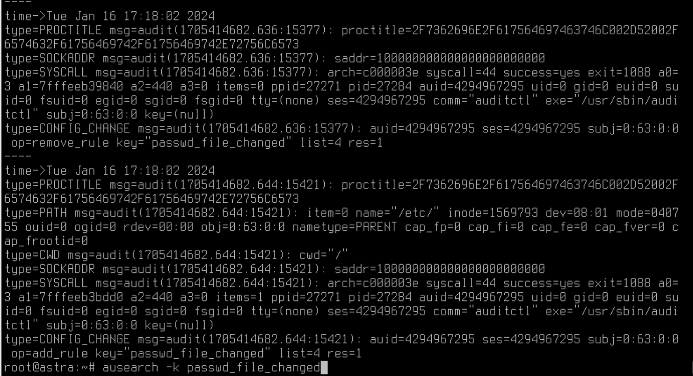
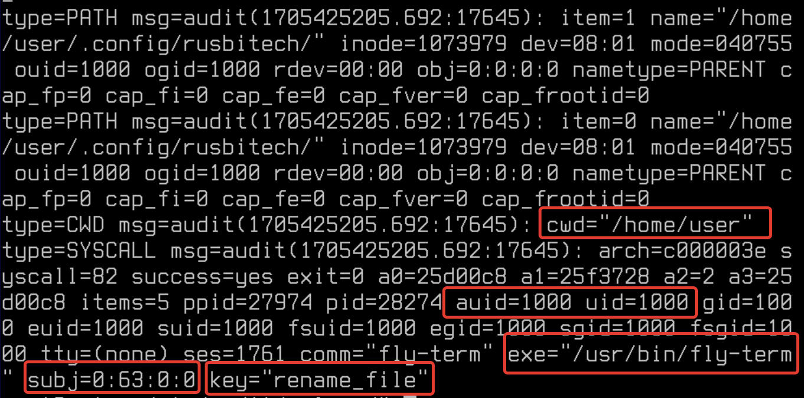

# Лабораторная работа №11. Тема: "Настройка подсистемы аудита в Astra Linux Special Edition"

Цель работы
----------
- Архитектура аудита;

- Правила протоколирования событий на Astra Linux;

- Утилиты управления аудитом;

- Журналирование. 


Оборудование, ПО:
----------

Виртуальная машина или компьютер под управлением ОС AstraLinux 1.7 в режиме защищенности "Воронеж" или выше.


# Чем займемся? 

Audit - это инструмент, который работает в любом Linux дистрибутиве. Его задача - отслеживать, что происходит в системе для мониторинга и контроля.

Audit умеет следить за - 

* Доступ к файлам;

* Изменение прав на файлы;

* Просмотр пользователей, изменивших конкретный файл;

* Обнаружение несанкционированных изменений; 

* Мониторинг системных вызовов и функций; 

* Обнаружение сбоев;

* Выполненные команды.

Схема работы подсистемы auditd можно визуализировать так - 




# Установка и настройка

Пакет audit входит в стандартную сборку Astra Linux и не требует дополнительных установок.

Конфигурация выполняется с помощью двух файлов:

1) auditd.conf - настройка самого демона;

2) audit.rules - настройка правил, используемых средством auditctl.

Чтобы настроить, какие именно события подвергать проверке, в структуре аудита используется файл правил с именем audit.rules.

Активные правила можно просмотреть с помощью опции -l:

```
auditctl -l
```

И, кстати, в Linux дистрибутивах по-умолчанию эти правила пустые, но не в Astra Linux! 

В Astra, уже выполнено несколько настроек, мы разберемся с тем что это за настройки, когда попробуем сами создать свои - будет намного легче.

Итак, чтобы выполнить, например, мониторинг файла конструкция будет такая - 

```
auditctl -a exit,always -F path=<имя_файла> -F perm=<разрешения>
```

И вот реальный пример - 

```
auditctl -a exit,always -F path=/etc/passwd -F perm=wa
```

В этом случае, ключ -F установит фильтры на файл указанный в path. Переменная path определяет, что создаст событие в системе (то есть, в этом случае кто файл изменит) Есть 4 типа доступа, похожие на разрешения файлов, но важно отметить, что между ними есть существенное различие:

* r=читать;

* w=писать;

* x=выполнить;

* a=изменить атрибут.

Ключ -a указывает список и действие. Допустимые списки: task, exit, user, exclude. Допустимые действия: never, always.

---------

Основные варианты списков:
exit - Добавить правило к списку, отвечающему за точки выхода из системных вызовов. Этот список применяется, когда необходимо создать событие для аудита, привязанное к точкам выхода из системных вызовов.

exclude - Добавить правило к списку, отвечающего за фильтрацию событий определенного типа. Этот список используется, чтобы отфильтровывать ненужные события. Например, если вы не хотите видеть avc сообщения, вы должны использовать этот список. Тип сообщения задается в поле msgtype.

Варианты действий:
always - установить контекст аудита. Всегда заполнять его во время входа в системный вызов и всегда генерировать запись во время выхода из системного вызова;
never - аудит не будет генерировать никаких записей. Это может быть использовано для подавления генерации событий. Обычно необходимо подавлять генерацию вверху списка, а не внизу, т.к. событие инициируется на первом совпавшем правиле.

---------
# Рассмотрим на практике

Попробуем добавить собственное постоянное правило в наш auditd.

Откроем конфигурационный файл Auditd

```
vim /etc/audit/rules.d/audit.rules
```

Добавим последнюю строку в данный файл

```
-w /etc/passwd -p wa -k passwd_file_changed
```



После внесения настроек в конфигурационный файл необходимо перезагрузить auditd 

```
systemctl restart auditd
```

Проверить, что правила применились можно командой - 

```
auditctl -l 
```



## А что мы сейчас сделали? 

Теперь, мы дополнительно контроллируем файл **/etc/passwd**. Применяемые в этой команде ключи: 

 - **-w** (where), указываем путь до контролируемого файла;

 - **-p** (permissions), в этом случае указываем контролируемые параметры, в нашем случае это запись, а также попытки изменить атрибуты доступа;

 - **-k** (key), в этом случае указывем ключ, по которому в событиях auditd будем производить поиск.


А как проверить? 

Попробуем сменить пользователю linuxuser пароль



А затем найдем события по ключу - 

```
ausearch -k passwd_file_changed
```



Ура! Теперь мы контролируем данный файл, и в случае попытки записи в этот файл - незамедлительно получим отчет об этом. 

## Попробуем настроить мониторинг еще чего-нибудь? 

```
-w /etc/sysctl.conf -p rwa -k configaccess
```

В этом случае мы проверяем, как часто файл читают, попытки редактирования и смены атрибутов.

В целом, файл /etc/sysctl.conf отвечает за настройку некоторых параметров ядра Linux. Он периодически прочитывается операционной системой, поэтому при настроенных параметрах сверху в логах вы сразу найдете события об этом файле.


**Обязательно попробуйте настроить и поискать события!**


Аудит системных вызовов позволяет отслеживать действия на сервере далеко за пределами уровня приложений. Вы можете отслеживать какие файлы были изменены и какой пользователь попытался это сделать. 


Синтаксис правил системных вызовов:

```
auditctl -a action,filter -S system_call -F field=value -k key_name
```

А теперь рассмотрим реальный пример - 

```
sudo auditctl -a always,exit -F arch=b64 -F "auid>=1000" -S rename -S renameat -k rename
```

В этом примере, мы настроили мониторинг событий, связанных с переименованием файлов. Система будет логировать через какую систему файл был переименован и каким пользователем. 

Проверим, например, под пользователем user создайте в домашней папке файл, а затем переименуйте его, а затем введите команду -  


```
ausearch -k rename
```


Вывод, конечно, пугающий! 

Но при вчитывании в строчки, можно заметить с каким уровнем целостности, какой пользователь и через какой инструмент вносит правки в файлы. 



# Приведем еще несколько примеров настроек для auditd

Контроль за выполнением команды **insmod** (данная команда выполнят установку модулей в ядро Linux)

```
auditctl -w /sbin/insmod -p x -k module_insert
```

Контроль за попыткой записать или изменить атрибуты файла /etc/selinux

```
auditctl -w /etc/selinux/ -p wa -k selinux_changes
```

Правило, регистрирующее все выполнение программы /bin/id - 

```
auditctl -a always,exit -F exe=/bin/id -F arch=b64 -S execve -k execution_bin_id
```

# Аудит журнальных файлов

Аудит журнальных файлов выполняется с помощью утилиты aureport, которая позволяет создавать сводные отчеты о событиях, записанных в файлах журнала Audit. По умолчанию все файлы audit.log находятся в каталоге /var/log/audit/ и запрашиваются для создания отчета.

Чтобы создать отчет для зарегистрированных событий за определенный промежуток времени, используйте следующую команду:

```
aureport --start <месяц>/<день>/<год> <часы>:<минуты>:<секунды> --end <месяц>/<день>/<год> <часы>:<минуты>:<секунды>
```

Например: 

```
aureport --start 07/15/2023 00:00:00 --end 09/12/2023 00:00:00
```


# Практическая работа

1) Добавьте правила в **/etc/audit/rules.d/audit.rules** или убедитесь, что ваше правило доступно к просмотру в выводе команды **auditctl -l**:

    * Отслеживание запуска определенного /usr/bin/vim/. Имя процесса отслеживания следует настроить - vim_execution.

    * Отслеживания обращения записи и чтения файла /etc/hosts. Имя процесса отслеживания следует настроить - access_hosts

2) Убедитесь, что при вводе команды **auditctl -l**, в списке правил встречаются сделанные вами настройки

# Заключение

В результате прохождения данного курса вы приобрели необходимые базовые навыки для эффективной работы с подсистемой Аудита в Astra Linux. Безусловно, данный инструмент имеет множество функций и особенностей, которые настраиваются индивидуально под конкретную задачу и инфраструктуру. 

Конечно, читать логи так - довольно неудобно, поэтому чаще всего данные события собирают на сервер для дальнейшей визуализации - это, например, MaxPatrol или Auditbeat.


В следующем материале вы познакомитесь с темой  - Red Book: настройка безопасной конфигурации для Astra Linux Special Edition 1.7

Благодарю за чтение и успехов вам в обучении!


# Дополнительная информация:
1) Auditd - документация от RedHat [Ссылка](https://access.redhat.com/documentation/ru-ru/red_hat_enterprise_linux/7/html/security_guide/sec-defining_audit_rules_and_controls)
2) Настройка auditd для обнаружения и расследования инцидентов  [Ссылка](https://habr.com/ru/articles/553036/)
3) Настройка и аудит системы Linux с помощью демона Auditd [Ссылка](https://1cloud.ru/help/security/audit-linux-c-pomoshju-auditd)
4) Аудит системных вызовов [Ссылка](https://habr.com/ru/companies/selectel/articles/267833/)

