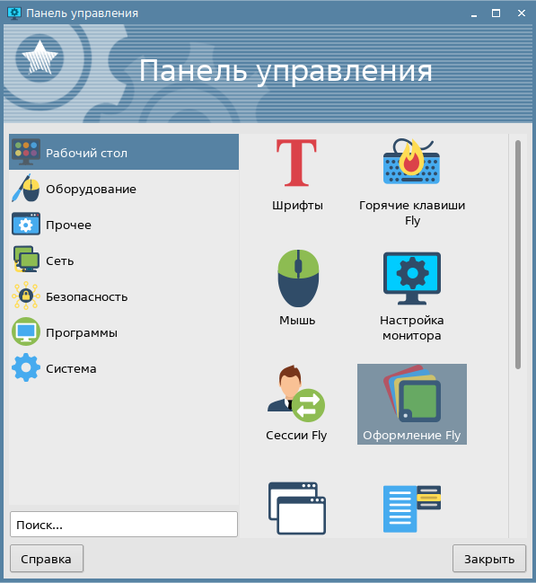
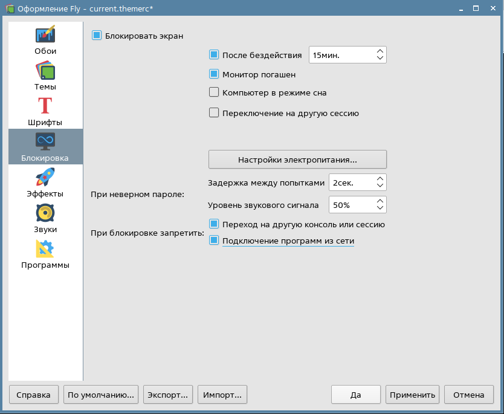
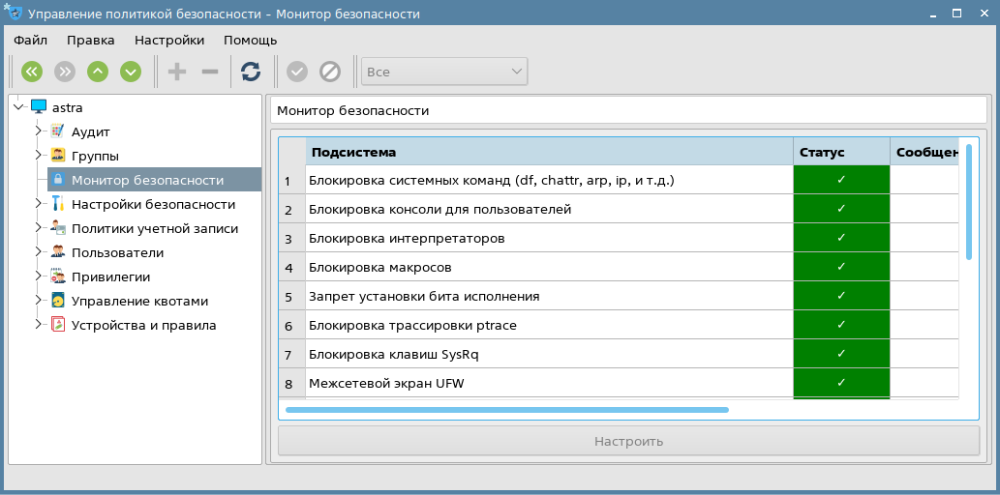

# Лабораторная работа №12. Тема: "Red Book: настройка безопасной конфигурации для Astra Linux Special Edition 1.7"

Цель работы
----------
- Ознакомиться с основными рекомендациями по безопасной настройке компьютера под управлением ОС Astra Linux;

- Получить навык настройки локальных политик безопасности;

- Получить навык настройки служб системы, для обеспечения защищенной работы. 


Оборудование, ПО:
----------

Виртуальная машина или компьютер под управлением ОС AstraLinux 1.7 в режиме защищенности "Воронеж" или выше.


# Чем займемся? 

В рамках последней лабораторной работы нам предстоит познакомиться с "Книгой рекомендаций" от разработчиков Astra Linux - Red Book. 


# Настройка безопасной конфигурации компьютера для работы с ОС Astra Linux

Начнем с настройки компьютера, на которую планируется установить операционную систему:

1) Если планируется использовать ОС в рекомендованном режиме очистки освобождающихся дисковых ресурсов, то исключить использование дисков SSD;

    Это связано с тем, что в SSD накопителях есть определенный цикл перезаписи, и при настройке параметров выше, SSD намного быстрее придет в негодность.

2) Установить "взломостойки" пароль на BIOS компьютера. "Взломостойкий", в понимании Astra Linux, это: 

   - Содержащий не менее 8 символов;

   - Не содержащий в себе никаких осмысленных слов (ни в каких раскладках);

   - Содержащий в себе буквы в различных регистрах, цифры и спецсимволы. 

3) При использовании процессоров Intel, рекомендуется отключить технологию Software Guard eXtensions (SGX). [Ссылка на уязвимость](https://bdu.fstec.ru/vul/2022-04966)


4) Обеспечить физическую защиту компьютера (различные пломбы, защитные крышки). 

5) Исключить использование беспроводных устройств. 

6) Отключить Wi-Fi и Bluetooth. Если Wi-Fi отключить нельзя, то настроить алгоритмы шифрования трафика (VPN или проксирование).

7) При наличии опций для процессоров Intel Execute Disable Bit (XD-Bit) и для процессоров AMD No Execute Bit (NX-Bit) включить их.  Это набор программных и аппаратных технологий, позволяющих задействовать режим, при котором запускать программы из области данных запрещается, что позволяет предотвратить атаки некоторых вредоносных программ (которые сохраняют код в области данных). Также с помощью данной функции выполняются дополнительные проверки содержимого памяти.

# Компьютер настроили, теперь можем перейти к настройки ОС. 

1) Установка ОС, в целом, обычная, за некоторым исключением. 

    - Рекомендуется использовать диски, на которых планируется хранить ОС, в режиме защитного преобразования дисков. Установить ОС в этом режиме можно вот так [Ссылка на документацию Astra Linux](https://wiki.astralinux.ru/pages/viewpage.action?pageId=36078012). По опыту, можно сказать, что система установленная на диске с шифрованием работает также, как и при обычной настройке. Но "починить" диск с использованием сторонних флешек или Live-образов будет практически невозможно. 

    -  В разделе установщика «Дополнительные настройки ОС» включить следующие функции подсистемы безопасности:

        1. **Запрет вывода меню загрузчика** — при включении данной функции будет запрещен вывод меню загрузчика GRUB 2. В процессе загрузки будет загружаться ядро ОС, выбранное по умолчанию;

        2. **Запрет трассировки ptrace** — при включении данной функции будет исключена возможность трассировки и отладки выполнения программного кода;

        3. **Запрос пароля для команды sudo** — при включении данной функции будет необходим ввод пароля при использовании механизма sudo;

        4. **Запрет установки бита исполнения** — при включении данной функции будет активирован режим запрета установки бита исполнения, обеспечивающий предотвращение несанкционированного запуска исполняемых файлов и сценариев для командной оболочки. Установка пакетов программ, создающих в ФС файлы с битом исполнения, будет завершаться с ошибкой. Запрет не распространяется на привилегированного пользователя root;

        5. **Запрет исполнения скриптов пользователя** — при включении данной функции блокируется несанкционированное использование интерпретатора для выполнения кода напрямую из командной строки или из неименованного канала (pipe). При этом сценарии, написанные для этих интерпретаторов, выполняются в штатном режиме (у файла скрипта при этом должны быть выставлены права на выполнение). Запрет исполнения скриптов не распространяется на пользователей из группы astra-admin;

        6. **Запрет исполнения макросов пользователя** — при включении данной функции будет блокировано исполнение макросов в стандартных приложениях;

        7. **Запрет консоли** — при включении данной функции будет блокирован консольный вход в систему для пользователя и запуск консоли из графического интерфейса сессии пользователя. Запрет не распространяется на пользователей из группы astra-admin;

        8. **Системные ограничения ulimits** — при включении данной функции будут активированы системные ограничения, установленные в файле /etc/security/limits.conf. Ограничения введены для повышения отказоустойчивости системы, и для предотвращения перегрузки оборудования.

    Для уровня защищенности «Усиленный» в разделе установщика «Дополнительные настройки ОС» включить следующие функции подсистемы безопасности:

        1. Мандатный контроль целостности — при включении данной функции будет активирован механизм мандатного контроля целостности;

        2. Замкнутая программная среда — при включении данной функции будет активирован механизм, обеспечивающий проверку неизменности и подлинности загружаемых исполняемых файлов. Механизм контроля реализован в виде невыгружаемого модуля ядра Astra Linux (модуль digsig_verif), выполняющего проверку встроенной электронной цифровой подписи файлов (ЭЦП). Если говорить простым языком, то замкнутая программная среда - это "фильтр", у которого есть список ПО, которому разрешено работать на компьютере, в то время как ПО, которого нет в этом списке, будет запрещено к исполнению.

        3. Очистка освобождаемой внешней памяти — при включении данной функции будет активирован режим очистки блоков файловой системы непосредственно при их освобождении, а также режим очистки разделов страничного обмена;

    Для уровня защищенности «Максимальный» в разделе установщика «Дополнительные настройки ОС» включить следующую функцию подсистемы безопасности:

        1. Мандатное управление доступом — при включении данной функции будет активирован механизм мандатного управления доступом;

Не беспокойтесь, если какие-то пункты безопасности были не включены в момент установки ОС. Их всегда можно включить в графической утилите "Управление политикой безопасности".

# Настройка парольной политики

Данный пункт, хоть и присутствует в рекомендациях к работе, но актуален только для локальных учетных записей. Если используется доменная инфраструктура, то все настройки выполняются на доменном сервере. 

Внести изменения в настройки политики паролей можно следующим образом:

 - в файле /etc/pam.d/common-password в строке password requisite pam cracklib.so установить значение minlen=8 и добавить параметры dcredit=-1, ucredit=-1 и lcredit=-1;

 - в файле /etc/login.defs для переменной PASS_MAX_DAYS установить значение 90, для переменной LOGIN_RETRIES установить значение 6 и для переменной LOGIN_TIMEOUT установить значение 1800.

 - Запретить повторное использование последних четырех паролей, откорректировав файл /etc/pam.d/common-password. Для этого в указанном файле в строке «...pam_unix.so» добавить параметр remember=4;

 - Настроить использование механизма sudo таким образом, чтобы пароль не запоминался для выполнения последующих команд и запрашивался для каждой команды. Для этого:

    * в терминале выполнить команду 

    ```
    sudo visudo
    ```

    * в открывшемся файле /etc/sudoers добавить строку

    ```
    «Defaults timestamp_timeout=0»
    ```

После выполнения указанных настроек, мы получим: 

1. Минимальная длина пароля —   8 символов;

2. Минимальное количество строчных букв в новом пароле - 1 символ;

3. Минимальное количество заглавных букв в новом пароле - 1 символ;

4.  Минимальное количество цифр в новом пароле - 1 символ;

5. Минимальное количество дней между сменами пароля и в числовом поле  - «0 дней»;

6. Максимальное количество дней между сменами пароля и в числовом поле - «90 дней»;

7.  Неуспешных попыток и в числовом поле -  6;

8. Период блокировки и в числовом поле  -  1800 секунд.

# Настройка экрана блокировки 

Экран блокировки также рекомендуется перенастроить. Сделать это можно через графические утилиты - Пуск — Панель управления — Рабочий стол — Оформление Fly 



на боковой панели навигации выбрать пункт Блокировка и выполнить действия (см. рис. ниже):

в секции Блокировать экран:

        - в числовом поле справа от флага После бездействия задать значение 15 мин.;

        - снять флаг Компьютер в режиме сна;

        - снять флаг Переключение на другую сессию;

в секции При блокировке запретить:

        - установить флаг Переход на другую консоль или сессию;

        - установить флаг Подключение программ из сети.



Или, через командную строку - 

У каждого пользователя в домашнем профиле есть каталог - **.fly/theme/current.themerc** 

Так, например, строчка - 

```
ScreenSaverDelay = 900 
```

В данном файле, настройка выше установит время блокировки на 15 минут. 

Или, например, строка 

```
LockerOnSleep = true
```

Установит блокировку рабочего стола. 

# Блокировка системных команд для пользователей

Включить блокировку запуска пользователями программ df, chattr, arp, ip.

**Эти программы необходимо блокировать в случае, когда в одной ОС производится обработка информации разных уровней конфиденциальности, т.к. с их помощью можно организовать скрытый канал передачи информации между уровнями.**

Для включения блокировки выполнить команду - 

```
sudo astra-commands-lock enable
```

Для того, чтобы проверить состояние блокировки системных команд, необходимо выполнит команду - 

```
sudo astra-commands-lock status 
```

# Ой, я столько всего навключал(а) в этих политиках безопасности, а как теперь понять что работает быстро? 

Краткую сводку состояний функций безопасности можно просмотреть, используя графическую утилиту fly-admin-smc. Для этого:

* через графический интерфейс запустить утилиту (необходимы права администратора): Пуск — Панель управления — Безопасность — Политика безопасности;

* на боковой панели навигации выбрать пункт Монитор безопасности. Если функция безопасности включена, то в столбце Статус будет отображен символ ✓, а поле будет выделено зелёным цветом.




Через командную строку узнать это можно - 

```
sudo astra-security-monitor
```

Для каждой выводимой функции безопасности возможны четыре состояния:

* ВКЛЮЧЕНО — функция безопасности включена. Включенное состояние означает повышенную безопасность, потенциально небезопасный функционал ОС запрещен;

* ВЫКЛЮЧЕНО — функция безопасности выключена;

* ВКЛЮЧАЕТСЯ — функция безопасности находится в процессе включения или будет включена после перезагрузки, но в настоящий момент  еще не активна;
 
* ВЫКЛЮЧАЕТСЯ — функция безопасности находится в процессе выключения или будет выключена после перезагрузки, но в настоящий момент еще активна.


# Какие еще настройки можно сделать? 

1. Например, очистку области подкачки можно включить с помощью команды - 

```
sudo astra-swapwiper-control enable
```
 
2. Для очистки оперативной памяти можно включить с помощью команды - 

```
sudo astra-secdel-control enable
```


# В процессе эксплуатации ОС

1. При возможности не использовать спящие режимы энергосбережения (т.н. сон, sleep, suspend-to-disk, hibernation, гибридный сон и пр.);


2. На компьютерах, введённых в домен, при наличии возможности, ограничить вход локальных пользователей, для это в файл **/etc/parsec/parsec.conf** внести следующие изменения:

    * Закомментировать строку: **login_local all**

    * раскомментировать строку: **login_local no**

3. Также, рекомендуется настроить режим "Киоска" - ограниченный набор приложений. Подробнее об этом можно ознакомиться [тут](https://wiki.astralinux.ru/pages/viewpage.action?pageId=67108883)


# Послесловие

Также, в качестве документа, который можно использовать для работы и безопасной настройки - [рекомендации ФСТЭК](https://fstec.ru/dokumenty/vse-dokumenty/spetsialnye-normativnye-dokumenty/metodicheskij-dokument-ot-25-dekabrya-2022-g)


# Заключение

В заключении можно сказать, что данный курс по Astra Linux предоставил вам фундаментальные знания по установке, настройке и использованию операционной системы Astra Linux. 

Вы получили необходимые навыки для работы с защищенной операционной системой и улучшили свои профессиональные компетенции.

Курс также помог понять важность безопасности в сфере информационных технологий и научил вас применять защищенные методы работы с операционной системой.
 
Мы надеемся, что  курс по Astra Linux оказался для вас полезным и информативным, и теперь вы готовы применять свои знания на практике.


# Дополнительная информация:
1) Red Book для Astra Linux 1.7 [Ссылка](https://wiki.astralinux.ru/pages/viewpage.action?pageId=153486034)


