# Лабораторная работа №2. Тема: "Работа с текстовой информацией в ОС Astra Linux"
Цель работы
----------
познакомиться с функционалом регулярных выражений в утилите grep;

познакомиться редактированием текстовых потоков с помощью sed;

познакомиться с инструментом awk для составления командных строк.

Оборудование, ПО:
----------

Виртуальная машина или компьютер под управлением ОС AstraLinux 1.7 в режиме защищенности "Воронеж" или выше.

Ход работы:
----------

Умение пользоваться инструментами фильтрации и поиска текста в Linux - крайне полезный и нужный навык для инженера, который работает с данной ОС.
Не стоит полагать, что этот навык нужен только для специалистов, которые много работают с документами.
Поиск логов, создание скриптов для автоматизации, быстрые административные задачи по смене ярлыков, поиск зависшего процесса и многое другое возможно с применением этих инструментов!


Введем новый термин - **Регулярные выражения**

# Это нужно знать!

---------------

Регулярные выражения - это шаблон, который соответствует сразу нескольким наборам строк. Шаблон состоит из операторов, используя символы и метасимволы (о метасимволах поговорим подробнее позднее)


---------------

Начнем с первого инструмента работы с текстом - утилита Grep


 # GREP - утилита командной строки, которая находит строку из файлов


Формат работы с grep следующий:

grep [ПАРАМЕТР] искомая строка [ФАЙЛ]

Начнем с простого:

```console
$  grep processor /proc/cpuinfo
```

В ответ, вам вернутся номера процессоров (каждого ядра отдельно).

Например

```console
proсessor : 0
processor : 1
```

По умолчанию, grep регистрозависимый, если запрос сформирован прописными буквами, то записи со строчными буквами отображены не будут. Для того, чтобы grep искал в любом регистре, используйте ключ "-i".

Проверим, что будет, если мы введем не полностью слово "processor", а, например, лишь его часть - слово "proc"

```console
$  grep proc /proc/cpuinfo
```

Результат тот же, значит делаем вывод - grep, при стандартном использовании без ключей, ищет любое совпадение искомой комбинации символов, даже если она является частью другого слова(выражения).

А что, если нам нужно найти именно слово "proc"? Как избежать "однокоренные" значения?

Воспользуемся параметром "-w"

```console
$  grep -w "proc" /proc/cpuinfo
```

Как можно заметить, ответа не поступило! В файле /proc/cpuinfo нет строк "proc".

Давайте проверим на другом примере, выполним 'grep' на /proc/cpuinfo. Поищем слово "cpu".

```console
$  grep cpu /proc/cpuinfo
```

Как можно заметить, в этом случае, мы получили много строк, где слово "cpu" встречается отдельно, а также в составе других слов.

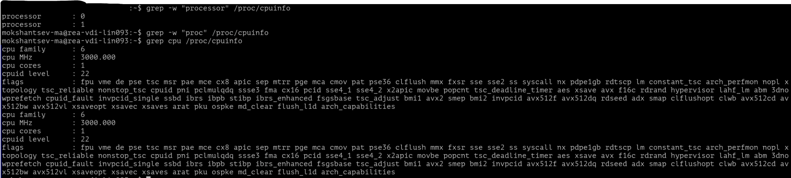

Проверим с ключом -w

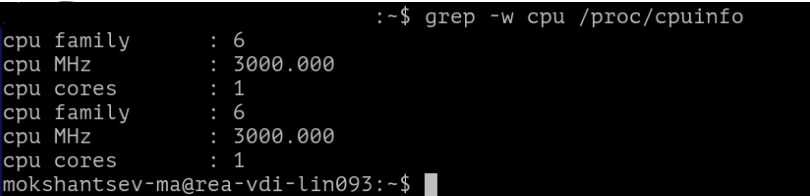

Теперь, множество строк пропали, указав вам только значения конкретных слов "cpu"

А что, например, если нам нужно найти строку, которая содержит шаблонное слово, но продолжается и оканчивается на различные символы?

Попробуем найти все строчки, которые продолжаются после слова "cpu"

Обратите внимание, мы применили метасимволы. К ним относятся: ".", "\", "$", "*", "[", "]", "^", "&".

```console
$  grep 'cpu\>' /proc/cpuinfo
```

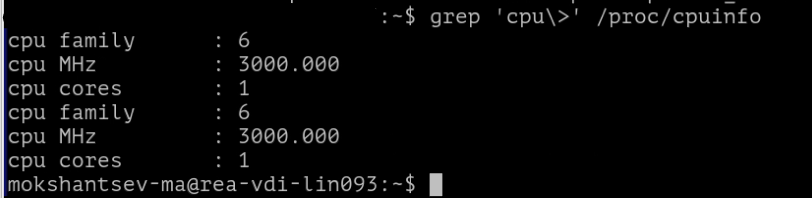

А теперь, все строчки которые продолжаются словом "cpu"

```console
$  grep '\<cpu' /proc/cpuinfo
```

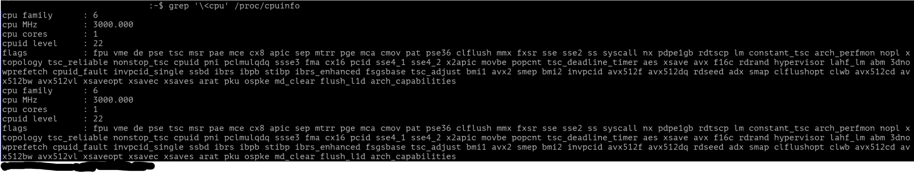

А если нужное нам слово располагается в начале или конце строки?

Попробуем прописать:

```console
$  grep '^cpu' /proc/cpuinfo
```

В ответ получим строки, которые начинаются на "cpu"

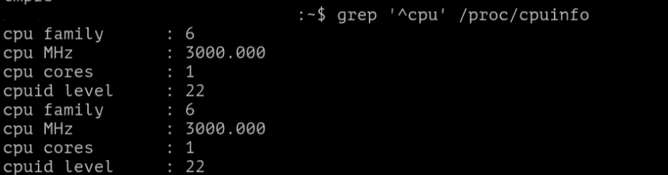

Проверим теперь другую конструкцию:

```console
$  grep 'cpu$' /proc/cpuinfo
```

В нашем примере файла строк, которые заканчивались на слово "cpu" - нет.

Попробуем сформировать другой запрос.

```console
$  grep 'yes$' /proc/cpuinfo
```

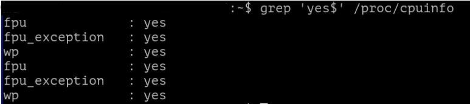

Теперь получилось, в ответе команды получили только строки, где в конце есть слово "yes".

А если, например, задача увидеть строки рядом с искомой?

Для этого нам потребуется ключ -C. Данным ключом задается количество строк, которые нужно напечтать.
Обратите внимание, что будут показаны строки, расположенные  выше и ниже искомого значения.


Например, найдем строку расположенную возле слова "processor"
```console
$  grep -С 1 processor /proc/cpuinfo
```

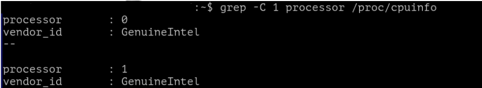

Для удобства "grep" разделил найденные значения пробелом, чтобы было удобнее читать результат.

Попробуем задать значение строк побольше?

```console
$  grep -С 4 processor /proc/cpuinfo
```

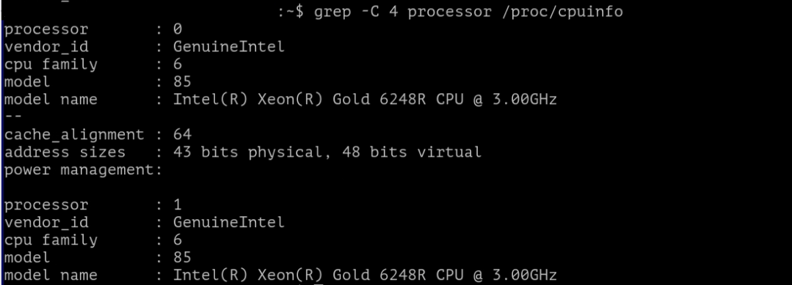

Стоит дополнить, что вместо -C можно использовать -A (after, после) для указания нужного количества строк после поискового запроса.
Результат работ команды

```console
$  grep -С 4 processor /proc/cpuinfo
```

и

```console
$  grep -А 4 processor /proc/cpuinfo
```


Также, с помощью ключа -B (before, до) можно вывести строки выше искомого значения.

```console
$  grep -B 4 processor /proc/cpuinfo
```

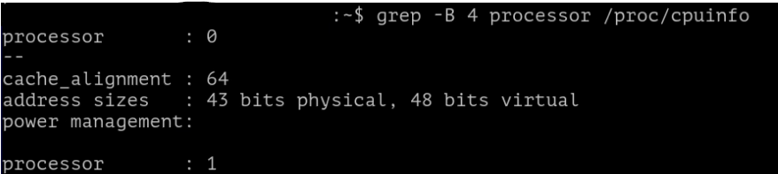

Будьте внимательны -  в нашем примере строка processor = 0 является первой записью в файле /proc/cpuinfo. А значит "before" ничего не покажет.

Перейдем к серьезным регулярным выражениям. Сделаем текстовый файл со следующим содержимым:

```console
client 10.10.10.1
server 192.168.1.1
computer 127.78.245.1
router 88.11.22.33
router2 99.22.33.44
linux1 111.111.22.33
linux2 173.65.234.1
linux3 243.1.1.1
linux4 109.105.110.115
```

Первым делом, сделаем выборку по слову linux, при условии что после искомого слова есть значения от 1 до 3.

```console
$  grep "linux[1-3]" test.txt
```

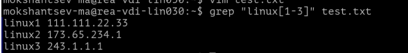

А если наоборот, исключая эти записи?

```console
$  grep "linux[^1-3]" test.txt
```

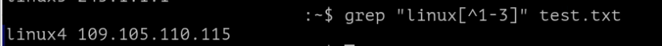

Для понимания, определим какие метасимволы мы использовали в вышеуказанных примерах.

Метасимволы "[]" позволяют определить подмножество символов, которые необходимо распознавать при выполнении операции поиска или подстановки. Запись группы символов, заключенных в квадратные скобки, означает: "любой одиночный символ из указанных".

Метасимвол ^ (отрицание). Позволяет выполнять инверсию запроса, который вы сформировали.

Давайте дополним наш текст дополнительными строчками.

```console
client 10.10.10.1
server 192.168.1.1
computer 127.78.245.1
router 88.11.22.33
router2 99.22.33.44
linux1 111.111.22.33
linux2 173.65.234.1
linux3 243.1.1.1
linux4 109.105.110.115
New Word
Another Word
Privet
```

И выполним выборку только строк с IP-адресами.

Для этого воспользуемся метасимволами в сочетании с опцией -E. Данная опция отвечает за поддержку расширенного регулярного выражения

```console
$  grep -E '\b[0-9]{1,3}(\.[0-9]{1,3}){3}\b' test.txt
```

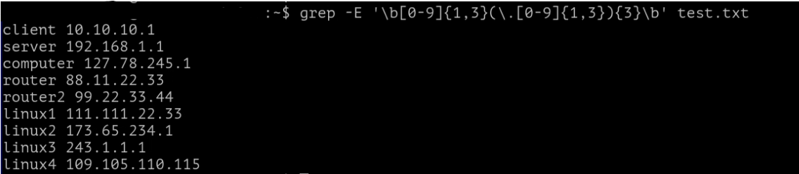

Мы получили результат выборки строк, в которых у нас есть IP-адрес из 4 цифр, разделенных точками (октетами). Прочие строчки не выведены, поскольку не имеют чисел в строке или состоят не из четырёх значений.

Теперь, поговорим о метасимволах, которые мы применили в данном запросе.

Метасимвол \b указывает на границы искомой строки, считайте, это как способ обособления.

Метасимволы "[]" позволяют определить подмножество символов, которые необходимо распознавать при выполнении операции поиска или подстановки. Запись группы символов, заключенных в квадратные скобки, означает: "любой одиночный символ из указанных". Например, если "[0123456789]", это будет означать: "любая цифра". Можно записать и короче: "[0-9]"

Метасимвол {} позволяет определить подмножество символов, расположенных в произвольном порядке.
Понять как он работает можно на простом примере.

```console
$  touch test{1,2,3,4}
```

В ответ получим:

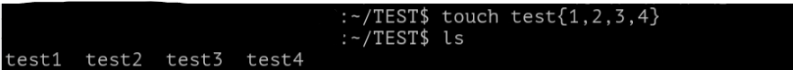

При этом, если мы выполним аналогичную команду, но например с метасимволом [].

```console
$  touch test[1-4]
```

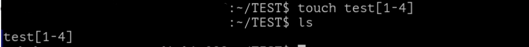

Как видим, в этом случае []  не отрабатывает.

Применяемые далее () выполняют группировку элементов, для поиска всех совпадений по группе.
Например, можно применить так:

```console
$  grep rosatom.(lab | net | ru | com)
```

В таком случае найдено будет любое совпадение, совпадающее по запросу.

Дальнейшая конструкция позволит выполнить выборку 3 раза, для того чтобы сформировать поиск именно по трёхзначной строке с точкой перед каждым блоком цифр.

\.[0-9]{1,3}){3}

\. - указывает на общий разделитель.

[0-9]{1,3} - уже знакомая нам конструкция, указывает что число состоит из 3 символов.

{3} - повторяет запрос  3 раза. 

\b - закрывает запрос.

Таким хитрым образом, получаем выборку по IP-адресам из файла.


Следующая конструкция выполняет ту же самую процедуру, но пишется сложнее, так как не применяется такое большое множество метасимволов.

В этом примере мы явно видим разделение значений через \.,  а также описание искомых параметров.

```console
$  grep -E "[0-9]{1,3}\.[0-9]{1,3}\.[0-9]{1,3}\.[0-9]{1,3}" test.txt
```

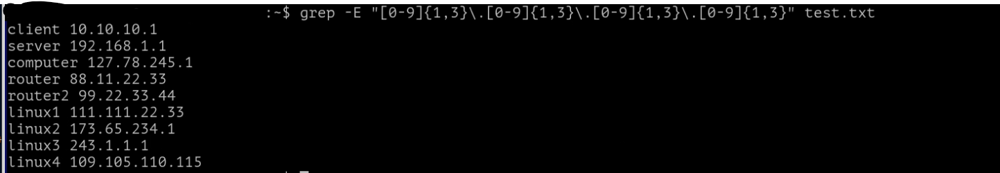

А что, если есть задача вывести только адреса? Без слов рядом.

На помощь приходит ключ -o (от англ. only-matching) в этом случае, выборка будет произведена по строгому соответствию шаблону.

```console
$  grep -oE "[0-9]{1,3}\.[0-9]{1,3}\.[0-9]{1,3}\.[0-9]{1,3}" test.txt
```

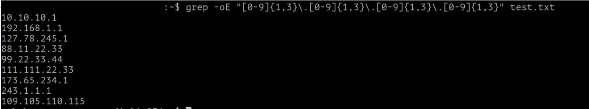

Давайте попробуем отредактировать наш test.txt, закомментируем несколько параметров.

```console
client 10.10.10.1
server 192.168.1.1
computer 127.78.245.1
router 88.11.22.33
router2 99.22.33.44
linux1 111.111.22.33
linux2 173.65.234.1
#linux3 243.1.1.1
#linux4 109.105.110.115
```

**Напомним, что в Linux символ # - является комментарием, операционная система, скрипты и различные программы игнорируют строки, которые начинаются на #. Это позволяет непосредественно в коде программы оставлять заметки или подсказки для пользователя.**

```console
$  grep -E "[0-9]{1,3}\.[0-9]{1,3}\.[0-9]{1,3}\.[0-9]{1,3}" test.txt
```

Как мы видим, при вводе уже знакомой нам команды по выборке IP-адреса из текста, она показывает нам строки, которые имеют символ #.

Предположим, что нам, как администраторам совершенно неинтересно посмотреть закомментированные (считайте неактивные) параметры.

С помощью ключа -v у команды grep можно установить инверсию запроса, то есть показать, наоборот, не подходящие строки под запрос.

А с помощью символа | (читается как - вертикальная черта, или на профессиональном жаргоне - "пайп" от англ. pipe )

Команда выглядит вот так:

```console
$  grep -E "[0-9]{1,3}\.[0-9]{1,3}\.[0-9]{1,3}\.[0-9]{1,3}" test.txt | grep -v '#'
```

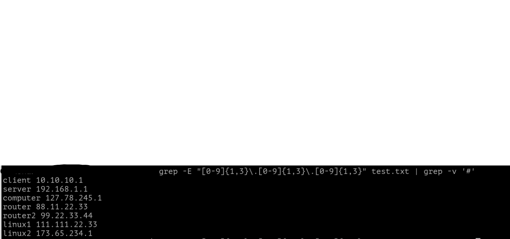

Наблюдаем результат, все строки, которые не имеют комментариев исключены из выдачи. Это крайне удобная функция, например, если нужно вывести все измененные значения в конфигурационном файле.

Помните, /etc/ssh/sshd_config - основной конфигурационный файл сервера SSH на вашем компьютере. Данный файл определяет настройки для подключения внешних клиентов.

В этом файле, все закомментированные строки являются значениями по умолчанию, а значит что при их изменении символ комментария '#' нужно удалять.

Команда выглядит так:

```console
$  cat /etc/ssh/sshd_config | grep -v '#'
```

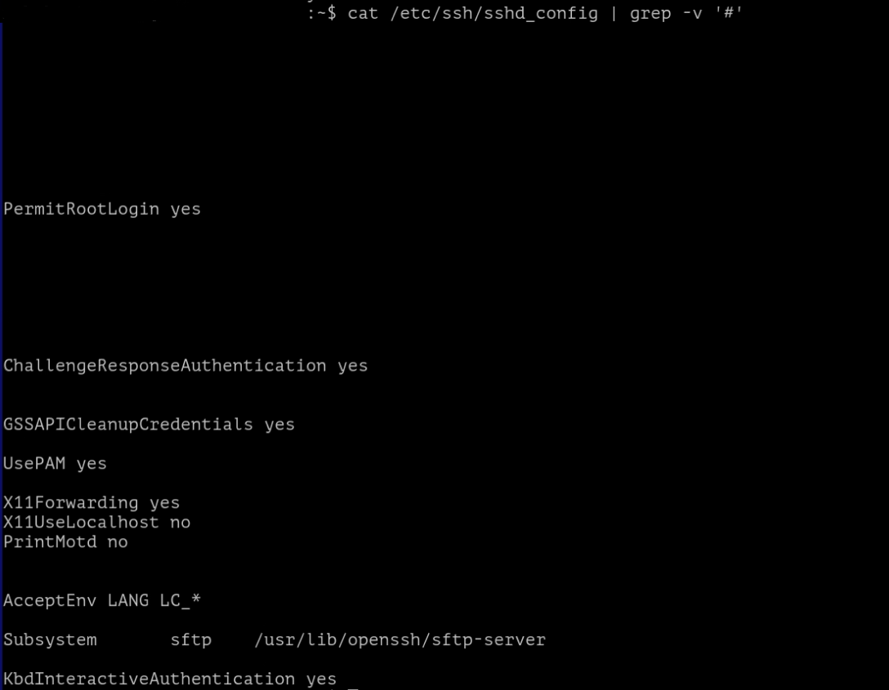

Попробуйте данный же файл посмотреть без grep

```console
$  cat /etc/ssh/sshd_config
```

Очевидно, что для быстрого просмотра намного удобнее анализировать файл без - '#'.

Перед тем, как перейти к теме работы с sed (потоковый текстовый редактор) стоит обратиться к тому, что так часто откладывали по ходу данной лабораторной работы.

Нам пора познакомиться  с метасимволами.


# Метасимвол . (точка)

Применение достаточно широкое, например:

При конструкции: "символ" "." "символ" означает, что между двумя искомыми символами может быть какой-то регулярный элемент.

Для эксперимента создадим файл test1.txt со следующим наполнением
```console
rea
r+a
r0a
rXa
reea
rosa
reka
```
А затем, попробуем ввести команду

```console
$  grep r.a test1.txt
```

Наблюдаем следующий вывод

```console
rea
r+a
r0a
rXa
```

Как можно заметить, мы  получили все строки, где есть слова начинающиеся на "r" и заканчивавшиеся на "a".

Попробуем поставить два символа точки, ведь у нас есть строки, которые состоят из четырёх букв.

```console
$  grep r..a test1.txt
```

Наблюдаем следующий вывод

```console
reea
rosa
reka
```

А что будет если написать только первый символ и точку? Например так:

```console
$  grep r. test1.txt
```
В ответ получим все строчки из файла, ведь все слова начинаются на букву "r".

Дополним файл еще строками:

```console
rosenergoatom
TestWord
Linux
```

Повторим команду

```console
$  grep r. test1.txt
```

В итоге, получаем все слова которые не только начинаются на букву "r", но и содержат данную букву в своей конструкции:

```console
rea
r+a
r0a
rXa
reea
rosa
reka
rosenergoatom
TestWord
```

Слово Linux в выводе команды отсутствует, так как не содержит букву "r".
Обратите внимание, что grep в стандартном режиме работы регистрозависимый.

# Метасимвол \ (обратная дробная черта)


Обратная дробная черта (или обратный слэш) отменяет специальное значение, которое может иметь следующий за ней символ, в частности, "\." означает действительно точку, а не спецсимвол - "любой символ".

Свойства обратной черты мы уже наблюдали в этой команде:

```console
$  grep -E "[0-9]{1,3}\.[0-9]{1,3}\.[0-9]{1,3}\.[0-9]{1,3}" test.txt | grep -v '#'
```

# Метасимвол $ (знак доллара)

В зависимости от того, как используется знак денежной единицы ('$'), он может обозначать конец файла или конец строки. Когда указывается диапазон (от строки 1 до строки '$'), речь идет о конце файла.

Для утилиты Grep данный символ неактуальный, в отличии, например от sed.

Создадим файл example.txt со следующим содержимым, к тому же проверим как работает sed с русским языком.

```console
Это текст
Это новая строка в тестовом файле
Это третья строка в тестовом файле
Это четвертая строка в текстовом файле
Это пятая строка в текстовом файле
```

А затем выполним команду

```console
$  sed '2,$s/тестовом/текстовом/' example.txt
```

Без применения ключа '-i' изменения в файл не будут внесены, а результат корректировки файла будет выведен в консоль.

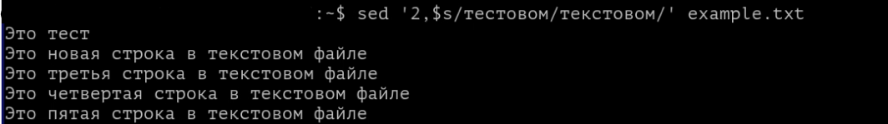

Разберемся подробнее в том, что сейчас произошло.

Конструкция

```console
$  sed '2,$s/тестовом/текстовом' example.txt
```

Означает, что начиная со **2** строки и до конца файла **$** выполняем замену (буква **s** сокращение от switch или substitute, то есть сменить или заменить) слово "тестовом" на "текстовом".

Проверьте, изменилось ли содержимое вашего файла с применением ключа -i.


# Метасимвол ^ (возврат каретки)

На самом деле, символ "возврат каретки" напрямую относится к историческому прошлому пишущих машинок. Он использовался после ввода строки и заставлял узел, держащий бумагу (каретку), вернуться вправо, так что машинка была готова печатать дальше на левой стороне бумаги.

В современных компьютерных системах  метасимвол "^" указывает начало строки.

Например, давайте в начало нашей строки вставим пробел.

```console
$  sed 's/^/ /' example.txt
```

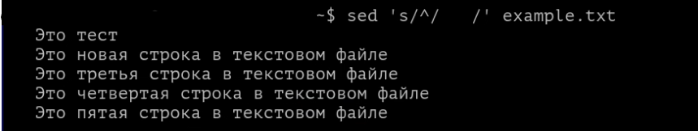

В примере выше указано несколько пробелов, для наглядности.


# Метасимвол * (звездочка)

В утилитах sed или grep данный метасимвол используется редко.

Но, например, пользоваться конструкцией копирования всех файлов по имени *.txt из директории

```console
$  cp *.txt /opt
```

Или удаление всех файлов, например, с именем *.txt.

```console
$  rm *.txt
```

# Метасимволы [] (квадратные скобки)

В ходе выполнения данной работы, мы уже обращались к данному метасимволу. Напомним, что он позволяет определить подмножество символов, как целостный массив данных.

# Метасимвол & (амперсанд)

Символ &, если мы говорим про утилиты grep,sed,awk, позволяет указывать ранее упомянутое поисковое выражение, что сокращает время на написание команды.

Предположим, имеется строка:

```console
	В ЭТО ВРЕМЯ
```

и требуется преобразовать ее в строку:

```console
	В ЭТО ВРЕМЯ СУТОК
```
конечно, для этого можно воспользоваться командой:

```console
	s/ВРЕМЯ/ВРЕМЯ СУТОК/
```

однако требование повторно указывать слово "ВРЕМЯ" кажется неразумным. Для того, чтобы избежать этого повторения, используется символ "&". В правой части команды подстановки амперсенд означает "найденный текст", так что можно ввести команду:

```console
	s/ВРЕМЯ/& СУТОК/
```

Конечно, в данном примере экономия будет незначительной, однако если количество символов велико экономится много вводимых символов. Снижается также вероятность совершения ошибки при вводе заменяющего текста. Например, для того, чтобы заключить в скобки строку, независимо от ее длины, можно использовать команду:

```console
	s/.*/(&)/
```

Амперсенд может встречаться в правой части команды несколько раз. Команда:

```console
	s/ВРЕМЯ/& СУТОК И & ГОДА/
```
построит строку:

```console
	ВРЕМЯ СУТОК И ВРЕМЯ ГОДА
```  

а команда:

```console
	s/В ЭТО ВРЕМЯ/&? &!!!/
```  

преобразует исходную строку в:

```console
	В ЭТО ВРЕМЯ?

  В ЭТО ВРЕМЯ!!!
```  

Перейдем к практике, приведем файл example.txt к следующему формату:

```console
	ВРЕМЯ
```  

А затем протестируем указанные выше примеры:

```console
$	sed 's/ВРЕМЯ/& СУТОК' example.txt
```  

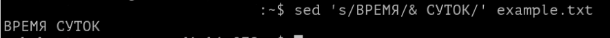

Стоит уточнить, что в Bash в терминале Linux - & используется для составления больших взаимосвязанных команд, например:

```console
$	mkdir ./privet && touch ./privet/hello
```

В этом случае команда последовательно создаст директорию, а затем файл внутри неё.

Но!

Если первая команда отработает с ошибкой, то вся строка будет отменена. Удачно должны завершиться все последовательные команды.

# Что такое SED? Знакомимся подробнее.

SED – это потоковый редактор текста (от англ. stream editor), c помощью которого можно выполнять с файлами множество операций вроде поиска и замены, вставки или удаления. При этом, чаще всего он используется именно для поиска и замены.

Перейдем сразу к примерам.

Подготовим файл example1.txt со следующим наполнением.

```console
 Кошка - друг человека. Кошка с давних времен помогала людям в хозяйстве. Кошка была источником вдохновения для многих произведений искусства.
```

В нашем новом тексте много повторений слова "Кошка", давайте заменим, например, на "Собака".

Воспользуемся командой:

```console
$ sed 's/Кошка/Собака/' example1.txt
```

Как можно заметить, теперь в первом предложении вместо слова "Кошка" мы видим слово "Собака".


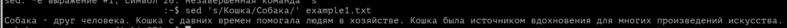

По умолчанию, sed затрагивает только первое вхождение слова из шаблона в каждой строке.

Проверим это утверждение, давайте пополним example1.txt новой строкой.

```console
 Кошка - друг человека. Кошка с давних времен помогала людям в хозяйстве. Кошка была источником вдохновения для многих произведений искусства.

 Кошка - это млекопитающее
```

Результат ниже, только первое вхождение слова изменилось в каждой строке.

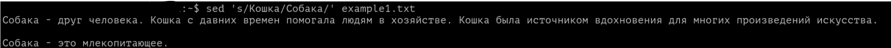

Хорошо, а если нам нужно изменить только второе значение из строки?

Легко:

```console
$ sed 's/Кошка/Собака/2' example1.txt
```

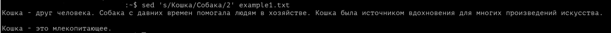

А если третье?

```console
$ sed 's/Кошка/Собака/3' example1.txt
```

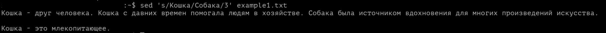

Для замены всех вхождений заданного шаблона, нужно воспользоваться ключом g (от англ. global - глобальный).

```console
$ sed 's/Кошка/Собака/g' example1.txt
```

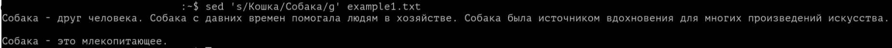

 Следующая команда заменит в каждой строке второе, третье, четвёртое и т.д. вхождения слова "кошка" на слово "собака":

 ```console
 $ sed 's/Кошка/Собака/2g' example1.txt
 ```

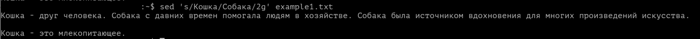

Обратите внимание, что первое значение в каждой строке не изменилось.

А можно ли внести корректировки только в нужную нам строку?

```console
$ sed '3 s/Кошка/Собака/' example1.txt
```

Например, мы сменили значение только в третьей строке.

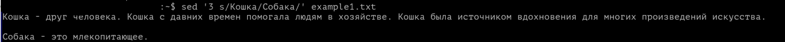

А если у нас текст с разным регистром? Можно ли sed настроить на игнорирование регистра?

Конечно, с помощью ключа /i

```console
$ sed 's/Кошка/Собака/i' example1.txt
```

В этом случае неважно как написано слово "Кошка", оно будет заменено на слово "Собака".


Как вы можете заметить, sed по умолчанию, выводит весь правленный текст. Включая те строки, которые не были тронуты.

Предположим, что текст, с которым мы работаем крайне большой, и читать его каждый раз - затруднительный процесс.

С помощью команды:

```console
$ sed 's/Кошка/Собака/p' example1.txt
```

Вы обнаружите продублированными в выводе те строки, в которых были внесены изменения.

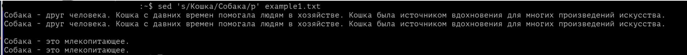

Помните особенность sed? Он меняет только первое вхождение в строке. Если нужно заменить везде, то добавьте ключ g.

```console
$ sed 's/Кошка/Собака/pg' example1.txt
```

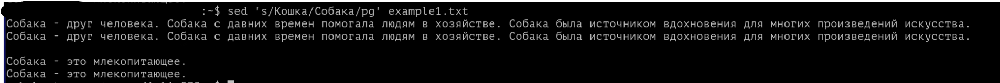

Наверное, у вас появился вопрос, а в чем же смысл ключа p, ведь получается что мы видим дубликаты строк? И текста на экране становится еще больше.

Исправим это, добавив новый ключ '-n' (подавление вывода)

```console
$ sed -n 's/Кошка/Собака/pg' example1.txt
```

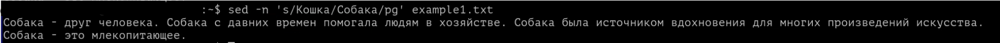

Теперь видны только строки, где действительно изменяются значения.

Хорошо, мы отработали механизм замены, поговорим об удалении строк в файле?

Например, выполним удаление 1-ой строки из текста.

```console
$ sed '1d' example1.txt
```

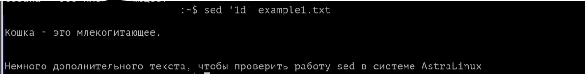


А как выполнить удаление самой последней строки?

```console
$ sed '$d' example1.txt
```

А можно ли указать диапазон удаляемых строк?

```console
$ sed '3,6d' example1.txt
```

 В этом случае будет выполнено удаление с 3 по 6 строку в вашем файле.


А удалить начиная с N-ой строки до конца?

```console
$ sed '12,$d' example1.txt
```

А если нужно удалить не целые строки, а только те, где есть слово из шаблона?

```console
$ sed '/Кошка/d' example1.txt
```

Попробуйте попрактиковаться самостоятельно!

Также, sed умеет вставлять пустые строки. Вероятно, задача редкая, но попробуйте в текст между каждой строкой вставить промежутки с помощью команды:

```console
$ sed G example1.txt
```

А вот вставить две пустых строки можно следующей командой:

```console
$ sed 'G;G' example1.txt
```

Или вставить пустую строку над каждой, где например есть искомое слово:

```console
$ sed '/Кошка/{x;p;x;}' example1.txt
```

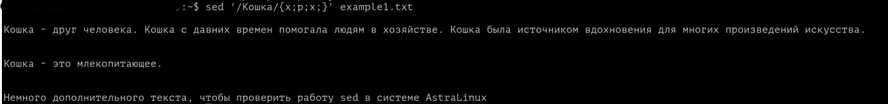

А как, например, вставить пустую строку под каждой, где есть искомое слово?

```console
$ sed '/Кошка/G' example1.txt
```

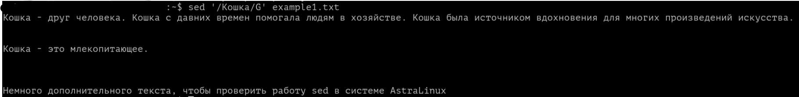

Изучая сегодняшний материал, а также первый курс по Astra Linux, вы наверняка помните такие команды как cat, head, tail

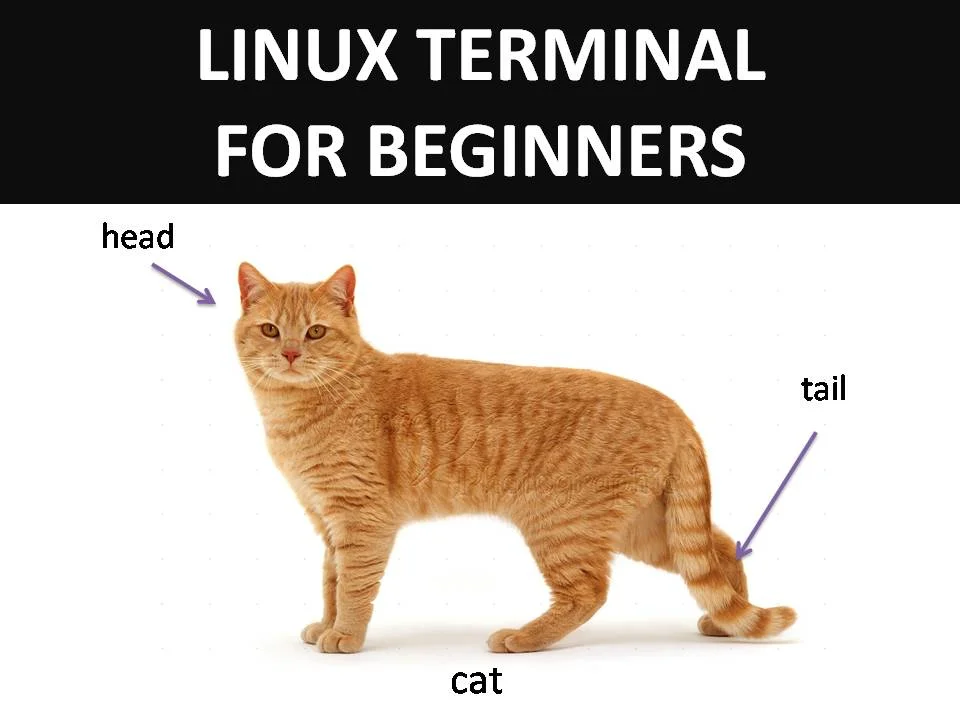

Легко вспомнить, что команда cat выводит вам весь файл, а head и tail либо его начало или конце соответственно.

SED может вам помочь в просмотре документов с конкретных строк, например, с 1 по 5 строку:

```console
$ sed -n '1,5p' example1.txt
```

Или с 13 по 18:

```console
$ sed -n '13,18p' example1.txt
```

Или наоборот, вывести весь файл кроме строк, указанных в команде sed:

```console
$ sed '1,4d' example1.txt
```

# AWK или как быстро посмотреть таблицу любого размера

AWK - это си-подобный язык обработки входного потока данных по заданным шаблонам. По сути, это не просто команда, а настоящий язык программирования. С помощью него можно выполнять сложные операции поиска, парсинга и замены, а можно просто приручить его для использования в задачах по работе с текстом.

При использовании awk вы можете выбирать данные на основе заданного критерия. Это может быть поиск значений в табличных файлах, в структурированных файлах (например, в xml или html) или просто в тексте.

Базовая форма утилиты awk подразумевает описание основного действия в одинарных кавычках и фигурных скобках с указанием после него целевого файла.

```console
$ awk '{действие}' example1.txt
```

Давайте подготовим такой структурированный файл

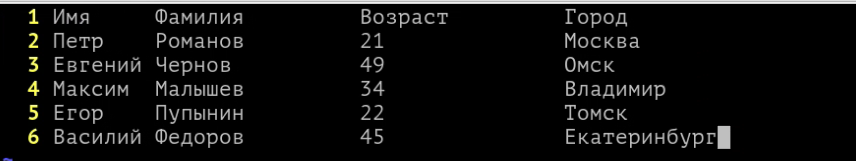

Простой файл, столбцы в нём разделены табуляцией (нажмите Tab, при работе в текстовом редакторе). Файл представляет собой таблицу со сведениями и сотрудниках.


Начнем с первой простой задачи, например, пронумеруем строки в файле:

```console
awk '{print NR,$0}' example1.txt
```

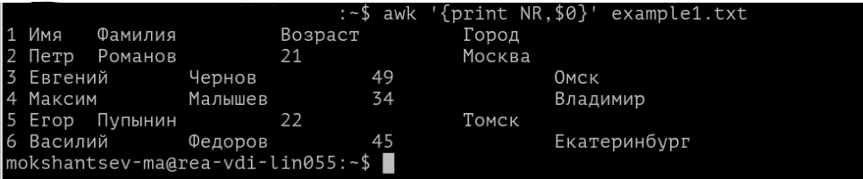

Давайте проверим, как через awk вызвать первый столбец файла:

```console
awk '{print $1}' example1.txt
```


Получается, что $1 - переменная, которая указывает на первое значение в строках нашего файла. В тоже время $0 указывает на скрытое пространство в файле, в которое, как правило, записывается номер строки.

А что же делать, если нужно вывести второй столбец?

Конечно, с помощью $2!

```console
awk '{print $2}' example1.txt
```

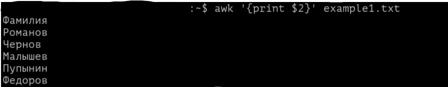

По умолчанию, awk начало и конец каждого столбца определяет именно по пробелу.

А можно ли вывести сразу два столбца?

```console
awk '{print $1, $2}' example1.txt
```

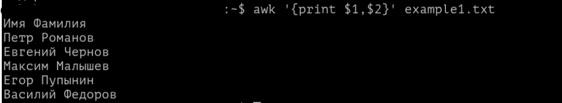

А как вывести последний столбец, при условии, что мы не знаем сколько всего столбцов в нашем файле?

```console
awk '{print $NF}' example1.txt
```

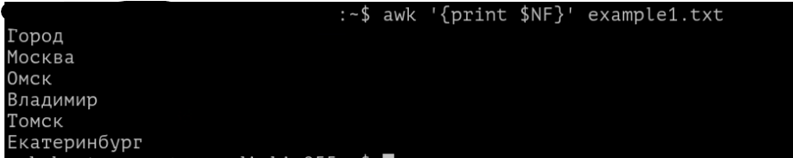

А можно ли вывести не весь столбец, а лишь первые три его строки?

Вот мы и столкнулись с несовершенство awk, самостоятельно данная утилита сделать такое не сможет, но в сочетании с утилитой head, например, ситуация кардинально изменяется!

```console
awk '{print $1}' example1.txt | head -n 2
```

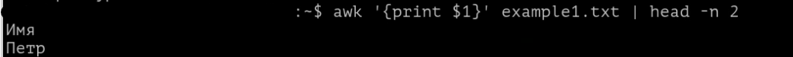

А можно ли вывести строку, которая бы начиналась с заданной буквы?

```console
awk '/^Е/' example1.txt
```

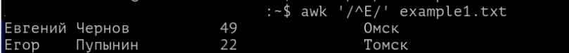

Действие команды начинается с символа ^, который указывает на начало строки. После этого прописывается буква, с которой нужная вам строка должна начинаться.


По аналогичному принципу можно выводить строку, завершающуюся конкретным шаблоном:

```console
awk '/к$/' example1.txt
```

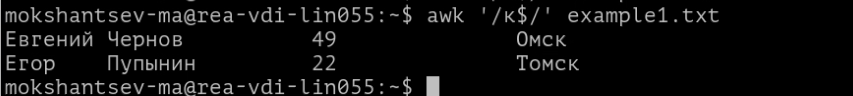

Давайте, попробуем применить и прочие спецсимволы, которые мы сегодня изучили:

```console
awk '! /^Е/' example1.txt
```

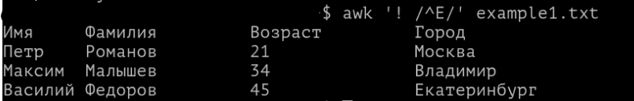

Как можно заметить, символ ! добавил в инверсию в указанную команду.

Для вывода слов, содержащих определённые буквы, а также слов, соответствующих указанному шаблону, мы снова используем прямые слэши.

Например, если надо найти слова, содержащие "ов", мы напишем:

```console
awk '/^ов/{print $0}' example1.txt
```


Давайте дополним наш файл example1.txt.

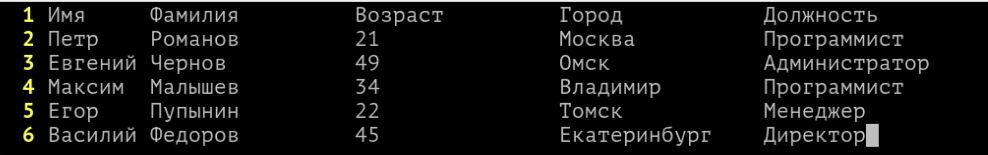

Теперь появился столбец, который хранит должность наших сотрудников.
А теперь, сделаем выборку только по должности - Программист.

```console
awk '/Программист/' example1.txt
```

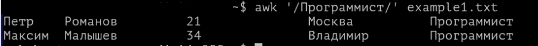

А что если нам надо узнать только имена наших программистов?

```console
awk '/Программист/{print $1,$2}' example1.txt
```

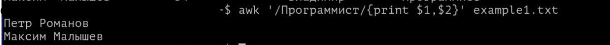

Предположим, что вы хотите найти информацию о сотрудниках разных возрастов.

```console
awk '$3 < 30 {print $0}' example1.txt
```

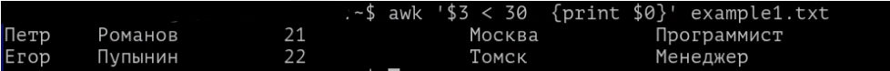

Разберем данную команду подробнее:
через $3 - вы указываете номер столбца, чьи значения планируете сравнивать. В нашем случае, мы ищем числа, которые будут меньше значения 30 из искомого столбца.

print $0 - указывает, что вывести нужно первый символ строки - а это её номер! Вот и получается, что в данном случае будет произведен вывод этой самой строки.

Далее, приведем примеры, которые вероятно пригодятся вам в рабочей практике:

Большинство файлов вряд ли будут разделены пробелами, вероятно, вы уже встречались с файлами .csv формата, где разделителем является запятая.

С помощью ключа -F awk можно сообщить о разделителе в искомом файле.

Например, перед нами csv файл с именами пользователей и их компьютерами.

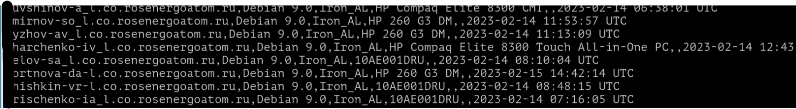

Выведем только первый и второй столбец этого файла:

```console
awk -F ',' '{print $1,$2}' example1.txt
```


И вот уже перед нами файл аккуратно показывает два столбца искомого файла, ничего лишнего!

А если мы хотим посмотреть содержимое предпоследнего столбца?

```console
awk -F ',' '{print $NF-1}' example1.txt
```

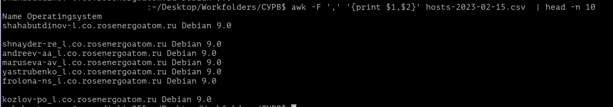

И тоже работает!


Вот и всё. Теперь у вас есть необходимая основа для начала работы с grep,awk и sed для управления текстовыми данными.

В следующем материале вы познакомитесь с  Дискреционном управлением доступа!

Благодарю за чтение и успехов вам в обучении!


# Дополнительная информация:
1) Шпаргалки как работать с awk [Ссылка](https://likegeeks.com/awk-command/)
2) Шпаргалки как работать с grep[Ссылка](https://digitology.tech/posts/shpargalka-po-gnu-grep/)
3) Шпаргалки как работать с sed [Ссылка](https://soft-setup.ru/shpargalka-po-sed-v-linux-s-primerami/)
