# Лабораторная работа №3. Тема: "Дискреционное управление доступом"
Цель работы
----------
научиться поиску файлов по правам доступа;

получить навык и понимание как менять расширенные дискреционные права доступа ;

разобраться в терминологии данной настройки;

получить навык настройки общих каталогов для групп пользователей, использование SGID, SUID, Sticky-bit;

создать общие каталоги для пользователей с использованием файловых списков доступа;

познакомиться с атрибутами файлов.

Оборудование, ПО:
----------

Виртуальная машина или компьютер под управлением ОС AstraLinux 1.7 в любом уровне защищенности.

Ход работы:
----------

# Расширенные права доступа (Extended POSIX ACL)
При прохождении базового курса вы уже знакомились с минимимальным функционалом настройки прав доступа, или как часто можно встретить в англоязычной терминологии - Minimal POSIX ACL.


Напомним, как эти права доступа выглядят


Также Minimal ACL имеют числовое представление (Numeric Notation) в виде трех восьмеричных чисел. Эти числа определяют разрешение на доступ к файлу или директории трех субъектов доступа (user,group,other). Каждое из них формируется путем суммирования восьмеричных значений необходимых разрешений:

- чтение = 4;

- запись = 2;

- выполнение =1.

Например, полный доступ (rwx) – это: 4+2+1=7


Вполне естественно, что такая простая схема, как в Minimal POSIX ACL имеет ряд недостатков. Самый явный из них, это отсутствие гибкости при совместном доступе субъектов к объектам.

Поэтому, была внедрена новая система - Extended POSIX ACL (EA) или иначе говоря расширенный список контроля доступа.


Команда - **getfacl** позволяет получить информацию о настройках расширенного списка контроля доступа. Давайте проверим её работу:

```console
getfacl example1.txt
```


В данном примере, стоит уточнить, будет использована машина в доменной инфраструктуре. Например, как видно по данному скриншоту group имеет значение стандартной группы для Microsoft ActiveDirectory - группа Domain Users.


Давайте попробуем установить на файл права

Шаблон применения команды:

```console
setfacl  [КЛЮЧ] [ПАРАМЕТРЫ] файл_назначения
```

Выполним её, давайте, добавим в наш файл права доступа пользователю adminsrv на чтение и запись, а также группе lpadmin добавим права на чтение и запись.

Команда звучит так:

```console
setfacl -m u:adminsrv:rw-,g:lpadmin:rw- example1.txt
```


Как можно заметить, теперь в поле user и group мы наблюдаем новую информацию о правах на наш файл.

Пользователю по имени adminsrv выданы права на чтение и запись, аналогичные права также назначены на группу lpadmin.

Стоит заметить, что управление расширенным контролем доступа достаточно простое. Для работы требуется всего две команды:

- setfacl - используется для назначения, модификации и удаления ACL прав.

- getfacl - используется для просмотра установленных ACL.

Для getfacl можно применять все изученные ранее метасимволы.

Например, если вам необходимо получить список расширенного контроля доступа во всей директории можно написать:

```console
getfacl *
```

Или

Вывести все файлы с именем super* в шаблоне имени.

```console
getfacl super*
```

Также, стоит оповестить. Команда ls также отображает, что на файле расширенный список контроля доступа.

Для этого введите ls -la.


Как можно заметить, теперь около стандартного набора символов, которые указывают на права доступа к файлу есть символ "+", который и указывает на применение расширенного списка контроля доступа.

Закрепим результат, создайте нового пользователя linuxuser, настройте ему максимальные права доступа
Для группы video права только на чтение.

```console
setfacl -m u:linuxuser:rw-,g:video:rw- example1.txt
```


Как можно заметить, теперь в сочетании с политиками для пользователя adminsrv, права доступа также появились у пользователя linuxuser.

## А сохраняются ли расширенные ACL при переносе файлов?


Если файл нужно скопировать в другую директорию с сохранением настроек расширенного правила доступа, введите команду:

```console
cp -p example1.txt ./
```

А команда mv отработает корректно в классическом исполнении:

```console
mv example1.txt /data/
```

Напоследок, давайте закрепим в памяти основные пользовательские разрешения.


Отлично, разобравшись с применнием основных прав доступа через расширенные и минимальные дискреционные права, мы можем перейти к особым битам управления (SUID,SGID,Sticky-bit).


# Понимание расширенных прав SUID, GUID и sticky bit

Есть три расширенных разрешений на ваши файлы. Первое из них — это разрешение на установку идентификатора пользователя (SUID). В некоторых особых случаях вы можете применить это разрешение к исполняемым файлам. По умолчанию пользователь, запускающий исполняемый файл, запускает этот файл со своими собственными разрешениями и правами доступа.

Для обычных пользователей это SUID обычно означает, что использование программы ограничено из-за недостаточных привелегий.

Рассмотрим, ситуацию, когда пользователю необходимо сменить пароль. Для этого пользователь должен записать свой новый пароль в файл /etc/shadow. Однако этот файл недоступен для записи пользователям, не имеющим прав доступа root:


**Разрешение SUID** предлагает решение этой проблемы. В утилите /usr/bin/passwd SUID настроен во всей красе! Это означает, что при смене пароля пользователь временно получает права root, что позволяет ему записывать в файл /etc/shadow. Вы можете сами увидеть разрешение SUID с **ls -l** в каталог **/usr/bin/passwd** букву **s** в позиции, где обычно вы ожидаете увидеть **x** для пользовательских разрешений:


Большинству администраторов никогда не придется его использовать; вы увидите его только в некоторых файлах, где операционная система должна установить его по умолчанию.
При неправильном применении вы можете случайно раздать права доступа root, то есть администратора системы. Поэтому, подумайте заранее стоит ли вам применять такую настройку.


Второе специальное разрешение — это **идентификатор группы (SGID)**. Это разрешение имеет два эффекта:

- При применении к исполняемому файлу, он дает пользователю, который исполняет файл, разрешения владельца группы этого файла. Таким образом, SGID может выполнить примерно то же самое, что SUID, только подменять группу с её правами и возможностями. Однако для этой цели SGID практически не используется.


- При применении к каталогу, SGID может быть полезен, потому что для всех созданных подкаталогов и файлов, владелец группы будет установлен тот же, что и в "родительском" каталоге. По умолчанию, когда пользователь создает файл, его  основная группа устанавливается как владелец группы для этого файла.

(узнать основную группу можно с помощью команды **groups**, если групп несколько, то основная будет самой первой в списке)

Попробуем на простом примере объяснить возможности SGID.

Предположим, у нас есть сотрудники отдела менеджмента - Николай и Лариса. В Linux, как вы помните из базового курса, все свежесозданные пользователи попадают в одноименную с логином группу. Также, оба они добавлены в общую группу - manager.

Когда пользователь создает файл, владельцем файла является сам пользователь и первичная для него группа (то есть одноименная с ним). В таком случае, файлы которые создает Николай будут недоступны для Ларисы - и наоборот!

Однако, если мы сделаем папку - /opt/manager, применим SGID на группу manager, то получится что все созданные внутри каталога /opt/manager файлы будут иметь группу по-умолчанию manager. А значит будут доступны Николаю и Ларисе одновременно!

Разрешение SGID показывается в выводе **ls -la** как **s** в позиции, где вы обычно находите разрешение на выполнение группы:


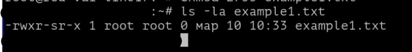


И третье из расширений - Sticky-bit. Это разрешение полезно для защиты файлов от случайного удаления в ситуации, где несколько пользователей имеют права на запись в один и тот же каталог. Если применяется  sticky bit, пользователь может удалить файл, только если он является владельцем файла или каталога.

По этой причине он применяется в качестве разрешения по умолчанию для каталога /tmp и может быть полезен также для каталогов общих групп.


Когда вы применяете sticky bit, пользователь может удалять файлы, только если выполняется одно из следующих условий:

- Пользователь является владельцем файла;

- Пользователь является владельцем каталога, в котором находится файл.


При использовании **ls -lа**, вы можете видеть sticky bit как **t** в позиции, где вы обычно видите разрешение на выполнение для других:


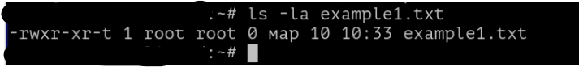

## Применение SUID, SGID и Sticky Bit.

Для начала структурируем изученную информацию:

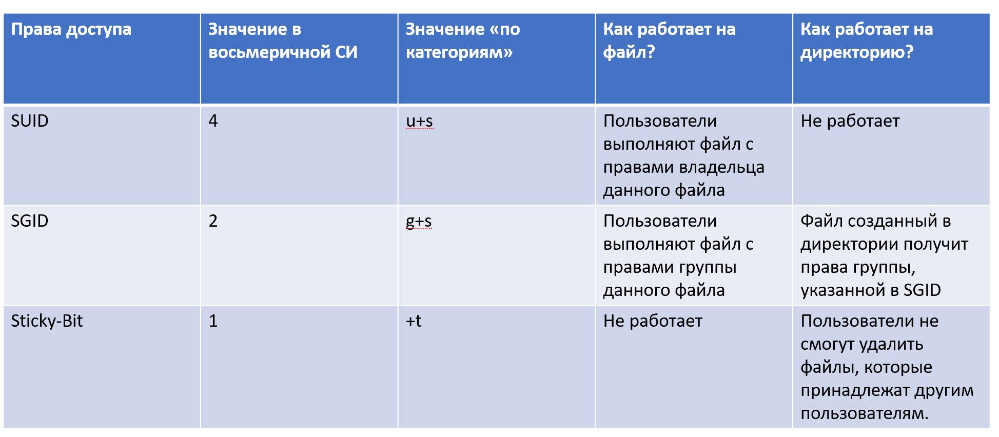

А теперь определимся как пользоваться.
**В приведенных ниже примерах применяются только права 755 для пользователей, групп и всех остальных. Данное значение выбрано как примерное! Применять на практике вы можете с абсолютно различным сочетанием правил доступа**

Если необходимо установить SUID, выполните команду:


```console
chmod 4755 example1.txt
```

Если необходимо установить SGID, выполните команду:

```console
chmod 2755 example1.txt
```

Если необходимо установить Sticky-bit, выполните команду:

```console
chmod 1755 example1.txt
```

Проверьте с помощью **ls -la**, что вы действительно назначили данные настройки на объекты вашей файловой системы.

#А как в Linux по-умолчанию на каждый файл уже назначаются какие-то права?

Вы наверняка задавали себе такой вопрос в голове.

Почему, когда вы создаете файл или каталог, то он автоматически имеет какие-то права доступа? Проверим какие?

```console
mkdir super_test
```

А затем через **ls -ld** изучим права доступа

```console
ls -ld super_test
```

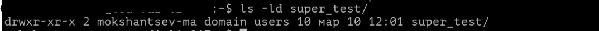

Получается, что на директорию были назначены права:

1) Чтение, запись и возможность входить в папку (права Execute на каталог отвечают именно за возможность входа в директорию) для владельца файла;

2) Чтение и врзможность входить в папку для группы-владельца;

3) Чтение и вход в папку для всех остальных пользователей.

А что будет, если мы создадим файл? Например, в этом же каталоге:

```console
touch super_test/file1.txt
```

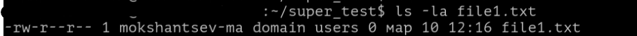

На файл права совершенно другие:

1) Владельцу файла позволено читать и писать;

2) Все остальные пользователи имеют право только на чтение документа.


**Это разрешения определяются настройкой под названием - umask**


В операционной системе специального назначения Astra Linux Special Edition за изменение маски прав доступа отвечает модуль pam_umask.


Модуль pam_umask пытается получить значение маски из следующих мест:

- значение umask= переданное как аргумент самому pam_umask.so

- umask= из поля GECOS пользователя

- значение UMASK=  в /etc/default/login

- значение UMASK  в  /etc/login.defs

Для активации модуля необходимо внести в конец файла /etc/pam.d/common-session строку:

```console
session optional pam_umask.so
```

Для установки глобальной маски прав доступа, можно передать параметр pam_umask.so, в том же файле /etc/pam.d/common-session:

```console
session optional pam_umask.so umask=0022
```

Или указать значение в  /etc/default/login:

```console
UMASK=0002
```

## Как UMASK работает?

Цифры, указанные в UMASK, аналогичны правам доступа в Linux: первая - владелец, вторая - группа и третья - все остальные. Эта маска используется для расчета прав файла.  Рассчитывается всё довольно просто, от максимальных прав отнимается маска и получаются права для файла.

Фактически, получается, что маска содержит права, которые не будут установлены для файла.

Поэтому права по умолчанию для файла будут 666 - 002 = 664, а для каталога - 777 - 002 = 775.

Вывести текущий показатель настроенной UMASK для вашей учетной записи можно с помощью команды:

```console
umask -p
```

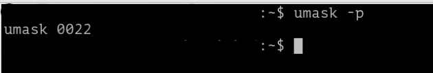

Если вам неудобно получать данное значение в битовой маске, то с помощью команды:

```console
umask -S
```

Можно получить другое значение, в так называемых, "категориях"

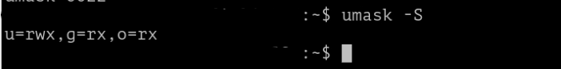

# Как найти файл, исходя из настроенных правил доступа?

Перед тем, как ответить на данный вопрос, давайте разберемся, а зачем это нужно?

Вы помните, что права 777 на файл в операционной системе позволит не только каждому пользователю обращаться к данному файлу и менять его как-угодно, но и запускать этот  файл как исполняемую программу. А это уже может быть крайне опасно для информационной безопасности вашей системы.

Стоит уточнить, что иногда операционная система самостоятельно выстывляет права 777 на файлы и директории. Например, директории сбора логов или документация в /usr/share/doc зачастую имеет данные привелегии. Это необходимо, чтобы к этим файлам могли получить доступ пользователи с самым разным уровнем "дозволенности".

Но в большинстве случаев права 777 нам не требуются!

Воспользуемся командой:

```console
find /opt -perm 777
```

Для наглядности, большая часть вывода команды будет опущена, вы и сами можете заметить насколько в директории /opt много файлов с правами 777


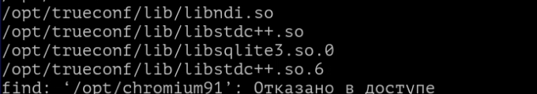

Обратите внимание, что не во все директории со стандартными пользовательскими правам вас допустят!

А также, посмотрите что за файлы нам показывают! Это исполняемые библиотеки клиента для видеосвязи. То есть, помимо множества обычных файлов и каталогов встречаются и прикладные программы, которым необходимо иметь такие права.

Формат команды find для поиска достаточно прост -

```console
find [искомая директория] -perm [запрашиваемые права доступа]
```

Также поиск возможен по "категориям":

```console
find /opt -perm ugo+rwx
```

Поиск по ACL через команду find невозможен, помните, мы говорили что не все программы в Linux поддерживают работу с расширенными программами доступа.

В этом случае воспользуемся объединением конструкции команды **getfacl** и **sed**.

```console
getfacl -R -s -p /opt | sed -n 's/^# file: //p'
```

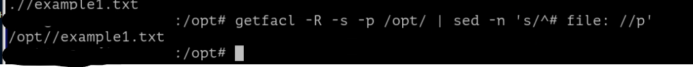

Разберемся c данной конструкцией:

-R - данный ключ описывает рекурсивный поиск по каталогу (и подкаталогам)

-s - данный ключ позволяет команде getfacl пропустить все файлы, не имеющие расширенных getfacl

-p - данный ключ выводит полный путь до файла, имеющий расширенные ACL. Давайте наглядно сравним вывод команд, чтобы разобраться в особенностях данного ключа.

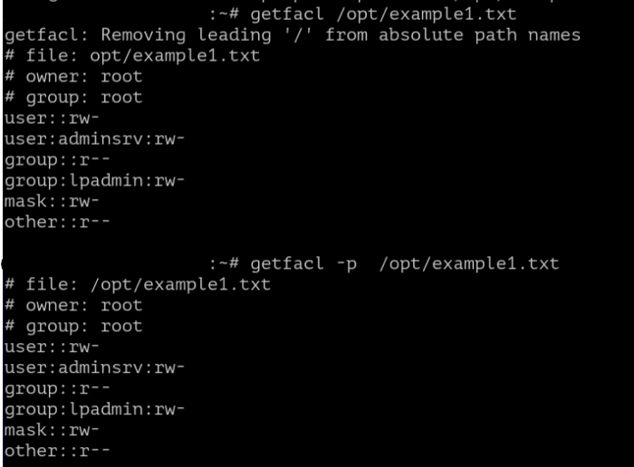

Отлично, с setfacl разобрались, теперь приступаем к анализу sed:

-n - уже хорошо знакомы нам ключ, указывающий на автоматическое удаление пробелов между строками. В нашем случае, если бы файлов с ACL было много, то так вывод команды получится аккуратнее.

Далее s используем для поиска по шаблону, а с помощью символа "^" указывает на поиск в начале строки шаблона #file: //p'

Флаг /p в данном случае является закрывающим символом для шаблона.


# Атрибуты файлов

Предположим вы хотите защитить некоторые важные файлы в Linux. При чем они должны быть защищены не только от перезаписи но и от случайного или преднамеренного удаления и перемещения. Предотвратить перезапись или изменение битов доступа к файлов можно с помощью стандартных утилит chmod и chown, но это не идеальное решение, так как у суперпользователя по прежнему остается полный доступ. Но есть еще одно решение. Это команда chattr.


Эта утилита позволяет устанавливать и отключать атрибуты файлов, на уровне файловой системы не зависимо от стандартных (чтение, запись, выполнение).

Для просмотра текущих аттрибутов можно использовать lsattr.

Для начала, давайте посмотрим какие атрибуты есть в нашей операционной системе, начнем с /etc/passwd

```console
lsattr /etc/passwd
```

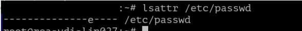

Как можно заметить, на файл назначен только один атрибут - e. Атрибут E, проще говоря, отвечает за то, что данный объект сохранен в операционной системе - ему выделили пространство на диске и система понимает где и как обращаться к данному файлу. На самом деле, данный параметр вы встретите на любом файле, который был создан на компьютере, его нельзя удалить или поставить на файл.

Попробуйте проверить файл example1.txt, который мы активно использовали сегодня для демонстрации ACL.

А какие еще атрибуты есть?

| Атрибут | Значение |
| -------| -------- |
| a  | Файл с установленным атрибутом "a" может быть открыт только в режиме добавления новых строк. Удалять ничего не получиться. Установить или удалить данный атрибут может только администратор системы или процесс, который поставил данный атрибут на файл. Такой атрибут иногда можно встретить в лог-файлах системы. |
| A  | При обращении к файлу с атрибутом A, его "atime" запись не будет изменена. Это означает, что невозможно будет отследить в какое время последний раз обращались к этому файлу |
| c  | Файл с установленным атрибутом 'c' автоматически сжимается ОС, для экономии дискового пространства |
| d  | Означает, что файл с таким атрибутом не будет кандидатом на  сохранение, в случае резервирования операционной системы |
| e  | атрибут, по умолчанию, указывает что для файла выделено место на диске |
| E | Означает, что файл шифруется файловой системой. Данный атрибут нельзя установить или удалить через chattr, ведь параметры шифрования настраиваются на стороне файловой системы. |
| F  | Атрибут F устанавливается на директорию, и означает что при выполнении поиска в каталоге, он будет нерегестрирозависимый. Данный атрибут имеет смысл только в файловых системах, где включена привязка к регистру, а также только в тех каталогах, где на момент установки атрибута, нет ни одного файла |
| i | Файл с атрибутом 'i' не может быть изменен: его нельзя удалить или переименовать, на этот файл нельзя создать ссылку, большая часть метаданных файла не может быть
изменена, и файл нельзя открыть в режиме записи. |
| m  | Означает, что файл не нужно сжимать, при условии если файловая система настроена на постоянное сжатие всех объектов в ОС |
| u  | содержимое файлов с этим атрибутом не будет удалено,а при удалении файла может быть восстановлено с помощью специальных программ, подробнее об этом [кликните тут](https://www.geeksforgeeks.org/how-to-recover-a-deleted-file-in-linux/). |

Стоит сразу предупредить, что не все атрибуты представлены в таблице сверху - лишь только самые распространенные. Если интересно ознакомиться со всеми, [кликните здесь](https://man7.org/linux/man-pages/man1/chattr.1.html).


Обратите внимание, что установить или снять атрибут можно только с правами 'root'!

Для установки атрибута используйте ключ +, например:

```console
chattr +i /etc/passwd
```

```console
chattr +с /etc/passwd
```

А для удаления "-", например:

```console
chattr -i /etc/passwd
```

```console
chattr -с /etc/passwd
```

## Установим собственный атрибут!

Например, на файл /etc/passwd

```console
chattr +i /etc/passwd
```


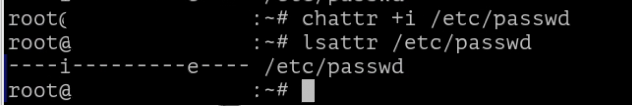

Как можно заметить, атрибут i есть, проверим на практике?

Попробуем от пользователя 'root' - который имеет неограниченный и максимальный доступ к системе, открыть данный файл через текстовый редактор "vim".

```console
vim /etc/passwd
```

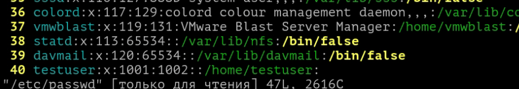

Если вы хотите назначить рекурсивно атрибуты, то не забывайте про ключ '-R'.

```console
chattr -R +i /etc/
```

Проверим как работает атрибут "a"?

```console
chattr +a example1.txt
```

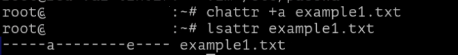

А теперь, попробуем записать в него что-нибудь:

```console
echo "Test" >  example1.txt
```

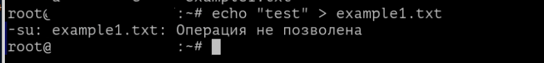

Как можно заметить, теперь на файл даже пользователь root не может писать.

Но, подождите, вероятно вы заметили что мы использовали ключ ">" - напомню, он указывает, что содержимое файла удаляется, а вместо него записывается то значение, что генерирует команда **echo**.

А если воспользоваться ">>" для добавления новой записи?


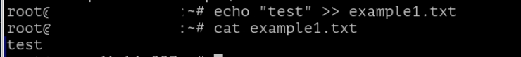

Успех! Все получилось! Атрибут "a" не запрещает добавлять новые значения в файл, он запрещает удаление прошлого содержимого.

Стоит уточнить, что многие текстовые редакторы не позволяет вам открыть данный файл даже для редактирования. Только добавлять через echo, grep, head, tail или прочие инструменты, изученные в Лабораторной работе №2.

В следующем материале вы познакомитесь с Мандатным управлением доступа!

Благодарю за чтение и успехов вам в обучении!


# Дополнительная информация:
1) Немного про SUID, SGID и Sticky-Bit [Ссылка](https://ruvds.com/ru/helpcenter/suid-sgid-sticky-bit-linux/)
2) Немного про ACL в Linux [Ссылка](https://wiki.archlinux.org/title/Access_Control_Lists_(%D0%A0%D1%83%D1%81%D1%81%D0%BA%D0%B8%D0%B9))
3) Документация на chattr [Ссылка](https://www.opennet.ru/man.shtml?topic=chattr&category=1&russian=0)
