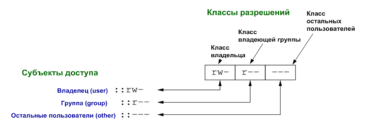
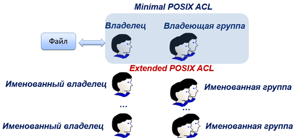
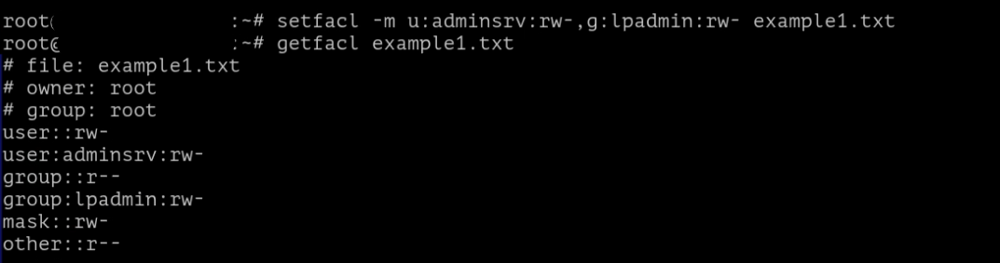
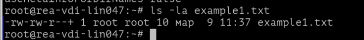
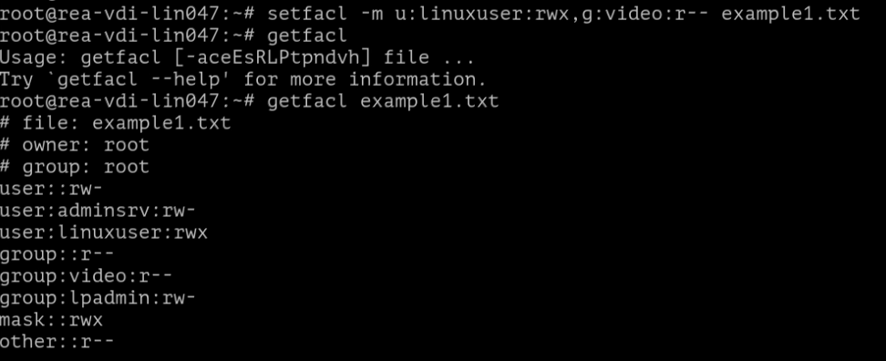
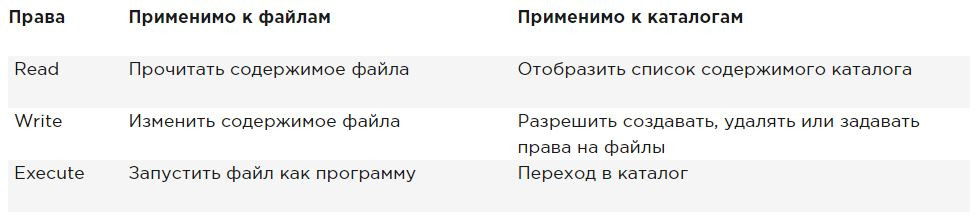
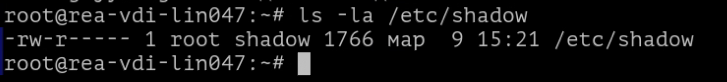
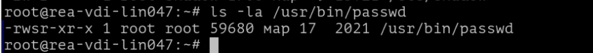

# Лабораторная работа №3. Тема: "Дискреционное управление доступом"
Цель работы
----------
научиться поиску файлов по правам доступа;

получить навык и понимание как менять расширенные дискреционные права доступа ;

разобраться в терминологии данной настройки;

получить навык настройки общих каталогов для групп пользователей, использование SGID, SUID, Sticky-bit;

создать общие каталоги для пользователей с использованием файловых списков доступа;

познакомиться с атрибутом append.

Оборудование, ПО:
----------

Виртуальная машина или компьютер под управлением ОС AstraLinux 1.7 в любом уровне защищенности.

Ход работы:
----------

# Расширенные права доступа (Extended POSIX ACL)
При прохождении базового курса вы уже знакомились с минимимальным функционалом настройки прав доступа, или как часто можно встретить в англоязычной терминологии - Minimal POSIX ACL.


Напомним, как эти права доступа выглядят




Также Minimal ACL имеют числовое представление (Numeric Notation) в виде трех восьмеричных чисел. Эти числа определяют разрешение на доступ к файлу или директории трех субъектов доступа (user,group,other). Каждое из них формируется путем суммирования восьмеричных значений необходимых разрешений:

- чтение = 4;

- запись = 2;

- выполнение =1.

Например, полный доступ (rwx) – это: 4+2+1=7


Вполне естественно, что такая простая схема, как в Minimal POSIX ACL имеет ряд недостатков. Самый явный из них, это отсутствие гибкости при совместном доступе субъектов к объектам.

Поэтому, была внедрена новая система - Extended POSIX ACL (EA) или иначе говоря расширенный список контроля доступа.



Команда - **getfacl** позволяет получить информацию о настройках расширенного списка контроля доступа. Давайте проверим её работу:

```console
getfacl example1.txt
```


В данном примере, стоит уточнить, будет использована машина в доменной инфраструктуре. Например, как видно по данному скриншоту group имеет значение стандартной группы для Microsoft ActiveDirectory - группа Domain Users.


Давайте попробуем установить на файл права

Шаблон применения команды:

```console
setfacl  [КЛЮЧ] [ПАРАМЕТРЫ] файл_назначения
```

Выполним её, давайте, добавим в наш файл права доступа пользователю adminsrv на чтение и запись, а также группе lpadmin добавим права на чтение и запись.

Команда звучит так:

```console
setfacl -m u:adminsrv:rw-,g:lpadmin:rw- example1.txt
```



Как можно заметить, теперь в поле user и group мы наблюдаем новую информацию о правах на наш файл.

Пользователю по имени adminsrv выданы права на чтение и запись, аналогичные права также назначены на группу lpadmin.

Стоит заметить, что управление расширенным контролем доступа достаточно простое. Для работы требуется всего две команды:

- setfacl - используется для назначения, модификации и удаления ACL прав.

- getfacl - используется для просмотра установленных ACL.

Для getfacl можно применять все изученные ранее метасимволы.

Например, если вам необходимо получить список расширенного контроля доступа во всей директории можно написать:

```console
getfacl *
```

Или

Вывести все файлы с именем super* в шаблоне имени.

```console
getfacl super*
```

Также, стоит оповестить. Команда ls также отображает, что на файле расширенный список контроля доступа.

Для этого введите ls -la.



Как можно заметить, теперь около стандартного набора символов, которые указывают на права доступа к файлу есть символ "+", который и указывает на применение расширенного списка контроля доступа.

Закрепим результат, создайте нового пользователя linuxuser, настройте ему максимальные права доступа
Для группы video права только на чтение.

```console
setfacl -m u:linuxuser:rw-,g:video:rw- example1.txt
```




Как можно заметить, теперь в сочетании с политиками для пользователя adminsrv, права доступа также появились у пользователя linuxuser.

Напоследок, давайте закрепим в памяти основные пользовательские разрешения.



Отлично, разобравшись с применнием основных прав доступа через расширенные и минимальные дискреционные права, мы можем перейти к особым битам управления (SUID,SGID,Sticky-bit).


# Понимание расширенных прав SUID, GUID и sticky bit

Есть три продвинутых разрешения. Первое из них — это разрешение на установку идентификатора пользователя (SUID). В некоторых особых случаях вы можете применить это разрешение к исполняемым файлам. По умолчанию пользователь, запускающий исполняемый файл, запускает этот файл со своими собственными разрешениями и правами доступа.

Для обычных пользователей это SUID обычно означает, что использование программы ограничено из-за недостаточных привелегий.

Рассмотрим, ситуацию, когда пользователю необходимо сменить пароль. Для этого пользователь должен записать свой новый пароль в файл /etc/shadow. Однако этот файл недоступен для записи пользователям, не имеющим прав доступа root:




**Разрешение SUID** предлагает решение этой проблемы. В утилите /usr/bin/passwd SUID настроен во всей красе! Это означает, что при смене пароля пользователь временно получает права root, что позволяет ему записывать в файл /etc/shadow. Вы можете сами увидеть разрешение SUID с **ls -l** в каталог **/usr/bin/passwd** букву **s** в позиции, где обычно вы ожидаете увидеть **x** для пользовательских разрешений:



Большинству администраторов никогда не придется его использовать; вы увидите его только в некоторых файлах, где операционная система должна установить его по умолчанию.
При неправильном применении вы можете случайно раздать права доступа root, то есть администратора системы. Поэтому, подумайте заранее стоит ли вам применять такую настройку.

Второе специальное разрешение — это **идентификатор группы (SGID)**. Это разрешение имеет два эффекта:

- При применении к исполняемому файлу, он дает пользователю, который исполняет файл, разрешения владельца группы этого файла. Таким образом, SGID может выполнить примерно то же самое, что SUID, только подменять группу с её правами и возможностями. Однако для этой цели SGID практически не используется.


- При применении к каталогу, SGID может быть полезен, потому что для всех созданных подкаталогов и файлов, владелец группы будет установлен тот же, что и в "родительском" каталоге. По умолчанию, когда пользователь создает файл, его  основная группа устанавливается как владелец группы для этого файла.

(узнать основную группу можно с помощью команды **groups**, если групп несколько, то основная будет самой первой в списке)

Попробуем на простом примере объяснить возможности SGID.

Предположим, у нас есть сотрудники отдела менеджмента - Николай и Лариса. В Linux, как вы помните из базового курса, все свежесозданные пользователи попадают в одноименную с логином группу. Также, оба они добавлены в общую группу - manager.

Когда пользователь создает файл, владельцем файла является сам пользователь и первичная для него группа (то есть одноименная с ним). В таком случае, файлы которые создает Николай будут недоступны для Ларисы - и наоборот!

Однако, если мы сделаем папку - /opt/manager, применим SGID на группу manager, то получится что все созданные внутри каталога /opt/manager файлы будут иметь группу по-умолчанию manager. А значит будут доступны Николаю и Ларисе одновременно!

Разрешение SGID показывается в выводе **ls -ld** как **s** в позиции, где вы обычно находите разрешение на выполнение группы:


Благодарю за чтение и успехов вам в обучении!


# Дополнительная информация:
1) Шпаргалки как работать с awk [Ссылка](https://likegeeks.com/awk-command/)
2) Шпаргалки как работать с grep[Ссылка](https://digitology.tech/posts/shpargalka-po-gnu-grep/)
3) Шпаргалки как работать с sed [Ссылка](https://soft-setup.ru/shpargalka-po-sed-v-linux-s-primerami/)
