# Лабораторная работа №4. Тема: "Мандатное управление доступом"
Цель работы
----------
познакомиться с терминами мандатного управления доступом в AstraLinux;

организовать совместную работу пользователей с файлами на разных уровнях конфиденциальности;

изучить основные инструменты управления мандатным доступом;

получить навык поиска информации в документации.

Оборудование, ПО:
----------

Виртуальная машина или компьютер под управлением ОС AstraLinux 1.7 в режиме защищенности "Воронеж" или выше.

Ход работы:
----------

# Начнем с терминологии.

Перед тем, как начать  работу с мандатным уровнем доступа необходимо хорошо понимать компоненты и термины данной системы.

Обратимся к основной документации на сайте [wiki.astralinux.ru](https://wiki.astralinux.ru/pages/viewpage.action?pageId=153486002)

В механизме мандатного управления доступом определены следующие термины:

- **субъект мандатного доступа** — тот, кто выполняет операции, подлежащие мандатному контролю (пользователь или процесс);

- **сущность (объект) мандатного доступа** — то, с чем выполняются операции, подлежащие мандатному контролю (файл, каталог и т.д.);

- **контейнер** — структурированная сущность доступа, т.е. сущность (каталог ФС), которая может содержать другие сущности доступа (каталоги или файлы).

Сущностям и субъектам присваиваются следующие мандатные атрибуты:

- **иерархический уровень конфиденциальности (уровень конфиденциальности)** — определяет степень секретности документа и соответствующий уровень доступа к этому документу, назначенный персоналу (субъекту). Субъекту с определенным уровнем конфиденциальности разрешено читать только документы с таким же уровнем конфиденциальности или ниже и запрещено читать документы с более высоким уровнем конфиденциальности. А также персоналу с более высоким уровнем конфиденциальности запрещено передавать (преднамеренно или случайно) документы высокого уровня конфиденциальности персоналу с более низким уровнем конфиденциальности;

- **неиерархическая категория конфиденциальности (категории конфиденциальности)** — разделение по категориям конфиденциальности. Персонал, работающий с первой категорией конфиденциальности, имеет соответствующую категорию конфиденциальности. При этом, не имея вторую категорию конфиденциальности, персонал не может иметь доступ к материалам второй категории конфиденциальности, а также не может передавать материалы первой категории конфиденциальности персоналу, не имеющему первую категорию конфиденциальности. Доступ может быть предоставлен одновременно к нескольким категориям конфиденциальности;

- **уровень целостности (неиерархический уровень целостности и иерархический (линейный) уровень целостности)** — субъект, работающий на некотором уровне целостности, может записывать (изменять) только сущности своего или более низкого уровня целостности. Иерархический уровень целостности в ОС зарезервирован, и на уровне пользователя не поддерживается его использование;

- **дополнительные мандатные атрибуты управления доступом** — являются необязательными атрибутами и позволяют уточнять или изменять правила мандатного доступа для отдельных контейнеров, субъектов или сущностей.

Путем использования уровней и категорий конфиденциальности обеспечивается защита от несанкционированного доступа к информации в части:

1. невозможности прочитать информацию, к которой не предоставлен доступ:
  * нижним уровням конфиденциальности запрещено читать информацию с верхних уровней конфиденциальности;
  * всем запрещено читать информацию, на которую нет разрешенной категории конфиденциальности;
2. невозможности передать информацию тому, кому не предоставлен доступ:
  * верхним уровням конфиденциальности запрещено записывать свою информацию на нижние уровни конфиденциальности;
  * всем запрещено передавать информацию тем, у кого нет соответствующей категории конфиденциальности.

# А зачем это нужно?

Использование мандатного контроля целостности усиливает общую безопасность вашей ОС, повышая её устойчивость от запуска вредоносного кода на системе. Также, данная система может предотвратить возможные проблемы даже при "атаках нулевого дня" - уязвимостях кода в различных программмах и приложениях, о которых выяснили злоумышленники раньше, чем разработчики смогли предоставить какие-то "патчи" безопасности.

Мандатная система реализует механизм, при котором в случае если вредоносным скриптом были получены права администратора, он всё равно не сможет нанести ущерб информации на вашем ПК.

# А как это выглядит?

Перед практикой, давайте познакомимся с тем, как выглядит настроенный мандатный контроль доступа.
Войдем в систему под пользователем, который был создан при первоначальной установке системы. По-умолчанию, он имеет в системе наивысшие привилегии, так как входит в группу astra-admin. Если вы не знаете какой пользователь у вас есть, можете сделать его самостоятельно и  добавить его в группу astra-admin.

В нашем примере пользователь ladmin.

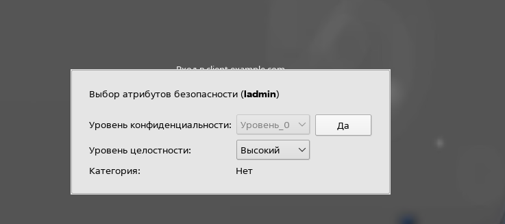

Как вы можете заметить, вход в систему уже совсем не похож на классический. Система спрашивает под каким режимом целостности входить в систему (с данным понятием мы уже знакомились в первой лабораторной работе).

Войдем в систему под высоким уровнем доступа.


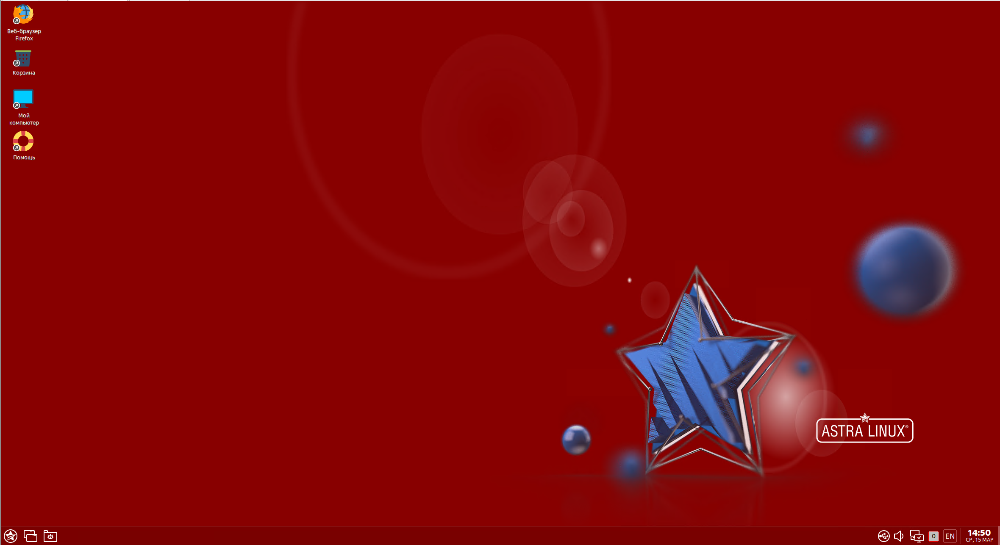

Вы наверняка уже видели данный рабочий стол. Яркий красный цвет указывает нам, что мы попали в систему с привилегиями администратора, иногда на профессиональном жаргоне это называют "красным режимом", но правильнее будет назвать данный режим - режим высокого контроля целостности файлов.

Попробуйте записать что-нибудь в файл /etc/hosts.

```console
echo test >> /etc/hosts
```
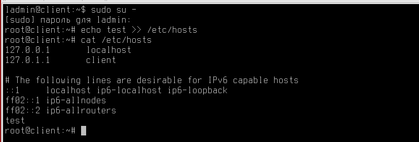


Получилось!


Попробуем зайти в низкий уровень целостности?

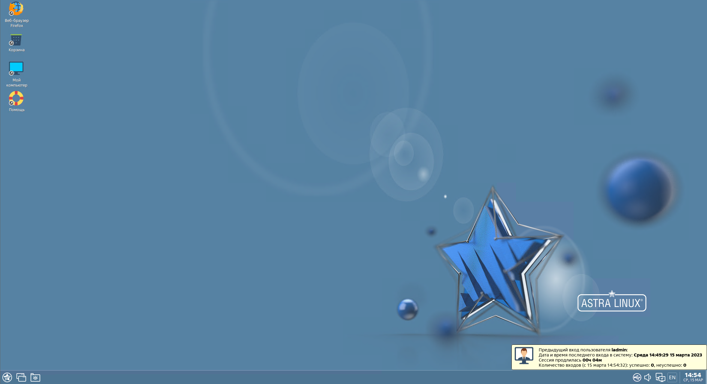

В этом режиме (на жарг. "синий режим") наш пользователь не имеет привилегий на изменение адреса или установку пакетов, это стандартный режим работы пользователя с ограниченным функционалом, в нём можно запускать офисные программы, открывать браузер и выполнять основные рабочие задачи с компьютером. Это низкий уровень целостности.

Откроем командную строку и введем "id"

```console
id
```

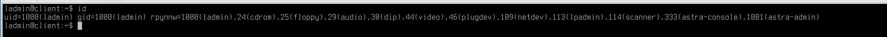

Обратите внимание, наш пользователь входит в группу astra-admin. Помните, эта группа позволяет всем её членам выполнять управление всей системой!

Давайте зайдем под пользователем "root"

```console
sudo su -
```

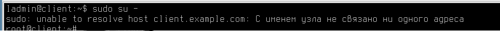

Вход успешно прошел, неужели мы так просто обошли систему безопасности?

Попробуем сделать что-нибудь деструктивное, например, записать пару строчек в файл /etc/hosts (достаточно примитивная операция для некоторых "зловредов").

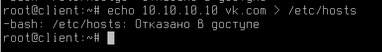

Как можно заметить, даже с повышенными до пользователя root привилегиями изменить что-то в данном файле не получится!

А если, например, мы попробуем остановить какой-то процесс?

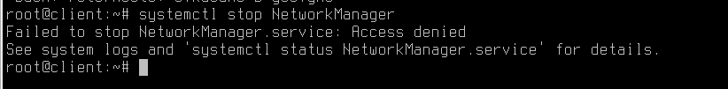

Также неудача! Мандатный контроль целостности во всей красе!

# Какие проблемы решает МКЦ?

Помните, что с дискреционными правами доступа каждый пользователь может назначить на свой файл любые права доступа для других пользователей и групп?

Но ведь пользователи - это люди, которые могут случайно допустить ошибку при настройке прав доступа, а это уже может привести к потере данных.

МКЦ же может назначать на файл уровень секретности (вспомните нашу первую лабораторную работу, там активно обсуждался вопрос грифов секретности), а также назначать категории.

Вспомним выдержку из текста первой лабораторной работы:


Представим, что у нас есть две категории "Яблоки" и "Апельсины". Мы наделили персонал, с уровнем доступа "Секретно"", полномочиями работать только с документами категории "Яблоки". Обращаться к документами категории "Апельсины", с тем же уровнем доступа "Секретно", данный персонал не сможет, ровно также как и передавать данные о документах "Яблоки" тем пользователям, кто работает с "Апельсинами". При этом, вероятно нам нужно дать универсальный доступ пользователю "Начальник", который может работать с документами любых категорий.

Давайте посмотрим как это выглядит в операционой системе, для этого создайте через графический интерфейс файл и перейдите в его свойства:


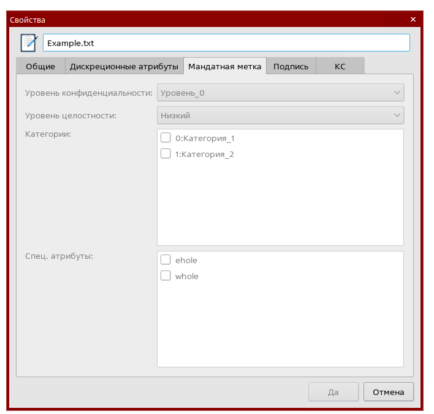

Как можно заметить, все параметры пустые и без возможности редактирования.

Но только ли данные следует защищать?

Действительно, ведь на компьютере кроме самой информации есть также и инструменты работы с ней - текстовые редакторы, браузер, файловые проводники и много другое. Как защититься от интеграции кода в них?

Мандатный контроль целостности реализован модулем ядра PARSEC в операционной системе Astrs Linux, он контролирует выполнение настроенных прав доступа, а также контролирует запущенные процессы и порядок их работы на компьютере.

Например, PARSEC прекрасно понимает, что запущенной на компьютере программе LibreOffice никогда не потребуется переписывать сетевые настройки вашего компьютера, а значит сможет оперативно отреагировать на устранение подобной уязвимости.

PARSEC также контролирует изменения которые вносятся в конфигурационные файлы компьютера.

# Неужели такую разработку внедрили только в Astra Linux?

Не только.

Впервые данный подход к обеспечению информационной безопасности был внедрен в Windows Vista, и в дальнейшем только развивался.

Вспомните, как иногда при работе с компьютером на Windows вам приходится запускать некоторые программы с правами администратора, чтобы они могли внести существенные изменения в работу ОС.

Или когда вы выключаете встроенные механизмы защиты операционной системы, такие как Windows Defender, например. Вы встречаетесь с МКЦ!

И в других Linux она также присутствует, но не той же мере, что в AstraLinux, например, в Debian похожий алгоритм работы можно реализовать через инструмент AppArmor, а в RedHat-подобных дистрибутивах - SELINUX. Не стоит путать, указанные сейчас решения и МКЦ - они отличаются и выполняют несколько другие задачи, но тоже выполняют функцию обеспечения информационной безопаности вашего ПК.

Повторим по материалу первой лабораторной работы.

Перед вам механизм изоляции процессов согласно разграничению по  уровням целостности.

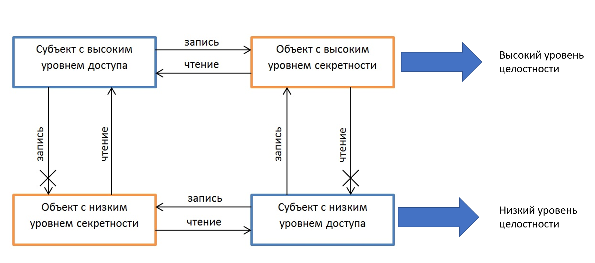

Стоит уточнить, что мандатный контроль целостности не предполагает иерархическое наследование прав.

Что значит, если вы находитесь на высоком уровне целостности - это не дает вам права менять данные, которые были созданы не вами на более низких уровнях целостности и наоборот также!

Заметка для администраторов -

---------------

Если вы хотите выполнять работы по администрированию операционной системы - например установка ПО или редактирование файлов, обязательно входите в систему под высоким уровнем целостности:

Выбрать уровень целостности можно:

1) Через вход в систему FLY через стандартный экран блокировки;

2) Через вход в систему удаленно по протоколу RDP, если пользователь имеет высокий уровень целостности, то по умолчанию будет выдан высокий уровень целостности;

3) По SSH установить высокий уровень целостности - **нельзя**.

---------------

Обратите внимание на скриншот ниже.

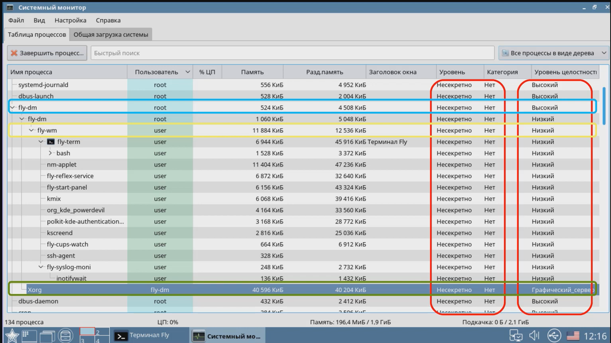

В этом скриншоте видно, что каждый процесс запущенный в системе имеет свой уровень целостности.

Например, процесс fly-dm - это менеджер окон  в Astra Linux, также он отвечает за вход пользователя в систему через экран блокировки в системе - как вы можете заметить на скриншоте, он запущен в режиме высокого уровня целостности, так как это требует по настройкам ОС.

Большинство других процессов запущены в низком уровне целостности, так как и сам пользователь, который попал в систему имеет низкий уровень.

Но обратите внимание, Уровень целостности процесса Xorg называется Графический_сервер.

Вспомним классификацию уровней целостности:

| Порядковый номер | Значение | Битовая маска | Комментарий
| -----------------| -------- | ------------- | -----------
| 0  | 000 | 0000 0000 | Нулевой уровень. "Низкий" |
| 1  | 001 | 0000 0001 | Уровень для сетевых сервисов |
| 2  | 002 | 0000 0010 | Уровень для Виртуализации |
| 3  | 004 | 0000 0100 | Уровень для специального ПО |
| 4  | 008 | 0000 1000 | Уровень графического сервера |
| 5  | 016 | 0001 0000 | По-умолчанию свободен, может быть использован для СУБД |
| 6  | 032 | 0010 0000 | Свободен |
| 7  | 064 | 0100 0000 | Высокй уровень. Уровень администратора |
| 8  | 128 | 1000 0000 | Высокй уровень. Уровень администратора в системах виртуалиации Брест |


Как можно заметить, уровень графического сервера находится выше чем "Низкий уровень целостности", но при этом все равно не имеет таких же высоких привилегий, как контур Администратора системы.

Это защищает систему от различных зловредных кодов, которые часто запускаются именно в графической оболочке пользователя (один из самых популярных примеров - различные фишинговые программы, которые переопределяют графический интерфейс пользователя, заменяя его ярлыки или ссылки на сайт на поддельные ресурсы). Ведь у процесса запускаемого на 4 уровне целостности нет прав редактировать уровни выше или ниже.

# Настало время познакомиться с системой поближе.

У МКЦ есть консольная утилита, но работать с ней не так удобно и быстро, как с графическим интерфейсом.

1) Войдите в операционную систему в высокий уровень целостности

2) Откройте меню "Пуск" --> "Системные" --> "Политика безопасности"

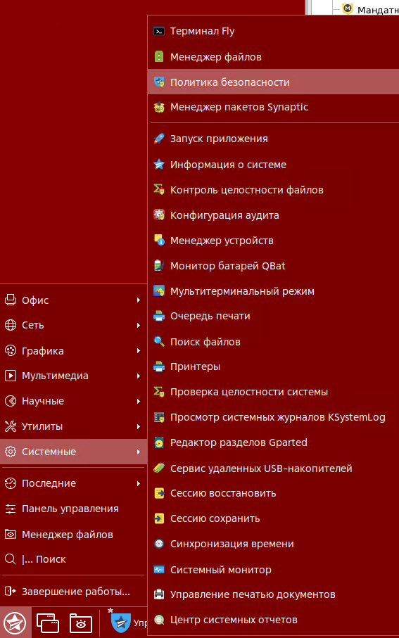

3) После того, как мы открыли данную программу, перейдите в раздел "Монитор безопаности"

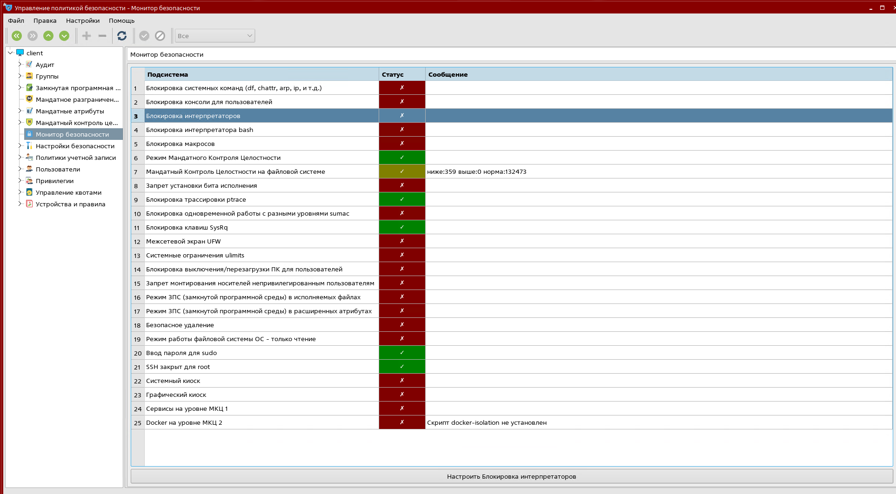

Как вы можете заметить, режим МКЦ включен - он включен, по-умолчанию, для версий "Воронеж" и "Смоленск".

Какой командой можно вывести информацию о том, в каком уровне целостности вы находитесь?

Команда pdp-id работает по шаблону:
```console
pdp-id <username>
```

Применим её на нашем лабораторном стенде:

```console
pdp-id ladmin
```

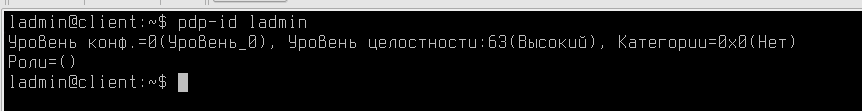

А как вывести уровень целостности файла?

```console
pdp-ls -M /etc/fstab
```
**Ключ -M выведет вам подробную информацию о МКЦ**

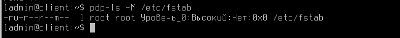

Обратите внимание, мы вошли в систему на Высоком уровне целостности, поэтому имеем право писать в файл /etc/fstab.

**В AstraLinux 1.7, по-умолчанию, все файлы системы защищены в высоком уровне целостности - например, /etc/shadow, /etc/passwd, /etc/fstab, /etc/hosts и т.д.**


# Дополнительная информация:
1) Немного про SUID, SGID и Sticky-Bit [Ссылка](https://ruvds.com/ru/helpcenter/suid-sgid-sticky-bit-linux/)
2) Немного про ACL в Linux [Ссылка](https://wiki.archlinux.org/title/Access_Control_Lists_(%D0%A0%D1%83%D1%81%D1%81%D0%BA%D0%B8%D0%B9))
3) Документация на chattr [Ссылка](https://www.opennet.ru/man.shtml?topic=chattr&category=1&russian=0)
