# Лабораторная работа №5. Тема: "Управление устройствами и модулями ядра"

Цель работы
----------
- Изучить основные концепции и методы управления устройствами и модулями ядра в Astra Linux;

- Провести практические эксперименты с модулями ядра и устройствами в Astra Linux.

Оборудование, ПО:
----------

Виртуальная машина или компьютер под управлением ОС AstraLinux 1.7 в режиме защищенности "Воронеж" или выше, а также с неразмеченной областью памяти на диске.

Если работаете на виртуальной машине, просто добавьте ей дополнительный виртуальный диск объемом, как минимум в 1 гб.


Ход работы:
----------

# Начнем с терминологии.

Ядро - это часть операционной системы, которая работает скрытно от пользователя системы, ведь пользователь не работает с ядром напрямую - он взаимодействует с программами и редакторами т.д.

Ядро берет на себя задачу обеспечить работу той или иной программы. Ядро имеет доступ к аппаратной части компьютера (к процессору, оперативной памяти, устройству хранения и т.д.).


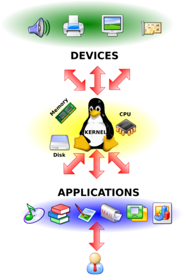

Стоит напомнить, что в Linux все драйвера и аппаратные подсистемы работают в одном адресном пространстве. Вы можете загружать и выгружать модули ядра для расширения функционала вашей операционной системы.

Чаще всего в процессе работы необходимо подключать модули драйверов устройств, поддержки криптографических алгоритмов, сетевых средств, и, чтобы уметь это правильно делать, нужно разбираться в строении ядра и уметь правильно работать с его модулями. Об этом и пойдет речь в этой лабораторной работе.

Процесс автоматической загрузки нового модуля ядра (при его наличии, конечно) во время подключения нового устройства выполняет демон - udev.

Доступные модули хранятся в каталогах:


-  **/lib/modules/<ядро_вашей_ос>** в виде файлов с расширением "ko".

-  **/lib32/modules/<ядро_вашей_ос>** в случае, если модуль ядра для х32-битной архитектуры

-  **/lib64/modules/<ядро_вашей_ос>** в случае, если модуль ядра для х64-битной архитектуры

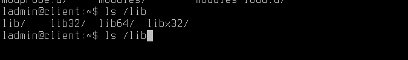

Стоит сразу предупредить, что вам не придется искать модули ядра в разных каталогах.

Если модуль уже присутствует в каталоге /lib/modules, то в других каталогах на него будет создана символьная ссылка, для оперативного доступа и взаимодействия.

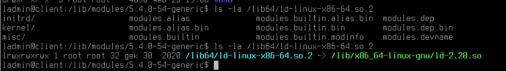

Попробуем найти модули ядра, что установлены на компьютере под AstraLinux 1.7:

```console
find /lib/modules/`uname -r` -name "*.ko"
```

Поясним введённую команду:

С поиском вы уже знакомы, но как можно заметить, в команде поиска мы непосредественно обращаемся к выводу другой команды - **uname -r**.

Данная команда выведет в ответ версию ядра вашей операционной системы, заключая конструкцию в ` ` вывод команды будет "дополнен" в find.

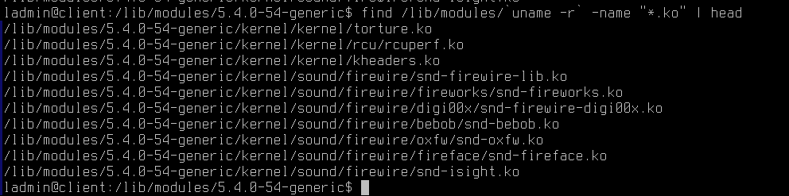

Файловая структура модулей выполнена по названию службы, за которую она отвечает. Как видно на примере, директория sound отвечает за модули ядра звуковой карты, а каталог firewire, за поддержку стандарта IEEE 1394.


Давайте воспользуемся командой 'modinfo', чтобы вывести более подробную информацию о модуле.

Шаблон применения:

```console
sudo modinfo <название_ядра>
```

Например, давайте выведем информацию о библиотеке snd-firewire-lib.

```console
sudo modinfo snd-firewire-lib
```

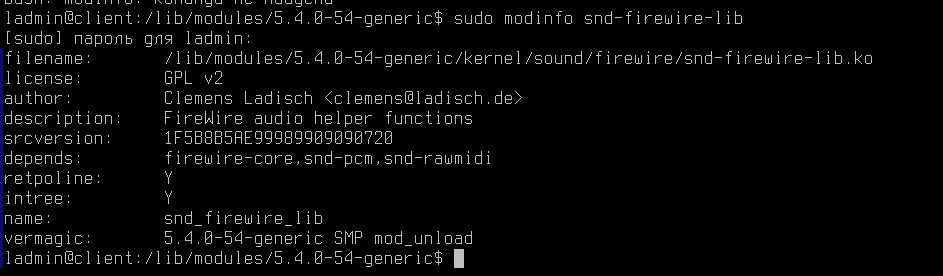

Вывод команды указывает нам версию модуля ядра, его автора ((поле author),  зависимости установки (поле depends), сведения о версии и т.д.

Сравним вывод с другой командой:

```console
sudo modinfo rt73usb
```

Как можно заметить, вывод команды огромен. Давайте ограничим его с помощью известной нам команды **head**

```console
sudo modinfo rt73usb | head
```


Обратите внимание, что появилась строка firmware.

----------

Поле «firmware» указывает на то, что этот модуль сам по себе не работает, ему нужна бинарная микропрограмма устройства в специальном файле «rt73.bin». Необходимость в файле микропрограммы появилась в связи с тем, что интерфейс взаимодействия с устройством закрыт, и эти функции возложены на файл прошивки (firmware). Взять firmware можно с сайта разработчика, установочного диска, поставляемого вместе с устройством, или где-нибудь в репозиториях дистрибутива, затем нужно его скопировать в каталог "/lib/firmware", при чем имя файла должно совпадать с тем, что указано в модуле.

----------

# Как загружать модуль ядра?

Загрузить модуль ядра можно с помощью команд - "insmod" и "modprobe".  Команда «insmod» загружает конкретный файл с расширением «*.ko», при этом, если модуль зависит от других модулей, еще не загруженных в ядро, команда выдаст ошибку, и не загрузит модуль. Команда «modprobe» работает только с деревом модулей, и возможна загрузка только оттуда по имени модуля, а не по имени файла.  Отсюда следует область применения этих команд: при помощи «insmod» подгружается файл модуля из произвольного места файловой системы (например, пользователь скомпилировал модули и перед переносом в дерево ядра решил проверить его работоспособность), а «modprobe» — для подгрузки уже готовых модулей, включенных в дерево модулей текущей версии ядра.

Например, чтобы выполнить загрузку ядра можно ввести команду:

```console
sudo modprobe rt73usb
```


В большинстве дистрибутивов этого было бы достаточно, но в Astra Linux  также необходимо добавить желаемый модуль ядра в файл - **/etc/modules-load.d/modules.conf**

Примечания -  также стоит проверить, что данный модуль не противоречит политикам ИБ в Astra Linux и не заблокирован в файле **/etc/modprobe.d/blacklist.conf**

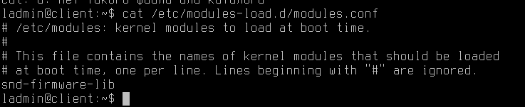

После этого выполните перезагрузку.

После загрузки компьютера выполните команду:

```console
sudo lsmod | grep rt73usb
```

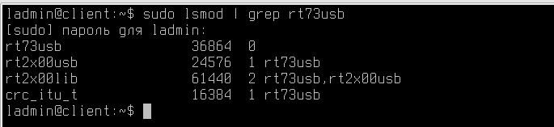

Модуль успешно подгрузился! Теперь, если у нас в компьютере появится адаптер беспроводной связи Ralink, то он корректно будет работать на нашем устройстве.

# А если необходимо выгрузить модуль?

Просто удалите строчку с вашем модулем из файла - **/etc/modules-load.d/modules.conf** и выполните перезагрузку.

После выгрузки модуля все возможности, которые он предоставлял, будут удалены из таблицы ядра.

Выполните проверку удаления модуля ядра самостоятельно.


# Управление устройствами в Astra Linux

При работе с Linux, вы наверняка слышали крылатую фразу - "В Linux - всё есть файл". И это правда!

Даже подключенные в систему клавиатура или мышь, процесс и ваш жесткий диск имеют абстрактный файл в системе.

Докажем данную гипотезу и заглянем в каталог /dev/


```console
ls /dev/
```

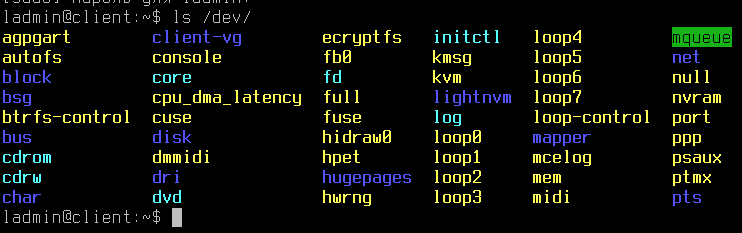

Огромное множество разных файлов вы видите перед собой - это все устройства (виртуальные или физические), которые используются в вашем компьютере.

Первый символ c в первой колонке указывает на тип файла — в данном случае символьное устройство. Для обычных файлов используется символ «-» (дефис), для каталогов
— d, для блочных устройств — b.


Например, обратите внимание на файл **/dev/core**

Попробуем его открыть?

```console
sudo cat /dev/core
```

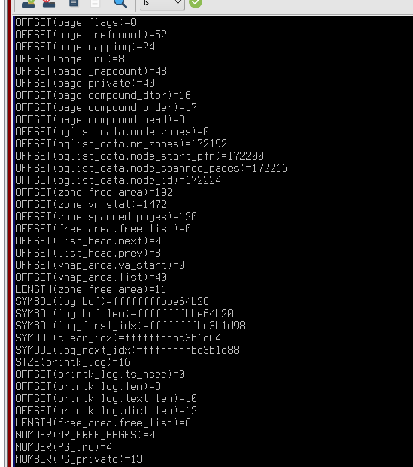

Нажмите Ctrl + C, чтобы отменить просмотр документа - он никогда не будет выведен полностью, ведь информация постоянно поступает в этот файл.

Этот файл отображает физическую память системы и записывается в ELF формате файла core. Полная длина этого файла - это размер оперативной памяти (RAM) плюс 4KB. С помощью этого псевдо-файла можно отслеживать текущее состояние любых структур ядра.


Наличие файлов устройств не означает, что данные устройства установлены в системе. Например, наличие файла **/dev/sda** не означает, что на компьютере установлен
жесткий диск SCSI. Это предусмотрено для облегчения установки программ и нового оборудования, т./к. исключает необходимость поиска нужных параметры и создания файлов для
новых устройств.

Каждый жесткий диск представлен отдельным файлом устройства в каталоге /dev: **/dev/hda** и **/dev/hdb** для первого и второго диска, подключенного по IDE шине, и **/dev/sda**, **/dev/sdb** и т. д. для дисков, использующих SCSI или SATA-интерфейс.

Стоит также упомянть, что в ядро ОС встроена программная реализация технологии RAID (уровни: RAID 0,RAID 1, RAID 5 и их сочетания). Команда **mdadm** предоставляет административный интерфейс пользователя для создания и управления массивами. После создания массива его устройство, например, **/dev/md0**, используется точно также, как **/dev/hda1** или **/dev/sdb7**.

## Так, а что можно делать с устройствами?

Очевидно, что в случае с блочными устройствами вы можете:
 1. Установить на них файловую систему

 2. Примонтировать пространство памяти в каталог в ОС (например, в /home - для хранения домашних профилей пользователей)

 3. Аналогично приходится выполнять процедуру и размонтирования

Итак, для установки файловой системы можно воспользоваться инструментами:

 - консольной утилитой **fdisk**

 - графической утилитой **gparted**

### Начнем с fdisk

1) Если вы используете новое блочное устройство, а не раздел уже размеченного ранее диска, то выполните следующие шаги:

 * Войдите в систему под пользователем с высоким уровнем целостности:

 * Убедитесь, что в систему успешно добавлен новый диск:

 ```console
  lsblk
 ```

 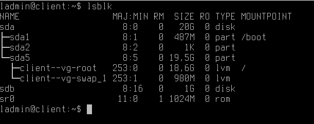

 Данная команда выводит список всех доступных блочных устройств, а также пути их монтирования в ОС.

Как можно заметить, у нас присутствует блочный диск /dev/sdb, который не имеет раздела.

Почему мы сделали такой поспешный вывод?

**При создании раздела на диске он будет пронумерован, то есть при создании первого раздела он получит наименование /dev/sdb1, при создании второго - /dev/sdb2 и т.д.**

В подтверждение этих слов, обратите внимание на **/dev/sda** - каждый раздел пронумерован.

Перейдем к форматированию нашего диска:

```console
 sudo fdisk /dev/sdb
```

 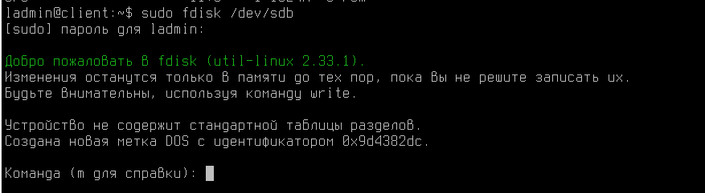

 Первым делом научимся обращаться к встроенной справке - введите букву "m"

 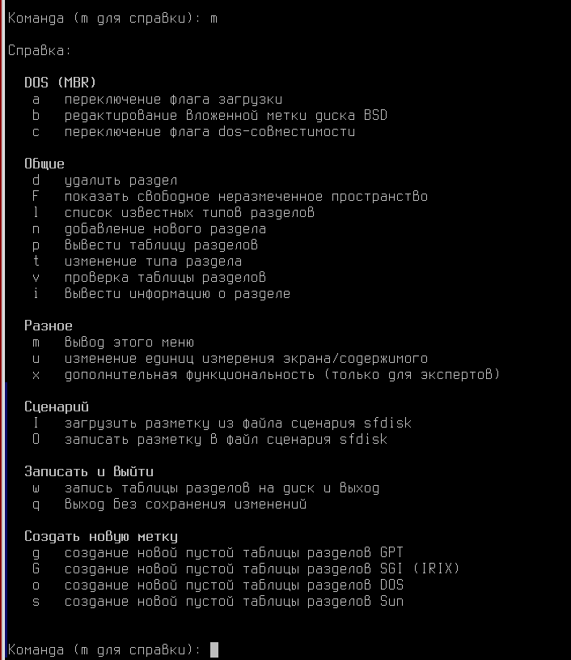

 В Astra Linux данный инструмент управления дисками переведен на русский язык, так что им достаточно удобно пользоваться. Внимательно ознакомьтесь с выводом команды!

Создадим новую таблицу разделов на диске с помощью команды - 'o'

 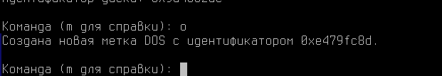

 После создания таблицы разделов, создадим сам раздел и разметим его, введите команду - "n"

 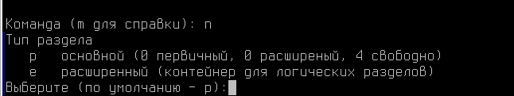

 После этого, необходимо выбрать тип раздела - основной или расширенный. Расширенный вам понадобится в случаях, если потребуется добавлять данный диск в RAID или LVM массивы. Выбираем  - "p", а затем "1", чтобы у нашего раздела был первый номер разметки.

  

Далее система задаст вам вопрос, какой сектор диска занять первым, а какой последним - это можно интерпертировать, как объем физического пространства, который диск заполнит в свой раздел.

Оставляя  значения по умолчанию, всё доступное пространство будет использовано для этого раздела.

Чтобы записать выполненные изменения, нажмите "w"

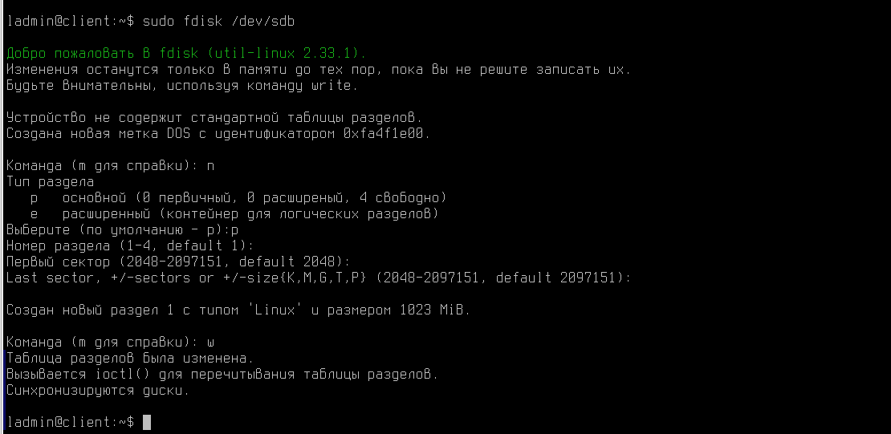


А что если нам нужно было всего 500 мб?

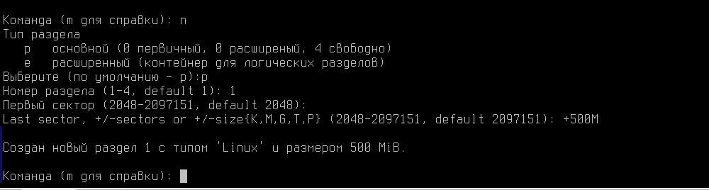

В этом случае, вам пришлось бы вручную назначть необходимый объем по формуле:

```console
+ <число> и далее буква K, M, G что соответственно указывает на килобайты, мегабайты, гигабайты.
```

Проверим результат

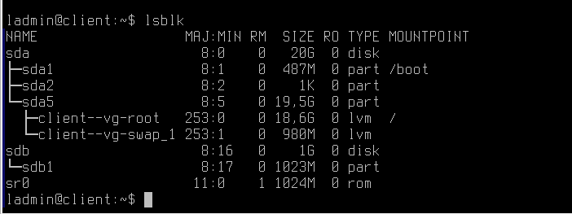

Как можно заметить раздел был создан, объемом в 1 Гб. Теперь на нём необходимо создать файловую систему.

**Файловая система — порядок, определяющий способ организации, хранения и именования данных на носителях информации в компьютерах.**

Файловых систем, которые могут работать в Linux - огромное множество (не только EXT4, NTFS или FAT32), а их количество только увеличивается. Спорить о их приемуществах и качествах можно долго.

Объединяет их одного - Linux сможет работать со всеми из них только если она будет установлена в ОС. Установка новой файловой системы ничем не отличается от установки любой программы на Astra Linux.

Например, вам потребовалось установить кластерную файловую систему - GlusterFS. Введите команду -

```console
sudo apt install glusterfs-common -y
```

И данная система будет на вашем ПК! Вводить команду выше в рамках нашего лаборот

Большинство файловых систем после установки в ОС можно сразу же разместить на ваш подготовленный диск через встроенный в систему набор скриптов - mkfs.

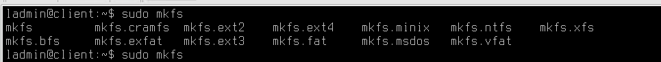

Например, давайте установим на раздел /dev/sdb1 файловую систему XFS.

```console
sudo mkfs.xfs /dev/sdb1
```

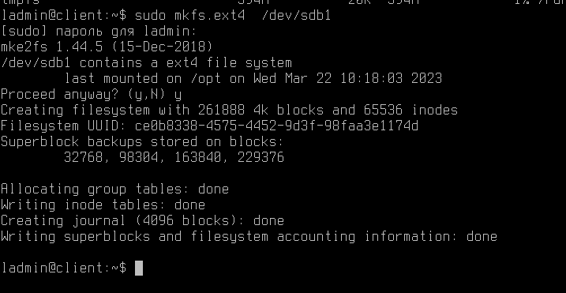

Отлично!

Раздел на диске есть, файловая система также была удачно установлена. Мы готовы монтировать данный диск в каталог на нашем компьютере!

```console
sudo mount /dev/sdb1 /opt
```

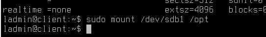

Проверить удачное монтирование можно с помощью команды -

```console
df -h
```

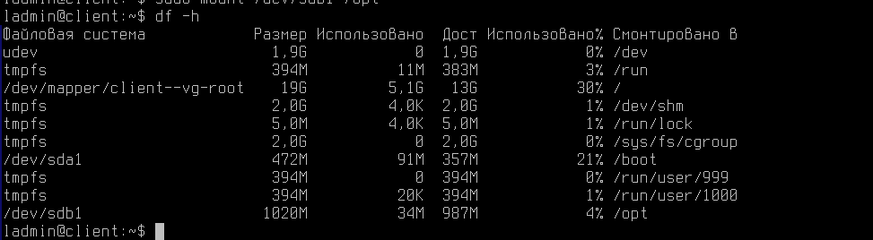

Возьмите данную команду себе на заметку, она позволит вам быстро и удобно выяснить куда примонтирован тот или иной диск, а также доступное на нём место.

Теперь, наш каталог /opt логически все также присутсвует в операционной системе, но физически размещен на другом диске.

Попробуем в него сохранить файл?

```console
cd /opt
touch file
```

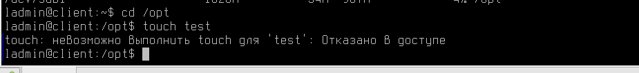

Вышла ошибка!

Ведь как многие заметили, процедура монтирования ресурса выполняется через команду sudo, а значит выполняется от имени пользователя root и с его правами доступа.

Чтобы исправить это, необходимо перемонтировать ресурс с опцией "-o defaults"

```console
mount /dev/sdb1 /opt -o defaults
```


В следующем материале вы познакомитесь с Управлением устройствами и модулями ядра!

Благодарю за чтение и успехов вам в обучении!


# Дополнительная информация:
1) Статья про модули ядра с сервиса Habr [Ссылка](https://habr.com/ru/post/117654/)
2) Немного про ACL в Linux [Ссылка](https://wiki.archlinux.org/title/Access_Control_Lists_(%D0%A0%D1%83%D1%81%D1%81%D0%BA%D0%B8%D0%B9))
3) Документация на chattr [Ссылка](https://www.opennet.ru/man.shtml?topic=chattr&category=1&russian=0)
