# Лабораторная работа №5. Тема: "Управление устройствами и модулями ядра"

Цель работы
----------
- Изучить основные концепции и методы управления устройствами и модулями ядра в Astra Linux;

- Провести практические эксперименты с модулями ядра и устройствами в Astra Linux.

Оборудование, ПО:
----------

Виртуальная машина или компьютер под управлением ОС AstraLinux 1.7 в режиме защищенности "Воронеж" или выше, а также с неразмеченной областью памяти на диске.

Если работаете на виртуальной машине, просто добавьте ей дополнительный виртуальный диск объемом, как минимум в 1 гб.


Ход работы:
----------

# Начнем с терминологии.

Ядро - это часть операционной системы, которая работает скрытно от пользователя системы, ведь пользователь не работает с ядром напрямую - он взаимодействует с программами и редакторами т.д.

Ядро берет на себя задачу обеспечить работу той или иной программы. Ядро имеет доступ к аппаратной части компьютера (к процессору, оперативной памяти, устройству хранения и т.д.).


Стоит напомнить, что в Linux все драйвера и аппаратные подсистемы работают в одном адресном пространстве. Вы можете загружать и выгружать модули ядра для расширения функционала вашей операционной системы.

Чаще всего в процессе работы необходимо подключать модули драйверов устройств, поддержки криптографических алгоритмов, сетевых средств, и, чтобы уметь это правильно делать, нужно разбираться в строении ядра и уметь правильно работать с его модулями. Об этом и пойдет речь в этой лабораторной работе.

Процесс автоматической загрузки нового модуля ядра (при его наличии, конечно) во время подключения нового устройства выполняет демон - udev.

Доступные модули хранятся в каталогах:


-  **/lib/modules/<ядро_вашей_ос>** в виде файлов с расширением "ko".

-  **/lib32/modules/<ядро_вашей_ос>** в случае, если модуль ядра для х32-битной архитектуры

-  **/lib64/modules/<ядро_вашей_ос>** в случае, если модуль ядра для х64-битной архитектуры


Стоит сразу предупредить, что вам не придется искать модули ядра в разных каталогах.

Если модуль уже присутствует в каталоге /lib/modules, то в других каталогах на него будет создана символьная ссылка, для оперативного доступа и взаимодействия.


Попробуем найти модули ядра, что установлены на компьютере под AstraLinux 1.7:

```console
find /lib/modules/`uname -r` -name "*.ko"
```

Поясним введённую команду:

С поиском вы уже знакомы, но как можно заметить, в команде поиска мы непосредественно обращаемся к выводу другой команды - **uname -r**.

Данная команда выведет в ответ версию ядра вашей операционной системы, заключая конструкцию в ` ` вывод команды будет "дополнен" в find.


Файловая структура модулей выполнена по названию службы, за которую она отвечает. Как видно на примере, директория sound отвечает за модули ядра звуковой карты, а каталог firewire, за поддержку стандарта IEEE 1394.


Давайте воспользуемся командой 'modinfo', чтобы вывести более подробную информацию о модуле.

Шаблон применения:

```console
sudo modinfo <название_ядра>
```

Например, давайте выведем информацию о библиотеке snd-firewire-lib.

```console
sudo modinfo snd-firewire-lib
```


Вывод команды указывает нам версию модуля ядра, его автора ((поле author),  зависимости установки (поле depends), сведения о версии и т.д.

Сравним вывод с другой командой:

```console
sudo modinfo rt73usb
```

Как можно заметить, вывод команды огромен. Давайте ограничим его с помощью известной нам команды **head**

```console
sudo modinfo rt73usb | head
```


Обратите внимание, что появилась строка firmware.

----------

Поле «firmware» указывает на то, что этот модуль сам по себе не работает, ему нужна бинарная микропрограмма устройства в специальном файле «rt73.bin». Необходимость в файле микропрограммы появилась в связи с тем, что интерфейс взаимодействия с устройством закрыт, и эти функции возложены на файл прошивки (firmware). Взять firmware можно с сайта разработчика, установочного диска, поставляемого вместе с устройством, или где-нибудь в репозиториях дистрибутива, затем нужно его скопировать в каталог "/lib/firmware", при чем имя файла должно совпадать с тем, что указано в модуле.

----------

# Как загружать модуль ядра?

Загрузить модуль ядра можно с помощью команд - "insmod" и "modprobe".  Команда «insmod» загружает конкретный файл с расширением «*.ko», при этом, если модуль зависит от других модулей, еще не загруженных в ядро, команда выдаст ошибку, и не загрузит модуль. Команда «modprobe» работает только с деревом модулей, и возможна загрузка только оттуда по имени модуля, а не по имени файла.  Отсюда следует область применения этих команд: при помощи «insmod» подгружается файл модуля из произвольного места файловой системы (например, пользователь скомпилировал модули и перед переносом в дерево ядра решил проверить его работоспособность), а «modprobe» — для подгрузки уже готовых модулей, включенных в дерево модулей текущей версии ядра.

Например, чтобы выполнить загрузку ядра можно ввести команду:

```console
sudo modprobe rt73usb
```


В большинстве дистрибутивов этого было бы достаточно, но в Astra Linux  также необходимо добавить желаемый модуль ядра в файл - **/etc/modules-load.d/modules.conf**

Примечания -  также стоит проверить, что данный модуль не противоречит политикам ИБ в Astra Linux и не заблокирован в файле **/etc/modprobe.d/blacklist.conf**


После этого выполните перезагрузку.

После загрузки компьютера выполните команду:

```console
sudo lsmod | grep rt73usb
```


Модуль успешно подгрузился! Теперь, если у нас в компьютере появится адаптер беспроводной связи Ralink, то он корректно будет работать на нашем устройстве.

# А если необходимо выгрузить модуль?

Просто удалите строчку с вашем модулем из файла - **/etc/modules-load.d/modules.conf** и выполните перезагрузку.

После выгрузки модуля все возможности, которые он предоставлял, будут удалены из таблицы ядра.

Выполните проверку удаления модуля ядра самостоятельно.


# Управление устройствами в Astra Linux

При работе с Linux, вы наверняка слышали крылатую фразу - "В Linux - всё есть файл". И это правда!

Даже подключенные в систему клавиатура или мышь, процесс и ваш жесткий диск имеют абстрактный файл в системе.

Докажем данную гипотезу и заглянем в каталог /dev/


```console
ls /dev/
```


Огромное множество разных файлов вы видите перед собой - это все устройства (виртуальные или физические), которые используются в вашем компьютере.

Первый символ c в первой колонке указывает на тип файла — в данном случае символьное устройство. Для обычных файлов используется символ «-» (дефис), для каталогов
— d, для блочных устройств — b.


Например, обратите внимание на файл **/dev/core**

Попробуем его открыть?

```console
sudo cat /dev/core
```


Нажмите Ctrl + C, чтобы отменить просмотр документа - он никогда не будет выведен полностью, ведь информация постоянно поступает в этот файл.

Этот файл отображает физическую память системы и записывается в ELF формате файла core. Полная длина этого файла - это размер оперативной памяти (RAM) плюс 4KB. С помощью этого псевдо-файла можно отслеживать текущее состояние любых структур ядра.


Наличие файлов устройств не означает, что данные устройства установлены в системе. Например, наличие файла **/dev/sda** не означает, что на компьютере установлен
жесткий диск SCSI. Это предусмотрено для облегчения установки программ и нового оборудования, т./к. исключает необходимость поиска нужных параметры и создания файлов для
новых устройств.

Каждый жесткий диск представлен отдельным файлом устройства в каталоге /dev: **/dev/hda** и **/dev/hdb** для первого и второго диска, подключенного по IDE шине, и **/dev/sda**, **/dev/sdb** и т. д. для дисков, использующих SCSI или SATA-интерфейс.

Стоит также упомянть, что в ядро ОС встроена программная реализация технологии RAID (уровни: RAID 0,RAID 1, RAID 5 и их сочетания). Команда **mdadm** предоставляет административный интерфейс пользователя для создания и управления массивами. После создания массива его устройство, например, **/dev/md0**, используется точно также, как **/dev/hda1** или **/dev/sdb7**.

## Так, а что можно делать с устройствами?

Очевидно, что в случае с блочными устройствами вы можете:
 1. Установить на них файловую систему

 2. Примонтировать пространство памяти в каталог в ОС (например, в /home - для хранения домашних профилей пользователей)

 3. Аналогично приходится выполнять процедуру и размонтирования

Итак, для установки файловой системы можно воспользоваться инструментами:

 - консольной утилитой **fdisk**

 - графической утилитой **gparted**

### Начнем с fdisk

1) Если вы используете новое блочное устройство, а не раздел уже размеченного ранее диска, то выполните следующие шаги:

 * Войдите в систему под пользователем с высоким уровнем целостности:

 * Убедитесь, что в систему успешно добавлен новый диск:

 ```console
  lsblk
 ```

 

 Данная команда выводит список всех доступных блочных устройств, а также пути их монтирования в ОС.

Как можно заметить, у нас присутствует блочный диск /dev/sdb, который не имеет раздела.

Почему мы сделали такой поспешный вывод?

**При создании раздела на диске он будет пронумерован, то есть при создании первого раздела он получит наименование /dev/sdb1, при создании второго - /dev/sdb2 и т.д.**

В подтверждение этих слов, обратите внимание на **/dev/sda** - каждый раздел пронумерован.

Перейдем к форматированию нашего диска:

```console
 sudo fdisk /dev/sdb
```

 

 Первым делом научимся обращаться к встроенной справке - введите букву "m"

 

 В Astra Linux данный инструмент управления дисками переведен на русский язык, так что им достаточно удобно пользоваться. Внимательно ознакомьтесь с выводом команды!

Создадим новую таблицу разделов на диске с помощью команды - 'o'

 

 После создания таблицы разделов, создадим сам раздел и разметим его, введите команду - "n"

 

 После этого, необходимо выбрать тип раздела - основной или расширенный. Расширенный вам понадобится в случаях, если потребуется добавлять данный диск в RAID или LVM массивы. Выбираем  - "p", а затем "1", чтобы у нашего раздела был первый номер разметки.

  

Далее система задаст вам вопрос, какой сектор диска занять первым, а какой последним - это можно интерпертировать, как объем физического пространства, который диск заполнит в свой раздел.

Оставляя  значения по умолчанию, всё доступное пространство будет использовано для этого раздела.

Чтобы записать выполненные изменения, нажмите "w"


А что если нам нужно было всего 500 мб?


В этом случае, вам пришлось бы вручную назначть необходимый объем по формуле:

```console
+ <число> и далее буква K, M, G что соответственно указывает на килобайты, мегабайты, гигабайты.
```

Проверим результат


Как можно заметить раздел был создан, объемом в 1 Гб. Теперь на нём необходимо создать файловую систему.

**Файловая система — порядок, определяющий способ организации, хранения и именования данных на носителях информации в компьютерах.**

Файловых систем, которые могут работать в Linux - огромное множество (не только EXT4, NTFS или FAT32), а их количество только увеличивается. Спорить о их приемуществах и качествах можно долго.

Объединяет их одного - Linux сможет работать со всеми из них только если она будет установлена в ОС. Установка новой файловой системы ничем не отличается от установки любой программы на Astra Linux.

Например, вам потребовалось установить кластерную файловую систему - GlusterFS. Введите команду -

```console
sudo apt install glusterfs-common -y
```

И данная система будет на вашем ПК! Команду выше можно не вводить, она лишь примерна

Стоит уточнить, что далеко не все файловые системы поддерживает метки конфиденциальности и уровни целостности.

Astra Linux Special Edition поддерживает работу с конфиденциальной информацией на дисковых разделах со следующими файловыми системами:

- ext2/ext3/ext4;

- xfs (начиная с Astra Linux Special Edition x.7);

- vfat;

- ntfs (поддерживается только полуавтоматическое монтирование в сессиях с нулевой классификационной меткой);

- iso9660/udf;

Большинство файловых систем после установки в ОС можно сразу же разместить на ваш подготовленный диск через встроенный в систему набор скриптов - mkfs.


Например, давайте установим на раздел /dev/sdb1 файловую систему EXT4.

```console
sudo mkfs.ext4 /dev/sdb1
```


Отлично!

Раздел на диске есть, файловая система также была удачно установлена. Мы готовы монтировать данный диск в каталог на нашем компьютере!

```console
sudo mount /dev/sdb1 /opt
```


Проверить удачное монтирование можно с помощью команды -

```console
df -h
```


Возьмите данную команду себе на заметку, она позволит вам быстро и удобно выяснить куда примонтирован тот или иной диск, а также доступное на нём место.

Теперь, наш каталог /opt логически все также присутсвует в операционной системе, но физически размещен на другом диске.

Попробуем в него сохранить файл?

```console
cd /opt
touch file
```


Вышла ошибка!

Проверим, каки права указаны на каталог /opt

```console
ls -la /opt
```

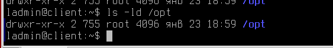

Как можно заметить, правда совершенно не позволяют пользователям создавать файлы в каталоге.

В рамках нашей работы, настроим права 777 - разрешим всем заходить и создавать файлы в этом каталоге.

```console
sudo chmod 777 /opt
```

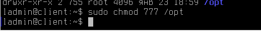

Теперь файлы создаются корректно!

```console
cd /opt
touch test
ls
```

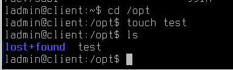

Казалось бы, что еще нужно - диск подключен и позволяет сохранять там файлы.

Но мы не добавили это блочное устройство в параметры автомонтирования, за это отвечает файл **/etc/fstab**

Примечание - стоит уточнить, что сетевые ресурсы, доступ к которым динамически назначается через ваши доменные политики монтируется с помощью технологии libpam-mount и конфигурационного файла **/etc/security/pam_mount.conf.xml**

Для этого перейдем в файл **/etc/fstab** и добавим следующую строку:

```console
/dev/sdb1 /opt ext4 defaults 0 0
```

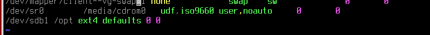

Разберемся с указанной строкой -

/dev/sdb1 - указываем диск, который планируется смонтировать

/opt - указываем

ext4 - указываем файловую систему на монтируемом блочном устройстве.

defaults - Далее указываются опции монтирования вот некоторые из них:

| Общие опции | Описание |
| -----------| -------- |
| sync/async | Все операции ввода / вывода файловой системы должны выполняться синхронно/асинхронно. |
| atime  | Производить запись времени последнего доступа к файлу. Значение по умолчанию. |
| noatime  | Не обновлять время доступа к файлу (например, для быстрого доступа к  потокам данных. |
| relatime  | Обновлять время доступа только при изменении файла или изменении времени доступа. (В отличие от noatime, необходимая опция для нормальной работы, например, почтовых клиентов или других приложений, которым необходимо точное время последнего изменения файлов) |
| norelatime  | Не включать функцию relatime  |
| strictatime  | Обновление времени доступа к структуре данных при изменении файлов. Отключает noatime и relatime. |
| auto / noauto	  | При auto устройство будет монтироваться автоматически при загрузке, или по команде mount. auto является вариантом по умолчанию. Если вы не хотите, чтобы устройство монтировалось автоматически, используйте параметр noauto. |
| defaults  | Использовать настройки по умолчанию. Эквивалентно: rw,suid,dev,exec,auto,nouser,async |
| exec / noexec  | exec позволяет выполнять двоичные файлы, которые находятся на этом раздел, в то время как noexec не позволяет этого делать. noexec может быть полезно для раздела, который не содержит бинарные файлы например /var, или содержит бинарные файлы которые вы не хотите выполнять на вашей системе, или которые не могут быть выполнены в вашей системе.  |
| encryption  | Определяет используемый алгоритм шифрования. Используется в сочетании с опцией loop. |
|  nofail | В случае отсутствия устройства не сообщать об ошибке. |
| _netdev  | Используется для предотвращения попыток смонтировать файловые системы, подключённые к сети. |
| owner  | Разрешает обычному (т.е. не root) пользователю монтировать файловую систему, если он является владельцем устройства. Эта опция подразумевает параметры nosuid и nodev. |
| ro  | Монтировать только для чтения. |
| rw  | Монтирование файловой системы для чтения и записи. |
| suid / nosuid	  | Разрешает использование битовых идентификаторов пользователей или групп / Запрещает использование битовых идентификаторов пользователей или групп. |
| user / nouser	  | user - разрешает монтирование от лица обычного пользователя, по умолчанию это имеет право сделать только root. nouser — соответсвенно запрещает |
| dev / nodev	  | Интерпретировать/не интерпретировать блок специальных устройств на файловой системе. |

Чаще всего при монтировании блочных устройств вам потребуется ключ defaults, а при монтировании сетевых ресурсов - user,noauto.

Параметры dump и pass практически всегда будут ноль.

### А что делает параметр dump?

Используется утилитой dump(8) для определения того, нужно ли создать резервную копию данных в файловой системе. У большинства пользователей утилита dump не установлена, поэтому им следует указывать 0 в этом поле.

### А что делает параметр fsck?

Используется программой fsck для определения того, нужно ли проверять целостность файловой системы. Значение 1 следует указывать только для корневой файловой системы; для остальных ФС, которые вы хотите проверять, используйте значение 2, которое имеет менее высокий приоритет. Файловые системы, для которых в поле указано значение 0, не будут проверяться fsck.

# Сложно работать с консольными утилитами?

Есть вариант, как можно выполнить разметку диска с помощью графической утилиты gparted.

Давайте попробуем с помощью данной программы:

- Удалить раздел, который уже есть в системе;

- Создать новый и разметить его.

Приступим к работе:

Откройте меню Пуск --> Системные --> Редактор разделов Gparted

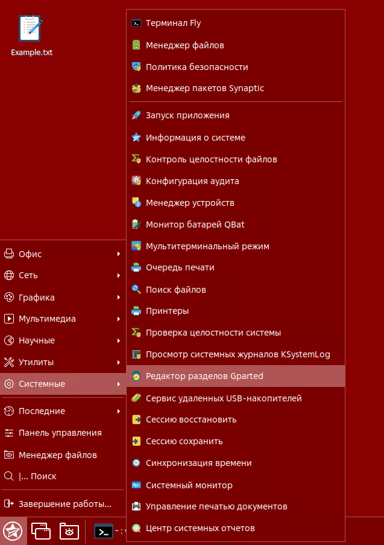

Программа ожидаемо затребует у вас права администратора, введите пароль.

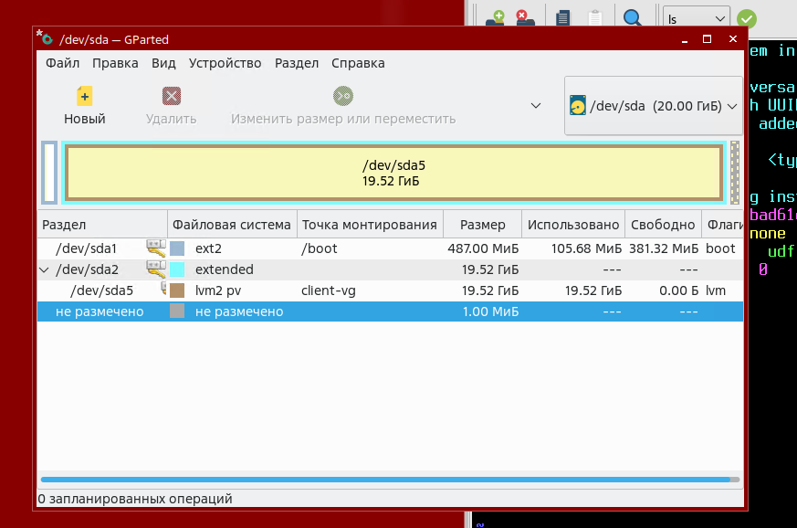

По результату, вы получите сведения о разделах вашей операционной системы.

**Но где же здесь разметка для диска /dev/sdb? Почему мы видим только разметку /dev/sda?**

Все просто, в правом верхнем углу выберите необходимое устройство, в нашем случае это /dev/sdb.

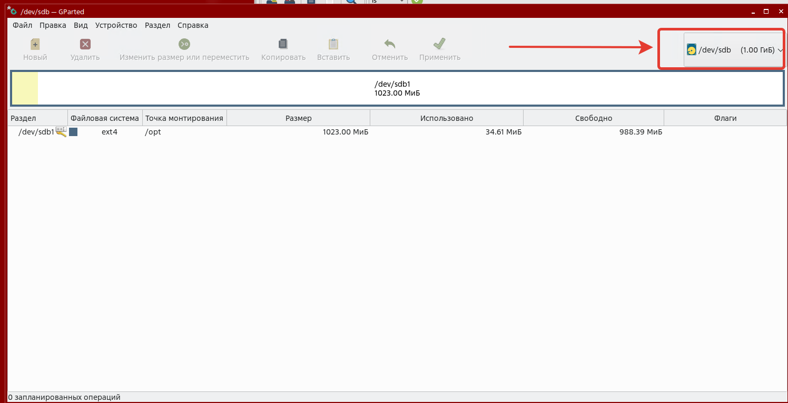


**Запомните! Вне зависимости от того, какой инструмент разметки вы используете - проводить такие работы нельзя с подключенным к каталогу устройством!**

Поэтому, первым делом выполним размонтирование.

Кликните ПКМ по разделу и выберите "Размонтировать"

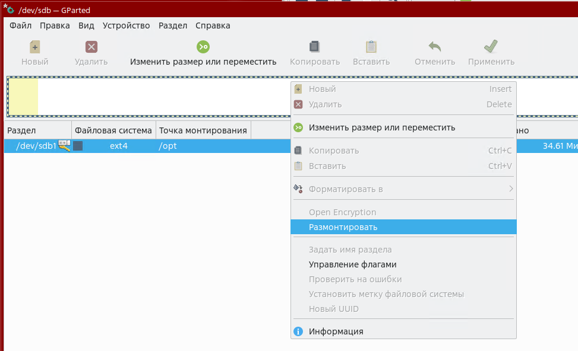

Затем, удалите раздел

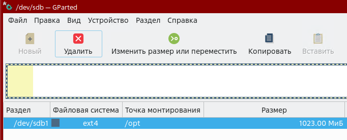

**Неужели вот так просто мы удалили безвозвратно целый раздел?**

Параметры в gparted не применяться, пока вы не запустите их. Наши изменения в данный момент - лишь показательные.

Выберите "Новый", чтобы создать новый раздел.

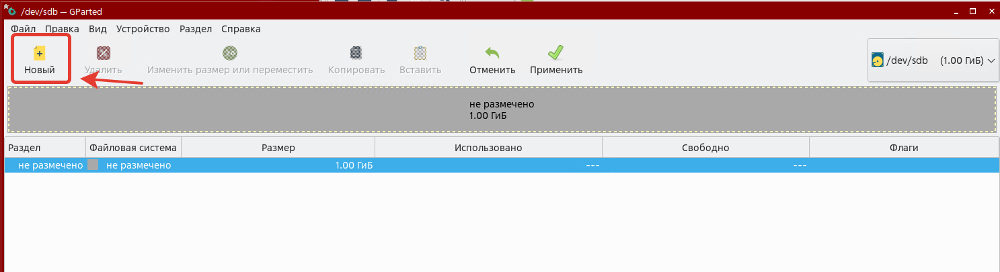

При выборе пункта "Новый" вы получаете возможность выбрать объем раздела, его тип и файловую систему - например, xfs

Попробуем разделить диск пополам, один на файловой системе XFS, а другой на EXT4

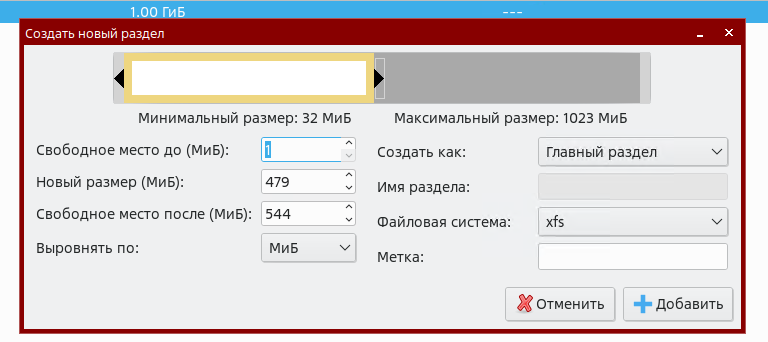

Как можно заметить, теперь у нас диск разделен на две отдельных области хранения созданных

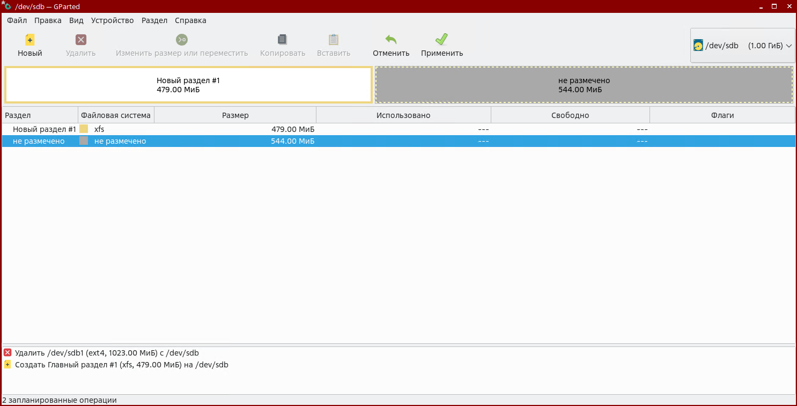

Разметку второго раздела выполните самостоятельно. Сравните с результатом на скриншоте.

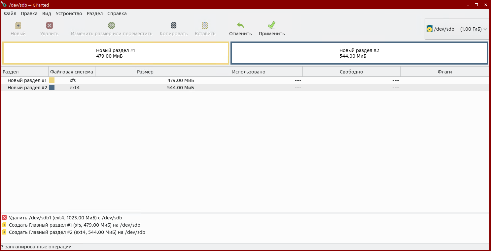

Чтобы применить настройки - нажмите соответствующую кнопку в интерфейсе программы.

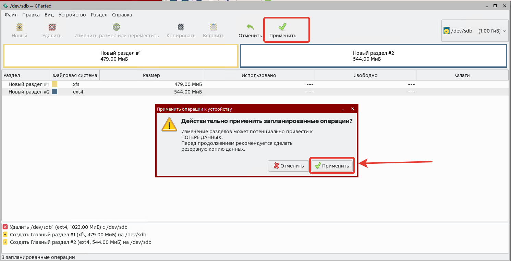

Результат видно в gparted

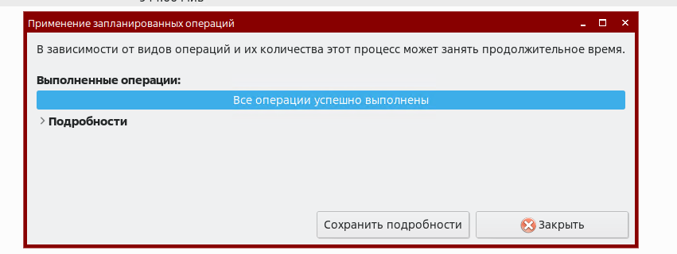

Безусловно, теперь наши правила в /etc/fstab не подойдут, адаптировать их нужно так:

```console
/dev/sdb1 /disk1 xfs defaults 0 0


```console
/dev/sdb2 /disk2 ext4 defaults 0 0
```

Итоговый результат выглядит так:

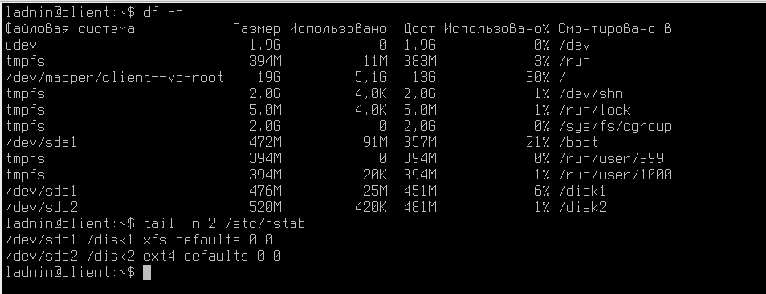


# Дополнительная информация о файловых системах Astra Linux
В зависимости от выбора, сделанного в процессе установки, каталоги могут относиться к различным файловым системам.
После начальной установки ФС ОС может состоять, например, из следующих частей:
- root:
- /bin — находятся выполняемые программы (точнее, их двоичные файлы). Они
необходимы для работы системы. Многие команды ОС являются программами
из этого каталога;
- /dev — расположены особые файлы, называемые «файлами устройств»
(device files). С их помощью осуществляется доступ ко всем физическим устройствам, установленным в системе;
- /boot — содержит необходимую информацию для загрузки системы (ядро
(ядра), образ initrd, файлы загрузчика);
- /root — домашний каталог суперпользователя;
- /tmp — используется для хранения временных файлов, создаваемых программами в процессе своей работы. Работая с программами, создающими много
больших временных файлов, лучше иметь отдельную ФС, чем простой каталог корневой ФС;
- /etc — содержит конфигурационные файлы ОС. Здесь находится файл паролей passwd, а также список ФС, подключаемых при начальной загрузке fstab.
В этом же каталоге хранятся сценарии загрузки (startup scripts), список узлов
(hosts) с их IP-адресами и множество других данных о конфигурации;
- /lib — содержатся разделяемые библиотеки, используемые многими программами во время своей работы. Применяя разделяемые библиотеки, хранящиеся
в общедоступном месте, можно уменьшить размер программ за счет повторного использования одного и того же кода;
- /рrос — является виртуальной файловой системой и используется для чтения из памяти информации о системе;
- /sbin — хранятся системные двоичные файлы (большинство из них используется для нужд системного администрирования);
- /usr — хранятся различные программы и данные, не подлежащие изменению. Каталог /usr и его подкаталоги необходимы для функционирования ОС, т. к. содержат
наиболее важные программы. Данный каталог почти всегда является отдельной ФС;
- /var — содержатся изменяемые файлы (такие как log-файлы и др.);
- /home — состоит из личных каталогов пользователей. Общепринято иметь здесь отдельный  раздел диска и файловой системы, чтобы обеспечить пользователям достаточное пространство для размещения своих файлов, а также возможность быстро его расширять.


В следующем материале вы познакомитесь с Расширенным администрированием устройств хранения данных!

Благодарю за чтение и успехов вам в обучении!


# Дополнительная информация:
1) Руководство администратора AstraLinux Часть 1 [Ссылка](https://astralinux.ru/products/astra-linux-special-edition/relizyi/smolensk/dokumentacziya/rukovodstvo-administratora-chast-1-astra-se.pdf)
2) Про Fstab [Ссылка](https://wiki.archlinux.org/title/Fstab_(%D0%A0%D1%83%D1%81%D1%81%D0%BA%D0%B8%D0%B9)
3) Про Fdisk [Ссылка](https://linux-faq.ru/page/komanda-fdisk)
