# Лабораторная работа №6. Тема: "Расширенное администрирование устройств хранения данных"

Цель работы
----------
- Изучить способы cоздания и настройки логических томов,;

- Приобрести навык создания снимков состояния.

Оборудование, ПО:
----------

Виртуальная машина или компьютер под управлением ОС AstraLinux 1.7 в режиме защищенности "Воронеж" или выше, а также с неразмеченной областью памяти на диске.

Если работаете на виртуальной машине, просто добавьте ей  два дополнительных виртуальных диска объемом, как минимум в 1 гб каждый.


Ход работы:
----------

# Начнем с терминологии и основных команд.

Данные на диске хранятся в виде файлов. Файл - это именованная область внешней памяти, в которую можно записывать и из которой можно считывать данные.

Также по ходу нашего урока мы будем использовать термин - блочное устройство.

Блочное устройство – это общий термин для обозначения устройства хранения данных, которое считывает или записывает данные в блоках определенного размера. Этот термин относится почти к каждому типу энергонезависимой памяти, в том числе к жестким дискам (HDD), твердотельным накопителям (SSD), флэш-памяти и т.д. Блочное устройство – это физическое устройство, на котором записывается файловая система. Файловая система, в свою очередь, определяет схему (разметку), согласно которой сохраняются данные и файлы.


Сами диски в системе именуются по порядку. Например, первый подключенный в систему диск через интерфейс SATA будет иметь имя - /dev/sda. Второй - /dev/sdb и так далее.

Ваши диски монтируются сразу в каталоги в операционной системе. Например, вы можете хранить всю домашнюю папку пользователя, которая по-умолчанию хранится в /home/$USERNAME сохранять на отдельном носителе.

Процесс монтирования можно выполнить с помощью команды - mount

Например,

```console
 mount -t ext4 /dev/sda /home/user
```

В этом случае ключ -t позволяет вам вручную выбрать тип файловой системы, которая установлена на диске или протокол доступа к удаленному файловому серверу (smb или nfs, например). Стоит уточнить, что команда mount  в большинстве случаев, способна сама определить тип файловой системы, особенно если монтируется локальный диск на компьютере.

Узнать список всех поддерживаемых файловых систем можно, заглянув в файл /proc/filesystems

```console
  cat /proc/filesystems
```

Монтирование с помощью команды выше выполняет это одноразово. Это удобно, когда нет необходимости в постоянно подключенном устройстве хранения. Например, при монтировании USB-накопителя или сетевого ресурса, который вы не используете постоянно.


Но что делать в случае, когда устройство необходимо постоянно?

**Помогает файл /etc/fstab**

В нем описан порядок и метод монтирования файловых ресурсов (удаленных или локальных)

Формат записи в файле /etc/fstab следующий:

**устройство точка_монтирования тип_файловой_системы опция1,опция2,опция3 дамп порядок_проверки**

Например -

**/dev/sdb1 /disk1 ext4 defaults 0 0**

Опция **defaults** как и прочие опции монтирования отразим в таблице, для удобства:


| Опции монтируемой файловой системы | Описание |
| ---------------------------------- | -------- |
| auto | файловая система монтируется автоматически |
| ro | 	монтируется в режиме "только чтение" |
| rw | монтируется в режиме "чтение и запись" |
| dev | файловая система может содержать файлы блочных и символьных устройств |
| exec | 	файловая система может содержать исполняемые файлы |
| suid | 	разрешено использование битов SUID и SGID |
| user | разрешено обычному пользователю размонтировать данную файловую систему и при этом используются значения по умолчанию (noexec, nosuid, nodev) |
| defaults | установки по умолчанию (rw, suid, dev, exec, nouser, async) |
| codepage | 	применять указанную кодировку к именам файлов |
| iocharset | отображать имена файлов в соответсвии с указанным набором символов |
| noauto | файловая система не может быть автоматически смонтирована |
| nodev	 | 	файловая система не может содержать файлы блочных и символьных устройств |
| noexec | файловая система не может содержать исполняемые файлы |
| nosuid | 	запрещено использование битов SUID и SGID |
| nouser | 	обычному пользователю запрещено размонтировать данную файловую систему |


## Попробуем отработать на практике

Проверим, какие блочные устройства есть на нашей лабораторной машине.

Воспользуемся удобной командой - lsblk

В большинстве случаев команды lsblk без каких-либо дополнительных параметров достаточно для определения диска или раздела, с которым вы хотите работать.

```console
  lsblk
```

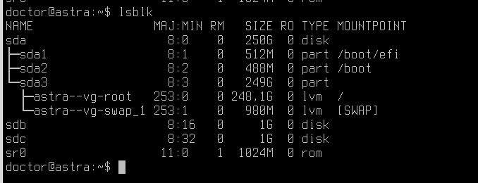

Здесь мы видим устройства, поименованные в алфавитном порядке.

**Как узнать, это SSD или жесткий диск (HDD) на Linux?**

Введите команду

```console
  lsblk --help
```

Так вы увидите список свойств, которые можно запросить у ваших блочных устройств хранения.

В этом сценарии вы будете использовать ROTA и DISC-GRAN.

ROTA сообщает вам, принадлежит ли блочное устройство к устройству ротационного хранения.

Жесткие диски являются ротационными, поэтому столбец выводит «1»  (двоичное логическое значение, означающее «true»).

DISC-GRAN показывает гранулярность сброса.

SSD поддерживают сброс, чтобы освободить неиспользуемые блоки данных.

Жесткие диски не поддерживают эту функцию, поскольку она им не нужны, поэтому в этом столбце для них будет отображаться нулевое значение («0B», что означает отказ от гранулярности нулевых байтов).


**Показать файловые системы, хранящиеся на дисках / разделах**


С помощью добавления параметров FSTYPE, LABEL можно получить информацию о установленных файловых системах.

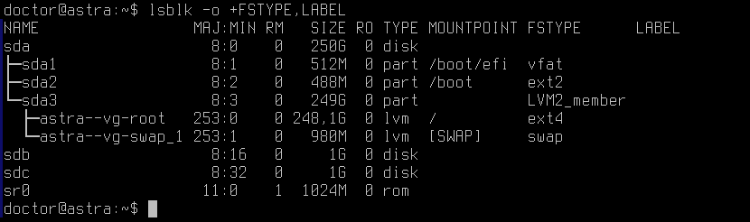

**Показать съемные устройства / USB-накопители**

С помощью параметра RM, можно точно выявить где съемное устройство и его тип.

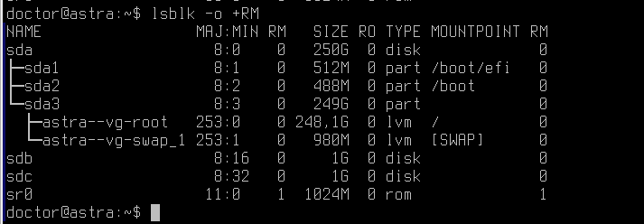


Эти команды будут полезны в вашем дальнейшем администрировании.

Как вы могли заметить, на лабораторном стенде есть два блочных устройства - **/dev/sdb** и **/dev/sdc**

Исходя из выводов команд lsblk, мы сделали вывод - данные диски совершенно пустые и не имеют даже установленной файловой системы.

# Работа с разделами

Для создания разделов есть множество утилит -

От графических, например, gparted до консольных, таких как cfdisk или fdisk.

Используйте тот инструмент, который вам будет удобнее в конкретной рабочей ситуации.

Разберем консольные инструменты - fdisk и cfdisk.

## Подробнее про fdisk

fdisk - системная утилита для управления разделами жесткого диска. Встречается практически во всех операционных системах на Linux-ядре. В связи с широким распространением, с данной командой можно столкнуться на многих форумах и в документациях к проектам.

Синтаксис команды классический

```console
  fdisk опции устройство
```

например, команда ниже запустит обработку диска /dev/sdb со стандартным набором опций данной утилиты

```console
  fdisk /dev/sdb
```

Для начала, выполним команду

```console
  fdisk -l
```

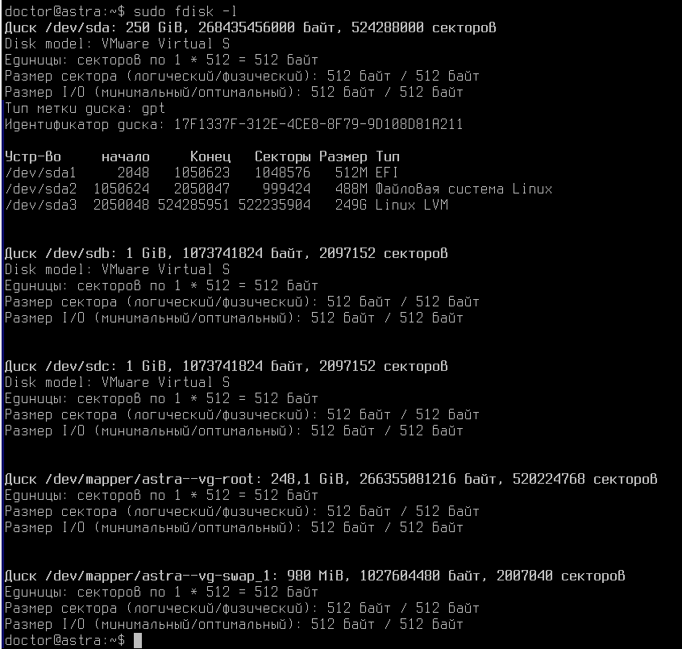

Данная команда покажет вам доступные для работы диски. Даже не смотря на то, что у нас с вами лабораторный стенд довольно простой, будьте внимательные при работе с разделами диска и всегда проверяйте устройства с которым вы хотите работать.

**Помните, что невнимательная работа с дисками может привести к потере полезных данных!**

Диски для нашей лабораторной работы, это **/dev/sdb** и **/dev/sdc**

Начнем с /dev/sdb


```console
  fdisk /dev/sdb
```

Попробуйте воспользоваться командой - m (manual) для того чтобы ознакомиться с справкой по команде.

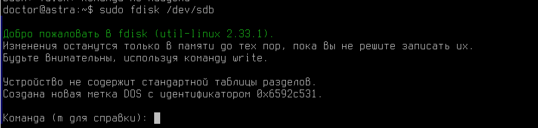

Ознакомившись со справкой, можно обнаружить, что команда "g" позволяет создать таблицу разделов GPT.

## Что такое таблица разделов?

**Для того чтобы разделить диск и необходима таблица разделов MBR или GPT. В этих таблицах хранятся сведения о начале и конце разделов. Даная информация помогает операционной системе определять, где начинается загрузочный диск и к какому сектору физического диска принадлежат данные**.

## Что такое MBR или GPT? В чем разница?

**На дисках с основной загрузочной записью (MBR) используется стандартная таблица разделов BIOS. Диски таблицы разделов GUID (GPT) используют единый расширяемый интерфейс встроенного ПО (UEFI).**


Создадим GPT таблицу.

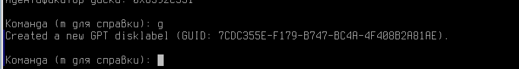

После этого разметим раздел на диске с помощью команды - n

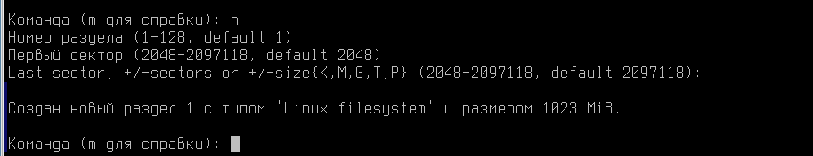

По умолчанию, fdisk размечает весь существующий доступны объем на диске. В нашем случае, 1 Гб.

Применим изменения с помощью команды - w

А затем сразу проверим результат через lsblk

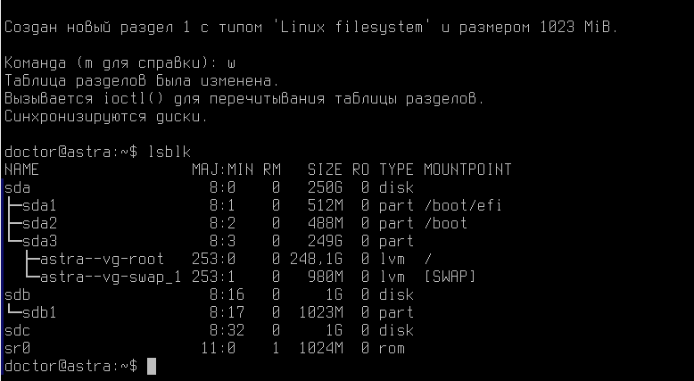

Как можно заметить, теперь у нас есть раздел объемом в 1Гб. Стоит уточнить, что файловой системы на этом разделе еще нет, а значит использовать его для хранения данных - невозможно!

Создадим файловую систему, например, с помощью встроенных в систему скриптов mkfs.

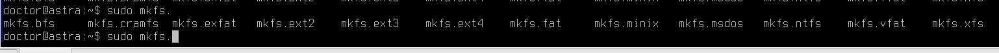

Создадим EXT4 на нашем новом разделе /dev/sdb1.

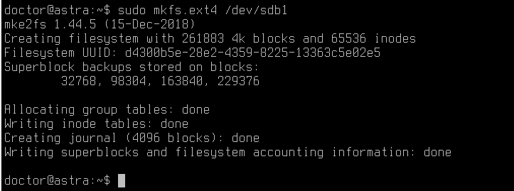

А теперь попробуем создать каталог в нашей операционной системе и примонтировать туда наш новый раздел.

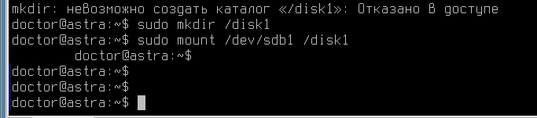

```console
  sudo mkdir /disk1
  sudo mount /dev/sdb1 /disk1
```
Перейдем в новый каталог и создадим там тестовый файл

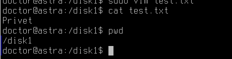

Вероятно, для создания файла в новом разделе вам потребуются права root, потому что команда mount, введеная нами выше, не дает обычному пользователю прав до данного блочного устройства.

# Fdisk неудобный?

Возможно, вам могло показаться что команда fdisk довольно неудобная. Есть ли альтернатива?

**Да, например, псевдографический cfdisk!**

Попробуем разметить диск через cfdisk на /dev/sdc

```console
  sudo cfdisk /dev/sdc
```

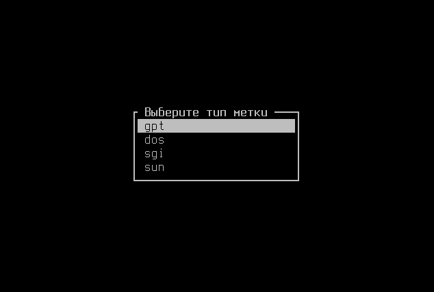

Первым делом нам надо создать разметку GPT.

Затем выберите "Новый" для создания нового раздела.

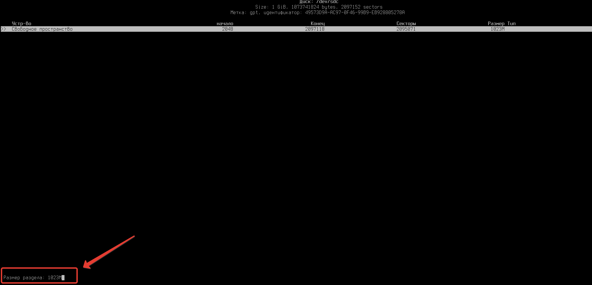

После выбора параметра "Новый" появится возможность указать размер раздела.

Также, как и консольная fdisk данная программа предлагает сразу разметить всё доступное физическое пространство диска. Выберем именно этот вариант.

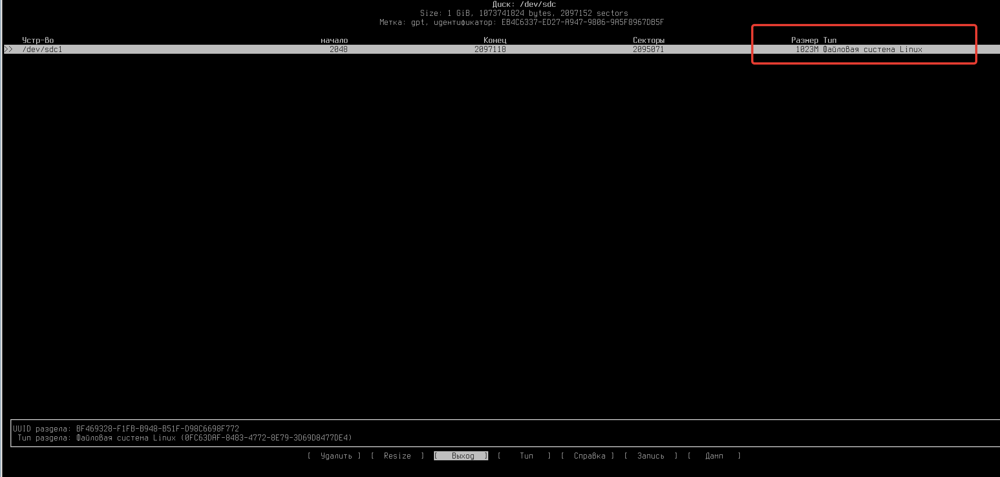

По умолчанию будет выбрана стандартная файловая система Linux, её мы в дальнейшем вручную настроим на ext4


Чтобы сохранить изменения выберите "Запись" в меню.

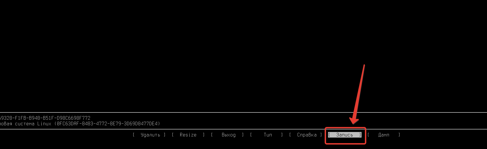

И пропишите вручную - "yes"

После этого программу можно закрыть, выбрав "Выход" в меню

Проверить, что все получилось можно с помощью знакомой нам команды lsblk

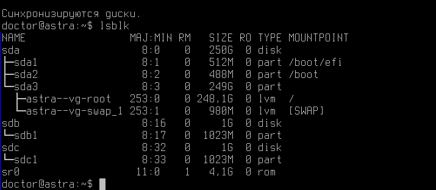

Установить файловую систему ext4 на разделе /dev/sdc1

```console
  sudo mkfs.ext4 /dev/sdc1
```

После этого оба наших раздела были проинициализированы и установлены, можем ими пользоваться в своих рабочих целях.


# А что еще можно делать с разделами и дисками?

Предположим, что теперь вам нужно разделить диск объемом в 1 Гб на две половины.

Безусловно, без переформатирования тут не справится, поэтому данные на дисках мы потеряем.

Попробуем!

Воспользуемся, например, тем же cfdisk.

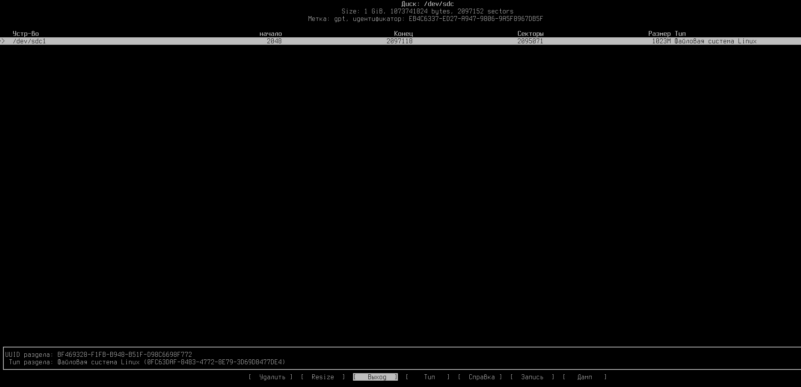

```console
  sudo cfdisk /dev/sdc
```

Удалите раздел

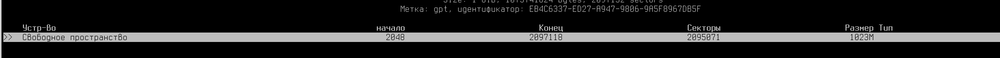

Создатите новый раздел, и укажите его размер в 512M

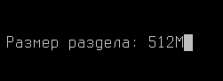

Если все сделали правильно, обратите внимание, что теперь на диске есть свободное пространство

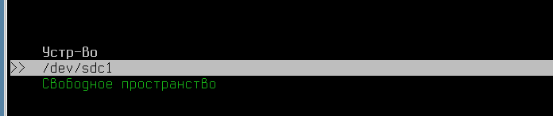

Для второго раздела диска оставьте все свободное пространство

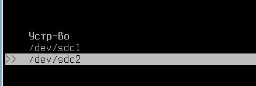

По итогу, получится два раздела на одном диске. Каждый из разделов по 500 Мб.

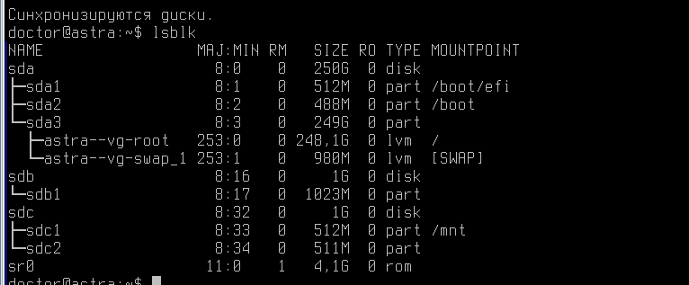


## Надоело кликать по меню! А как сделать тоже самое через fdisk?

Попробуем также переформатировать наш диск /dev/sdb в два раздела.

```console
  sudo fdisk /dev/sdb
```

Далее в интерфейсе программы fdisk мы выбираем букву - d, чтобы удалить раздел.


Проверим, что раздел был удален -

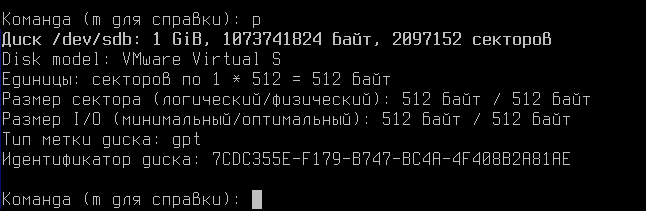

Создадим разделы -

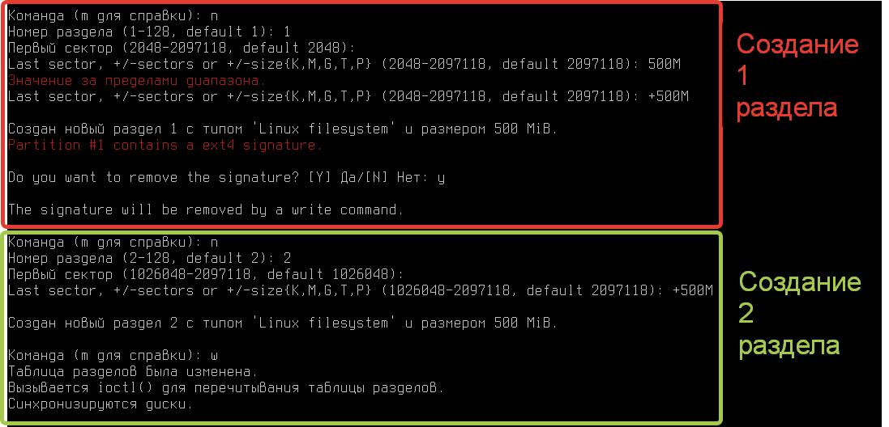

Команды, которые мы использовали в данном примере уже знакомы.

Из интересного:

- Мы указали номер раздела, в случае создания первого раздела номер был 1, в случае второго - 2.

- Объем диска мы указали через конструкцию - +500M (стоит сказать, что также можно и уменьшать разделы, если это поддерживается вашей файловой системой и вы предварительно сохранили данные в безопасном месте)

Проверим, что все работает командой - lsblk

```console
  sudo lsblk
```

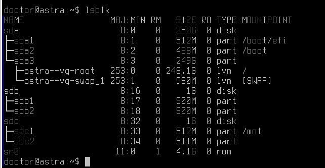

Наблюдаем два раздела по 500Мб нашего диска (в 1гб объема)

# Скучно! Где же расширенное администрирование?

Поговорим о LVM, и чем же он может пригодится вам, как системным администраторам и инженерам.

Прежде чем начать работу с LVM, разберемся - стоит ли вам использовать его.

Начнем с преимуществ.

- LVM работает на уровне ядра. Это гарантирует максимальную прозрачность конфигурации и использования диска. Приложения смогут работать с логическими виртуальными разделами LVM так же, как с обычными.

- Также в  LVM есть возможность произвольно создавать, изменять размер, переименовывать тома без перезагрузки компьютера.

- Кроме того, вы можете объединить любое количество дисков в один логический том (как в RAID, для примера), а затем создать столько томов, сколько вам нужно, быстро и легко.

- LVM позволяет создавать снепшоты логических томов без остановки операционной системы и использовать расширенные функции шифрования. Снепшоты могут быть полезны для реализации резервного копирования.


Но технология LVM имеет некоторые недостатки, которые могут быть препятствием для ее использования.

- Важнейшим недостатком является то, что LVM добавляет еще один виртуальный уровень, который может повлиять на производительность системы.

- И последним недостатком является то, что современные файловые системы (например, Btrfs и ZFS) имеют много ограничений по их использованию в производительной системе функций LVM (например, текущее изменение размера томов, создание снепшотов и т.п.). И в некоторых случаях смысл использования LVM просто теряется.

- Также, стоит уточнить, что восстанавливать LVM массивы может быть довольно сложно, что может привести к потере данных, при отсутствии резервного копирования.


## Попробуем собрать свой LVM-массив

Для начала рассмотрим схематичное изображение того, что находится внутри LVM-массива

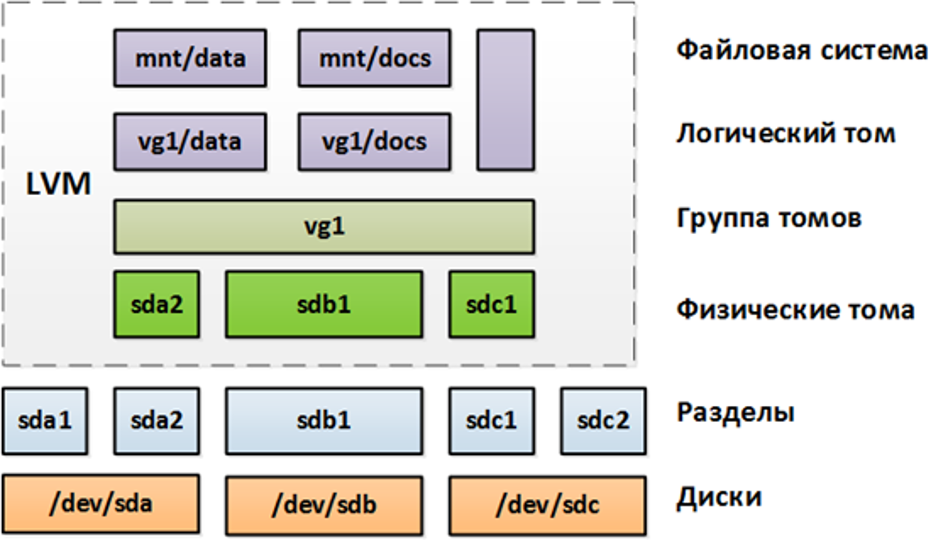

Система объединяет диски и разделы на них в единые группы, которые в дальнейшем можно монтировать.

Базовой физической единицей хранения логического тома LVM является блочное устройство, например  раздел или целый диск. Чтобы использовать устройство в качестве логического тома LVM, диск или раздел необходимо инициализировать как физический том (PV). Выполнить иницализацию можно командой -

```console
  sudo pvcreate /dev/sdc1
```

**Перед выполнением данной команды, пересоздайте разметку на дисках /dev/sdc и /dev/sdb**

При удачном выполнении команды, результат будет следующий -

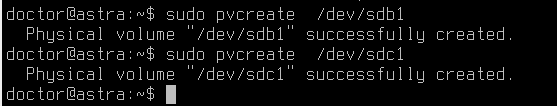

Это означает, что физические диски были проинициализированы. Сейчас они доступны для добавления в LVM-массив.

Проверить добавленные для работы диски можно командой -

```console
  sudo pvs
```

или

```console
  sudo pvdisplay
```

В выводе команды вы увидите добавленные диски

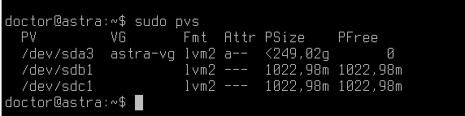

### Ура, а что дальше?

А теперь потребуется создать Volume Group - группу томов. Это дополнительная сущность для объединения дисков в одну систему.

Команда ниже - создаст объединенную группу томов под названием vg-edu, объединив оба диска (получив суммарный доступный объем в 2 Гб постоянной памяти)

```console
  sudo vgcreate vg-edu /dev/sdb1 /dev/sdc1
```

Проверить также можно:

```console
  sudo vgs
```

или

```console
  sudo vgdisplay
```

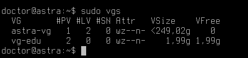

Так как наш vg-edu создан из двух дисков по 1 гигабайт, суммарный объем группы томов составляет - 2 гигабайта.

**Финальный шаг**

Теперь мы начинаем создание логического тома - Logical Volume (LV)

Для начала создадим LV объемом, например, в 500Мб.

```console
  sudo lvcreate -n Vol1 -L 500M vg-edu
```

Проверим состояние нашего логического тома

```console
  sudo lvs
```

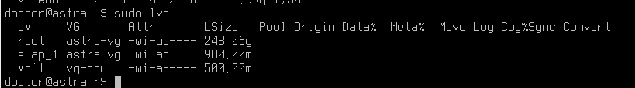

Ура! Логический том в 500 Мб создан, теперь мы можем создать на нем файловую систему и примонтировать в каталог своей операционной системы для хранения файлов.

В AstraLinux, в частности, LVM устройства находятся в /dev/mapper

Создадим файловую систему в новом блочном объекте

```console
  sudo mkfs.ext4 /dev/mapper/vg--edu-Vol1
```

Затем примонтируйте ресурс в папку /mnt, например.

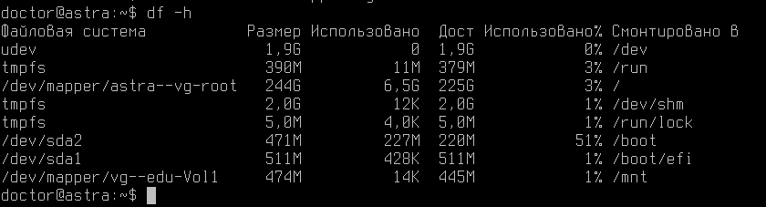

Создадим второй LVM-массив, но теперь с произвольным объемом в 50% от всего доступного объема массива.

```console
  sudo lvcreate -n Vol2 -l 50%FREE vg-edu
```

Проверим как получилось

```console
  sudo lvs
```

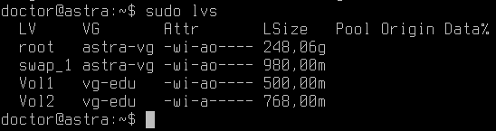

Отлично!

Создайте каталог **/mnt2** и примонтируйте LVM-раздел Vol2


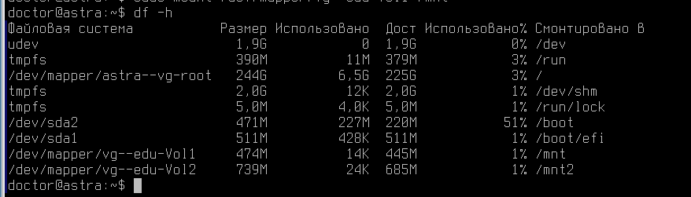

# Попробуем реализовать некоторые уникальные особенности LVM?

## Начнем со снимок состояния LVM-разделов

Создайте в каталоге /mnt несколько файлов, это будет полезно для проверки работы снапшотов

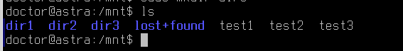

Снапшоты отчасти относятся к системам резервного копирования, но по сути не являются бэкапом, а лишь позволяют возвращать данные в исходное состояние на определенный момент времени. Так, когда необходимо сделать полный бэкап (например, сервера с активной базой данных), понадобится останавливать запись на диск и только потом снимать копию, т.к. в противном случае не все данные попадут в копию. При больших объемах копирование может занимать несколько часов и более, что недопустимо для production-систем, работающих 24\7 – ведь никто не останавливает базу для снятия дампа.

В таких случаях при необходимости создания полной копии без остановки на запись (почти) и приходят на помощь снапшоты. При создании снапшота происходит моментальный снимок или “заморозка” данных. Процесс создания снимка происходит, как правило, очень быстро – приложение или операционная система на какое-то непродолжительное время приостанавливает запись, и в этот момент создается моментальный снимок текущего состояния данных. Под приостановкой записи подразумевается, что приложение будет работать, но процессы записи на диск осуществляться не будут. Для клиента это может выглядеть как некая кратковременная задержка. Длительность такой задержки будет зависеть от приложения и его размера.

Поэтому есть общие рекомендации и напоминания относительно снапшотов:

  * Снапшот – не бэкап!

  * Не стоит хранить снапшоты длительное время, особенно в продакшене. Снапшот выполнил свою функцию и должен быть сразу удален.

  * Не стоит хранить большое дерево снапшотов (2-3 штуки будет достаточно), в противном случае производительность диска значительно просядет.


## Создадим снапшот

Процесс создания снапшота похож на создание Logical Volume, отличается лишь ключ -s

Объем снапшота назначается в зависимости от объема диска

```console
  sudo lvcreate -L 500M -s -n vol-snap /dev/mapper/vg--edu-Vol1
```

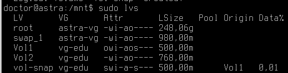


Поле Data (Allocated to snapshot в lvs), которое показывает свободное место для снапшота в процентах. На данный момент весь выделенный гигабайт свободен, т.к. в исходный том в /mnt не было записано никаких изменений.

Добавим изменения на наш диск - создайте с помощью команды `truncate` какой-нибудь тяжелый файлик, например, объемом в 40Мбайт.

```console
  sudo dd if=/dev/zero of=/mnt/Docs.txt bs=40M count=1 oflag=dsync
```

Теперь, как вы можете заметить значение Data изменилось - это связано с созданием нового файла.

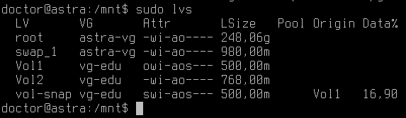

Создадим точку монтирования - /mnt3, туда примонтируем наш снапшот

```console
  sudo mount /dev/mapper/vg--edu-vol--snap /mnt3
```

И посмотрим его содержимое через `ls`

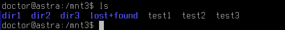

Как можно заметить, файла Docs.txt здесь нет, так как на момент создания снапшота данного файла не было.

## А что будет если выделенный объем пропадет?

Может возникнуть логичный вопрос, а что произойдет, если все секторы будут использованы, и отведенный гигабайт исчерпается? Такой снапшот станет непригодным для использования.

Удалить его можно будет командой -

```console
  sudo lvremove /dev/mapper/vg--edu-vol--snap
```

# Слияние (merge) снапшота с исходным LV

Данный функционал очень удобен при выполнении различных экспериментов. 
Приведем наглядный пример: например, сайт с базой данных. Перед применением в рабочей среде, необходимо проверить, что всё будет работать корректно. Смонтированный снапшот LVM-массива отлично подойдет для проведения эксперимента – в случае его успешности можно будет выполнить слияние с исходным томом или же просто удалить. Исходная файловая система при этом никак не пострадает. Применение данного функционала можно найти в различных случаях.

1. Для начала отмонтируйте основной LVM-массив и снапшот.

2. А затем объедините LVM-массивы

```
lvconvert --merge /dev/mapper/vg--edu-vol--snap -b
```

В конечном итоге, если слияние завершилось, проверьте, что исходные файлы не потерялись и не изменили свою конфигурацию.


# Заключение

В рамках этой лабораторной вы научились работать с блочными устройствами, создавать LVM-массивы.

В следующем материале вы познакомитесь с Запуском заданий по расписанию или в зависимости от изменений в ОС!

Благодарю за чтение и успехов вам в обучении!


# Дополнительная информация:
1) Руководство администратора  LVM  в RedHat Linux [Ссылка](https://access.redhat.com/documentation/en-us/red_hat_enterprise_linux/7/html/logical_volume_manager_administration/lv_overview)
2) Про Fstab [Ссылка](https://wiki.archlinux.org/title/Fstab_(%D0%A0%D1%83%D1%81%D1%81%D0%BA%D0%B8%D0%B9)
3) Про LVM [Ссылка](https://it-lux.ru/lvm-snapshot/)
