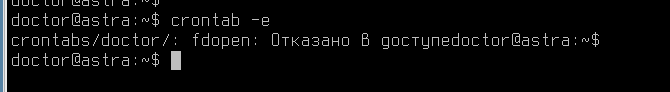
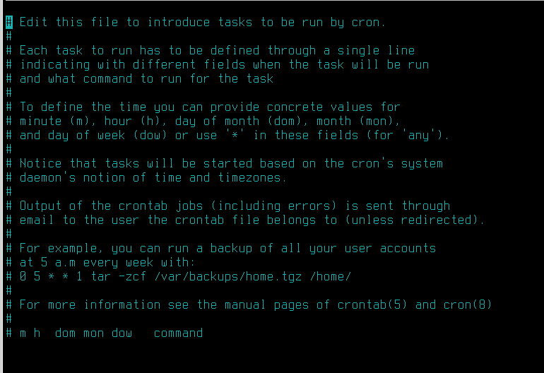

# Лабораторная работа №7. Тема: "Запуск заданий по расписанию"

Цель работы
----------
- Приобрести навык настройки расписания для запуска заданий через cron;

- Научиться использовать таймеры systemd для запуска заданий по расписанию.

Оборудование, ПО:
----------

Виртуальная машина или компьютер под управлением ОС AstraLinux 1.7 в режиме защищенности "Воронеж" или выше.


Ход работы:
----------

# Что будем делать сейчас?

В жизни, пожалуй, каждого администратора настанет момент, когда однажды он захочет автоматизировать свои рабочие процессы.

Например, чтобы в 21:00 все компьютеры в офисе отключались или чтобы в 22:00 сервер автоматически отправлял журнал отчета о работе за весь рабочий день - и многое много другое, что хотелось бы автоматизировать, в-первую очередь для удобства, а во-вторую таким образом мы сможем снизить ошибки связанные с человеческим фактором.

В этом материала мы, поговорим о инструментах настройки выполнения различных задач по времени - такие как **systemd** и **cron**, а также о **incron** — который следит за событиями в файловой системе и выполняет команду при наступлении указанного в задании события.


## Начнем с какой-нибудь простой задачи, которую автоматизируем по времени выполнения через crontab

Например, предположим, что мы хотим выводить текущее время каждую минуту  в отдельный файл /opt/time.log.

Да, на практике такая задача, вероятно, будет бесполезной - но это лишь начало!

Создайте скрипт **/opt/script.sh** со следующим содержимым:

```console
 #!/bin/bash
 echo "Current date and time: $(date)"
```

Не забудьте выдать новому скрипту права на выполнение.

После этого, попробуем в crontab настроить выполнение данного скрипта каждую минуту.

Откройте общий системный конфигурационный файл - **/etc/crontab** и в конце допишите строку:

```console
*/1 * * * * root /opt/script.sh >> /opt/date.log
```

Пока дожидаемся пары минут, чтобы точно убедиться в работоспособности нашего правила **crontab** обсудим описанное выше правило -


Сначала прописывается значение в какую минуту будет выполняться скрипт.

Далее значение часа, затем число месяца, порядковый номер месяца, а в конце день недели выполнения скрипта или команды.

В конце указывается имя пользователя, от имени которого будет запускаться скрипт.

Для того, чтобы удобнее работать с crontab и получить точную оценку в какой промежуток времени будет выполняеться скрипт, удобно воспользоваться сайтом - https://crontab.guru/#*

###А что означает запись - */1

В этом примере, это означает с каким "шагом" выполняется поставленная задача - буквально каждую минуту.

Пока мы читали этот текст - минута прошла! Пойдем смотреть содержимое файла /opt/date.log


Как мы можем заметить правило работает! В каждую 1 секунду новой минуты выполняется скрипт.

##Круто, а что так можно автоматизировать?

Почти все, за исключением запуска графических утилит.

В этом примере мы настраивали общий файл **/etc/crontab**, для его редактирования нужны права администратора.

Если у вас есть задача сделать выполнение заданий по расписанию с правами обычного пользователя, можно воспользоваться командой:

```console
crontab -e
```


Но, по умолчанию, пользователи не имеют прав на настройку пользовательского crontab



Для того, чтобы включить данную функцию в Astra Linux необходимо сделать команды:

1. Добавить имя пользователя в файл - /etc/cron.allow

```console
echo doctor >> /etc/cron.allow
```

2. Установить права доступа на файл /var/spool/cron/crontab

```console
sudo chmod 1733 /var/spool/cron/crontabs
```

Или просто добавить пользователя в группу crontabs

```console
sudo usermod -a -G crontab <username>
```

Затем повторим команду

```console
crontab -e
```



Конструкция файла такая же, как у общей версии **/etc/crontab**

Единственное отличие - указывать имя пользователя не нужно.

С помощью команды, указанной ниже, можно посмотреть все настроенные пользовательские задачи

```console
crontab -l
```

А сам конфигурационный файл пользователя  хранится по пути - **/var/spool/cron/crontabs/doctor**


# Теперь познакомимся с инструментом systemd timers

Несмотря на то, что cron, возможно, самый известный планировщик задач, таймеры systemd могут выступать в качестве альтернативы.


## Приемущества

Основные преимущества использования таймеров приходят от каждой задачи, которая имеет собственную службу systemd. Вот некоторые из этих преимуществ:

 - Задачи могут быть легко запущены независимо от их таймеров. Это упрощает отладку.

 - Каждая задача может быть настроена для работы в определенной среде.

 - Задачи могут быть присоединены к cgroups.

 - Задачи могут быть настроены в зависимости от других юнитов systemd.

 - Задачи регистрируются в журнале systemd для легкости отладки.


Попробуем создать таймер, например, чистку кэша операционной системы каждые 8 часов.

Создайте файл по пути - **/etc/systemd/system/cache.timer**

Содержимое должно быть следующим: 

```

[Unit]
Description=Clean Cache Service

[Timer]
OnCalendar=*:0/8
Persistent=true     
 
[Install]
WantedBy=timers.target

```

Затем, создадим скрипт очистки кэша оперативной памяти  - **/opt/clean_cache.sh**

```

#!/bin/bash
sync
echo 3 > /proc/sys/vm/drop_caches

```


После этого, необходимо создать сервис systemd -  **/etc/systemd/system/clean.service**


```

[Unit]
Description=Clean Cache Service

[Service]
Type=oneshot
ExecStart=/opt/clean_cache.sh

```


# Заключение

В рамках этой лабораторной вы научились работать с блочными устройствами, создавать LVM-массивы.

В следующем материале вы познакомитесь с Запуском заданий по расписанию или в зависимости от изменений в ОС!

Благодарю за чтение и успехов вам в обучении!


# Дополнительная информация:
1) Руководство администратора  LVM  в RedHat Linux [Ссылка](https://access.redhat.com/documentation/en-us/red_hat_enterprise_linux/7/html/logical_volume_manager_administration/lv_overview)
2) Про Fstab [Ссылка](https://wiki.archlinux.org/title/Fstab_(%D0%A0%D1%83%D1%81%D1%81%D0%BA%D0%B8%D0%B9)
3) Про LVM [Ссылка](https://it-lux.ru/lvm-snapshot/)
