# Лабораторная работа №8. Тема: "Поиск и устранение неисправностей"

Цель работы
----------
- Восстановление загрузчика системы, работа с каталогом /boot;

- восстановление пароля администратора;

- подготовка дампа для отправки разработчикам.

Оборудование, ПО:
----------

Виртуальная машина или компьютер под управлением ОС AstraLinux 1.7 в режиме защищенности "Воронеж" или выше.


Ход работы:
----------

# Что будем делать сейчас?

В данной лабораторной работе мы обсудим основные ошибки, которые часто возникают в ходе эксплуатации и работы с Astra Linux.

Стоит уточнить, что не все описанные в лабораторной работе инструменты и ситуации вы сможете повторить на виртуальной машине, которую вы получили от авторов курса.


# Ломаем раздел boot

А когда это может быть полезно? 

Раздел /boot может выйти из строя по разным причинам, чаще всего - это переполнение раздела /boot. Случится  это может, например, если вы установили новую версию ядра,не заменив или не удалив предыдущее ядро.

Раздел /boot, если вы устанавливали ОС с LVM-разделом, как правило имеет размер в 500 Мб.

На тестовой машине, умышленно приведем систему к будущей неработоспособности.

Для начала, проверим какой у нас объем свободного места на /boot, с помощью команды 

```

df -h

```

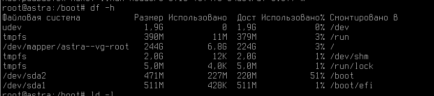

Как можно заметить, раздел /boot наполовину занят текущим ядром ОС Linux. 

Сделаем умышленную ошибку и установим новое ядро, не удалив старое. 

```

apt install linux-image-5.10

```

И посмотрим объем раздела теперь.

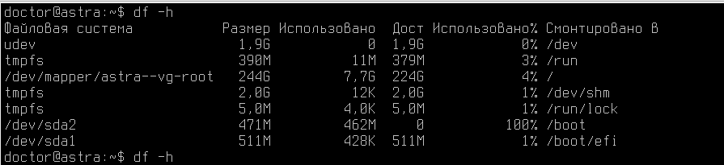


Заполнен! И что же будет, если мы перезагрузим нашу операционную систему? 

```

sudo reboot

```

GRUB предлагает нам несколько ядер для загрузки. Попробуем загрузиться.

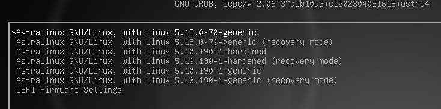

Выбираем ядро, и в итоге - ничего! Долгое ожидание загрузки ядра ни к чему не приведет. 

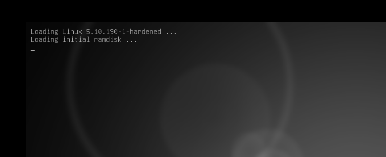

Сломали систему, теперь пора чинить! 

P.S. Возможно, в вашем случае ошибка будет примерно такой - 

```

- - - [ end Kernel panic - not syncing: VFS: Unable to mount root fs on unknow-block(0,0)

```


# Исправляем неисправность

Для исправления нам нужно загрузиться в "Режим восстановления". Для этого:

1. Подключить к виртуальной машине установочный образ Astra Linux 1.7;

2. Загрузиться с установочного диска;

3. Выбрать "Режим восстановления";


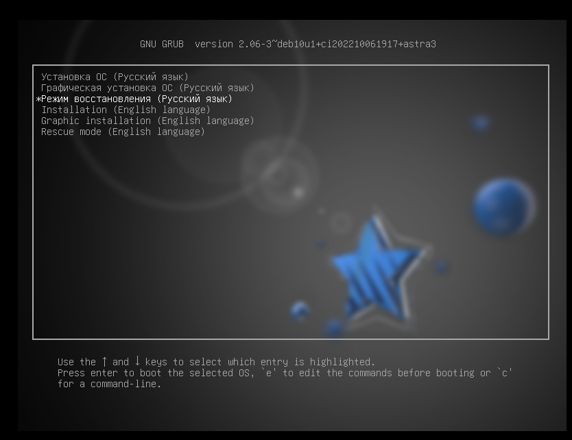


4. Далее пройдите по стандартным настройкам режима восстановления (установка языка, времени, раскладка клавиатуры - все эти настройки могут быть любыми и не влияют на работоспособность режима восстановления);

5. На следующем шаге необходимо выбрать устройсто корневой файловой системы. Вероятно, данный шаг вызовет у вас вопросы - что нужно подключать? Что это за "корневое устройство"? 

Тут потребуется вспомнить, на каком разделе вашего диска находится корневая директория - /

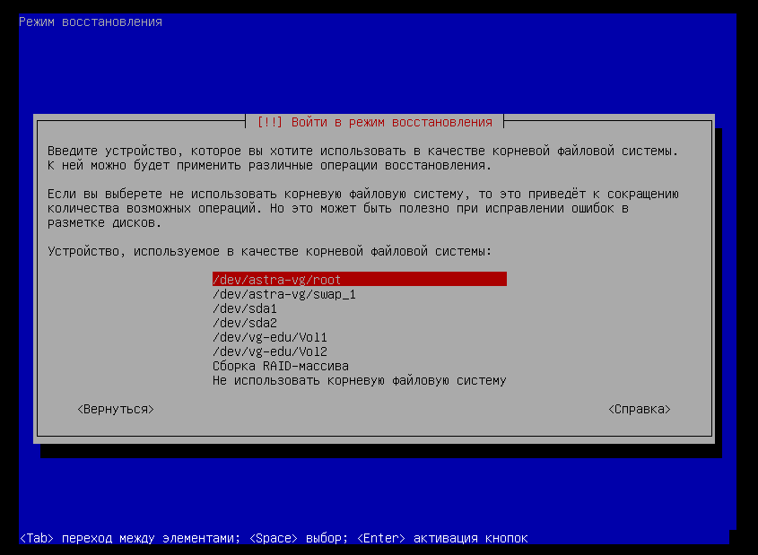


В случае LVM массива, который был инициализирован в ходе установки операционной системы, зачастую это /dev/astra-vg/root

6. Далее система предлагает смонтировать /boot, внимательно прочитайте описание вопроса, если раздел /boot сломан, то монтировать его не нужно, ведь со смонтированным устройством тяжело работать и существенно сужается возможный инструментарий. В нашем случае, мы будем удалять лишние установленные ядра, поэтому примонтировать раздел нужно.

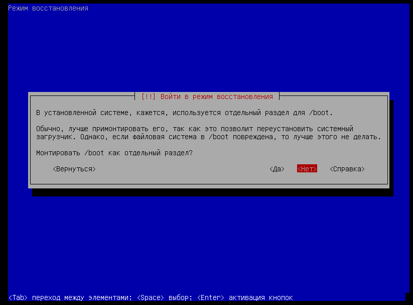


7. Запускаем командную оболочку на корневом разделе

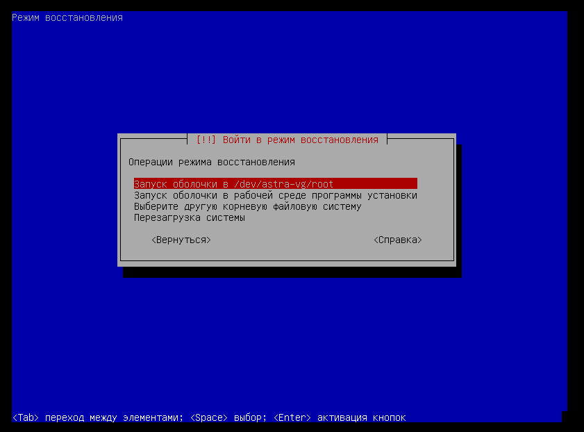


8. Если все правильно, то по итогу вы получаете Bash-shell вашей "сломанной" операционной системы. И здесь можно исправить все ошибки, которые приводят к неудачному запуску операционной системы.

Например:
 * Испорченный /boot
 * Испорченный файл /etc/fstab
 * Неправильно установленные драйвера или модули ядра


9. Затем, нажмите одновременно сочетание трех клавиш - CTRL + ALT + F2 и нажмите Enter на черном фоне. 

Введите команду 

```

chroot /target

```

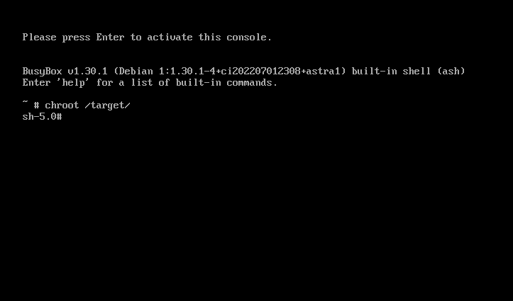


# Мы в системе, а что дальше?!

В примере мы установили множество версий ядра Linux, удалим все "старые".

Посмотрим, что у нас есть сейчас - 

```

ls -la

```

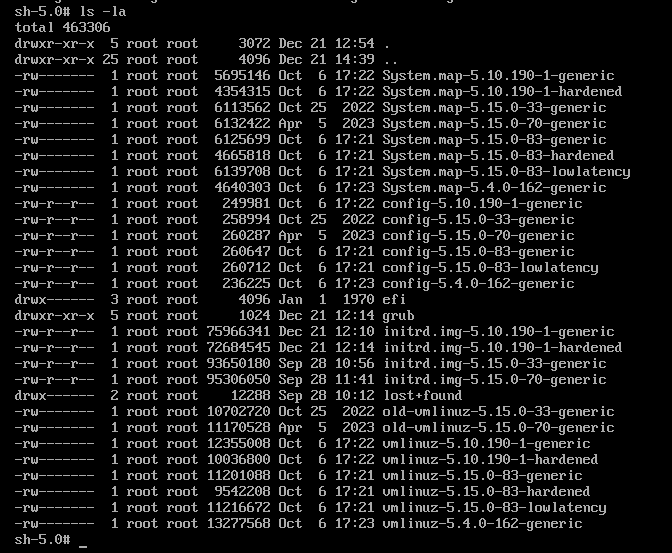


А затем удалим все старые версии ядра. 

```

rm -rf *5.4.0-162-generic

rm -rf *5.10.190-1-generic

rm -rf *5.15.0-33-generic

rm -rf *5.15.0-70-generic

```


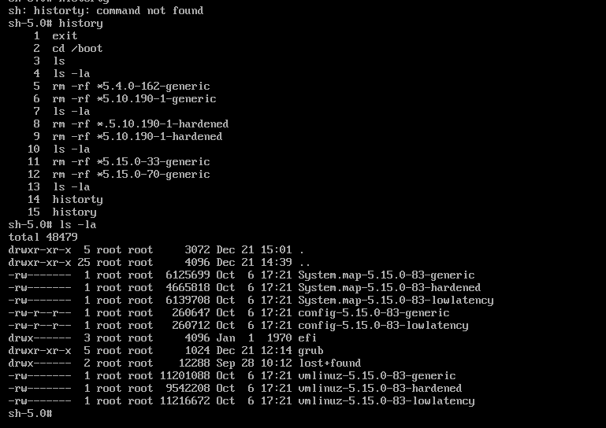


После удаления всего лишнего, обновим информацию о доступных ядер в initrd


```
update-initramfs -t -u -k 5.15.0-83-generic

```

# Это нужно знать!


---------------

Загрузочный RAM диск (Initrd) это образ корневой файловой системы,
который монтируется до того как настоящая корневая фс будет доступна.
Initrd связан с ядром и загружается как часть ядра в процессе загрузки
системы. Ядро монтирует образ initrd в котором находятся необходимые
модули для монтирования корневой фс и уже дальнейшего перехода в этот
корень как основной.

---------------

После обновления initrd, необходимо обновить загрузчик grub

```

update-grub

```

После этого из режима восстановления можно выйти

```

exit

```

А после перезагрузить систему

```

reboot

```

## Поздравляем с успешной починкой раздела /boot!

# Хорошо, /boot/ починили, а если я сломаю /etc/fstab? 

Напомню, что в файле /etc/fstab прописываются блочные устройства которые автоматически монтируются при загрузке ОС. При ошибках в конфигурации этого файла система не загрузится.

Важно уточнить, что если вдруг 


Предположим, что вы случайно ошиблись в файле **/etc/fstab**

Например, давайте закомментируем все параметры в этом файле


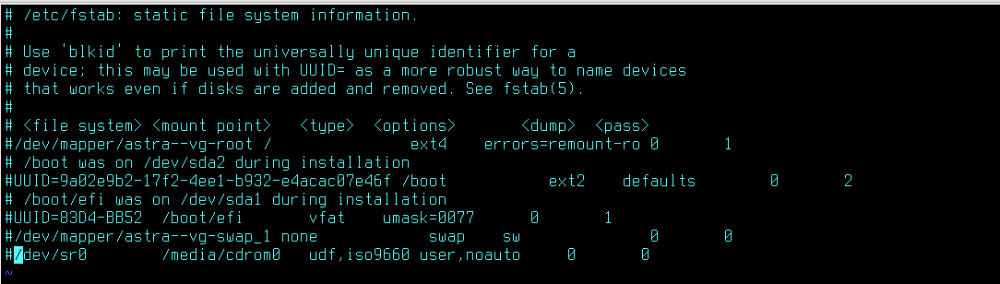


А затем выполним перезагрузку и увидим вот такое -

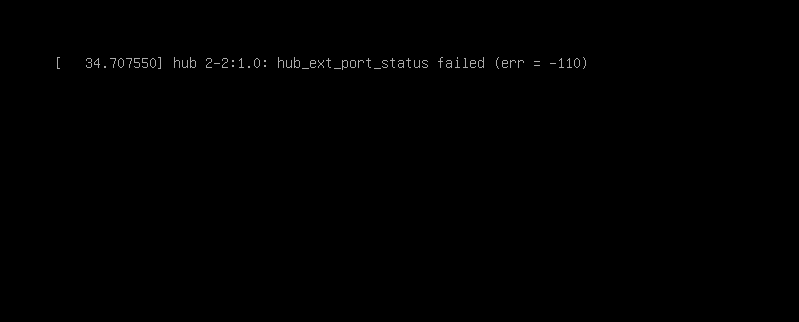


Система сломана! 

Теперь нужно также подключить установочный диск и загрузиться в режим восстановления.

Алгоритм тот же. Загрузимся в Shell и откроем файл /etc/fstab


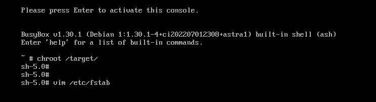

Исправляем ошибки в нашем конфигурационном файле

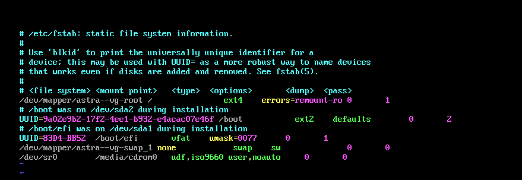

А затем также перезагружаемся и наблюдаем рабочую ОС! 

## Вариантов ошибок, которые могут сложиться  в ходе эксплуатации  Astra Linux, очень много - но большую часть из них можно решить через режим восстановления без потери данных пользователя.

# Восстановление пароля администратора

Наверняка, каждый специалист по внедрению и обслуживанию Astra Linux однажды столкнется с таким несчастьем, как забытый пароль от пользователя Адмиинистратор.

Разберем варианты его восстановления, без потери данных на учетной записи.

# 1. Восстановление через загрузчик GRUB

Для первого варианта вам потребуется вспомнить, какой пароль был назначен на загрузчик GRUB

To be continued...


# Заключение

В рамках этой лабораторной вы научились работать с блочными устройствами, создавать LVM-массивы.

В следующем материале вы познакомитесь с Запуском заданий по расписанию или в зависимости от изменений в ОС!

Благодарю за чтение и успехов вам в обучении!


# Дополнительная информация:
1) Про systemd-timers от OpenSUSE [Ссылка](https://documentation.suse.com/smart/systems-management/html/systemd-working-with-timers/index.html)
2) Про systemd-timers от Arch Linux [Ссылка](https://wiki.archlinux.org/title/Systemd_(%D0%A0%D1%83%D1%81%D1%81%D0%BA%D0%B8%D0%B9)/Timers_(%D0%A0%D1%83%D1%81%D1%81%D0%BA%D0%B8%D0%B9))
3) Статья про systemd-timers с Habr [Ссылка](https://habr.com/ru/companies/ruvds/articles/512868/)
