# Лабораторная работа №8. Тема: "Поиск и устранение неисправностей"

Цель работы
----------
- Восстановление загрузчика системы, работа с каталогом /boot;

- восстановление пароля администратора;

- подготовка дампа для отправки разработчикам.

Оборудование, ПО:
----------

Виртуальная машина или компьютер под управлением ОС AstraLinux 1.7 в режиме защищенности "Воронеж" или выше.


Ход работы:
----------

# Что будем делать сейчас?

В данной лабораторной работе мы обсудим основные ошибки, которые часто возникают в ходе эксплуатации и работы с Astra Linux.

Стоит уточнить, что не все описанные в лабораторной работе инструменты и ситуации вы сможете повторить на виртуальной машине, которую вы получили от авторов курса.


# Ломаем раздел boot

А когда это может быть полезно? 

Раздел /boot может выйти из строя по разным причинам, чаще всего - это переполнение раздела /boot. Случится  это может, например, если вы установили новую версию ядра,не заменив или не удалив предыдущее ядро.

Раздел /boot, если вы устанавливали ОС с LVM-разделом, как правило имеет размер в 500 Мб.

На тестовой машине, умышленно приведем систему к будущей неработоспособности.

Для начала, проверим какой у нас объем свободного места на /boot, с помощью команды 

```

df -h

```


Как можно заметить, раздел /boot наполовину занят текущим ядром ОС Linux. 

Сделаем умышленную ошибку и установим новое ядро, не удалив старое. 

```

apt install linux-image-5.10

```

И посмотрим объем раздела теперь.


Заполнен! И что же будет, если мы перезагрузим нашу операционную систему? 

```

sudo reboot

```

GRUB предлагает нам несколько ядер для загрузки. Попробуем загрузиться.


Выбираем ядро, и в итоге - ничего! Долгое ожидание загрузки ядра ни к чему не приведет. 


Сломали систему, теперь пора чинить! 

P.S. Возможно, в вашем случае ошибка будет примерно такой - 

```

- - - [ end Kernel panic - not syncing: VFS: Unable to mount root fs on unknow-block(0,0)

```


# Исправляем неисправность

Для исправления нам нужно загрузиться в "Режим восстановления". Для этого:

1. Подключить к виртуальной машине установочный образ Astra Linux 1.7;

2. Загрузиться с установочного диска;

3. Выбрать "Режим восстановления";


4. Далее пройдите по стандартным настройкам режима восстановления (установка языка, времени, раскладка клавиатуры - все эти настройки могут быть любыми и не влияют на работоспособность режима восстановления);

5. На следующем шаге необходимо выбрать устройсто корневой файловой системы. Вероятно, данный шаг вызовет у вас вопросы - что нужно подключать? Что это за "корневое устройство"? 

Тут потребуется вспомнить, на каком разделе вашего диска находится корневая директория - /


В случае LVM массива, который был инициализирован в ходе установки операционной системы, зачастую это /dev/astra-vg/root

6. Далее система предлагает смонтировать /boot, внимательно прочитайте описание вопроса, если раздел /boot сломан, то монтировать его не нужно, ведь со смонтированным устройством тяжело работать и существенно сужается возможный инструментарий. В нашем случае, мы будем удалять лишние установленные ядра, поэтому примонтировать раздел нужно.


7. Запускаем командную оболочку на корневом разделе


8. Если все правильно, то по итогу вы получаете Bash-shell вашей "сломанной" операционной системы. И здесь можно исправить все ошибки, которые приводят к неудачному запуску операционной системы.

Например:
 * Испорченный /boot
 * Испорченный файл /etc/fstab
 * Неправильно установленные драйвера или модули ядра


9. Затем, нажмите одновременно сочетание трех клавиш - CTRL + ALT + F2 и нажмите Enter на черном фоне. 

Введите команду 

```

chroot /target

```


# Мы в системе, а что дальше?!

В примере мы установили множество версий ядра Linux, удалим все "старые".

Посмотрим, что у нас есть сейчас - 

```

ls -la

```


А затем удалим все старые версии ядра. 

```

rm -rf *5.4.0-162-generic

rm -rf *5.10.190-1-generic

rm -rf *5.15.0-33-generic

rm -rf *5.15.0-70-generic

```


После удаления всего лишнего, обновим информацию о доступных ядер в initrd


```
update-initramfs -t -u -k 5.15.0-83-generic
```

Стоит добавить, что зачастую даже если вы столкнулись с неработоспособностью ОС до обновления ядра, указанные выше действия могут помочь восстановить загрузчик GRUB.

# Это нужно знать!


---------------

Загрузочный RAM диск (Initrd) это образ корневой файловой системы,
который монтируется до того как настоящая корневая фс будет доступна.
Initrd связан с ядром и загружается как часть ядра в процессе загрузки
системы. Ядро монтирует образ initrd в котором находятся необходимые
модули для монтирования корневой фс и уже дальнейшего перехода в этот
корень как основной.

---------------

После обновления initrd, необходимо обновить загрузчик grub

```

update-grub

```

После этого из режима восстановления можно выйти

```

exit

```

А после перезагрузить систему

```

reboot

```

## Поздравляем с успешной починкой раздела /boot!

# Хорошо, /boot/ починили, а если я сломаю /etc/fstab? 

Напомню, что в файле /etc/fstab прописываются блочные устройства которые автоматически монтируются при загрузке ОС. При ошибках в конфигурации этого файла система не загрузится.

Важно уточнить, что если вдруг 


Предположим, что вы случайно ошиблись в файле **/etc/fstab**

Например, давайте закомментируем все параметры в этом файле


А затем выполним перезагрузку и увидим вот такое -


Система сломана! 

Теперь нужно также подключить установочный диск и загрузиться в режим восстановления.

Алгоритм тот же. Загрузимся в Shell и откроем файл /etc/fstab


Исправляем ошибки в нашем конфигурационном файле


А затем также перезагружаемся и наблюдаем рабочую ОС! 

## Вариантов ошибок, которые могут сложиться  в ходе эксплуатации  Astra Linux, очень много - но большую часть из них можно решить через режим восстановления без потери данных пользователя.

# Восстановление пароля администратора

Наверняка, каждый специалист по внедрению и обслуживанию Astra Linux однажды столкнется с таким несчастьем, как забытый пароль от пользователя Адмиинистратор.

Разберем варианты его восстановления, без потери данных на учетной записи.

# 1. Восстановление через загрузчик GRUB

Для первого варианта вам потребуется вспомнить, какой пароль был назначен на загрузчик GRUB.

Перезагружаем операционную систему, и в поле выбора ядра нажимаем английскую клавишу **e**

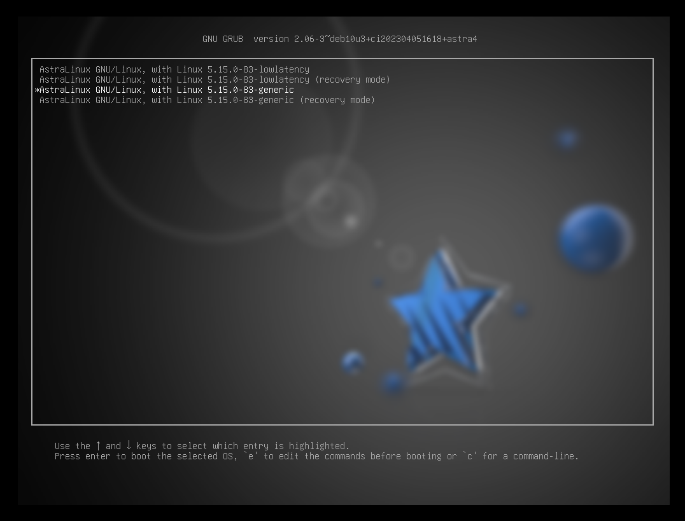

Система запросит логин от пользователя Администратора, а затем в поле "пароль" введите не пароль от вашей УЗ, а пароль от GRUB.

Затем, найдите строку, которая начинается со слова Linux. 


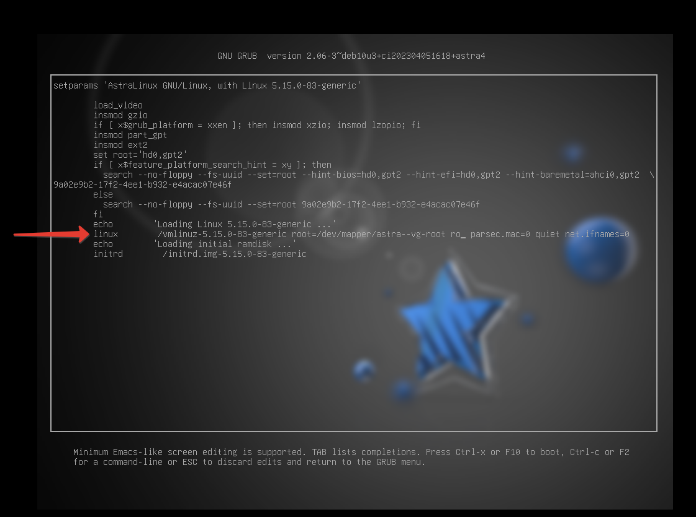


В этой строке замените слово **ro** на **rw**, а в конце строки добавьте **init /bin/bash**

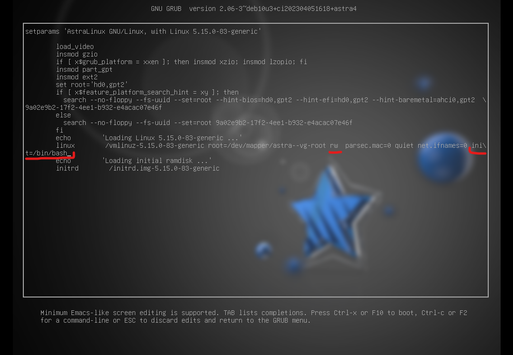

Будьте внимательны, что в системе символы "переноса", как в данном случае "/" - устанавливаются автоматически.

После исправления загрузчика, нажмите клавишу F10.

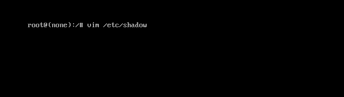

Загрузится командная строка, откроем в ней файл хранения теневых паролей - **/etc/shadow**

```
vim /etc/shadow
```


В этом файле, находим строчку с нашим пользователем кому требуется сбросить пароль, и удаляем его хэш.

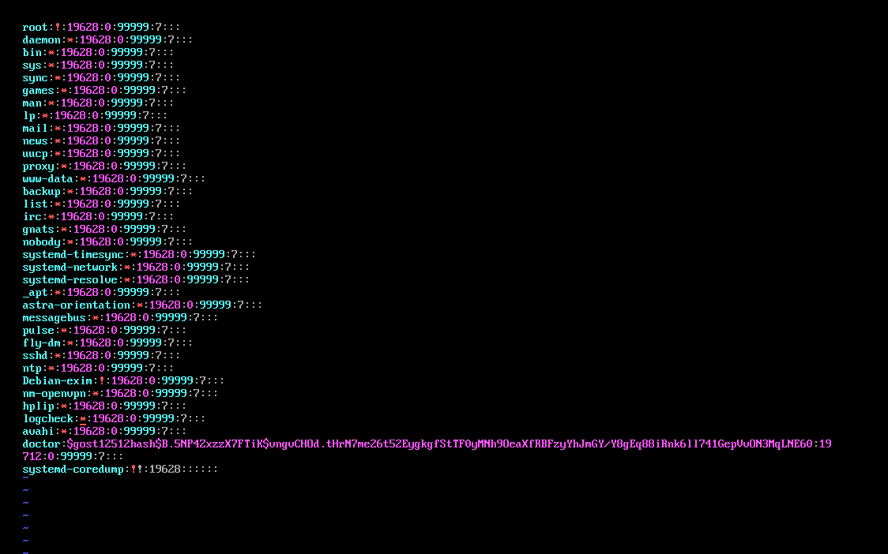


Файл выглядит так - 

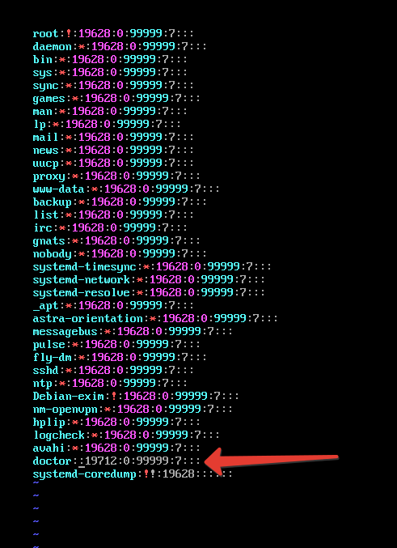

Также нужно проверить файл - **/etc/shadow-**

Если в этом файле также присутствует хэш - его нужно удалить

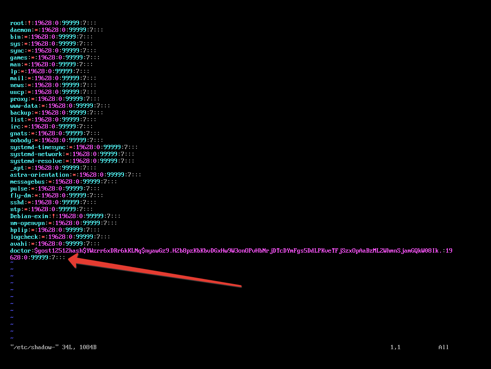


После удаления всех хэшей нашего пароля, необходимо перезагрузить систему с помощью команды - 


```
reboot -f
```

После загрузки ОС

Входим под нашим пользователем "doctor" без пароля

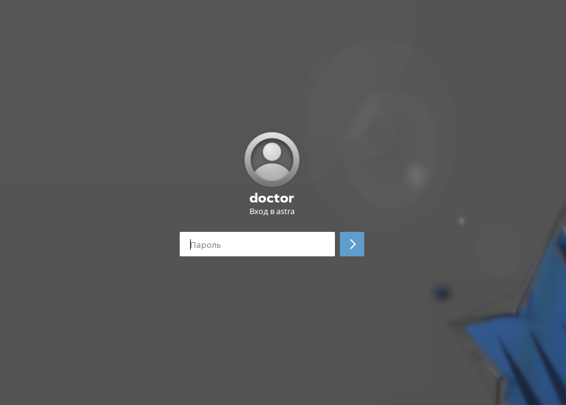


И вот мы в системе! Не забываем установить пароль обратно!


# 2. Восстановление пароля через "Режим восстановления"

Если вдруг и пароль от GRUB забыт, тогда на помощь придет "Режим восстановления".

Загружаемся в режим восстановления известным способом:

0. Подключите установочный диск Astra Linux в ваш компьютер, виртуальную машину или сервер. 

1. Смонтируйте корневой раздел вашей файловой системы

2. Выполните сочетание клавиш "Ctrl + Alt + F2" , а затем команду - 

```
chroot /target
```

3. Далее вам нужно аналогично удалить хэш-пароля из файлов **/etc/shadow** и **/etc/shadow-**

P.S. Если в **/etc/shadow-** хэш-пароля нет - это не страшно, пропускайте этот шаг. Главное удалить хэщ из **/etc/shadow**

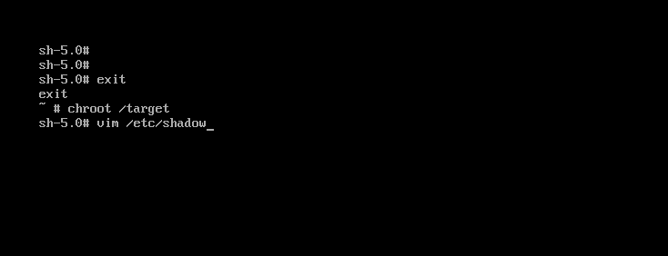


После этого выполните перезагрузку системы и также войдите под своим пользователем в систему без ввода пароля.

**Не забудьте после сброса пароля установить новый пароль!**

# 3. Восстановления пароля без режима восстановления и пароля GRUB

Если день совсем на задался - пароль от GRUB утерян, "Режим восстановления" Astra Linux по каким-то причинам никак не загружается - последней  надеждой будет загрузка в Live-режим работы какого-нибудь дистрибутива.

Подойдет любой Live образ, в рамках данной лабораторной работы мы будем использовать Debian 11 Live.

# Это нужно знать!


---------------

Live образ операционной системы Linux представляет собой полностью готовую к использованию систему, которая может быть загружена с DVD, USB-накопителя или другого съемного устройства без необходимости установки на жесткий диск. При помощи live образа пользователь может протестировать операционную систему, провести восстановление данных, выполнить диагностику, а также использовать ее для рабочих целей без изменения текущей установленной операционной системы.

---------------


Скачать такой же дистрибутив в свою коллекцию можно тут - [Ссылка] (https://www.debian.org/CD/live/index.ru.html)


Итак, грузимся с диска и выбираем Live-режим работы

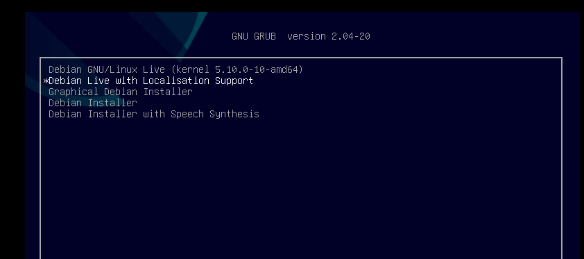

1. Выбирайте любой удобный для вас язык работы. 

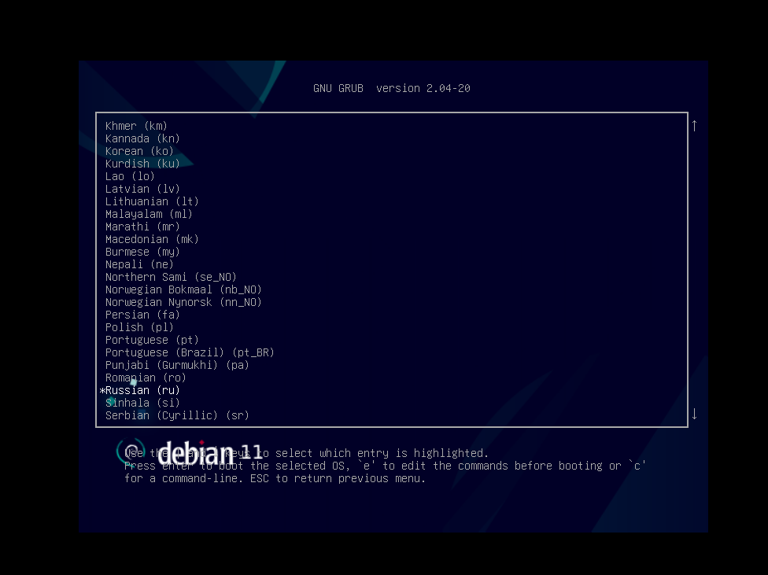

2. Перейдите под пользователя root, а затем с помощью команды - **lsblk** выведите список всех доступных блочных устройств

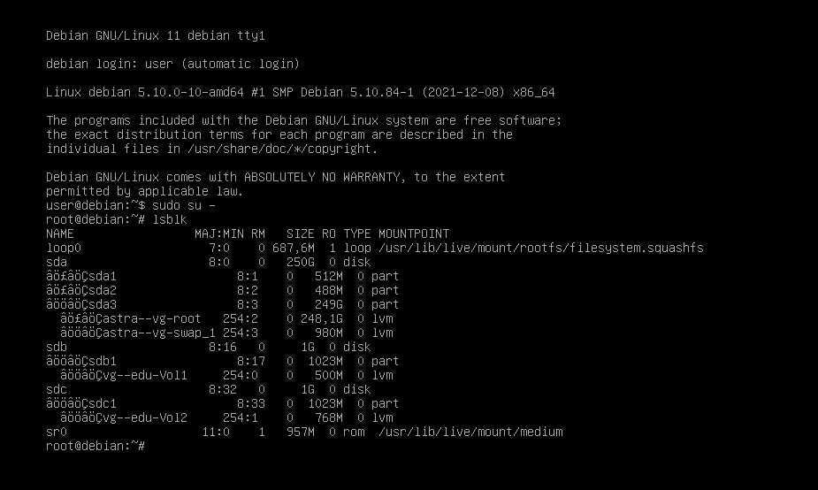

Среди всех доступных устройств, обратите внимание на наш LVM массив!

Нам необходимо примонтировать корневной раздел нашей файловой системы. 

Выполним команду - 


```
mount /dev/mapper/astra--vg-root /mnt
```


А затем проверим, что блочное устройство появилось в списке подключенных дисков.

```
df -h
```

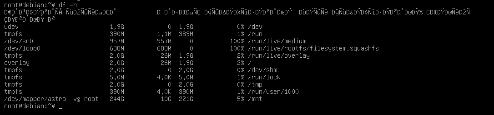


3. Перейдем в каталог /mnt, куда смонтировали диск.

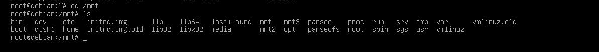

Ура! Вся наша файловая система на месте, дальше операции аналогичны двум первым пунктам, а именно:

1. Удаляем хэш-пароля в **/etc/shadow**

2. Удаляем хэш-пароля в **/etc/shadow-**

3. Перезагружаем систему.

**Не забудьте после сброса пароля установить новый пароль!**

## В целом, подводя итоги стоит сказать, что использование LiveCD образа для исправления ошибок в Astra Linux иногда может быть куда эффективнее и полезнее чем "ограниченный" режим восстановления.


Это достигается за счет того, что в LiveCD вы получаете практически полноценную ОС, куда можно установить различное ПО для отладки вашей системы, мониторинга дисковых проблем и пересборки LVM-массивов. 


# Подготовка дампа для отправки разработчикам.

Предположим, что вы столкнулись с рядом тяжелых и сложных проблем, которые исправить самостоятельно не получается и пора воспользоваться технической поддержкой. 

## Что техническая поддержка может у вас спросить? 

Как правило, взаимодействие с техподдержкой сводится к отправке логов и дампов с вашей системы. 

Попросят они выполнение вот таких команд - 

```
sudo astra-create-debug-logs
```

или 


```
sudo sos report --case-id SIRIUS-1111111
```

или 

```
sudo tar -czf /tmp/astra-logs-SIRIUS-11111-my-pc.tar.gz --exclude=faillog --exclude=lastlog /var/log
```


Где SIRIUS-1111111 - это идентификатор вашей заявки в техподдержку, а my-pc - хостнейм вашего компьютера. 


Но что эти команды делают? Давайте разбираться.


# Начнем с astra-create-debug-logs

В результате получаем архив - 


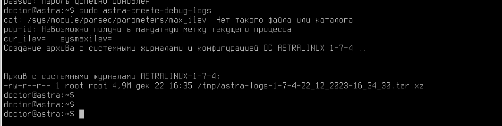

Посмотрим что внутри? 

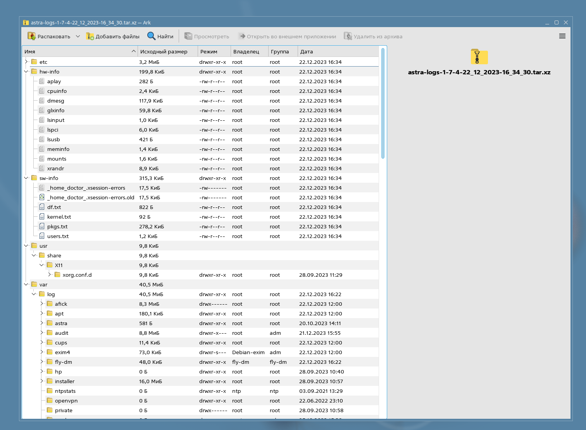

Как можно заметить, здесь сохраняется все содержимое каталога /etc, формируется папка hw-info, где записывается информация о всей аппаратной части вашего компьютера.


Также образуется папка sw-info, со сведениями о установленном ПО и ядрах операционной системы и активных пользователях в системе.

Не мало важным является то, что также бекапится весь каталог **/var/log** - помните, что это каталог, в котором содержатся служебные журналы большинства работающих процессов.

Если вы отправляете специалистам техподдержки запрос, приложите этот архив к запросу - чтобы дело пошло немного быстрее. 

## Я отправил запрос в техподдержку с архивом, но они требуют от меня еще каких-то выгрузок? 

Разберемся, что выполняет команда - 

```
sudo sos report --case-id SIRIUS-1111111
```
 
Если прошлая команда предоставляется от разработчиков Astra Linux, то sos report - стандартная команда генерации логов от Debian.

Она также выполняет глубокий анализ состояния операционной системы и запаковывает это в архив, который затем планируется отправить разработчикам. 

Как правило, ключом case-id вы указываете номер вашей заявки в технической поддержке.

Что внутри архива? 


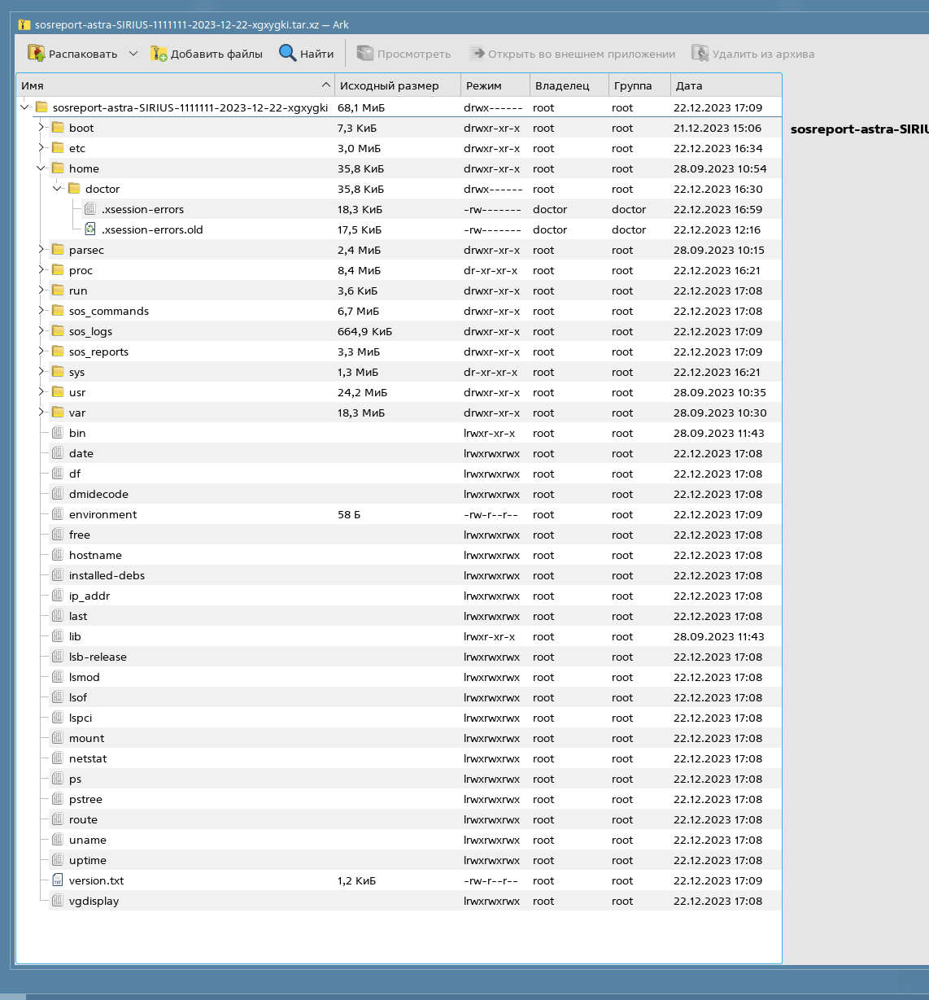

Примерно тоже самое, только теперь еще раздел /boot запаковали, сведения о подключенных драйверах и модулях ядра, установленное программное обеспечение, запущеннные в системе процессы и журналы логов.

Также собирается информация о домашних профилях пользователей, но не личная информация - а ошибки связанные с работой графических утилит. 


## Им все мало и мало! Теперь что-то еще хотят!

Когда ситуация требует глубочайшего анализа, иногда потребуется воспользоватся последней командой - 

```
sudo tar -czf /tmp/astra-logs-SIRIUS-11111-my-pc.tar.gz --exclude=faillog --exclude=lastlog /var/log
```


Команда **sudo tar -czf /tmp/astra-logs-SIRIUS-11111-my-pc.tar.gz --exclude=faillog --exclude=lastlog /var/log** создает сжатый архив **/tmp/astra-logs-SIRIUS-11111-my-pc.tar.gz** из содержимого каталога /var/log, однако исключает файлы с именами **faillog** и **lastlog** из этого архива.


Файлы **faillog** и ***lastlog** являются системными файлами журналов, хранящими информацию о неудачных попытках входа пользователей в систему (faillog) и о времени последнего входа пользователей в систему (lastlog). Эти файлы обычно находятся в каталоге **/var/log** на системах Linux. В данном контексте их исключение из архива означает, что они не будут включены в созданный архив.


# Заключение

В рамках этой лабораторной вы научились работать с восстановлением загрузчика GRUB и раздела /boot, а также сбрасывать пароль для пользователя Администратор.

Помимо этого мы разобрали как правильно написать заявку в техническую поддержку, если вдруг все пошло совсем не по плану.

В следующем материале вы познакомитесь с темой  - Управление конфигурациями хостов с помощью Ansible

Благодарю за чтение и успехов вам в обучении!


# Дополнительная информация:
1) Установка загрузчика GRUB в UEFI [Ссылка](https://wiki.astralinux.ru/pages/viewpage.action?pageId=130424699)
2) Переустановка GRUB  в режиме восстановления [Ссылка](https://wiki.astralinux.ru/kb/pereustanovka-grub-v-reyoime-vosstanovleniya-190916205.html)
3) Анализ и чтение логов  [Ссылка](https://wiki.astralinux.ru/pages/viewpage.action?pageId=257467825)
4) Журналы работы системных служб [Ссылка](https://wiki.astralinux.ru/pages/viewpage.action?pageId=9011231)
5) Учимся читать логи (На примере Veeam)[Ссылка](https://habr.com/ru/companies/veeam/articles/529662/)