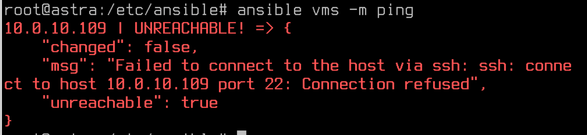
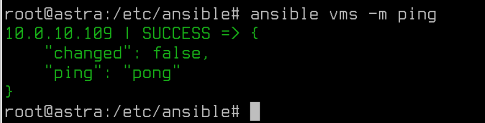
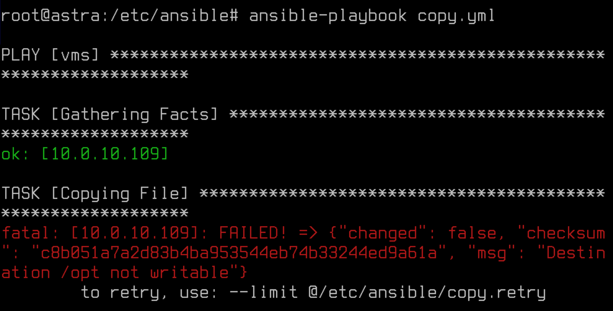
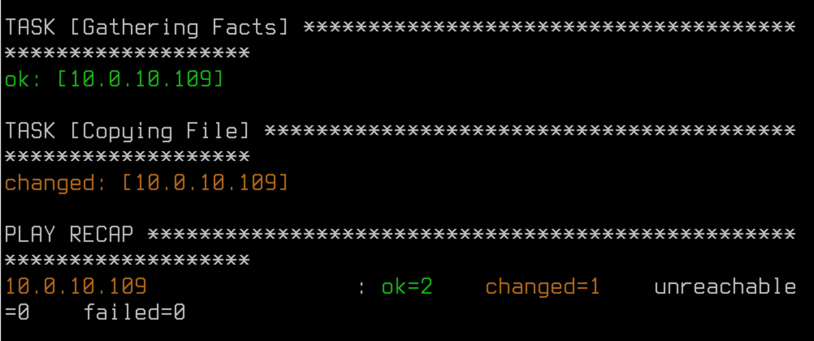
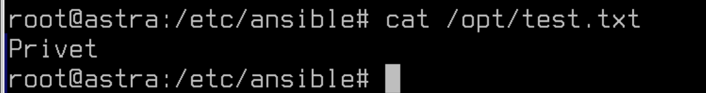
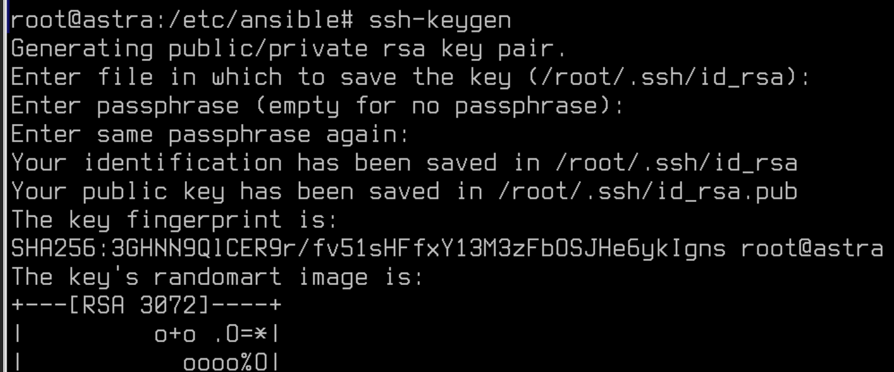
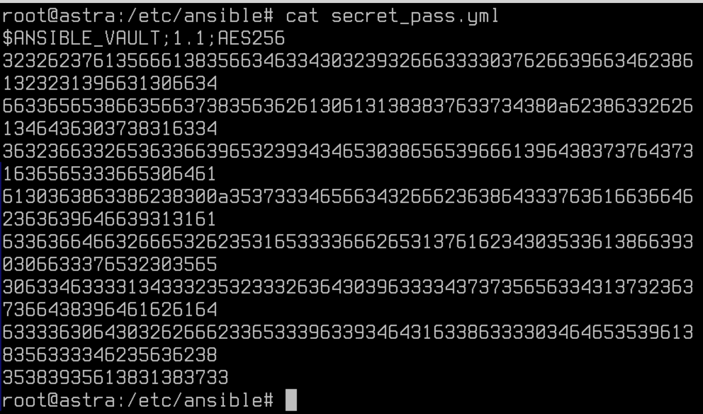

# Лабораторная работа №9. Тема: "Управление конфигурациями хостов с помощью Ansible"

Цель работы
----------
- Изучить инструмент централизованного управления хостами Ansible.


Оборудование, ПО:
----------

Виртуальная машина или компьютер под управлением ОС AstraLinux 1.7 в режиме защищенности "Воронеж" или выше.


Ход работы:
----------

# Что будем делать сейчас?

В данной лабораторной работе мы обсудим как управлять компьютерами под управлением ОС Astra Linux централизовано.

Конечно, для обсуждения функционала Ansible потребовалось бы несколько виртуальных машин, но в рамках нашей лабораторной работы все настройки мы будем выполнять на одной единственной машине - она будет играть роль как сервера, так и клиента. 


# Разбираемся, как вообще можно управлять парком машин на Astra Linux.

Даже если в вашей зоне ответственности всего 5 компьютеров, каждый раз пробегать вокруг них для обновления или установки нового ПО может очень скоро надоесть. 

На помощь приходят инструменты централизованного управления. Можно выделить два типа таких систем: 

1) PUSH-системы. В этом случае, команды отправляются с сервера по команде администратора. Клиенты не опрашивают сервер по какому-либо таймеру. Примеры таких систем: Ansible, SaltStack.

2) PULL-системы. Здесь все наоборот, клиенты сами обращаются к серверу по таймеру, например, как в случае с Puppet - раз в 30 минут. Примеры таким систем - Puppet, CHEF.

Беусловно, стоит уточнить, что сейчас любая указанная система может быть настроена как PULL или PUSH, просто это может быть не совсем удобно, так как тот же Puppet изначально был задуман как PULL и имеет ряд особенностей из-за этого.

# Ansible - что за зверь такой? 

Ansible - это инструмент для управления конфигурациями компьютеров, с помощью него можно автоматизировать процесс установки ПО, редактирования конфигурационных файлов, да и все что вам только может быть нужно сделать на большом количестве устройств.

Ansible использует язык описания конфигурации YAML (YAML Ain't Markup Language) для определения необходимых состояний системы. Он работает по принципу "Infrastructure as Code" (IaC), что позволяет описывать инфраструктуру как код, что облегчает ее управление и поддержку.

Основные возможности Ansible включают в себя управление серверами под Linux, но также с использованием различных модулей расширения  можно управлять сетевым оборудованием (например, Cisco или Eltex), базами данных, межсетевыми экранами и т.д.

Доступные модули расширения хранятся на сайте Ansible Galaxy [Ссылка](https://galaxy.ansible.com/ui/)

Используя Ansible, системные администраторы и разработчики могут значительно упростить процессы управления и настройки инфраструктуры, уменьшить рутинные задачи и сократить время, затрачиваемое на эти процессы. В итоге, это позволяет повысить производительность и надежность компьютерных систем.


# Приступаем к работе!

Установим Ansible на сервере.

```
apt install ansible
```

Для работы Ansible никаких клиентов не нужно, ведь по своей архитектуре, это набор Python-скриптов которые подключаются по SSH к подчиненным устройствам и выполняют прописанные команды и задачи. 

Теперь для работы нам доступна директория /etc/ansible. В этой директории хранятся файлы: 

* ansible.cfg

* hosts

Это стандартные файлы для Ansible. 

Настройки Ansible могут присутствовать в нескольких различных расположениях, причём именно первый найденный файл будет применяться. Порядок поиска таков:

* ANSIBLE_CFG: эта переменная окружения применяется когда она установлена, по-умолчанию, её нет;

* ansible.cfg: находящийся в текущем каталоге, откуда вы запускаете плейбук;

* ~/ansible.cfg: расположено в домашнем каталоге пользователя;

* ~/.ansible.cfg: это местоположение в домашнем каталоге пользователя;

* /etc/ansible/ansible.cfg - основная директория Ansible-сервиса.

Как правило, многие используют либо отдельную директорию в удобном для работы месте или используют стандартный каталог /etc/ansible.

# А что в самих каталогах то? 

Перейдем в каталог /etc/ansible

Файл ansible.cfg уже имеет ряд настроек, можете ознакомиться с ним, на данный момент самая интересная для нас строка - inventory


Эта строка определяет, к какому списку хостов для управления обращается Ansible во время выполнения плейбука. 

Посмотрим теперь, что внутри файла hosts.


А в этом файле тут можно узнать, что добавлять хосты можно по доменным именам (при условии, что у вас работает DNS или настроен файл с локальным сопоставлением доменного имени с IP-адресом - /etc/hosts)

Использование групп в инвентарном файле позволяет группировать удаленные хосты по регионам размещения или по ролям серверов — это чрезвычайно удобно при работе с сотнями и тысячами серверов.

Также в inventory файле можно использовать регулярные выражения, например запись:

```
[test]

test-[01:99]
```

будет соответствовать группе хостов test, в которую входят хосты test-01, test-02, test-03, … test-99.

Для конкретного хоста или группы хостов из инвентарного файла можно установить специфические переменные при необходимости. Например, хосту test-1 можно назначить ssh порт таким образом:

```
[test]

test-1 ssh_port=5555

test-2
```
Изменить ssh порт для всей группы хостов можно так:

```
[test]

test-1

test-2

[test:vars]
ssh_port=5555
```

Такие настройки позволяют группировать клиенты по группам для каких-нибудь специфических настроек, например, ARM - группа для рабочих мест пользователей или SERVERS - группа для настройки серверов.


# Отправимся уже создавать первые плейбуки!

Начнем с чего-нибудь простого. Как на счет установки ПО? 

Создайте файл - 

```
/etc/ansible/install_soft.yml
```

## А затем, необходимо в YML формате написать ваш Ansible-код.

И перед тем как мы это сделаем, стоит рассказать, что YAML, не смотря на то что задумывался как очень простой язык разметки, по факту же имеет ряд особенностей и сложностей, которые могут сильно отпугнуть начинающих пользователей Ansible.

Рассмотрим формат YAML, в сравнении с другими языками


Как можно заметить,  в целом YAML довольно удобочитаемый файловый формат, состоящий из пар «ключ-значение» и делающий акцент на отступы и перенос строк. YAML активно используется в файлах конфигурации многих хорошо известных инструментов/технологий, по типу docker-compose, Kubernetes, Ansible и т.д.

Будьте внимательны к количеству пробелов, когда будете переписывать код в свой лабораторный стенд

Наш первый плейбук на установку ПО tree на компьютер
```yaml
---
- hosts: localhost
  tasks:
    - name: Install Software
      apt:
        name: tree
        state: present
```

Объясним строки указанные выше. 

**hosts**: localhost - означает, что подключение будет происходить к компьютеру по имени localhost - это мы сами!

---------------

Тут стоит сказать, что в Ansible есть два константных значения: 

* all - в этом случае все устройства описанные в файле hosts будут подключены к запускаемому плейбуку

* localhost - в этом случае, подключение будет проходить только к вашему локальному компьютеру, такое удобно использовать для поиска неисправностей и тестирования плейбука перед релизом.

---------------

Далее мы описываем выполняемые задачи - **tasks**.

Параметром **name** мы указываем имя задачи, в целом её указывать необязательно, но это повышает удобство чтения плейбука, а также в логах легче искать что делали Ansible'ом. 

**apt** - используем встроенный в Ansible модуль apt, для установки пакетов в системах, которые использует именно этот пакетный менеджер.

Далее через отступы мы формируем "преемственность", то есть описываем, что внутри модуля apt планируем делать (устанавливаем ПО, или наоборот удаляем и т.п.)

**name** (внутри apt)  - имя устанавливаемого ПО.

**state** - означает, в каком состоянии  должен быть данный пакет на подчиненных устройств, в этом случае state: present, означает что пакет должен быть установлен. 


**Запускаем!**

Введите команду

```
ansible-playbook /etc/ansible/install_soft.yml
```


И скрипт отработал, пакет **tree** установлен!

А что мы увидели в процессе запуска Ansible-плейбука? 

1) **PLAY [localhost]** - определяет на какую группу хостов работает плейбук.

2)  **TASK [Gathering Facts]** - этот таск запускается автоматически, он нужен для Ansible, с целью сбора информации о клиенте (в этом случае Ansible собирает информацию о операционной системе, доступной ОЗУ, установленном ПО и многое другое о подчиненном компьютере)

3) **TASK [Install Software]** - это уже наш таск, узнаете имя? Тут мы просто устанавливаем 

4) **PLAY RECAP** - тут мы видим подытог, что наш плейбук наделал и на каких устройствах побывал. Здесь все кратко и понятно. 


# А как так это все легко заработало?

Действительно,  если бы мы работали не локально, а пытались подключиться к удаленным машинам нам необходимо предварительно настроить:

1) SSH на сервере

2) SSH на клиенте

3) Обменяться ключами между клиентом и сервером или подключаться через связку логин\пароль

Попробуем реализовать архитектуру, как если бы было несколько разных устройств.

Для этого в файле /etc/ansible/hosts напишите ваш IP-адрес лабораторного стенда. 

Заодно проверим работу групп.

В начале файла, над всеми комментариями просто добавьте конструкцию: 


```
[vms]
X.X.X.X
```

Файл по итогу выглядит так - 


И попробуем создать плейбук, например, по копированию файлов с основного сервера на подчиненное устройство.

## Важная команда! 

Есть возможность проверить работает или нет ваше подключение к клиентам:

```
ansible all -m ping
```

Где all, это константа, помните такую? 

Если не хотите проверять все перечисленные в /etc/ansible/hosts сервера, то допустимо указать конкретную группу или адрес, например:

```
ansible vms -m ping
```



Видим ошибку! И в данный момент вполне ожидаемую.

Ведь нам необходимо настроить SSH-соединение между этим адресом (да, и пускай что в нашем примере это наш локальный адрес).

Если бы вы внедряли Ansible в реальную среду, вам пришлось бы делать также на всех устройствах которые планируется централизованного настраивать.

# Настройка SSH для Ansible

Варианты настройки подключений у нас всего два:

1) Реализовать сервисную учетную запись и подключаться к ней через логин и пароль;

2) Реализовать такую же сервисную учетную запись, но отключить вход по паролю, только по ключу.


Попробуем оба варианта.

* Для первого варианта создайте учетную запись "ansible" с паролем "P@ssw0rd", настройте данной УЗ возможность вводить команды sudo без использования пароля.

Вспомним какие команды нам для этого пригодятся - 

```
adduser ansible
```

А добавить пользователя в sudoers можно так - 

```
usermod -a ansible -G astra-admin
```

Затем, нам потребуется установить две программы:

1) SSHPASS, чтобы подключить возможность использовать логин и пароль для соединения с подчиненными устройствами через Ansible

2) OPENSSH-SERVER, если вдруг у вас на хостовой машине не установлен SSH-сервер.

```
apt install sshpass openssh-server -y
```

Если, кстати, позабыть установить sshpass, то при попытке подключиться через Ansible по логину и паролю ошибка будет вот такой - 


# А что надо настроить в Ansible, для подключения по логину и паролю? 

Для начала обратимся к файлу **/etc/ansible/hosts** и приведем его к следующему виду - 

```
[vms]

[vms:vars]
ansible_ssh_user = ansible
ansible_ssh_pass = P@ssw0rd
```

В этом случае мы объявили переменные для группы хостов vms, если такие переменные указаны, Ansible, по-умолчанию, воспользуется ими для подключения к устройствам. 

P.S. Вероятно, вас засмущал открытый логин и пароль в текстовом файле, далее мы разберем как это исправить. 

После необходимо отключить проверку ключей на хостах (ведь ключей у нас нет, авторизация по паролю)

Идем в **/etc/ansible/ansible.cfg**

И расскоментируем там строку - 

```
host_key_checking = False
```

Проверяем!

```
ansible vms -m ping
```



Веселая "зеленая" надпись сигнализирует нам, что все работает! Отправляемся создавать наш плейбук.

```yaml
---
- hosts: vms
  tasks:
    - name: Copying File
      copy:
        src: /etc/ansible/test.txt
        dest: /opt/test.txt
        owner: ansible
        group: ansible
        mode: u=rw,g=r,o=r
```

Используем модуль "Copy", он в целом, интуитивно понятен по описанию с официальной документации [Ссылка на документацию](https://docs.ansible.com/ansible/latest/collections/ansible/builtin/copy_module.html)

Перед запуском создадим /etc/ansible/test.txt с произвольным содержимым

```
echo "Privet" > /etc/ansible/test.txt
```

Запускаем!

```
ansible-playbook copy.yml
```



# Ошибка!  Но почему? 

А все ведь просто, мы пытаемся подключиться к машине через пользователя ansible, но "Ansible" не пытался использовать свои права sudoers. Необходимо доработать плейбук, а также выдать пользователю Ansible высокий уровень целостности. 

Плейбук доработать можно так - 

```yaml
---
- hosts: vms
  become: true
  become_method: sudo
  tasks:
    - name: Copying File
      copy:
        src: /etc/ansible/test.txt
        dest: /opt/test.txt
        owner: ansible
        group: ansible
        mode: u=rw,g=r,o=r
```

Таким образом, при подключении через Ansible мы будем получать доступ до команды sudo через пароль.

Установить пользователю ansible высокий уровень целостности можно в "Политике безопасности".



Статус **changed** в логах работы плейбука намекает нам, что файл был создан, проверим это. 

```
cat /opt/test.txt
```




# Окееей, а как работать по ключам? 

Для подключения по ключам не будем создавать отдельную УЗ, воспользуемся user.

Поменяем в **/etc/ansible/hosts** УЗ для подключения и уберем информацию о паролях.


```
[vms]
10.0.10.109

[vms:vars]
ansible_ssh_user = user
```

Затем, нам необходимо передать SSH-ключ. SSH передается под тем пользователем, который будет запускать плейбук, для пользователя, который будет выполнять команды на подчиненном устройстве.

Для начала SSH-ключ надо создать - 

```
ssh-keygen
```



А затем передать - 

```
ssh-copy-id user@10.0.10.109
```

И в качестве проверки работы, напишем еще один плейбук? 

Допустим, это будет плейбук на добавление строки в конфигурационный файл.

Согласитесь, иногда менять целый файл с настройками может привести к плачевным последствиям.

Создайте плейбук - **/etc/ansible/line.yml**

```yaml
---
- hosts: vms
  become: true
  tasks:
          - name: Configure packet forwarding
            lineinfile:
                    path: /etc/sysctl.conf
                    line: net.ipv4.ip_forward=1
                    insertafter: EOF
```

В этом плейбуке мы добавляем строку для включения IPv4-маршрутизации на Linux.

Проверяем!

```
ansible-playbook line.yml
```


Работает! 

# Так-так, а что же там с открытыми паролями? 

В зависимости от задач, пароли вам придется как-то хранить и использовать. Тут на помощь могут прийти переменные и **Ansible Vault**.

---------------

Ansible Vault - это инструмент, предоставляемый инструментом управления конфигурацией Ansible, который позволяет шифровать конфиденциальные данные, такие как пароли, ключи SSH, API токены и другие секреты. Это помогает обеспечить безопасность и защиту конфиденциальной информации в файлах инвентаризации и плейбуков Ansible. Таким образом, Ansible Vault позволяет безопасно хранить и использовать секретные данные в автоматизированных процессах управления конфигурацией.

---------------

Первым делом, давайте создадим такой файл, с помощью команды - 

```
ansible-vault create secret_pass.yml
```

Система потребует защитить данный файл паролем, обязательно запомните его, он пригодится для запуска нашего плейбука.

После ввода пароля появится временный файл, где вы смело в открытом виде пишите следующие значения: 

```
[vms:vars]
ansible_ssh_user: "ansible"
ansible_ssh_pass: "P@ssw0rd"
```

Закончив работу с этим файлом, сохраните его. 

## Ага, и как теперь убедиться что это точно зашифровано? 

А давайте взглянем что внутри нашего secret_pass.yml



Зашифровано! Теперь осталось применить это в работе.

# Рассмотрим очередной плейбук

Например, на перезапуск сервиса CUPS.

Для этого, создадим файл **/etc/ansible/service.yml**

```yaml
---
- hosts: vms
  vars_files:
    - /etc/ansible/secret_pass.yml
  become: true
  tasks:
          - name: Cups Restart
            service:
              name: cups
              state: restarted
```

И запустим вот такой командой - 

```
ansible-playbook service.yml --ask-vault-pass
```

Далее система запросит пароль от Ansible Vault и выполнит команды плейбука.

# А как можно еще поработать с Ansible Vault?

Создать файл можно - 

```
ansible-vault create user.yml
```

Отредактировать файл можно - 

```
ansible-vault edit user.yml
```

Посмотреть, что в файле внутри, но не редактировать его - 

```
ansible-vault view user.yml
```

Зашифровать файл, который уже был когда-то создан - 

```
ansible-vault encrypt user.yml secret_user.yml
```


Расшифровать файл - 

```
ansible-vault decrypt secret_user.yml user.yml
```


# Заключение

В результате прохождения данного курса вы приобрели необходимые навыки для эффективного управления конфигурациями хостов с помощью Ansible. Мы освоили основные концепции и инструменты Ansible, освоили методы автоматизации управления конфигурациями, научились создавать playbooks и роли, а также выполнять управление хостами. Данная лабораторная работа позволила участникам углубить свои знания и навыки в области управления конфигурациями, что будет полезно для их дальнейшей профессиональной деятельности.

Безусловно, мы бы не смогли в полной мере обсудить данный инструмент - он имеет широкое применение и инструментарий, но сформировать базовое представление об инструменте точно смогли!

В следующем материале вы познакомитесь с темой  - Мандатный контроль целостности в Astra Linux Special Edition.

Благодарю за чтение и успехов вам в обучении!


# Дополнительная информация:
1) Руководство по YAML [Ссылка](https://wiki.merionet.ru/articles/rukovodstvo-po-yaml-vse-chto-vam-nuzhno-znat-za-5-minut)
2) YAML - что за зверь?  [Ссылка](https://habr.com/ru/articles/710414/)
3) Модуль APT в Ansible. Документация  [Ссылка](https://docs.ansible.com/ansible/latest/collections/ansible/builtin/apt_module.html)
4) Ansible Vault [Ссылка](https://docs.ansible.com/ansible/2.9/user_guide/vault.html)
5) Ansible для начинающих[Ссылка](https://habr.com/ru/companies/slurm/articles/714000/)
6) Ansible. Основы.. Видео на русском. [Ссылка](https://www.youtube.com/watch?v=n27bpkAtyf4&ab_channel=Unixway)