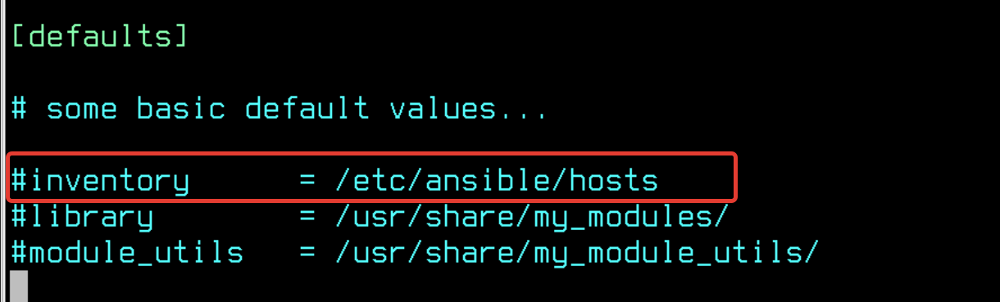
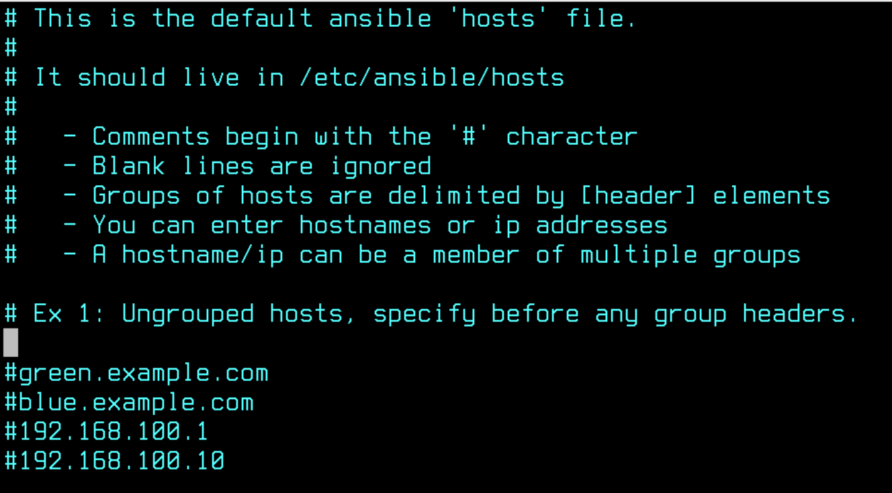
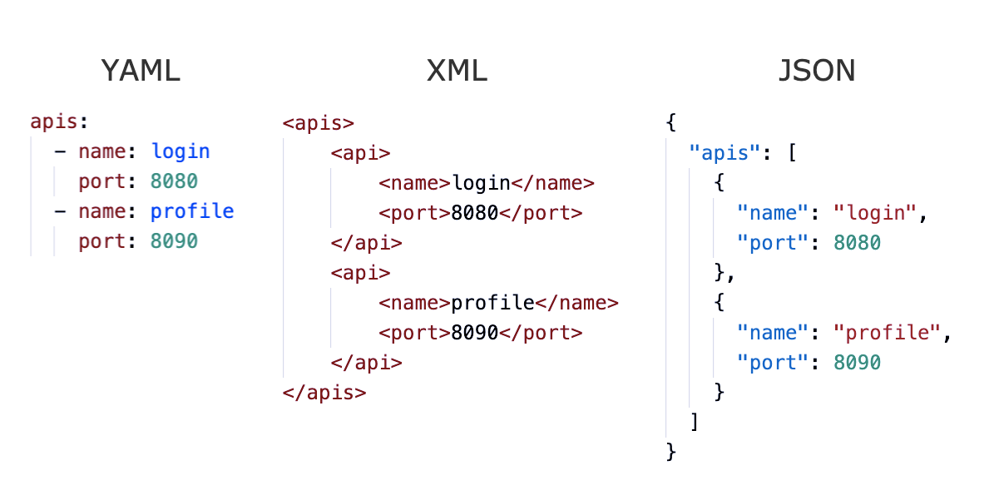
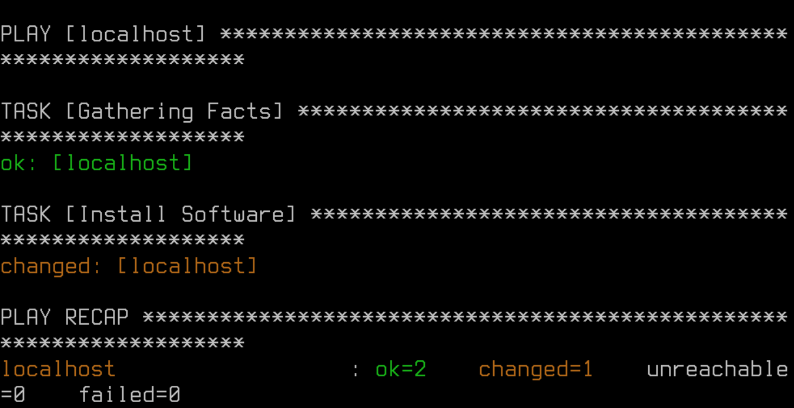

# Лабораторная работа №9. Тема: "Управление конфигурациями хостов с помощью Ansible"

Цель работы
----------
- Изучить инструмент централизованного управления хостами Ansible.


Оборудование, ПО:
----------

Виртуальная машина или компьютер под управлением ОС AstraLinux 1.7 в режиме защищенности "Воронеж" или выше.


Ход работы:
----------

# Что будем делать сейчас?

В данной лабораторной работе мы обсудим как управлять компьютерами под управлением ОС Astra Linux централизовано.

Конечно, для обсуждения функционала Ansible потребовалось бы несколько виртуальных машин, но в рамках нашей лабораторной работы все настройки мы будем выполнять на одной единственной машине - она будет играть роль как сервера, так и клиента. 


# Разбираемся, как вообще можно управлять парком машин на Astra Linux.

Даже если в вашей зоне ответственности всего 5 компьютеров, каждый раз пробегать вокруг них для обновления или установки нового ПО может очень скоро надоесть. 

На помощь приходят инструменты централизованного управления. Можно выделить два типа таких систем: 

1) PUSH-системы. В этом случае, команды отправляются с сервера по команде администратора. Клиенты не опрашивают сервер по какому-либо таймеру. Примеры таких систем: Ansible, SaltStack.

2) PULL-системы. Здесь все наоборот, клиенты сами обращаются к серверу по таймеру, например, как в случае с Puppet - раз в 30 минут. Примеры таким систем - Puppet, CHEF.

Беусловно, стоит уточнить, что сейчас любая указанная система может быть настроена как PULL или PUSH, просто это может быть не совсем удобно, так как тот же Puppet изначально был задуман как PULL и имеет ряд особенностей из-за этого.

# Ansible - что за зверь такой? 

Ansible - это инструмент для управления конфигурациями компьютеров, с помощью него можно автоматизировать процесс установки ПО, редактирования конфигурационных файлов, да и все что вам только может быть нужно сделать на большом количестве устройств.

Ansible использует язык описания конфигурации YAML (YAML Ain't Markup Language) для определения необходимых состояний системы. Он работает по принципу "Infrastructure as Code" (IaC), что позволяет описывать инфраструктуру как код, что облегчает ее управление и поддержку.

Основные возможности Ansible включают в себя управление серверами под Linux, но также с использованием различных модулей расширения  можно управлять сетевым оборудованием (например, Cisco или Eltex), базами данных, межсетевыми экранами и т.д.

Доступные модули расширения хранятся на сайте Ansible Galaxy [Ссылка](https://galaxy.ansible.com/ui/)

Используя Ansible, системные администраторы и разработчики могут значительно упростить процессы управления и настройки инфраструктуры, уменьшить рутинные задачи и сократить время, затрачиваемое на эти процессы. В итоге, это позволяет повысить производительность и надежность компьютерных систем.


# Приступаем к работе!

Установим Ansible на сервере.

```
apt install ansible
```

Для работы Ansible никаких клиентов не нужно, ведь по своей архитектуре, это набор Python-скриптов которые подключаются по SSH к подчиненным устройствам и выполняют прописанные команды и задачи. 

Теперь для работы нам доступна директория /etc/ansible. В этой директории хранятся файлы: 

* ansible.cfg

* hosts

Это стандартные файлы для Ansible. 

Настройки Ansible могут присутствовать в нескольких различных расположениях, причём именно первый найденный файл будет применяться. Порядок поиска таков:

* ANSIBLE_CFG: эта переменная окружения применяется когда она установлена, по-умолчанию, её нет;

* ansible.cfg: находящийся в текущем каталоге, откуда вы запускаете плейбук;

* ~/ansible.cfg: расположено в домашнем каталоге пользователя;

* ~/.ansible.cfg: это местоположение в домашнем каталоге пользователя;

* /etc/ansible/ansible.cfg - основная директория Ansible-сервиса.

Как правило, многие используют либо отдельную директорию в удобном для работы месте или используют стандартный каталог /etc/ansible.

# А что в самих каталогах то? 

Перейдем в каталог /etc/ansible

Файл ansible.cfg уже имеет ряд настроек, можете ознакомиться с ним, на данный момент самая интересная для нас строка - inventory



Эта строка определяет, к какому списку хостов для управления обращается Ansible во время выполнения плейбука. 

Посмотрим теперь, что внутри файла hosts.



А в этом файле тут можно узнать, что добавлять хосты можно по доменным именам (при условии, что у вас работает DNS или настроен файл с локальным сопоставлением доменного имени с IP-адресом - /etc/hosts)

Использование групп в инвентарном файле позволяет группировать удаленные хосты по регионам размещения или по ролям серверов — это чрезвычайно удобно при работе с сотнями и тысячами серверов.

Также в inventory файле можно использовать регулярные выражения, например запись:

```
[test]

test-[01:99]
```

будет соответствовать группе хостов test, в которую входят хосты test-01, test-02, test-03, … test-99.

Для конкретного хоста или группы хостов из инвентарного файла можно установить специфические переменные при необходимости. Например, хосту test-1 можно назначить ssh порт таким образом:

```
[test]

test-1 ssh_port=5555

test-2
```
Изменить ssh порт для всей группы хостов можно так:

```
[test]

test-1

test-2

[test:vars]
ssh_port=5555
```

Такие настройки позволяют группировать клиенты по группам для каких-нибудь специфических настроек, например, ARM - группа для рабочих мест пользователей или SERVERS - группа для настройки серверов.


# Отправимся уже создавать первые плейбуки!

Начнем с чего-нибудь простого. Как на счет установки ПО? 

Создайте файл - 

```
/etc/ansible/install_soft.yml
```

## А затем, необходимо в YML формате написать ваш Ansible-код.

И перед тем как мы это сделаем, стоит рассказать, что YAML, не смотря на то что задумывался как очень простой язык разметки, по факту же имеет ряд особенностей и сложностей, которые могут сильно отпугнуть начинающих пользователей Ansible.

Рассмотрим формат YAML, в сравнении с другими языками



Как можно заметить,  в целом YAML довольно удобочитаемый файловый формат, состоящий из пар «ключ-значение» и делающий акцент на отступы и перенос строк. YAML активно используется в файлах конфигурации многих хорошо известных инструментов/технологий, по типу docker-compose, Kubernetes, Ansible и т.д.

Будьте внимательны к количеству пробелов, когда будете переписывать код в свой лабораторный стенд

Наш первый плейбук на установку ПО tree на компьютер
```yaml
---
- hosts: localhost
  tasks:
    - name: Install Software
      apt:
        name: tree
        state: present
```

Объясним строки указанные выше. 

**hosts**: localhost - означает, что подключение будет происходить к компьютеру по имени localhost - это мы сами!

---------------

Тут стоит сказать, что в Ansible есть два константных значения: 

* all - в этом случае все устройства описанные в файле hosts будут подключены к запускаемому плейбуку

* localhost - в этом случае, подключение будет проходить только к вашему локальному компьютеру, такое удобно использовать для поиска неисправностей и тестирования плейбука перед релизом.

---------------

Далее мы описываем выполняемые задачи - **tasks**.

Параметром **name** мы указываем имя задачи, в целом её указывать необязательно, но это повышает удобство чтения плейбука, а также в логах легче искать что делали Ansible'ом. 

**apt** - используем встроенный в Ansible модуль apt, для установки пакетов в системах, которые использует именно этот пакетный менеджер.

Далее через отступы мы формируем "преемственность", то есть описываем, что внутри модуля apt планируем делать (устанавливаем ПО, или наоборот удаляем и т.п.)

**name** (внутри apt)  - имя устанавливаемого ПО.

**state** - означает, в каком состоянии  должен быть данный пакет на подчиненных устройств, в этом случае state: present, означает что пакет должен быть установлен. 


**Запускаем!**

Введите команду

```
ansible-playbook /etc/ansible/install_soft.yml
```



И скрипт отработал, пакет **tree** установлен!

А что мы увидели в процессе запуска Ansible-плейбука? 

1) **PLAY [localhost]** - определяет на какую группу хостов работает плейбук.

2)  **TASK [Gathering Facts]** - этот таск запускается автоматически, он нужен для Ansible, с целью сбора информации о клиенте (в этом случае Ansible собирает информацию о операционной системе, доступной ОЗУ, установленном ПО и многое другое о подчиненном компьютере)

3) **TASK [Install Software]** - это уже наш таск, узнаете имя? Тут мы просто устанавливаем 

4) **PLAY RECAP** - тут мы видим подытог, что наш плейбук наделал и на каких устройствах побывал. Здесь все кратко и понятно. 


# А как так это все легко заработало? 


# Заключение

В рамках этой лабораторной вы научились работать с восстановлением загрузчика GRUB и раздела /boot, а также сбрасывать пароль для пользователя Администратор.

Помимо этого мы разобрали как правильно написать заявку в техническую поддержку, если вдруг все пошло совсем не по плану.

В следующем материале вы познакомитесь с темой  - Управление конфигурациями хостов с помощью Ansible

Благодарю за чтение и успехов вам в обучении!


# Дополнительная информация:
1) Руководство по YAML [Ссылка](https://wiki.merionet.ru/articles/rukovodstvo-po-yaml-vse-chto-vam-nuzhno-znat-za-5-minut)
2) YAML - что за зверь?  [Ссылка](https://habr.com/ru/articles/710414/)
3) Модуль APT в Ansible. Документация  [Ссылка](https://docs.ansible.com/ansible/latest/collections/ansible/builtin/apt_module.html)
4) Журналы работы системных служб [Ссылка](https://wiki.astralinux.ru/pages/viewpage.action?pageId=9011231)
5) Учимся читать логи (На примере Veeam)[Ссылка](https://habr.com/ru/companies/veeam/articles/529662/)