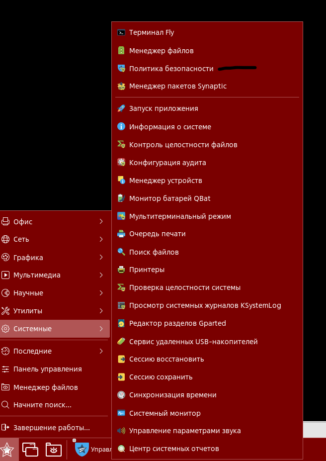
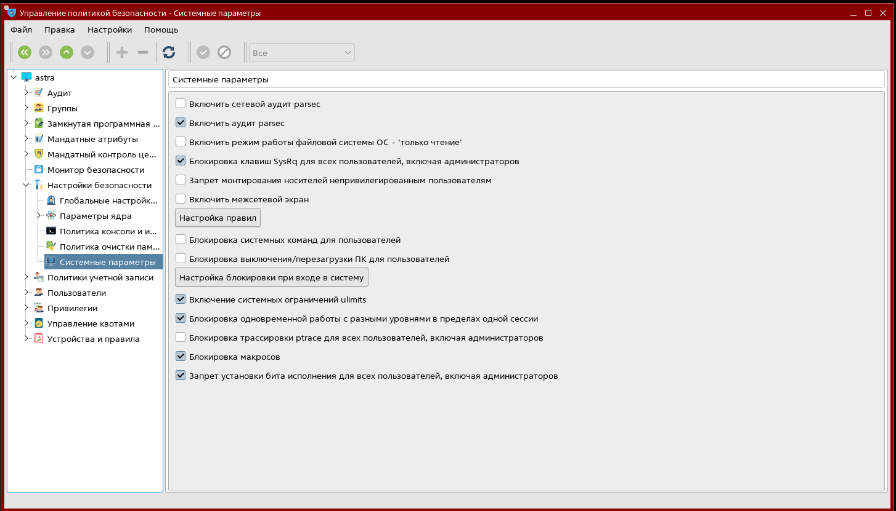

# Лабораторная работа №1. Тема: "Настройка Astra Linux по Red Book"
Цель работы
----------

познакомиться с документацией разработчика - Astra Linux Red Book.


Оборудование, ПО:
----------
Виртуальная машина под управлением ОС Astra Linux 1.7  в режиме защищенности "Воронеж"


Ход работы:
----------
Целью данной лабораторной работы является ознакомление с рекомендуемыми настройками по Astra Linux Red Book.


# Общий обзор

[Ссылка на все сборники RedBook](https://wiki.astralinux.ru/pages/viewpage.action?pageId=9011287)

Red Book - это  рекомендации от разработчика операционной системы Astra Linux к тому как правильно установить, настроить и эксплуатировать операционную систему. Данные рекомендации, конечно, не являются обязательными к исполнению, но точно обязательны к ознакомлению. 

Разделы Red Book описывают как работать с системой и компьютером  в целом:

* До установки ОС

* При установке ОС 

* После установки ОС

* Во время её эксплуатации

## Раздел до установки 

Раздел, в рамках нашего курса, не самый интересный. И можно его описать буквально в несколько предложений: 

1. Использовать диски с аппаратной защитой данных от несанкционированного доступа;

2. Установить аппартные модули доверенной загрузки в сам ПК непосредственно;

3. Обеспечить физическую защиту от вскрытия корпуса компьютера специальными пломбами  и заглушкам.


## Раздел при  установке ОС

 * По возможности, использовать шифрование разделов через dm-crypt [Подробнее об этом](https://wiki.astralinux.ru/pages/viewpage.action?pageId=36078012).

dm-crypt - это подсистема ядра Linux, предназначенная для шифрования блочных устройств. Она используется для шифрования дисков и разделов на жестких дисках, USB-накопителях, иных блочных устройствах. dm-crypt обеспечивает прозрачное и эффективное шифрование данных на уровне блоков, что позволяет зашифровывать весь раздел или диск целиком, не требуя изменений внутри файловой системы.

Принцип работы dm-crypt состоит в том, что данные записываются на незашифрованный устройство с использованием ключа шифрования. При чтении данные дешифруются и предоставляются пользователю. 

Для работы с dm-crypt используется утилита cryptsetup, которая предоставляет интерфейс командной строки для создания, удаления и управления зашифрованными устройствами.


* Использовать ядро Hardened. 

Ядро Hardened (или защищенное ядро) - это специальная версия ядра операционной системы, которая разрабатывается с целью повышения безопасности и стойкости к различным атакам. Ядро Hardened обычно содержит дополнительные механизмы защиты, такие как контроль выполнения данных (DEP), случайное смешивание адресов (ASLR), защита от переполнения буфера и другие технологии, которые помогают предотвратить эксплойты и атаки на уязвимости ядра.

Стоит уточнить, что ядро Hardened немного ограничивает функциональность компьютера - например, она запрещает использование Docker. 

Также, Hardened ядро всегда будет работать медленнее обычного! Конечно, такие разницы в работоспособсности будут практически незаметны при обычной офисной работе, но существенно повлияют на работу при выполнении высоконагруженных задач. 


## Раздел после установки ОС

Сейчас можем прикоснуться к виртуальным машинам! 

Для всех режимов работы (уровней защищенности) в разделе "Политика безопасности":



Рекомендованно установить следующие параметры: 


1. Запрет вывода меню загрузчика — при включении данной функции будет запрещен вывод меню загрузчика GRUB 2. В процессе загрузки будет загружаться ядро ОС, 
выбранное по умолчанию.

Также удобно регулировать данные настройки через командную строку.

Для включения: 

```
astra-boot-loader menu enable
```

Для отключения: 

```
astra-boot-loader menu disable
```


2. Запрет трассировки ptrace — при включении данной функции будет исключена возможность трассировки и отладки выполнения программного кода.

Для включения: 

```
astra-ptrace-lock enable
```

Для отключения: 

```
astra-ptrace-lock disable
```

Для проверки:

```
astra-ptrace-lock status
```

3. Запрос пароля для команды sudo — при включении данной функции будет необходим ввод пароля при использовании механизма sudo.

Для включения: 

```
astra-sudo-control enable
```

Для отключения: 

```
astra-sudo-control disable
```

Для проверки:

```
astra-sudo-control status
```


4. Запрет установки бита исполнения — при включении данной функции будет активирован режим запрета установки бита исполнения, обеспечивающий предотвращение 
несанкционированного запуска исполняемых файлов и сценариев для командной оболочки. Установка пакетов программ, создающих в файловой системе (ФС) файлы с битом исполнения, будет завершаться с ошибкой. Запрет не распространяется на привилегированного пользователя root.

Для включения: 

```
astra-nochmodx enable
```

Для отключения: 

```
astra-nochmodx disable
```

Для проверки:

```
astra-nochmodx status
```


5. Запрет исполнения скриптов пользователя — при включении данной функции блокируется несанкционированное использование интерпретатора для выполнения кода напрямую из командной строки или из неименованного канала (pipe). При этом сценарии, написанные для этих интерпретаторов, выполняются в штатном режиме (у файла скрипта при этом должны быть выставлены права на выполнение). Запрет исполнения скриптов не распространяется на пользователей из группы astra-admin.

Для включения: 

```
astra-nochmodx enable
```

Для отключения: 

```
astra-nochmodx disable
```

Для проверки:

```
astra-nochmodx status
```


6. Запрет исполнения макросов пользователя — при включении данной функции будет блокировано исполнение макросов в стандартных приложениях;

Для включения: 

```
astra-macros-lock enable
```

Для отключения: 

```
astra-macros-lock  disable
```

Для проверки:

```
astra-macros-lock  status
```

7. Запрет консоли — при включении данной функции будет блокирован консольный вход в систему для пользователя и запуск консоли из графического интерфейса сессии пользователя. Запрет не распространяется на пользователей из группы astra-admin.

Для включения: 

```
astra-console-lock enable
```

Для отключения: 

```
astra-console-lock disable
```

Для проверки:

```
astra-console-lock status
```


8. Системные ограничения ulimits — при включении данной функции будут активированы системные ограничения, установленные в файле /etc/security/limits.conf.


Для включения: 

```
astra-ulimits-control enable
```

Для отключения: 

```
astra-ulimits-control disable
```

Для проверки:

```
astra-ulimits-control status
```

Все указанные выше параметры можно установить в графическом интерфейсе "Политик безопасности"




### Для уровня защищенности «Усиленный» в разделе установщика «Дополнительные настройки ОС» включить следующие функции подсистемы безопасности.

1. Мандатный контроль целостности — при включении данной функции будет активирован механизм мандатного контроля целостности.

2. Замкнутая программная среда — при включении данной функции будет активирован механизм, обеспечивающий проверку неизменности и подлинности загружаемых исполняемых файлов формата ELF.

3. Очистка освобождаемой внешней памяти — при включении данной функции будет активирован режим очистки блоков файловой системы непосредственно при их освобождении, а также режим очистки разделов страничного обмена.

# А как проверить, что все введенные мной настройки были применены?

```
sudo astra-security-monitor
```

Пример вывода команды:
```
sudo astra-security-monitor
Обработка...
 
          Функция безопасности          Статус  Подробности
 
   Блокировка системных команд       ВЫКЛЮЧЕНО
            Блокировка консоли       ВЫКЛЮЧЕНО
    Блокировка интерпретаторов        ВКЛЮЧЕНО
               Блокировка bash        ВКЛЮЧЕНО
           Блокировка макросов       ВЫКЛЮЧЕНО
                     Режим МРД        ВКЛЮЧЕНО
                     Режим МКЦ        ВКЛЮЧЕНО
          МКЦ файловой системы        ЧАСТИЧНО ниже:12921 выше:0 норма:174955
    Блокировка бита исполнения        ВКЛЮЧЕНО
             Блокировка ptrace        ВКЛЮЧЕНО
              Блокировка sumac       ВЫКЛЮЧЕНО
              Блокировка sysrq        ВКЛЮЧЕНО
          Межсетевой экран UFW       ВЫКЛЮЧЕНО
           Ограничения ulimits       ВЫКЛЮЧЕНО
 Блокировка отключения питания       ВЫКЛЮЧЕНО
       Блокировка монтирования       ВЫКЛЮЧЕНО
                   Подпись ELF       ВЫКЛЮЧЕНО
                 Подпись xattr       ВЫКЛЮЧЕНО
           Безопасное удаление       ВЫКЛЮЧЕНО
        Overlay на корневой ФС       ВЫКЛЮЧЕНО
                sudo с паролем       ВЫКЛЮЧЕНО
           SSH закрыт для root        ВКЛЮЧЕНО
           Защита SSH fail2ban       ВЫКЛЮЧЕНО
               Системный киоск       ВЫКЛЮЧЕНО
             Графический киоск       ВЫКЛЮЧЕНО
       Сервисы на уровне МКЦ 1       ВЫКЛЮЧЕНО
        Docker на уровне МКЦ 2       ВЫКЛЮЧЕНО Скрипт docker-isolation не установлен
                         audit        ВКЛЮЧЕНО
                     audit-net       ВЫКЛЮЧЕНО`
```

# В процессе эксплуатации ОС

На компьютерах, введенных в домен, при наличии возможности, ограничить вход локальных пользователей, для это в файл /etc/parsec/parsec.conf внести следующие изменения:

```
закомментировать строку:       login_local all   # Вход локальных пользователей разрешен для всех
раскомментировать строку:    login_local no    # Вход локальных пользователей запрещен для всех
```


# Дополнительная информация:
1) RedBook для Astra Linux X.7 [Ссылка](https://wiki.astralinux.ru/pages/viewpage.action?pageId=153486034)


