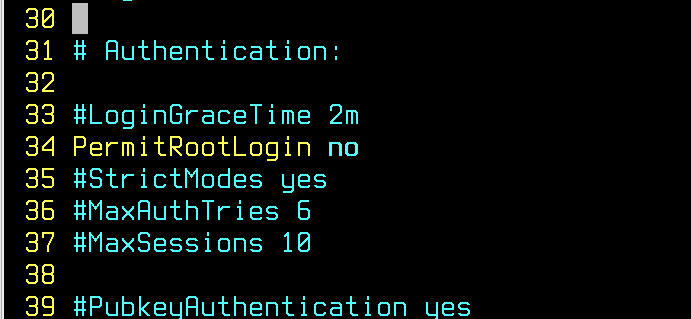
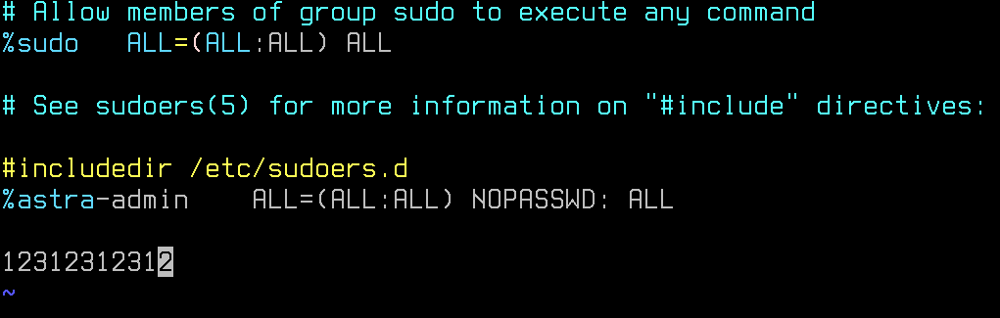
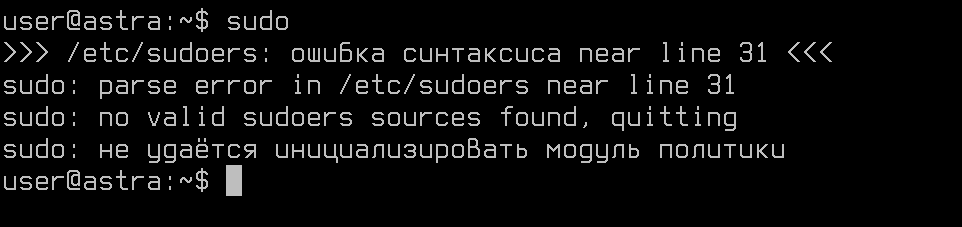
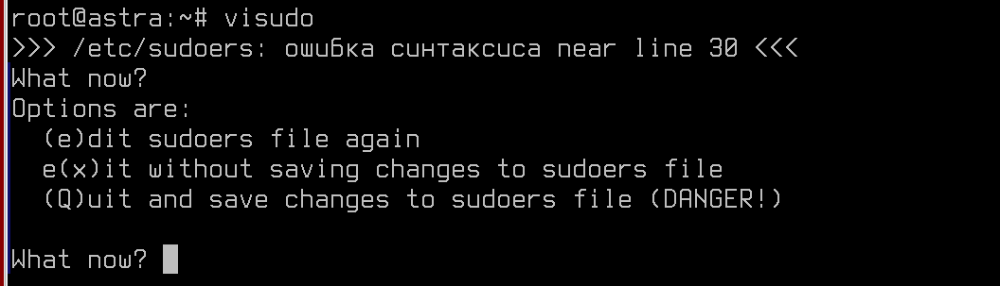
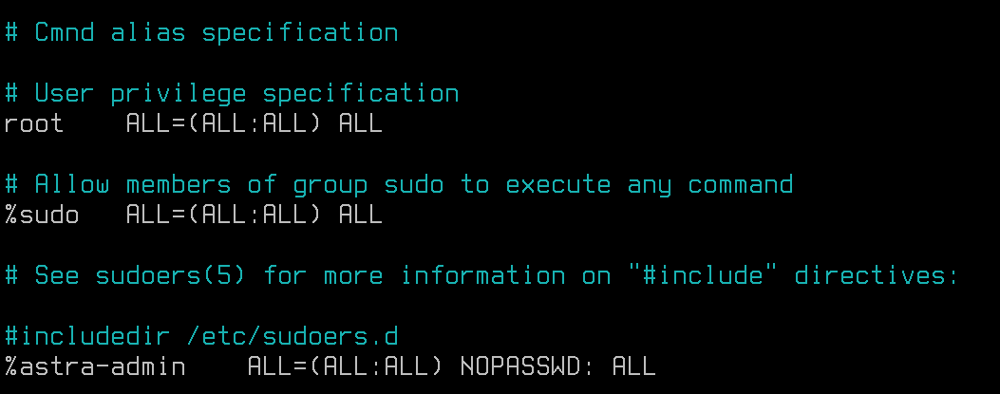

# Лабораторная работа №2. Тема: "Настройка Linux-систем по рекомендациям ФСТЭК РФ"
Цель работы
----------

изучить требования ФСТЭК РФ по безопасной эксплуатации Linux-систем


Оборудование, ПО:
----------
Виртуальная машина под управлением ОС Astra Linux 1.7  в режиме защищенности "Воронеж"


Ход работы:
----------
Целью данной лабораторной работы является ознакомление с рекомендуемыми настройками ФСТЭК РФ по безопасной эксплуатации несертифицированных Linux-систем на объектах критической инфраструктуры.


# Общие сведения о документе

Методический документ от 25 декабря 2022 г. ФСТЭК РФ регулирует настройки и обязательные требования к Linux-дистрибутивам, которые используются в объектах критической инфраструктуры.

К сожалению, или к счастью, но это не значит, что вы можете установить любой Linux-дистрибутив в информационную систему такой инфраструктуры.

```
Настоящие Рекомендации подлежат реализации в государственных информационных системах и на объектах критической информационной инфраструктуры Российской Федерации, построенных с использованием операционных систем Linux, несертифицированных по требованиям безопасности информации, до их замены на сертифицированные отечественные операционные системы.
```

При этом 

```
Настройка сертифицированных операционных систем на базе ядра Linux осуществляется в соответствии с эксплуатационной документацией разработчиков операционных систем.
```

Это не значит, что инструменты описанные в данном документе мы можем не использовать только потому, что работаем на сертифицированной Astra Linux. 

Знакомится с этим документом нужно, а также применять его на практике, чтобы по итогу, используя рекомендации как ФСТЭК, так и вендора - получить безопасную и надежную ОС. 


Документ разделен на разделы:

* настройка авторизации в операционной системе;

* ограничение механизмов получения привилегий;

* настройка прав доступа к объектам файловой системы;

* настройка механизмов защиты ядра Linux;

* уменьшение периметра атаки ядра Linux;

* настройка средств защиты пользовательского пространства со стороны ядра Linux.


## Настройка авторизации в операционных системах Linux

### 1. Не допускать использование учетных записей с пустыми паролями. 

При установке различных программ - например, Apache2 или Nginx, или SSHD. В системе появляется служебный пользователь. По умолчанию, он без пароля и без терминального доступа, но существуют компьютерные атаки, направленные как раз на существование таких "пустых" учетных записей. 

Для того чтобы не допустить использование учетных записей пользователей с пустыми паролями в Linux, вам следует выполнить следующие шаги:

1. Откройте терминал и войдите в систему под учетной записью с правами администратора.

2. Отредактируйте файл /etc/login.defs с помощью текстового редактора. Например, выполните команду:

```
sudo nano /etc/login.defs
```


3. Найдите и измените параметр PASSMINLEN на значение 1 или больше. Этот параметр устанавливает минимальную длину пароля.

```
PASS_MIN_LEN 1
```


4. Сохраните изменения в файле login.defs и закройте текстовый редактор.

5. Обновите файл /etc/shadow командой:

```
sudo pwconv
```


Теперь пользователи не смогут установить пустой пароль, причему  Если вы хотите заблокировать учетную запись пользователя, вы можете использовать команду passwd с опцией -l для блокировки:

```
sudo passwd -l username
```


### 2. Обеспечить отключение входа суперпользователя по протоколу SSH.

В файле /etc/ssh/sshd_config




### 3. Запретить использование команды sudo и su 

Команда "su" в UNIX-подобных операционных системах (как Linux) используется для переключения пользователя на другого, обычно более привилегированного, например, на суперпользователя (root).

Для ограничения доступа к команде su используется механизм PAM модуля pam_wheel.

По умолчанию данный модуль отключен.

Для включения разграничения доступа к команде su по системной группе astra-admin необходимо в файле /etc/pam.d/su изменить строку:

```
#auth       required   pam_wheel.so
```

На

```
auth       required   pam_wheel.so group=astra-admin
```

Если имя группы имеет пробел, например, domain group, то можно использовать синтаксис:

```
auth       required   pam_wheel.so [group=domain group]
```

После этого командой su смогут пользоваться только пользователи группы astra-admin  или domain group.


### 4. Органичить список пользователей, которым разрешен доступ к команде sudo

Команда sudo в UNIX-подобных операционных системах также используется для выполнения команд с повышенными привилегиями, например, от имени суперпользователя (root). Это позволяет пользователям без необходимости входа под суперпользователем выполнять административные задачи.


Информацию о том, кто может использовать команду **sudo** операционная система хранит в файле - **/etc/sudoers** и **/etc/sudoers.d** 

**Редактировать данные файлы напрямую, через различные текстовые редакторы - идея плохая, ведь если вы случайно допустите ошибку или опечатку в них, есть риск потерять административный доступ до операционной системы**

Для безопасного редактирования файла используйте команду - **visudo**

Рассмотрим на примере, чем редактирование файла /etc/sudoers без специальной команды может быть опасно.

P.S. Не проверять на реальной машине! Это может привести к потере доступа! 

```
vim /etc/sudoers
```



Допустили специальную ошибку, сохраняем и выходим из документа



И все! Теперь команда sudo недоступна.

А если бы мы работали через visudo?



То система бы сразу предупредила нас о проблемах! 

Ладно, на этом "вредные" советы закончились, что у нас с правилами sudo?





По-умолчанию, пользователь root, члены группы sudo и astra-admin имеют полный доступ до команды **sudo**.

Вы можете это поменять по своему усмотрению, например, если планируется выдать доступ для всех членов доменной группы: 

```
%domain\ admins ALL=(ALL:ALL) ALL
```

В этом случае, все члены доменной группы Domain Admins 
получат доступ до этой повышенных привилегий.

#### А что если мы планируем дать доступ только до определенных команд?

Например, 

```
a-admin-domain ALL=NOPASSWD: /bin/tar, /usr/bin/chown
```

И вот так, получится выдать доступ до конкретных команд определенным пользователям и группам. 

### 5. Настройка прав доступа к объектам файловой системы

Установить корректные права доступа к файлам настройки пользователей, а именно к файлам с перечнями пользовательских идентификаторов (/etc/passwd) и групп (/etc/group), либо хранилищам хешей паролей
(в операционных системах GNU/Linux, Solaris, HP-UX: /etc/shadow, AIX: /etc/security/passwd), с помощью команд:

```
chmod 644 /etc/passwd;

chmod 644 /etc/group;

chmod go-rwx /etc/shadow.
```

Установить корректные права доступа к системным файлам заданий (конфигурационным файлам) cron при помощи команд:

```
chmod go-wx /etc/crontab

chmod go-wx /etc/cron.d

chmod go-wx /etc/cron.hourly

chmod go-wx /etc/cron.daily

chmod go-wx /etc/cron.weekly

chmod go-wx /etc/cron.monthly
```

### 6. Настройка механизмов защиты ядра Linux

Файл sysctl.conf в Linux системах представляет собой конфигурационный файл, используемый для настройки параметров ядра операционной системы, управляемых через sysctl (системный вызов). Этот файл содержит параметры, определяющие различные аспекты поведения ядра, такие как сетевые настройки, настройки безопасности, параметры виртуальной памяти и т. д. 

Изменения в sysctl.conf вступают в силу после перезагрузки системы или после применения изменений с помощью команды sysctl -p.

Чтобы внести правки, откройте файл - **/etc/sysctl.conf**

И внесите 


# Дополнительная информация:
1) Установка системы мониторинга Zabbix на Astra Linux SE [Ссылка](https://wiki.astralinux.ru/pages/viewpage.action?pageId=38699775)
2) BIND9  в качестве DNS-сервера в частных сетях [Ссылка](https://www.digitalocean.com/community/tutorials/how-to-configure-bind-as-a-private-network-dns-server-on-ubuntu-18-04-ru)
3) Zabbix-шаблоны [Ссылка](https://www.zabbix.com/documentation/current/ru/manual/config/templates)
4) Руководство по Zabbix [Ссылка](https://www.zabbix.com/documentation/current/ru/manual)

