# Лабораторная работа №3. Тема: "Шифрование информации"
Цель работы
----------

изучить технические решения, которые существуют на российском рынке, по обеспечению шифрования и организации безопасного доступа


Оборудование, ПО:
----------
Виртуальная машина под управлением ОС Astra Linux 1.7  в режиме защищенности "Воронеж"


Ход работы:
----------
Целью данной лабораторной работы является ознакомление с инструментами обеспечения шифрования и защиты от НСД для Astra Linux. 


# Какие технические решения есть? 

Конечно, данной лабораторной работой все технические решения мы не перечислим. Что-то могло забыться, а что-то не совсем актуально в рабочих задачах. 

В основном, в большинстве государственных организациях или в объектах критической инфраструктуры вы встретитесь с ними:

1. КриптПро;

2. SecretNet;

3. Kaspersky;

4. dm-crypt.


## Начнем с КриптоПро

КриптоПро — это специальный криптопровайдер, предназначенный для подписи и шифрования. Без применения таких программ, как КриптоПро, использование ЭЦП становится невозможным. Криптопровайдер — модуль, который устанавливается непосредственно на персональный компьютер и предназначен для защиты данных от изменения третьими лицами.

Электронная подпись (ЭП или ЭЦП) — это цифровой аналог рукописной подписи. Электронные ключи используют в разных областях: для подписания электронных документов с контрагентами, сдачи отчётности, регистрации онлайн-кассы, участия в торгах, работы на госпорталах и т.д.

При подписании документа электронной подписью сохраняются данные о том, когда и кем был подписан файл. Если в документ внесут изменения после подписания, об этом можно будет узнать.

Хранится ЭЦП на токене.

Токен для ЭЦП — это ключевой носитель для записи сертификата и ключей электронной подписи (ЭП). Ещё его называют аппаратным или программным ключом.

Одним из основных производителей ЭЦП в России - компания "Актив" и их продукт "Рутокен". Выглядит токен примерно так:

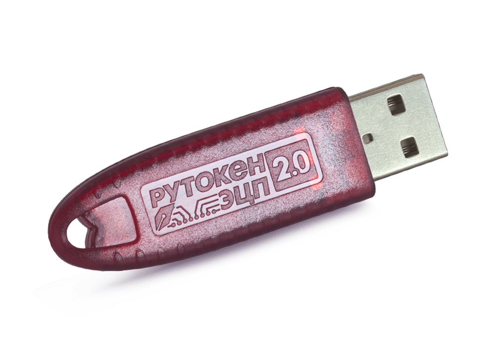

Или так:


## А как нам попробовать работу с этим продуктом?

Да, конечно для лабораторной работы мы не сможем каждому предоставить ЭЦП-токен, так что рассмотрим только функционал самого криптопровайдера. 

КриптоПро - платное программное обеспечение, с возможностью демо-версии в 3 месяца. Этим и воспользуемся. 


## Установка КриптоПро

Архив с программным обеспечением КриптоПро CSP доступен для загрузки на официальном сайте [www.cryptopro.ru](https://www.cryptopro.ru/products/csp). 

Для загрузки требуется регистрация на сайте.

Скачается архив - "linux_amd64_deb.tgz", распакуйте его:

```
tar -xvf linux-amd64_deb.tgz
```

После этого, перейдем в распакованный каталог и запустим скрипт установки с правами администратора:

```
sudo ./install_gui.sh
```

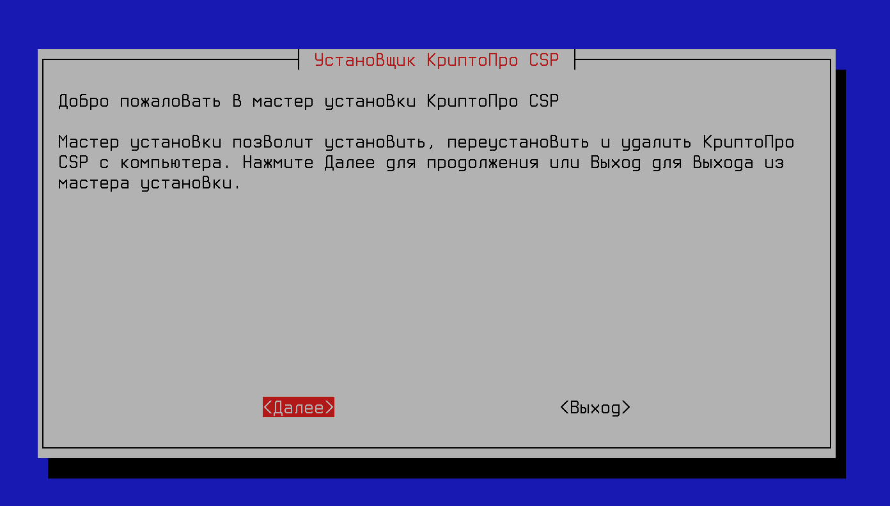

Для полной работы с ЭЦП выберите: 

* Поддержка токенов и смарт-карт;

* Импортирование из ОС сертификатов.

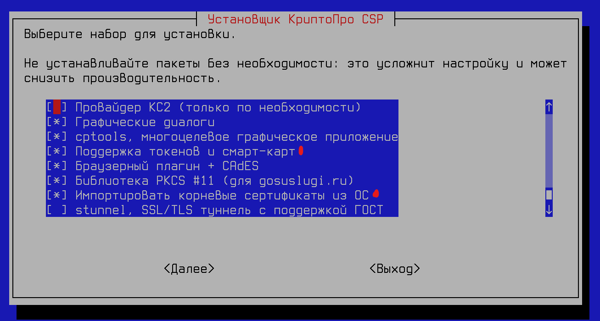


Итоговый перечень установленных программ:

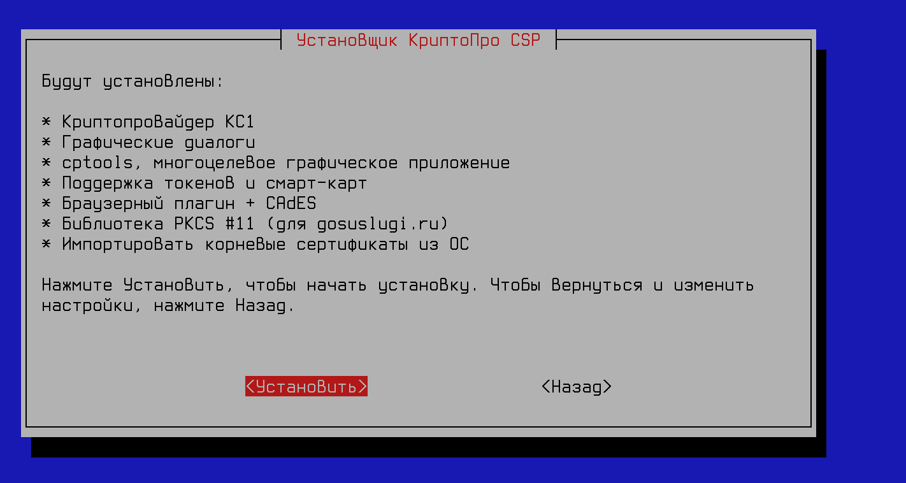


После установки, система уведомит вас о успехах соответствующим уведомлением

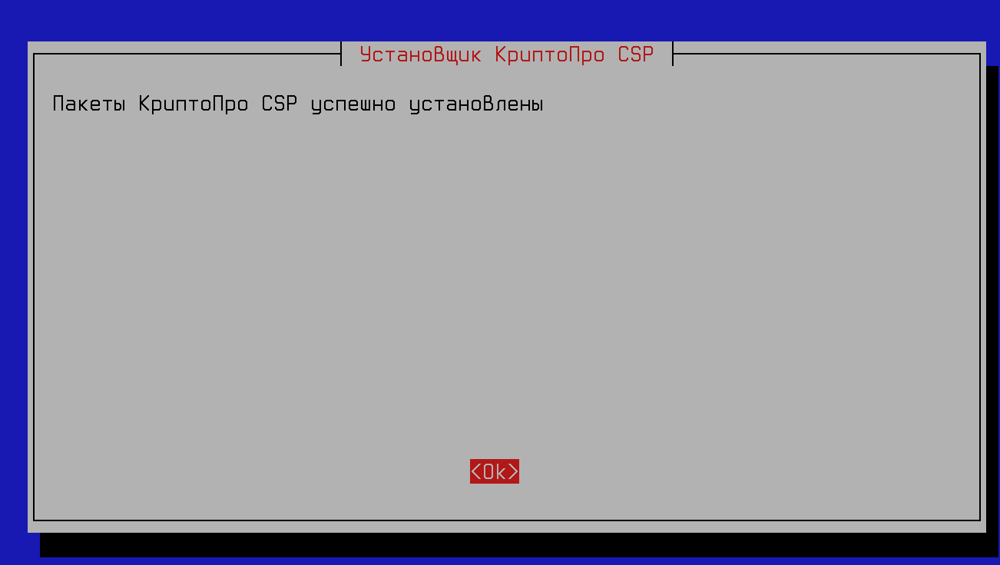


Проверить, что все работает можно командой:

```
/opt/cprocsp/sbin/amd64/cpconfig -license -view
```


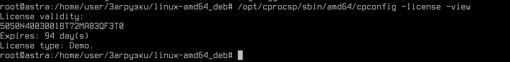

Для установки лицензии выполнить команду:

```
sudo /opt/cprocsp/sbin/amd64/cpconfig -license -set <номер_лицензии>
```

Примеры использования КриптоПро в Astra Linux можно увидеть тут: [Ссылка](https://wiki.astralinux.ru/pages/viewpage.action?pageId=32833902)


### Категории сертификатов

**Из документации Astra Linux**

Сертификаты делятся на четыре категории:

* личные сертификаты (устанавливаются в хранилище umy, где u = User, my - имя хранилища). Для таких сертификатов, как правило, имеется закрытый ключ (и они требуют особой установки, чтобы в хранилище появилась ссылка на этот закрытый ключ). В результате с их использованием можно, например, подписать файл;

* корневые сертификаты - краеугольный камень безопасности, так как цепочки доверия строятся от них.  Корневые сертификаты надо добавлять в хранилища осознанно и внимательно (устанавливаются в uroot, также администратор может поставить их в mroot, где m = Machine, такие сертификаты будут доступны в режиме read only в root-хранилищах всех пользователей);

* промежуточные сертификаты - появляются, когда есть промежуточные УЦ (структура вида "головной УЦ" -> "промежуточный УЦ" -> "пользовательский сертификат"). Прямое доверие к ним не требуется (устанавливаются в uca, также администратор может поставить их в mca). В это же хранилище устанавливаются и списки отзыва сертификатов (CRL). Обычно точки получения промежуточных сертификатов и списков отзыва (CRL) правильно указаны в пользовательских сертификатах, поэтому они загружаются автоматически и устанавливаются в хранилище ucache. Обычно непосредственная работа с промежуточными сертификатами не требуется;

* сертификаты партнёров по общению, чтобы проверять их подписи и зашифровывать для них сообщения. Ставятся либо в umy (это не лучшая, но распространенная практика), либо в uAddressBook.

### Графический интерфейс КриптоПро

"Меню Пуск" --> "Утилиты" --> "Инструменты КриптоПро"

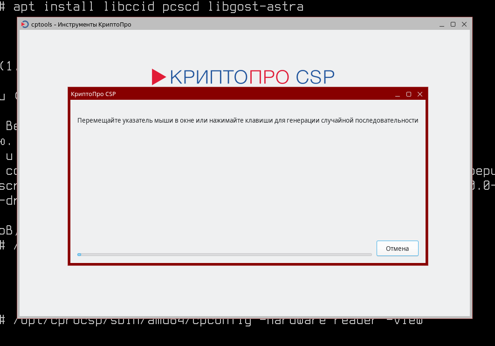

Здесь можно в удобной форме также поработать с КриптоПро и токенами. 


## Установка SecretNet

Программное обеспечение Secret Net Studio – комплексное решение для защиты рабочих станций и серверов на уровне данных, приложений, сети, операционной системы и периферийного оборудования. Secret Net Studio предлагает защиту информации от несанкционированного доступа, антивирусную защиту, межсетевое экранирование, контроль действий приложений и защиту от сетевых атак, шифрование контейнеров, создание защищенного соединения с удаленными компьютерами и многое другое.


Также как и КриптПро данное решение является платным, но имеет функционал "демоверсии" после процедуры регистрации.

[Скачать тут](https://www.securitycode.ru/download_center/)


Скачать, распаковать и перейти в папку:

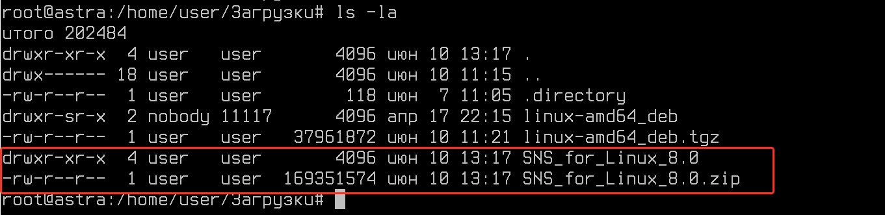


В папке Documentation есть инструкции по установке. 

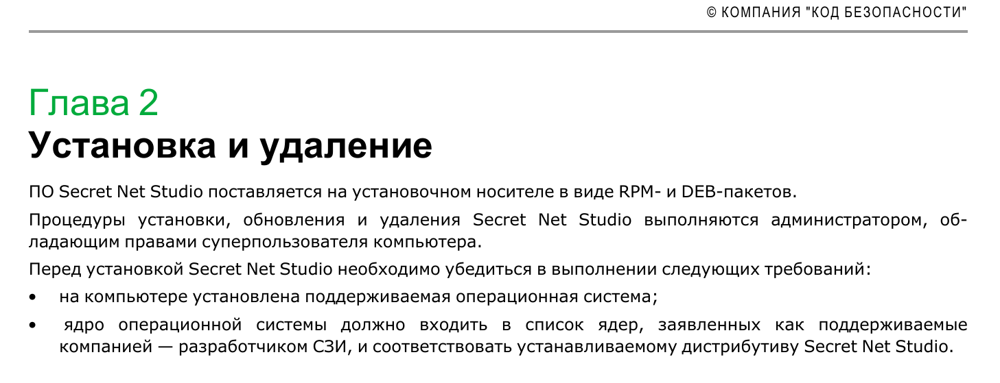


Выполните установку:

```
apt install ./sns_8.0-302.astra1.7_amd64.deb
```

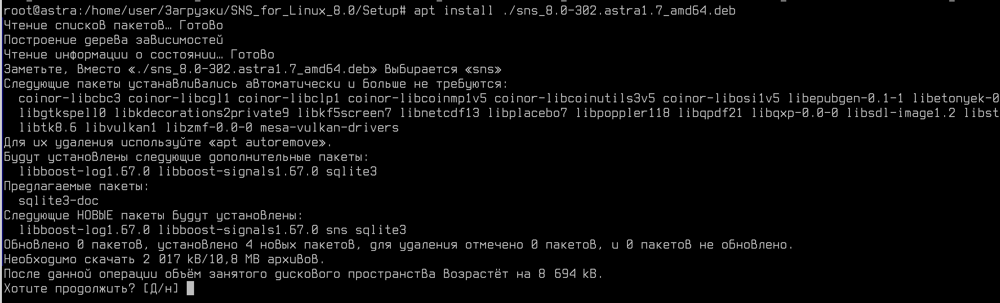

И вот ошибка!

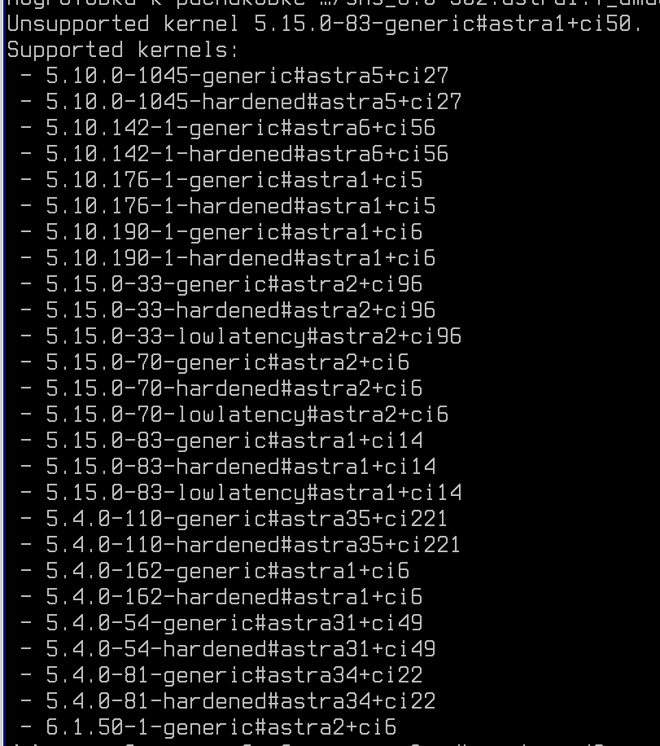

SecretNet привязыван к ядру операционной системы, установим ту версию, что требуется ПО. 

Конкретно в нашем случае, нам будет проще установить версию - 5.4.0-162.astra1+ci6


Для этого нам потребуется подключить только следующие репозитории в /etc/apt/sources.list:

```
deb http://dl.astralinux.ru/astra/frozen/1.7_x86-64/1.7.5/repository-main/ 1.7_x86-64 main contrib non-free
deb http://dl.astralinux.ru/astra/frozen/1.7_x86-64/1.7.5/repository-update/ 1.7_x86-64 main contrib non-free
```

Для установки конкретной версии ПО:

```
apt install linux-image-5.4.0-162-generic= 5.4.0-162.astra1+ci6
```

После установки


Соответственно, как через терминал указать ядро, загружаемое по умолчанию?

```
sudo grep 'menuentry ' /boot/grub/grub.cfg | cut -f 2 -d "'" | nl -v 0
```

Вывод будет примерно такой:

```
0  AstraLinuxSE GNU/Linux
1  AstraLinuxSE GNU/Linux, with Linux 5.15.0-33-hardened
2  AstraLinuxSE GNU/Linux, with Linux 5.15.0-33-hardened (recovery mode)
3  AstraLinuxSE GNU/Linux, with Linux 5.15.0-33-generic
4  AstraLinuxSE GNU/Linux, with Linux 5.15.0-33-generic (recovery mode)
```

Далее укажите в файле **/etc/default/grub** в параметре GRUB_DEFAULT номер того ядра, что вы желаете запустить. 

Чтобы обновить настройки, введите команду:

```
sudo update-grub
```

Установим следующую версию ядра - 5.15.0-83.astra1+ci14


## To be continued....


