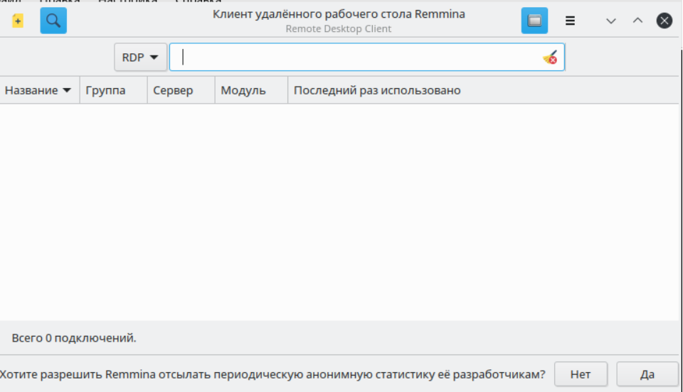
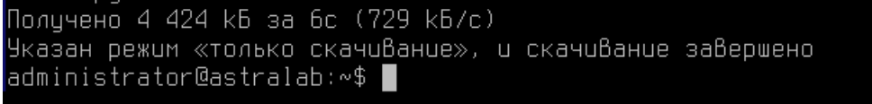
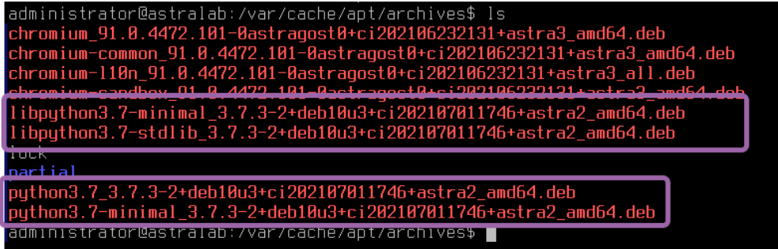
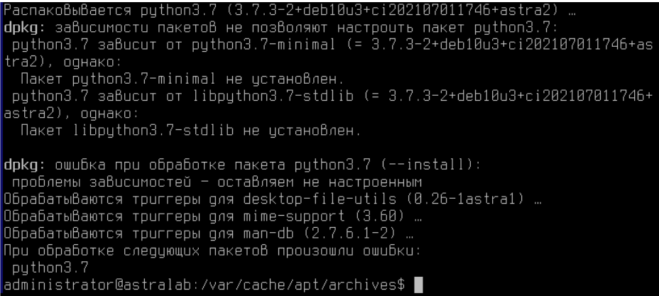
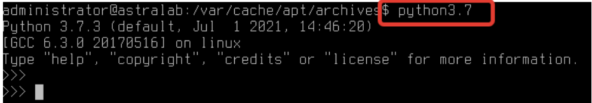

# Лабораторная работа №2. Тема: "Установка и настройка ПО".

Цель работы
----------
приобрести навыки установки программного обеспечения через репозиторий;

приобрести навыки удаления программного обеспечения через репозиторий;


Оборудование, ПО:
----------

Установленная в ходе выполнения лабораторной работы #1 виртуальная машина;
VirtualBox версии 6.1;

Доступ к сетевым репозиториям.


Ход работы:
----------

В прошлых лабораторных работах мы устанавливали программное обеспечение с
помощью пакетного менеджера APT, а также графической оснастки данной программы
- SYNAPTIC.

Попробуем установить программное обеспечение remmina


# Это нужно знать!


---------------

**Remmina**  — это клиент удаленного рабочего стола для компьютерных операционных систем на базе POSIX. Он поддерживает протоколы удаленного рабочего стола,
VNC, NX, XDMCP, SPICE, RDP.

---------------------

1) Установим данную программу с помощью команды в терминале Fly.
```console
$ sudo apt install remmina
```
Подтверждаем установку нажатием Y.

---------------------

2) После завершения установки обратимся к данной программе. Введите в командной строке команду запуска
```console
$ remmina
```

---------------------

3) Теперь на машине есть клиент для RDP-соединения.



---------------------

4) Попробуем также скачать пакет без установки, только скачивание.

Это будет полезно, в случае, если вам необходимо перенести установочные пакеты на
машину, которая не имеет доступа в интернет или для того чтобы удовлетворить
некоторые пакетные зависимости.

Стоит напомнить вам, что Astra Linux базируется на базе ОС Debian 9 (Stretch),
большая часть пакетов для Debian 9 может установиться на Astra Linux Орёл.

Команда для скачивания пакета с репозитория без установки выглядит так
```console
$ sudo apt install --download-only <название_пакета>
```

В нашем случае, давайте скачаем с репозитория, язык программирования - Python 3.7.
```console
$ udo apt install --download-only python3.7
```

Обратите внимание, что в конце система написала итог “режим только для
скачивания”.



---------------------

5) Перейдем в директорию - **/var/cache/apt/archives/** - именно по данному пути
,по-умолчанию, хранятся скачанные файлы



Наблюдаем скачанные *.deb пакеты для установки Python3.7. Обратите внимание, что
все эти пакеты для установки Python3.7 нужны, так как они зависимые друг от друга.

---------------------

# Это нужно знать!


---------------

**deb** (сокращение от Debian) — расширение имён файлов «бинарных»
пакетов для распространения и установки программного обеспечения в
операционной системе проекта Debian, и других, использующих систему
управления пакетами dpkg.

**dpkg** — это программное обеспечение, являющееся основой системы
управления пакетами в Debian и ряде других операционных систем,
основанных на Debian, например Ubuntu. dpkg используется для установки,
удаления, и получения информации о .deb пакетах. dpkg является довольно
низкоуровневой утилитой.

---------------

6) Для того чтобы установить DEB-пакет необходимо воспользоваться командой dpkg.
```console
$ sudo dpkg -i <DEB-файл>
```

Попробуем установить DEB-пакет с Python3.7.
```console
$ sudo dpkg -i python3.7…. далее воспользуйтесь клавишей TAB на
клавиатуре, чтобы вызвать подпрограмму автозаполнения.
```

---------------

# Это нужно знать!


---------------

Следует напомнить, что каждая команда в Linux имеет встроенную справку, с
которой можно познакомиться с помощью команд:
* <название_команды> -h - ключ -h (от англ. Help - помощь)
* <название_команды> --help - ключ --help (от англ. Help - помощь)
* man <название_команды> - man (от англ. manual - мануал)
Это существенно пригодится в вашей профессиональной деятельности


---------------

7) Обратите внимание, что система выдала ошибку с зависимостей.



Это одна из основных проблем установки ПО через инструмент dpkg, так как он не
строит и не умеет удовлетворять дерево зависимостей.

Но стоит также обратить внимание, что dpkg указывает какие пакеты должны быть
установлены для работы python3.7.

Установим пакеты в том порядке, как рекомендует dpkg.

Обратите внимание, что dpkg можно передать множество файлов для установки.

---------------

8) Внимательно читая вывод команды dpkg самостоятельно установите все пакеты в
требуемом порядке и убедитесь в том, что Python3.7 установился в ваш компьютер.

Запустите **python3.7**, убедитесь в том, что пакет работает.



---------------

9) Вывести список всего установленного ПО можно с помощью двух команд:
```console
$ sudo dpkg -l
```
```console
$ sudo apt list --installed
```

Ознакомьтесь со  списком установленного ПО.

---------------

Дополнительная информация:
1) https://inlnk.ru/O1w4jJ - инструкции по подключению репозиториев
2) https://inlnk.ru/ELQV1P - инструкции по установке пакета Wine.
