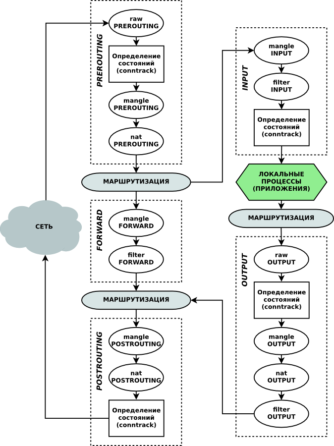

# Лабораторная работа №2. Тема: "Настройка межсетевого  экрана"
Цель работы
----------

познакомиться с UFW - основным решением межсетевого экранирования в Astra Linux.


Оборудование, ПО:
----------
Виртуальная машина под управлением ОС Astra Linux 1.7  в режиме защищенности "Воронеж".


Ход работы:
----------
UFW, или Uncomplicated Firewall, является основным инструментом для настройки и управления файерволом в операционной системе  Astra Linux. С помощью UFW вы можете задать правила доступа к сети для различных сервисов и приложений.

В этом курсе мы рассмотрим основные возможности и функционал UFW, научимся его устанавливать, настраивать и использовать для защиты вашей системы от внешних угроз.


# UFW, iptables, nftables - сколько можно то?! 

Да, если вы уже имели опыт работы с разными дистрибутивами Linux, то наверняка сталкивались с тем, что решения для межсетевого экрана бывают разные - iptables, nftables, firewalld, ufw. 

Но что их всех объединяет? 

### Все они используют модуль ядра netfilter!

А в случае с некоторыми другими решениями, как например, UFW, они являются "обвязкой над обвязкой", так как UFW использует iptables для формирования правил, а затем уже переводит для работы с netfilter.

В любом случае, правило работы с трафиком сводится к данной схеме. Она описывает весь процесс обработки трафика на компьютере под управлением Linux.

Также, стоит добавить, что UFW инструмент не гибкий. При настройке сложных правил придется прибегнуть к чистому **iptables**. 



Постараемся предметно разобраться в значении данной схемы. 

1) Каждый этап работы с трафиком именнуется цепочкой, а внутри "цепочек" находятся таблицы, которые содержат правила по работе с трафиком. Данные конструкции работают в следующем порядке:

  * PREROUTING (премаршрутизация) - в этой цепочке содержатся правила, которые работают до того, как компьютер сформирует и отправит IP-пакет в сеть. Здесь допустимо настроить таблицу NAT - если есть задача "подменить" адрес источника непосредственно на отправителе или промаркировать трафик меткой в таблице MANGLE. 

===Далее выполняется маршрутизация, а затем трафик перейдет в цепочку INPUT, если он  является входящим соединением и должен быть обработан внутренним процессом, или же в ветку FORWARD, если трафик должен уйти в сеть к другому устройству===

Например, мы попадем в **INPUT**

  * В этом случае, цепочка INPUT встретит нас следующим набором таблиц - 
  
    1. MANGLE (для маркировки);
    
    2. filter (для того чтобы отфильтровать нежелательный входящий трафик);
    
    3. conntrack (если входящий трафик допустим, но необходимо отслеживать его состояние).  Если трафик не был отфильтрован в ходе работы, то он передается на прикладной уровень по модели OSI - сервисам и программам, которые запущены на компьютере.

#### Немного отступим от темы и обсудим что такое conntrack

Один из примеров использования conntrack в iptables - это настройка правил для обеспечения безопасности сервера. Например, можно настроить правило, которое разрешает входящие соединения только на определенные порты (например, порт 80 для HTTP) и отслеживает состояние этих соединений с помощью conntrack.

Допустим, у вас есть веб-сервер, который должен принимать только HTTP-запросы на порт 80. Вы можете создать правило в iptables с использованием conntrack, которое будет отслеживать состояние соединений на этом порте:

```
iptables -A INPUT -p tcp --dport 80 -m conntrack --ctstate NEW,ESTABLISHED -j ACCEPT
iptables -A INPUT -p tcp --dport 80 -j REJECT
```

В приведенном примере правило позволяет только устанавливать новые и установленные соединения на порт 80, отклоняя все остальные входящие соединения на этот порт. Таким образом, использование conntrack позволяет более точно контролировать поток трафика и улучшить безопасность сервера, предотвращая несанкционированные подключения.

 * Если трафик был обработан внутренними процессами системы и должен вновь вернуться в сеть (если, например, мы с АРМ используем какой-нибудь клиент-серверное приложение), то мы перейдем в цепочку **OUTPUT**. Здесь нас встретят следующие таблицы (указаны в порядке обработки) - 

      1. raw - буквально "сырая" таблица. Разместить в неё можно любое правило;

      2. conntraсk;

      3. mangle;

      4. nat;

      5. filter.

* После **OUTPUT** пакет должен отправиться в процесс маршрутизации и цепочку **POSTROUTING**. Таблицы будут следующими: 

  1. mangle;

  2. NAT - причем здесь "NAT* правило сработает только при условии, что пакет должен направиться за пределы локальной сети. Например, если из Linux делать роутер, то команда для NAT будет следующей:

  ```
  iptables -t nat -A POSTROUING -s 0.0.0.0/0 -o eth0 -j MASQUERADE
  ```

Разберем команду выше - 

1. -t nat - указываем таблицу NAT

2. -A POSTROUTING - указываем цепочку POSTROUING в таблице NAT

3. -s 0.0.0.0/0 - здесь могла бы быть ваша локальная подсеть (например, 192.168.1.0/24), но также допустимо использование wildcard. В этом случае под правило попадает любая подсеть. 

4. -o eth0. Здесь o - outside. Считайте, как outside-интерфейс. Или в какой адрес выполнять трансляцию (NAT) - в адрес, указанный на интерфейсе eth0.

5. -j MASQUERADE. Здесь j - jump, имеется ввиду как "Action". MASQUERADE  в терминологии iptables - это PAT, или NAT Overload, или NAT с перегрузкой. Названий у этой технологии много, но суть одна - транслируем не "адрес в адрес", а "адрес в порт". Так рациональнее. 

## Забыли поговорить о цепочке FORWARD

Действительно, увлеклись мы маршрутом через цепочку **INPUT**, а что с **FORWARD**? 

Таблиц в этой цепочке немного: 

1. mangle;

2. filter. 

В цепочку **FORWARD** трафик попадает при условии, что ваше устройство является промежуточным в компьютерной сети - то есть роутером! Случай, довольно редкий для АРМ, но вполне "ожидаемый" если вдруг из ПК на базе Astra Linux решили сделать маршрутизатор. 

# Фух, теорию мы изучили подробно. Отправляемся практиковаться с UFW. 

По умолчанию, UFW установлен в Astra Linux, но выключен. В случае, если по каким-то причинам UFW отсутсвутет, то его можно установить командой - 

```
apt install ufw -y
```

Проверить состояние UFW можно с помощью команды - 


```
sudo ufw status
```


По умолчанию, UFW, как и любой межсетевой экран использует правило "Deny any". Поэтому просто включить мы его не можем. Учитывая, что сейчас подключение до виртуальной машины реализовано через RDP.


## Шаблоны приложений

В UFW есть возможность создать шаблоны приложения. Это удобно для учета, документирования и эксплуатации UFW в "продуктивной" среде.

Получить список всех доступных шаблонов можно командой - 

```
sudo ufw app list
```


Как мы можем заметить по скриншоту выше, список внушительный! 

Попробуем узнать конкретнее, что прячется за названиями этих шаблонов? 

Введем команду - 

```
sudo ufw app info MSN
```


Мы получили краткое описание профиля, порты которые он открывает и протоколы. 

### А как создать свой профиль? 

Например, под RDP профиля нет. А нам, вероятно, было бы удобно пользоваться таким профилем для настройки. 

Перейдем в каталог - **/etc/ufw/applications.d**

```
cd /etc/ufw/applications.d
```

А далее, создайте там файл с произвольным названием. Например, **xrdp**

```
sudo vim /etc/ufw/applications.d/xrdp
```

Файл необходимо привести к данному виду - 


Структура файла: 

```
[<название_профиля>] - именно по этому названию мы будем обращаться через UFW  к этому профилю 
title=<заголовок> - краткий заголовок 
description=<краткое описание>
ports=<список портов>/<протокол>
```

По поводу ports, пару примеров: 

Если нужно открыть несколько портов, можно написать: 

```
ports=50,80,443
```

Если нужно открыть порт, а также указать протокол:

```
ports=50/udp
```

Если нужно открыть несколько портов и несколько протоколов, то писать нужно так:

```
ports=50/udp|50/tcp
```

### Окей, что дальше? 

Включаем наш профиль -

```
sudo ufw allow XRDP
```


Затем включаем сам UFW - 

```
sudo ufw enable
```


Проверить, какие правила применены можно командой - 

```
sudo ufw status
```


Если не указавать ключей, то команда выше укажет добавленные профили. 

Если необходимо получить подробный отчет о открытых портах и протоколах. 

```
sudo ufw status verbose
```


## А что, просто порт открыть нельзя? 

Можно! 

```
sudo ufw allow 1234/tcp
```

А вот так можно открыть сразу диапазон - 

```
sudo ufw allow 8000:8100/udp
```


## Мы только открываем! А если теперь хочу закрыть? 

Синтаксис прежний, но слово **allow** меняется на **deny**

```
sudo ufw deny 1234/tcp
```

```
sudo ufw deny 8000:8100/udp
``` 

# Работа с IP-адресами

Можно ли разрешить сетевой доступ до АРМ с конкретного адреса? Например, у вас в сети присутствует централизованный сервер администрирования - как Касперский или Puppet. 

```
sudo ufw allow from 10.100.10.100
```

В случае ввода команды выше, с указанного адреса  будет разрешен доступ к любым портам нашего АРМ.

Если это недопустимо, порты можно открыть более точно - 

```
sudo ufw allow from 10.100.10.100 to any port 22
```

В случае ввода команды выше, доступ с адреса 10.100.10.100 будет разрешен только в порт 22.

## А если мне нужно доступ открыть для целой подсети? 

Тогда вам стоит ввести команду -

```
sudo ufw allow from 10.100.10.0/24
```

Причем, можно также настроить конкретный порт - 

```
sudo ufw allow from 10.100.10.0/24 to any port 22
```

## Я администрирую сервер, где несколько сетевых интерфейсов. Можно ли открыть порт 22 для конкретного интерфейса?

Можно!

Тогда команда будет выглядеть так - 

```
sudo ufw allow in on eth2 to any port 22
```

В этом случае eth2 - название вашего сетевого интерфейса.

Такую конструкцию удобно использовать, если сервер имеет несколько сетевых интерфейсов.

## Я куда-то нажал и все сломалось. Как теперь удалить правило? 

Удобнее всего сделать это с помощью команды - 

```
sudo ufw status numbered
```


А затем удалить правило по его номеру - 

```
sudo ufw delete 1
```

Или

```
sudo ufw delete X, где X - это номер правила, которое нужно удалить
```

## А как мне добавить правило в цепочку выше или ниже?

С помощью команды, конечно - 

Вставить соответствующее RULE (правило) как правило под указанным NUM (номером):

```
sudo ufw insert NUM RULE
```

Или более практичный пример - 
```
sudo ufw insert 1 allow 80/tcp
```

# Что связывает UFW и iptables?

В начале лабораторной работы мы объявили, что UFW является оболочкой поверх iptables. В качестве подтверждения этих слов, введем команду - 

```
sudo iptables-save
```


# Здорово, а UFW умеет делать NAT? 

Вот здесь начинается сложность - не умеет. 

Как, впрочем, и любые другие сложные настройки. 

UFW довольно простой и "заскриптованный". Если вам необходимо внести какие-то специфичные настройки, то сделать это можно в файлах конфигурации UFW.

Так, например, если мы планируем делать роутер на базе Astra Linux, для начала вам предстоит разрешить трафик **FORWARD** в UFW. 

Откроем конфигурационный файл UFW - **/etc/default/ufw**

 

В строчке DEFAULT_FORWARD_POLICY значение сменить с **DROP** на **ACCEPT**

А правило для MASQUERADE в этом случае нам потребуется описать в конфигурационном файле - **/etc/ufw/before.rules**


# А что, в графике с UFW нельзя поработать? 

Графический инструмент gufw доступен в меню ("Пуск" - "Панель управления" - "Прочее" - "Настройка межсетевого экрана").
Так же, его можно запустить из командной строки командой 

```
gufw
```

Графический инструмент содержит подробную справку о работе с UFW.


# Практическая работа

1) Настройте UFW для открытия порта 80 для HTTP-трафика.

2) Заблокируйте доступ к порту 22 для SSH из всех внешних сетей, кроме доступа с внутреннего сетевого интерфейса виртуальной машины.

3) Разрешите доступ к порту 443 для HTTPS-соединений.

4) Откройте необходимые порты для работы приложения, работающего на порту 5000. Правило назовите APPS.

5) Создайте правило приложения для разрешения доступа к порту 3306 для MySQL-сервера. Правило назовите MySQL.


# Дополнительная информация:
1) Введение в Iptables [Ссылка](https://habr.com/ru/articles/747616/)
2) Настройка iptables в Linux [Ссылка](https://selectel.ru/blog/setup-iptables-linux/)
3) Межсетевой экран UFW в Astra Linux [Ссылка](https://wiki.astralinux.ru/pages/viewpage.action?pageId=27362474)
4) UFW + iptables в Astra Linux [Ссылка](https://wiki.astralinux.ru/pages/viewpage.action?pageId=68911165)

