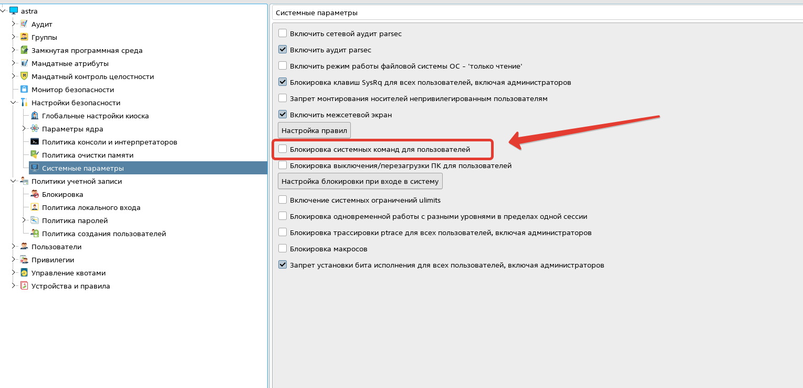
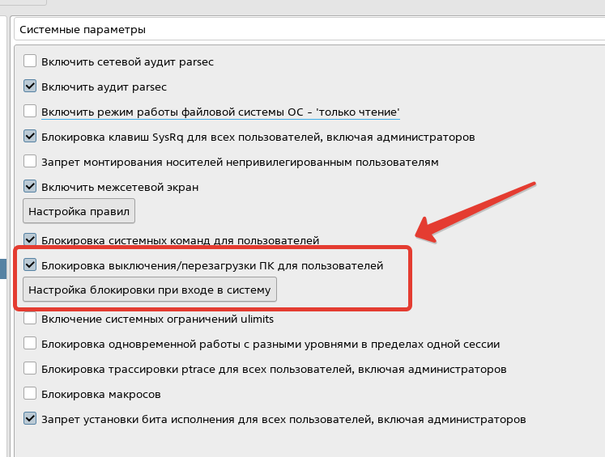
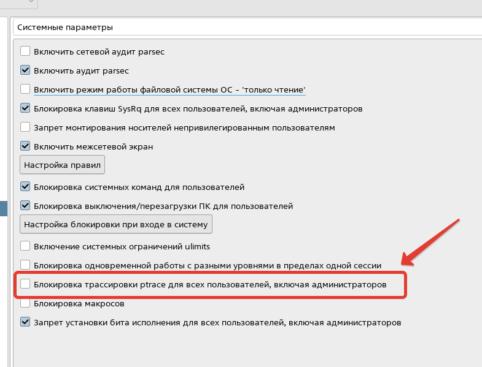
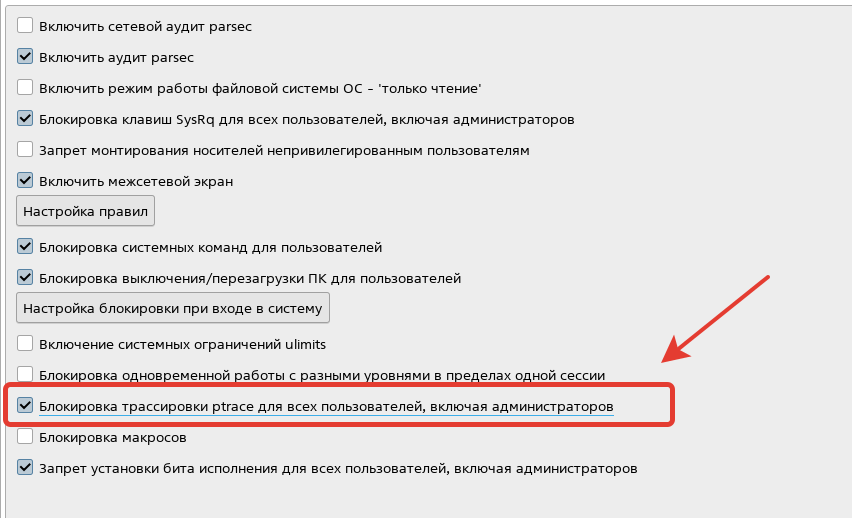

# Лабораторная работа №3. Тема: "Блокировка интерпретатора, системных команд и параметров"
Цель работы
----------

познакомиться с механизмом блокировки интерпретаторов, системных команд и параметров.


Оборудование, ПО:
----------
Виртуальная машина под управлением ОС Astra Linux 1.7  в режиме защищенности "Воронеж".


Ход работы:
----------
В ходе выполнения данной лабораторной работы вы узнаете о методах борьбы с возможными угрозами безопасности, связанными с возможностью выполнения нежелательных действий с помощью интерпретаторов и системных команд. Вы также изучите различные техники блокировки доступа к определенным функциям и параметрам системы, чтобы обеспечить её безопасность. 


# Начнем с блокировки интерпретаторов

## От чего мы защищаемся с помощью данной настройки?

Блокировка интерпретаторов позволяет предотвратить атаку в ходе которой злоумышленник подменяет стандартные исполняемые файлы, используемые системой для интерпретации скриптов - своими вредоносными версиями. После этого, когда пользователь запускает скрипт или команду, злоумышленники получают полный контроль над системой и могут производить различные вредоносные действия.

В Astra Linux, включение блокировки интерпретаторов, работает следующим образом: 
 
 * Блокировка интерпретаторов не распространяется на пользователей из группы astra-admin.

 * Блокировка интерпретатора bash включается отдельно, так ка может ограничить функционал некоторых программ и служб, не очевидным образом использующих bash, что приведет к нарушению штатной работы ОС.

 * После блокировки интерпретатора bash для пользователей, не входящих в группу astra-admin будут невозможны:

      1. консольный вход с оболочкой bash;

      2. работа в графическом терминале Fly-term в графических сессиях.


Включить данную блокировку можно через графический интерфейс -  **Пуск — Панель управления — Безопасность — Политика безопасности**

Затем на боковой панели навигации выбрать пункт Настройки безопасности — Политика консоли и интерпретаторов и на рабочей панели установить флаги:


Также, данная настройка включается через командную строку -

Данной командой вы блокируете все интерпретаторы (кромe Bash) - 

```
sudo astra-interpreters-lock enable
```

А вот этой командой, вы заблокируете Bash - 

```
sudo astra-bash-lock enable
```

Проверить состояние блокировок можно следующими командами:

Для других интерпретаторов - 

```
sudo astra-interpreters-lock status
```

Для Bash - 

```
sudo astra-bash-lock status
```


# Но все эти проверки - синтетические. Как проверить реальную работу? 

Необходимо войти в систему под пользователем, который не входит в группу astra-admin. 

Создайте его самостоятельно с помощью команды adduser или графической утилиты "Политика безопасности". Не добавляйте его в группу astra-admin!

Затем, попробуйте открыть Fly-term через меню Пуск --> Системные --> Терминал Fly.


Выйдет ошибка! Чего, в целом, мы и ожидали.

## Но что теперь? 

На самом деле в ходе установки разного ПО и его эксплуатации может возникнуть потребность к использованию **/bin/bash** для пользователя. Особенно это актуально для нестандартного ПО.  Именно поэтому, при настройке блокировки интерпретаторов необходимо будет протестировать работу критичного ПО на АРМах пользователей перед публикацией в широкие массы. 

# Блокировка системных команд

К таким командам относятся - **df, chattr, arp, ip**

Эти команды необходимо блокировать в случае, когда на одном АРМ производится обработка информации разных уровней конфиденциальности и\или работают пользователи с разными уровнями целостности и конфиденциальности, т.к. с  помощью данных утилит можно организовать скрытый канал передачи информации между уровнями.

Команды блокируются для пользователей с помощью выставления на них прав доступа 750 (rwx r-x ---).

Включить данную утилиту можно в графическом интерфейсе "Политики безопасности"




Или в командной строке - 

```
sudo astra-commands-lock enable
```

Для того чтобы проверить состояние блокировки системных команд, необходимо в терминале выполнить команду:

```
sudo astra-commands-lock status
```


# Настройка системных параметров

Под этим громким словом скрывается сразу стек различных настроек:

1. **Включение на файловой системе режима работы «только чтение».**

Процитируем выдержку из документации -

"После включения этого ограничения фактическое содержимое корневой ФС монтируется в **overlay** одновременно с ФС, хранящейся в памяти. Изменения файлов сохраняются только в памяти, а ФС на носителе остается без изменений. После перезагрузки все изменения теряются, и система каждый раз загружается в исходном состоянии.
Данная функция может применяться в тех случаях, когда носитель, на котором расположена корневая ФС, аппаратно защищен от записи либо необходимо программно защитить его от изменений.
Функционал overlay не касается ФС, хранящихся на отдельных разделах, отличных от корневого. Например, если каталог /home хранится на отдельном разделе или носителе, вносимые в него изменения будут сохраняться после перезагрузки.
Для применения изменений требуется перезагрузка."

Получается, что данная настройку имеет смысл включить только если вы окончательно закончили работу над настройкой АРМ и планируете заблокировать его для любых дальнейших изменений. 

Включить данную настройку можно командой -

```
sudo astra-overlay enable
```

Проверить, что настройка работает можно с помощью команды - 

```
sudo astra-overlay status
```


2. **Запрет монтирования съемных носителей**

Описание из документации - 

"После включения этого ограничения монтирование съемных носителей информации будет запрещено пользователям, входящим в группу floppy, при этом запрет не распространяется на пользователей из группы astra-admin.
Ограничение вступает в действие немедленно."

Включить данную настройку можно командой - 

```
sudo astra-mount-lock enable
```

Проверить, что настройка работает можно с помощью команды - 

```
sudo astra-mount-lock status
```

В графической утилите "Политика безопасности" аналогичная настройка выполняется с помощью - 


3. **Блокировка выключения компьютера пользователями**

Описание из документации - 

"После включения этого ограничения права доступа к исполняемому файлу /bin/systemctl меняются на 750 (rwx --- ---) и меняются параметры в fly-dmrc.
Команды systemctl могут выполняться только через механизм sudo. Также при включении инструмента блокируется возможность перезагрузки компьютера путем нажатия комбинации клавиш <Ctrl+Alt+Delete>.
Ограничение вступает в действие немедленно."


Включить данную настройку можно через команду -

```
sudo astra-shutdown-lock enable
```

Проверить, что настройка работает можно с помощью команды - 

```
sudo astra-shutdown-lock status
```

Или в графической утилите "Политика безопасности". 




4. **Блокировка одновременной работы с разными уровнями конфиденциальности в пределах одной сессии**

В целом, название говорит само за себя - сменить свой уровень целостности с помощью команды **sumac** не получится. 

Включить данную настройку можно через команду - 

```
sudo astra-sumac-lock enable
```

Проверить, что настройка работает можно с помощью команды - 

```
sudo astra-sumac-lock status
```

В графической утилите "Политика безопасности" также можно настроить - 



5. **Очистка освобождаемой внешней памяти и области подкачки**

Реализованный в ОС механизм очистки освобождаемой внешней памяти очищает неиспользуемые блоки ФС непосредственно при их освобождении, а также очищает разделы страничного обмена. Работа данного механизма существенно снижает скорость выполнения операций удаления и усечения размера файла подкачки.

В этом случае, при включении данной настройки области памяти на диске, освобождающиеся при  удалении или уменьшении размеров любых файлов в пределах заданной ФС, очищаются путем перезаписи каждого байта. Данную настройку нерекомендуется вносить, если ваш компьютер работает на SSD и NVME накопителях (так как они существенно быстрее выйдут из строя).

В графической утилите настройка выглядит примерно так - 


В этом случае, для включения настроек необходимо выбрать один из режимов:

* выключено — механизм очистки выключен;
* сигнатура — очистка предопределенной маскирующей последовательностью;
* случайно — очистка псевдослучайной маскирующей последовательностью.

### Стоит заметить, что если настройка выше вам не подходит, то отличной альтернативой будет включение режима безопасного удаления файлов. 

Команда - 

```
sudo astra-secdel-control enable
```

Включает режим безопасного удаления файлов на разделах с файловыми системами, присутствующими в файле /etc/fstab. Поддерживаются следующие форматы файловых систем:

* ext2;

* ext3;

* ext4;

* xfs.

Когда функция astra-secdel-control включена, при удалении файлов содержимое файлов уничтожается, чтобы его нельзя было восстановить. В обычных условиях при удалении файлы логически помечаются как удаленные, но их содержимое остается на носителе, пока не будет затерто новыми данными. Изменение режима работы вступает в действие после следующего монтирования файловой системы (в т.ч. после перезагрузки ОС).

#  Блокировка макросов

Команда - 

```
sudo astra-macros-lock enable
```

Блокирует исполнение макросов в документах libreoffice. Для этого из меню программ libreoffice удаляются соответствующие пункты, а файлы, отвечающие за работу макросов, перемещаются или делаются недоступными пользователю. Блокировка макросов решает две задачи - защищает от выполнения вредоносного кода при открытии документов и не позволяет злонамеренному пользователю исполнять произвольный код через механизм макросов.
Изменение режима блокировки вступает в действие немедленно.


# Включение системных ограничений ulimits

Ulimit – утилита для ограничения системных ресурсов, доступных процессу – количество файлов, которые может открыть процесс; размер файла, который может создать пользователь; объем памяти, который может использоваться процессом, запущенный от имени пользователя.

Данная политика точно не рекомендуется к использованию, если ваш компьютер является доменным и за ним работают пользователи из домена Active Directory.

Иначе, пользователи из домена не смогут войти в систему спустя несколько рабочих дней - потому что они буквально "забьют" свой ulimits.

Для исправления такой беды следует:

1. Создать файл /etc/security/limits.d/90-fsize.conf с содержимым:

```
* hard fsize unlimited
* soft fsize unlimited
```

# Блокировка трассировки ptrace 

Сначала немного теории, что такое ptrace в целом.

ptrace (от process trace) — системный вызов в некоторых unix-подобных системах (в том числе в Linux, FreeBSD, Max OS X), который позволяет трассировать или отлаживать выбранный процесс. Можно сказать, что ptrace дает полный контроль над процессом: можно изменять ход выполнения программы, смотреть и изменять значения в памяти или состояния регистров. Стоит оговориться, что никаких дополнительных прав при этом мы не получаем — возможные действия ограничены правами запущенного процесса. К тому же, при трассировке программы с setuid битом, этот самый бит не работает — привилегии не повышаются.

В реальной жизни, это может стать причиной перехвата системных вызовов и проникновения в систему потенциальным злоумышленником.

Подробнее о атаках  на ptrace можно почитать тут -  [Ссылка] (https://habr.com/ru/articles/430302/)

```
sudo astra-ptrace-lock enable
```

Или в графической утилите "Политика безопасности". 




# Практическая работа

Выполните настройку следующих механизмов блокировки. Убедитесь в их работоспособности.

1. Включите запрет монтирования внешних носителей. 

2. Заблокируйте работу пользователям команды sumac.

3. Заблокируйте работу программных алгоритмов автоматизации рутинных процессов в LibreOffice.

4. Запретите работу команды ptrace для всех пользователей.


# Дополнительная информация:
1) Подробнее о системных блокировках [Ссылка](https://wiki.astralinux.ru/pages/viewpage.action?pageId=153486034#RedBook:AstraLinuxSpecialEdition(%D0%BE%D1%87%D0%B5%D1%80%D0%B5%D0%B4%D0%BD%D0%BE%D0%B5%D0%BE%D0%B1%D0%BD%D0%BE%D0%B2%D0%BB%D0%B5%D0%BD%D0%B8%D0%B5x.7)-%D0%91%D0%BB%D0%BE%D0%BA%D0%B8%D1%80%D0%BE%D0%B2%D0%BA%D0%B0%D0%B8%D0%BD%D1%82%D0%B5%D1%80%D0%BF%D1%80%D0%B5%D1%82%D0%B0%D1%82%D0%BE%D1%80%D0%BE%D0%B2%D0%B8%D0%B1%D0%BB%D0%BE%D0%BA%D0%B8%D1%80%D0%BE%D0%B2%D0%BA%D0%B0%D0%B8%D0%BD%D1%82%D0%B5%D1%80%D0%BF%D1%80%D0%B5%D1%82%D0%B0%D1%82%D0%BE%D1%80%D0%B0bash)
2) Список всех команд-блокировок [Ссылка](https://wiki.astralinux.ru/pages/viewpage.action?pageId=109020865#:~:text=lkrg%20%D0%BD%D0%B5%20%D0%B8%D1%81%D0%BF%D0%BE%D0%BB%D1%8C%D0%B7%D1%83%D0%B5%D1%82.-,astra%2Dmacros%2Dlock,%D0%BF%D0%B5%D1%80%D0%B5%D0%BC%D0%B5%D1%89%D0%B0%D1%8E%D1%82%D1%81%D1%8F%20%D0%B8%D0%BB%D0%B8%20%D0%B4%D0%B5%D0%BB%D0%B0%D1%8E%D1%82%D1%81%D1%8F%20%D0%BD%D0%B5%D0%B4%D0%BE%D1%81%D1%82%D1%83%D0%BF%D0%BD%D1%8B%D0%BC%D0%B8%20%D0%BF%D0%BE%D0%BB%D1%8C%D0%B7%D0%BE%D0%B2%D0%B0%D1%82%D0%B5%D0%BB%D1%8E.)
3) Astra Linux Red Book [Ссылка](https://wiki.astralinux.ru/pages/viewpage.action?pageId=153486034)


