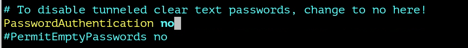

# Лабораторная работа №5. Тема: "Методы противодействия основным компьютерным атакам"
Цель работы
----------

Разбираем типовые сценарии атак на корпоративные сети, а также основные тенденции с обеспечении безопасности IT-инфраструктур. 


Оборудование, ПО:
----------
Виртуальная машина под управлением ОС Astra Linux 1.7  в режиме защищенности "Воронеж".


Ход работы:
----------

Пентестеры (или penetration testers) - специалисты по тестированию на проникновение в корпоративные системы. Их основная задача заключается в проверке уровня безопасности компьютерных систем, сетей или веб-приложений путем имитации реальных кибератак. Пентестеры используют различные методы и инструменты, чтобы обнаружить уязвимости и слабые места в системах, которые могут быть использованы злоумышленниками. Кроме того, они помогают организациям усовершенствовать свои меры защиты и повысить уровень кибербезопасности.

Пентестер - как хакер в "белой" шляпе, свои знания по взлому он применяет не во вред - а в благо! Попробуем в ходе данной лабораторной работы думать, как взломщик и защитник. По возможности, одновременно. 

# Эшелонированная  система безопасности

В современном мире IT-инфраструктура защищается на каждом уровне. Такой подход называется эшелонированная защита (Defence in Depth). Например, если главный сайт компании каким-то образом был скомпрометирован, злоумышленникам должно быть сложно продвинуться внутрь инфраструктуры, т.к. на следующем уровне их должны будут обнаружить средства защиты демилитаризированной зоны.

Подход Defence in Depth включает в себя следующие пункты:

1. установка антивирусов на все машины в инфраструктуре и регулярное обновление антивирусных баз;

2. системы обнаружения и предотвращения атак(IDS и IPS), а также межсетевые экраны с настроенными правилами позволяют контролировать и фильтровать трафик, проходящий по корпоративной сети;

3. для защиты на уровне приложений используются такие решения, как Web Application Firewall, почтовые фильтры, которые отсекают атаки на веб, отсеивают почтовый спам и предотвращают рассылки писем с прикреплёнными вредоносными вложениями;

4. регулярное обновление всех компонентов инфраструктуры;

5. если в инфраструктуре участвует служба каталогов (например Microsoft Active Directory), то требуется грамотная настройка групповых политик, распределение минимальных необходимых прав между пользователями и т.д.;

6. инструктирование сотрудников о работе с конфиденциальными файлами, использовании ресурсов инфраструктуры;

7. также сюда можно включить защиту на физическом уровне, т.е. служба охраны, ограниченный доступ в различные помещения и т.п.

## Хорошо, вот я выстроил 7-и уровненую систему, но ведь все разрушится об 0-day уязвимость? 

Крайние результаты исследований инцидентов показали, что киберпреступники стали реже использовать сложные атаки с использованием 0-day уязвимостей. Вместо этого они предпочитают более простые методы нападения, которые не требуют больших финансовых затрат. Это связано в том числе с тем, что многие компании не имеют эффективной системы обновления программного обеспечения. Обновление крупной инфраструктуры часто требует значительных финансовых и человеческих ресурсов, а значит довольные старые уязвимости могут быть успешно проэксплуатированы. 


# Злоумышленнику надо получить доступ внутрь системы. Какие варианты могут быть? 

1. На ум сразу приходят протоколы удаленного доступа. Среди распространенных инструментов — Telnet, SSH и протоколы для удаленного подключения вроде RDP, VNC, Spice. Любой открытый порт для удаленного доступа - идеальная цель для атаки по подбору паролей (BruteForce).

Такая атака не требует никаких особенных знаний и навыков: в большинстве случаев достаточно ноутбука, программы для подбора учетных данных (например, Hydra или NMAP) и словаря самых популярных паролей, которые можно без труда найти в интернете.

Нередко в качестве пароля от SSH и Telnet можно встретить комбинацию root:root, root:toor, admin:admin, test:test, astra:astra или astra:123435678.

## И что нам делать? 

Для SSH следует отказаться от авторизации по паролю.

Для этого необходимо настроить доступ по ключам с авторизованных удаленных мест (например, с компьютеров ваших администраторов).

Предварительно, **обязательно передайте SSH-ключи** для всех машин, с которых планируется доступ до вашей инфраструктуры. 

В конфигурационном файле - **/etc/ssh/sshd_config**

Установите параметр - **PasswordAuthentication no**



Также, было бы рационально настроить AllowGroups и DenyUsers для подключения.


В этом случае к авторизации будут допущены только члены локальных групп sshusers,astra-admin,infosec.

А также явный запрет на вход пользователю **astra**

А также явно запретить пользователю root входить в систему. **PermitRootLogin no**

## А также, очень правильно было бы настроить фильтрацию по IP-адресу клиентов подключения. 

Например, ваша подсеть, где располагаются компьютеры администраторов - 10.111.0.0/24, а подсеть 10.8.0.0/24 - для офисных пользователей.

Справедливо, что вероятность подключения с подсети 10.8.0.0/24 до ваших инфраструктурных серверов - равна нулю!

На помощь в этом вопросе придет fail2ban.

Установить его можно командой - 

```
sudo apt install fail2ban -y
```

Основной конфигурационный файл настройки - **/etc/fail2ban/jail.conf**

Добавьте в файл секцию sshd и настройка может быть такой - 


ignoreip - директива, которая указывает на те адреса, которые ИСКЛЮЧАЮТСЯ из описанного правила. Это буквально те адреса, которые допущены к подключению на порт 22 и дальнейшей авторизации. 

# Эксплуатация известных уязвимостей

## Атаки на уязвимое ПО

По  статистике от Positive Technology, использование устаревших версий ПО — один из наиболее распространенных недостатков безопасности. Как правило, в рамках пентестов эксплуатация уязвимостей ПО, позволяющих удаленно выполнять код, не производится, так как подобные атаки (например, направленные на переполнение буфера) могут вызвать отказ в обслуживании систем. Для нарушителя это условие не только не будет помехой, но может оказаться его основной целью. Вот лишь некоторые распространенные примеры устаревших версий различных систем и их уязвимостей:

* Windows Server 2003 SP1, SP2 [CVE-2012-0002](http://cve.mitre.org/cgi-bin/cvename.cgi?name=CVE-2012-0002);

* nginx 1.3.11 [CVE-2013-2028](https://cve.mitre.org/cgi-bin/cvename.cgi?name=CVE-2013-2028);

* PHP 5.3.8, 5.3.28, 5.5.1 и множества других версий [CVE-2014-3515](https://cve.mitre.org/cgi-bin/cvename.cgi?name=CVE-2014-3515), [CVE-2011-3379](https://cve.mitre.org/cgi-bin/cvename.cgi?name=CVE-2011-3379), [CVE-2013-6420](https://cve.mitre.org/cgi-bin/cvename.cgi?name=CVE-2013-6420)), ProFTPD FTP Server 1.3.3a ([CVE-2011-4130](https://cve.mitre.org/cgi-bin/cvename.cgi?name=CVE-2011-4130), [CVE-2010-4221](https://cve.mitre.org/cgi-bin/cvename.cgi?name=CVE-2010-4221)), OpenSSH Server 4.3 ([CVE-2006-5051](https://cve.mitre.org/cgi-bin/cvename.cgi?name=CVE-2006-5051), [CVE-2006-5052](https://cve.mitre.org/cgi-bin/cvename.cgi?name=CVE-2006-5052)). До сих пор можно встретить даже Windows XP с известной уязвимостью ([CVE-2008-4250](https://www.cve.mitre.org/cgi-bin/cvename.cgi?name=cve-2008-4250)).


**Рекомендации по защите**

 Для предотвращения подобных атак рекомендуем своевременно обновлять ПО и устанавливать обновления безопасности для ОС. Кроме того, желательно не раскрывать версии применяемых систем. 


# Подбор доменной учетной записи

В большинстве корпоративных сетей настроены парольные политики для учетных записей в домене, но далеко не всегда они эффективны. Зачастую ограничения позволяют задавать словарные комбинации. Например, пароль P@ssw0rd формально обладает достаточной длиной и сложностью, чтобы удовлетворять условиям политики, но он есть в большинстве словарей популярных паролей и наверняка будет проверен нарушителем одним из первых. Словари позволяют подобрать и более сложные комбинации.

Часто администраторы задают и ограничения на количество попыток ввода неверного пароля, с последующей блокировкой учетной записи. Однако нарушитель может запустить подбор одного (или двух) паролей для целого списка логинов — если у него есть информация о них. Получить такие данные несложно: внутреннему нарушителю (сотруднику организации) достаточно сделать запрос к контроллеру домена либо проанализировать адресную книгу почтового клиента; внешний же нарушитель может изучить открытые источники в интернете (публикации компании, презентации, контактные данные с официального сайта) либо использовать недостатки защиты данных, хранящихся на внешних ресурсах организации.


**Рекомендации по защите.**

Минимизировать риск можно при помощи строгой парольной политики для всех пользователей домена, а также ограничив привилегии локальных пользователей на рабочих компьютерах и серверах, входящих в домен. Для привилегированных учетных записей рекомендуем использовать двухфакторную аутентификацию. При этом важно понимать, что двухфакторная аутентификация тоже подвержена атакам


## Заключение

В ходе курса по информационной безопасности автоматизированных систем Astra Linux вы  получили необходимые знания и навыки для защиты системы от злоумышленников.  Были рассмотрены основные принципы безопасности и получены навыки применения инструментов и технологий безопасности. Теперь участники курса могут эффективно обеспечивать безопасность своей системы и защищать ее от угроз. 

Мы надеемся, что вы в результате курса  приобрели ценные знания, которые помогут вам успешно справляться с вызовами в области информационной безопасности.


# Практическая работа

1. Разрешите вход по SSH только пользователям в группе IT;

2. Смените порт XRDP с 3389 на 3400;

3. Выполните настройку fail2ban для SSH, разрешите подключение только с адреса - 10.0.0.0/24;


# Дополнительная информация:
1) Как понимать события аудита в Linux [Ссылка](https://habr.com/ru/companies/pt/articles/789014/)
2) Как обезопасить себя и свои данные [Ссылка] (https://habr.com/ru/articles/550904/)


