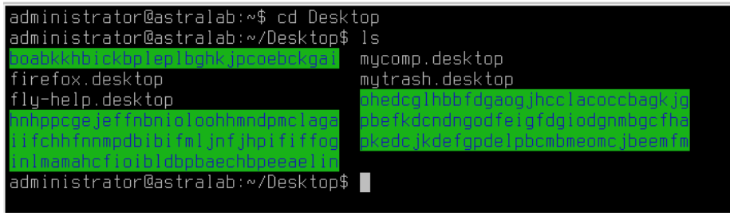
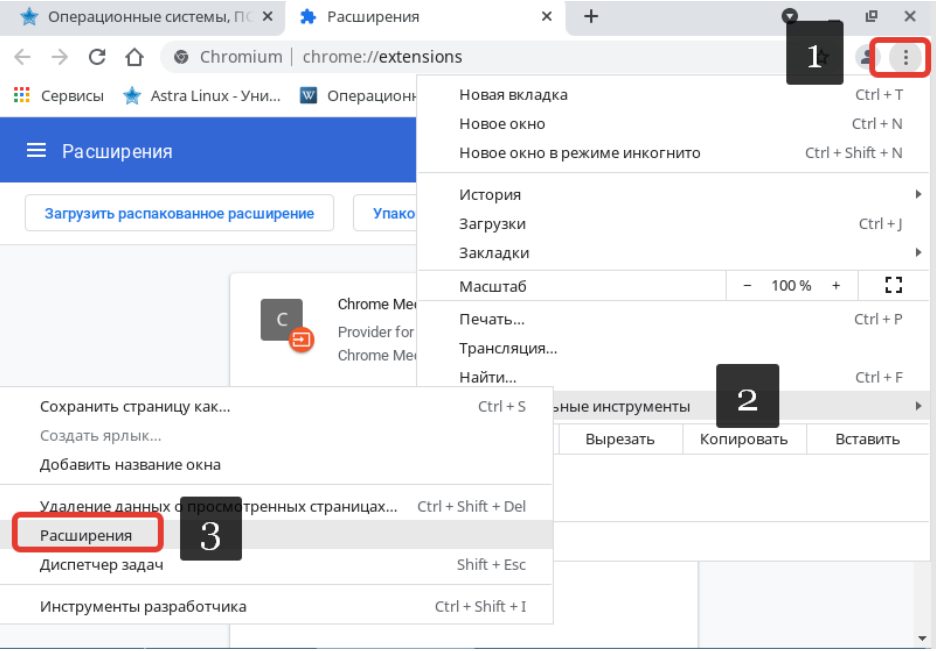

# Лабораторная работа №2. Тема: " “Настройка браузера и его расширений”.

Цель работы
----------
приобрести навыки установки программного обеспечения через репозиторий;

приобрести навыки удаления программного обеспечения через репозиторий;

приобрести навыки установки браузера по-умолчанию;

приобрести навыки установки расширений в браузере.


Оборудование, ПО:
----------

Установленная в ходе выполнения лабораторной работы #1 виртуальная машина;
VirtualBox версии 6.1;
Файлы расширений.

Ход работы:
----------

В рамках выполнения данной работы установим и настроим браузер Chromium.
Всю настройку и установку программного обеспечения можно выполнить двумя
способами:
 * Графически, через менеджер пакетов - Synaptic
 * Командами через командную строчку
 Рассмотрим оба способа

 **Начнем с Synaptic**

---------------

1) Откройте терминал Fly и выполните команду
 ```console
 $ sudo synaptic-pkexec
 ```

---------------------
2) Откроется главное окно инструмента установки и обновления Synaptic


---------------------

3) Воспользуемся поиском и попытаемся найти пакет **chromium**


---------------------

4) Загружается список всех программных продуктов, которые так или иначе
связаны с chromium. Выбираем первый пакет с таким названием. Кликаем ЛКМ
дважды по “чек-боксу” рядом с названием нашего пакета.


---------------------

5)  Соглашаемся на установку нужного набора ПО.


---------------------

6) Выбранные вами пакеты были выделены зеленым цветом, нажимаем
“Применить”


---------------------

7) Подтвердите установку данного ПО.


---------------------

8) Дожидаемся  установки.


---------------------

9) Установка пакетов прошла успешно


---------------------

10) Убедимся в корректности установленного браузера


---------------------

11) Браузер корректно открылся и загрузился.


---------------------

12) Выполним удаление браузера Chromium, для его дальнейшей установки через
командную строчку.

---------------------

13) Через тот же инструмент Synaptic, попробуем удалить chromium.

Правой кнопкой мыши кликаем по названию пакета и далее в контекстном меню выберите “Отметить для полного удаления”.

Повторите процедуру для каждого пакета, который имеет зеленый или красный
идентификатор.


---------------------

14) Применяем удаление пакета.


---------------------

15) Убедитесь, что требуемые пакеты добавлены к удалению.


---------------------

16) Пакеты были успешно удалены.


---------------------

**Рассмотрим вариант для установки ПО через командную строчку.**

1) Вводим команду -
```console
$ sudo apt install chromium
```
---------------------

2) Нажмите Y, чтобы подтвердить установку ПО.


---------------------

3) После выполнения команды, проверьте корректность работы установленного
браузера **chromium**


---------------------

**Браузер был успешно установлен двумя разными способами.**

# Это нужно знать!


---------------

**apt** (advanced packaging tool) — программа для установки, обновления и удаления
программных пакетов в операционных системах Debian и основанных на них (Ubuntu,
Astra Linux и т. п.) Способна автоматически устанавливать и настраивать программы для
UNIX-подобных операционных систем как из предварительно откомпилированных
пакетов, так и из исходных кодов.

---------------------

4) Удалить chromium можно с помощью команды -
```console
$ sudo apt remove chromium
```

---------------------

5)  При условии наличия интернета, все расширения просто бы установились через
Google Store. В нашем случае разберем инструмент оффлайн установки.
Скачать архив с расширениями вы можете по ссылке ниже.


---------------------

6) Скопируйте файлы из папки на рабочий стол вашего виртуального рабочего
места.


---------------------

7) После этого открываем командную строчку и выполняем операцию копирования
файлов с рабочего стола в папку отдельную папку - /opt/plugins
Для начала с помощью командной строчки перейдем на рабочий стол нашего
пользователя administrator:
* Откройте терминал Fly
* Введите команду
```console
$ cd Desktop
```
* Далее введите команду
```console
$ ls
```



---------------------

8) Все выделенные “зеленым” объекты нам нужно скопировать в другую директорию.

# Это нужно знать!


---------------

Забегая чуть вперед, следует сказать, что выделены “зеленым” данные
директории не просто так. Это означает, что эти файлы являются
исполняемыми, то есть, могут играть роль директории для хранения скриптов или
прочих исполняемых файлов.
Также обращаем ваше внимание, что прямо в адресной
строке Astra Linux указывает полный путь до той директории, где сейчас вы
находитесь относительно всей системы.


---------------------

9) Далее введем команду создания директории.
```console
$ mkdir /opt/plugins
```

Команда mkdir (make directory, создание директории)

---------------------

10) Пример команды копирования.
```console
$ cp <укажите_что_копируем> <укажите_куда_копируем>
```

В нашем случае, учитывая что мы копируем целые директории (папки), нам
необходимо добавить ключ -r (recursivе), для того чтобы выполнить рекурсивное
копирование всего дерева каталогов.

```console
$ cp -r <укажите_что_копируем> <укажите_куда_копируем>
```


На скриншоте выше копирование происходит из рабочего стола в папку
/opt/plugins

---------------------

11) Повторите данные команды для установки всех расширений.
После этого необходимо перейти в конфигурационный файл - **/etc/chromium/default**
И в конце этого файла добавьте строчку
```console
$ export CHROMIUM_FLAGS="$CHROMIUM_FLAGS --load-extensions=`ls -dm /opt/plugins/* 2>/dev/null | tr -d '\n'`"
```
Обратите внимание, что в данной строчке используются одинарные кавычки ‘,
двойные кавычки “, а также гравис - ` (в русском языке гравис используется
крайне редко, найти вы его можете там же где буква Ё на русской раскладке)

12)  После копирования документов в эту папку и загрузки в неё расширений,
перейдите в просмотр расширений в Chromium (Настройки → Дополнительные
инструменты → Расширения)



---------------------

13) Убедитесь в том, что расширения были загружены.


---------------------

# Как создать оффлайн установщик расширений для браузера?

Алгоритм работы в такой ситуации может быть следующим:
* На компьютер   с доступом в интернет установите желаемое
расширение в браузер
* Найдите файлы расширений на вашем компьютере (в Linux -
$HOME/.config/chromium/Default/Extensions;)
* Перенесите файлы  уже на целевой машине скопируйте в
аналогичную папку /opt/plugins (или другую, описанную вами в файле
/etc/chromium/default)
* Данная настройка применяется на всех пользователей в системе по-умолчанию

---------------------

# Как настроить Chromium браузером по умолчанию?
**Для настройки программ по-умолчанию MIME-types файлов. Если перейти в свойства
любого документа в системе, то будет видно, что у каждого из них есть свой
MIME-type**

# Это нужно знать!


---------------

**Медиа тип** (так же известный как Multipurpose Internet Mail Extensions или MIME
тип) является стандартом, который описывает природу и формат документа, файла
или набора байтов. Он определён и стандартизирован в спецификации RFC 6838

---------------

Описанием того, какой тип файла, какой программой нужно открыть, занимается файл,
расположенный по пути - **/usr/share/applications/mimeapps.list**

Файл в Astra Linux по-умолчанию преднастроен так, что любые HTML, XML, XHTML файлы
открываются браузером Firefox. Исправить это можно заменив все значения “firefox” на
“chromium”.

Пример файла mimeapps.list


---------------

Перед тем как выполнить замену, стоит также уточнить, что информация о доступных
приложениях принимается из директории /usr/share/applications, где расположены
файлы формата *.desktop.

Это файлы-ярлыки для запуска и обращению к
приложению.

Обращаясь к примеру записи в mimeapps.list. Обратите внимание, что указано
сопоставление типа файла с ярлыком из директории /usr/share/applications. Эти
знания будут полезны вам, если потребуется задача назначать на особый тип файлов
собственное программное обеспечение для открытия.

Для быстрой замены слова firefox на chromium воспользуемся текстовым редактором
sed. Команда по замене выглядит вот так:

```console
$ sudo sed -i ‘s%firefox%chromium%g’ /usr/share/applications/mimeapps.list
```

---------------

Проверить результат настройки просто - создайте файл с расширением *.html

Выполните команду на рабочем столе Astra Linux вашей сессии:
```console
$ touch index.html
```

Обратите внимание, что логотип теперь “Chromium”.
А также, попробуйте открыть документ и убедиться, что бразуер Chromium обработал
этот формат файлов.

**Работы по настройке браузера завершены**

Дополнительная информация:
1) https://inlnk.ru/ELQV8n - подробнее про MIME-типы
2) https://inlnk.ru/n0d7a4 - подробнее про настройку mimeapps.list
