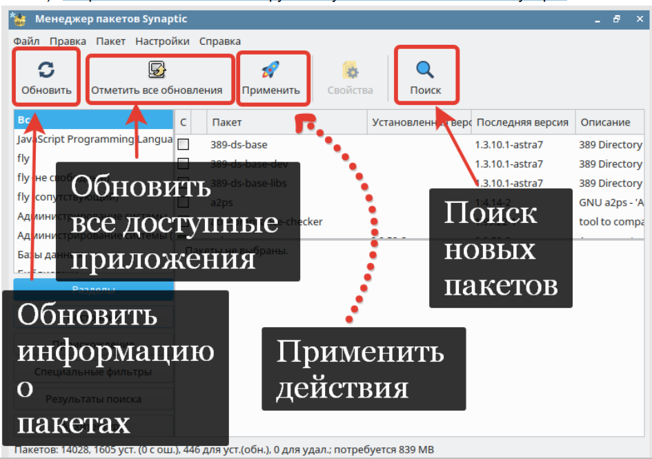
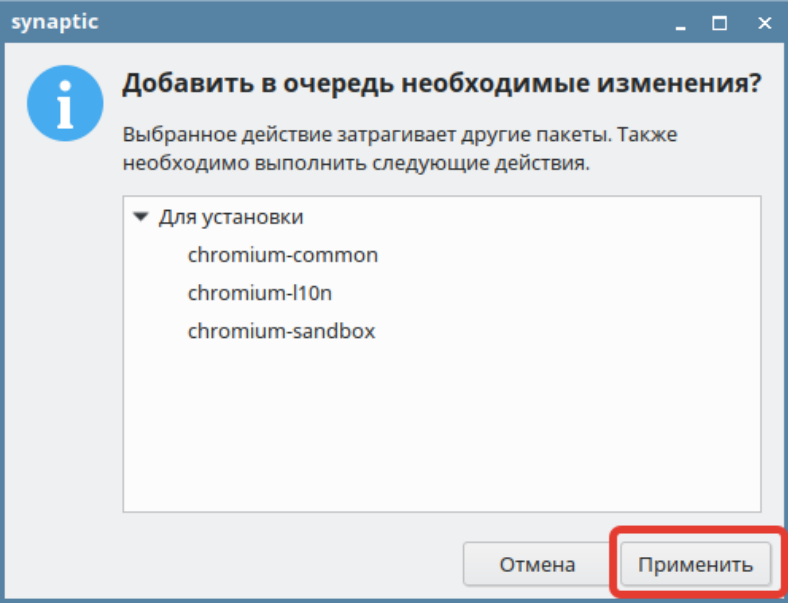
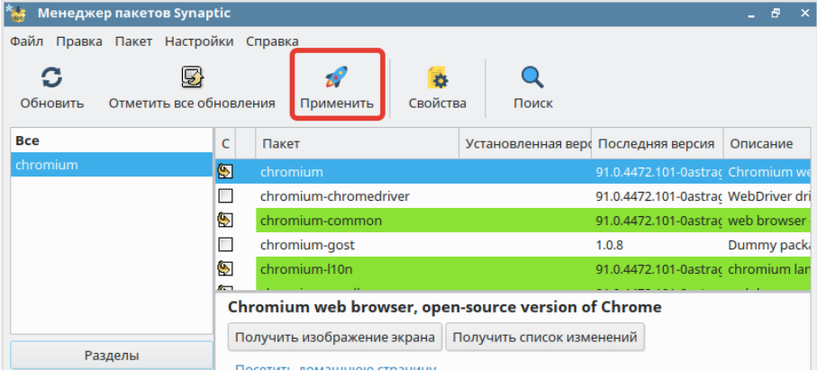
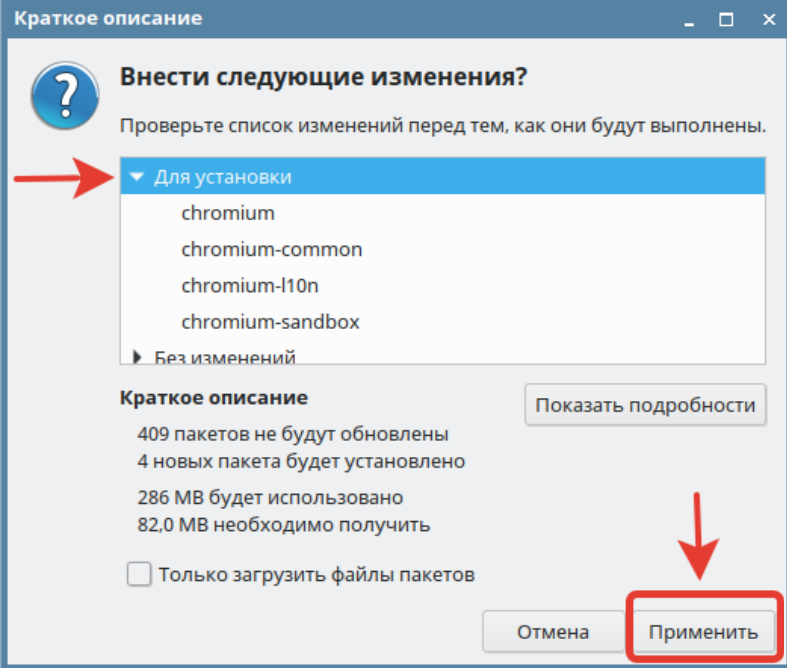
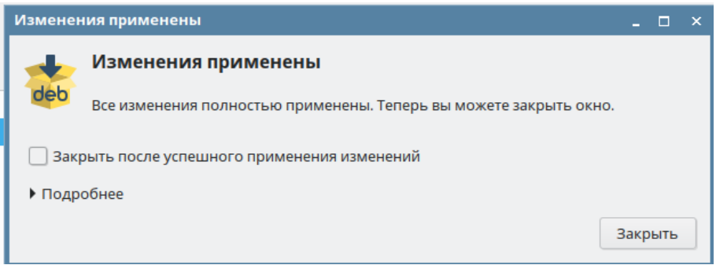
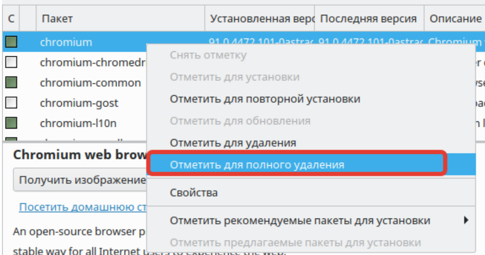
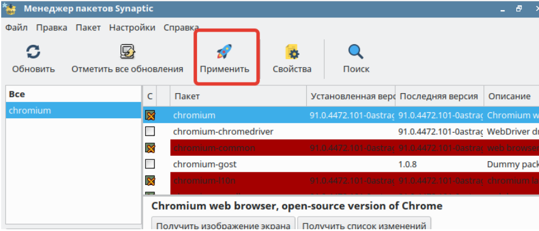
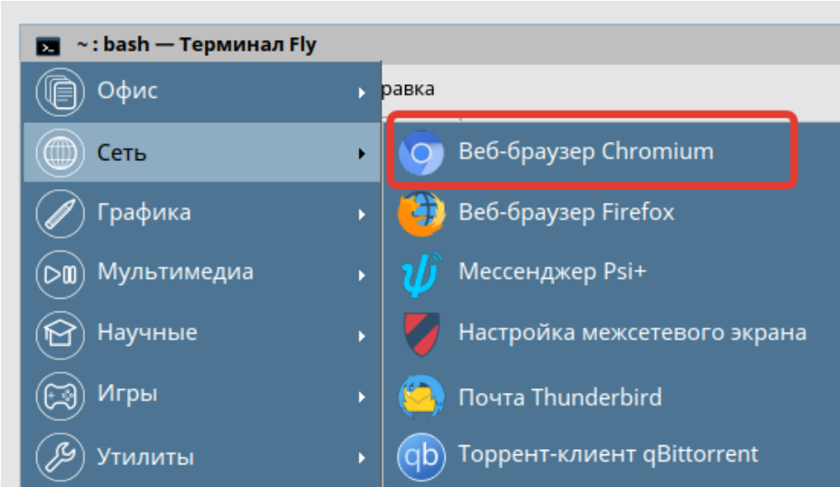

# Лабораторная работа №2. Тема: " “Настройка браузера и его расширений”.

Цель работы
----------
приобрести навыки установки программного обеспечения через репозиторий;

приобрести навыки удаления программного обеспечения через репозиторий;

приобрести навыки установки браузера по-умолчанию;

приобрести навыки установки расширений в браузере.


Оборудование, ПО:
----------

Установленная в ходе выполнения лабораторной работы #1 виртуальная машина;
VirtualBox версии 6.1;
Файлы расширений.

Ход работы:
----------

В рамках выполнения данной работы установим и настроим браузер Chromium.
Всю настройку и установку программного обеспечения можно выполнить двумя
способами:
 * Графически, через менеджер пакетов - Synaptic
 * Командами через командную строчку
 Рассмотрим оба способа

 **Начнем с Synaptic**

---------------

1) Откройте терминал Fly и выполните команду
 ```console
 $ sudo synaptic-pkexec
 ```

---------------------
2) Откроется главное окно инструмента установки и обновления Synaptic



---------------------

3) Воспользуемся поиском и попытаемся найти пакет **chromium**


---------------------

4) Загружается список всех программных продуктов, которые так или иначе
связаны с chromium. Выбираем первый пакет с таким названием. Кликаем ЛКМ
дважды по “чек-боксу” рядом с названием нашего пакета.


---------------------

5)  Соглашаемся на установку нужного набора ПО.



---------------------

6) Выбранные вами пакеты были выделены зеленым цветом, нажимаем
“Применить”



---------------------

7) Подтвердите установку данного ПО.



---------------------

8) Дожидаемся  установки.


---------------------

9) Установка пакетов прошла успешно



---------------------

10) Убедимся в корректности установленного браузера


---------------------

11) Браузер корректно открылся и загрузился.


---------------------

12) Выполним удаление браузера Chromium, для его дальнейшей установки через
командную строчку.

---------------------

13) Через тот же инструмент Synaptic, попробуем удалить chromium.

Правой кнопкой мыши кликаем по названию пакета и далее в контекстном меню выберите “Отметить для полного удаления”.

Повторите процедуру для каждого пакета, который имеет зеленый или красный
идентификатор.



---------------------

14) Применяем удаление пакета.



---------------------

15) Убедитесь, что требуемые пакеты добавлены к удалению.


---------------------

16) Пакеты были успешно удалены.


---------------------

**Рассмотрим вариант для установки ПО через командную строчку.**

1) Вводим команду -
```console
$ sudo apt install chromium
```
---------------------

2) Нажмите Y, чтобы подтвердить установку ПО.


---------------------

3) После выполнения команды, проверьте корректность работы установленного
браузера **chromium**



---------------------

**Браузер был успешно установлен двумя разными способами.**

# Это нужно знать!


---------------

**apt** (advanced packaging tool) — программа для установки, обновления и удаления
программных пакетов в операционных системах Debian и основанных на них (Ubuntu,
Astra Linux и т. п.) Способна автоматически устанавливать и настраивать программы для
UNIX-подобных операционных систем как из предварительно откомпилированных
пакетов, так и из исходных кодов.

---------------------

4) Удалить chromium можно с помощью команды -
```console
$ sudo apt remove chromium
```

---------------------

5)  При условии наличия интернета, все расширения просто бы установились через
Google Store. В нашем случае разберем инструмент оффлайн установки.


---------------------
