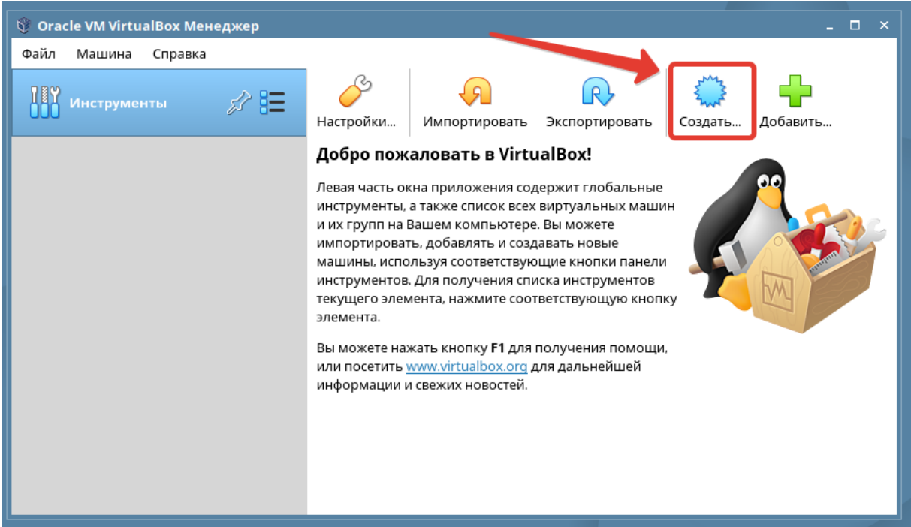

# Лабораторная работа №1. Тема: "Установка Операционной системы в виртуальной среде"
Цель работы
----------
приобрести навыки установки операционной системы;

приобрести навыки настройки операционной системы;

приобрести навыки создания виртуальных машин.

Оборудование, ПО:
----------
ISO-образ Astra Linux Орёл.

Доступ к сетевым репозиториям.

Включенная виртуализация на хостовом компьютере.

Ход работы:
----------
Astra Linux («А́стра Ли́нукс», от лат. astra — «звезда») — операционная система на
базе ядра Linux, созданная для комплексной защиты информации и построения
защищённых автоматизированных систем. Востребована в первую очередь в
российских силовых ведомствах, государственных органах и государственных
корпорациях. Обеспечивает степень защиты обрабатываемой информации до уровня
государственной тайны «особой важности» включительно. Сертифицирована в
системах сертификации средств защиты информации Минобороны, ФСТЭК и ФСБ
России. Включена в Единый реестр российских программ Минкомсвязи России.
Минимальные системные требования для работы Astra Linux Орёл с графическим
окружением:

 | **Оперативная память** | от 4 гб |
| -------------------| ------------ |
| **Объем дискового пространства**           | от 16 гб
| **Процессор**        | Архитектура x86            |

Перейдем к созданию виртуальной машины с операционной системой Astra Linux

#Это нужно знать!

| ** Виртуальная машина (ВМ или VM) — это виртуальный компьютер, который
использует выделенные ресурсы реального компьютера (процессор, диск, адаптер).
Эти ресурсы хранятся локально на вычислительном устройстве и позволяют ВМ
работать автономно. Простыми словами, виртуальная машина позволяет создать на
одном компьютере ещё один компьютер, который будет использовать его ресурсы, но
работать изолированно.
Система, которая содержит и запускает образа виртуальных машин называется
системой виртуализации или гипервизор.
Гипервизоры разделяются на типы: первый и второй.
Гипервизор первого типа - автономный гипервизор, который устанавливается на
хостовую машину в качестве операционной системы и позволяет виртуальным
машинам обращаться к вычислительным ресурсам напрямую, без посредника в виде
основной операционной системы. Примеры: Vmware ESXi, Windows Hyper-V
Гипервизор второго типа- гипервизор, работающий на базе основной операционной
системы. В таком случае, виртуальные машины не имеют прямого доступа к
вычислительным ресурсам компьютера. Обращение к вычислительным ресурсам
проходит через основную ОС. Примеры: Vmware Workstation, Virtual Box.** |
| ------------------------------------------------------------------------------------------------------------------------ |

