# Лабораторная работа №1. Тема: "Базовая конфигурация Astra Linux"
Цель работы
----------

познакомиться с основными инструментами базового администрирования Astra Linux;


Оборудование, ПО:
----------
Виртуальная машина под управлением ОС Astra Linux 1.7  в режиме защищенности "Воронеж".


Ход работы:
----------
В этой теме мы обсудим основные конфигурации, которые требуется к настройке перед работой с Astra Linux. 


# На что данный курс опирается? 

В данном курсе мы будем опираться на задания чемпионатов профессионального мастерства по комптенции "Сетевое и системное администрирование" разных лет. 


# Настройте имена хостов

Зачастую, любое задание с данных чемпионатов начинается именно с этой строки. Неужели это так важно? 

Настройка корректных имен компьютеров в сети имеет несколько преимуществ:

1. Удобство и легкость идентификации: Использование описательных и понятных имен компьютеров помогает администраторам быстро и легко идентифицировать нужное устройство в сети.

2. Упрощение администрирования: Правильно настроенные имена компьютеров облегчают управление сетью, помогают быстрее находить и устранять проблемы и проводить необходимые изменения.

## Перейдем к настройке

Казалось бы, что может быть проще установки имени на компьютер? 

Но вариантов через какие инструменты и команды это можно сделать - довольно много. Рассмотрим некоторые. 

1. Первый - редактирование файла **/etc/hostname**.

В этом файле достаточно внести в одну строчку название вашего компьютера. 

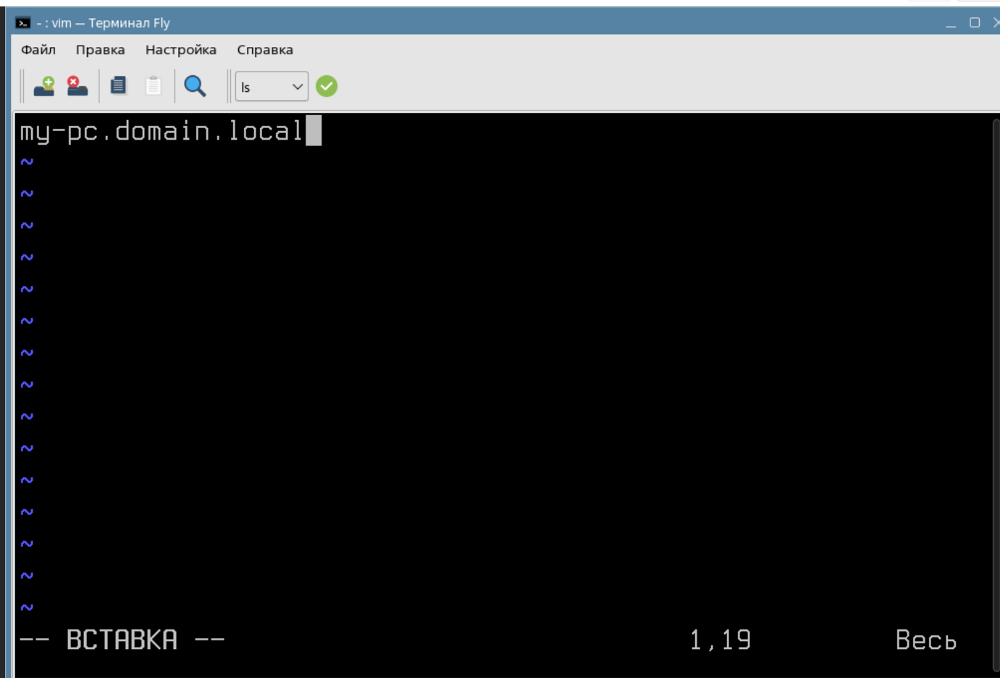

Но зачем мы еще указали доменное имя? Сочетания короткого имени "my-pc" с приставкой его домена называется FQDN.

FQDN (Fully Qualified Domain Name) - это полностью определенное доменное имя. Это адрес, который полностью идентифицирует конкретное устройство в компьютерной сети. FQDN состоит из нескольких частей, разделенных точками. Например, для имени my-pc.domain.local, "my-pc" является коротким именем компьютера, "domain" - доменом второго уровня, а ".local" - доменом верхнего уровня.

Использование FQDN важно для точного идентифицирования устройства в сети. Также, это упрощает администрирование и ввод компьютера в доменную инфраструктуру ALD(OpenLDAP) или Microsoft Active Directory.

2. Второй - использование команды "hostnamectl"

Введите команду - 

```
sudo hostnamectl set-hostname my-pc.domain.local
```

И в этом случае имя вашего компьютера будет изменено. 

3. Третий - использование "nmtui"

NMTUI - это аббревиатура (**N**etwork **M**anager **T**ext **U**ser-**I**nterface). Консольная утилита устанавливается в Astra Linux по умолчанию, если вы используете графический интерфейс или установили пакет NetworkManager. Данная программа используется для настройки IP-адресации на компьютере, но также имееет функционал настройки имени компьютера (хостнейма).

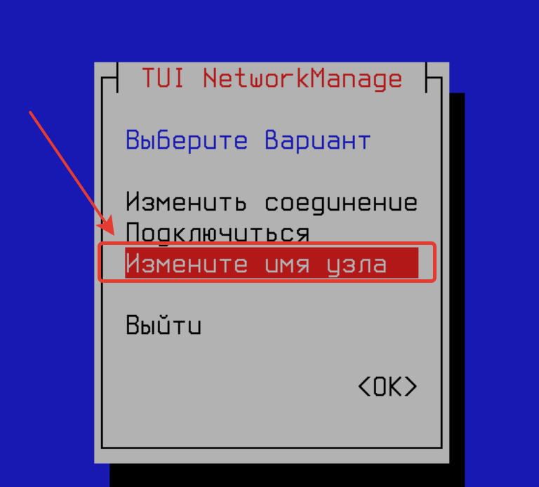

Пожалуй, три варианта хватит, но что лучше выбрать? 

В случае с настройкой имени компьютера - выбирайте что удобнее для вас, в первую очередь. 

## Я настроил имя, и теперь компьютер медленнее выполняет команды!!

Частая особенность, что после настройки имени устройства  команды **sudo** выполняются с существенной задержкой.

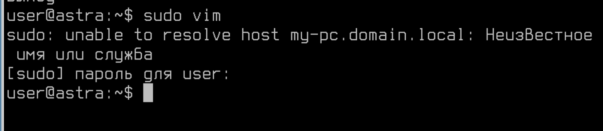

Это связано с тем, что команда **sudo** пытается выполнить поиск нового имени. Для этого необходимо или создать DNS-запись в вашем домене, которая бы указывала на этот компьютер. Или создать её вручную в файле **/etc/hosts**.

Файл /etc/hosts - это текстовый файл в операционной системе Unix/Linux, который используется для соответствия IP-адресов именам хостов. Когда устройство пытается подключиться к другому устройству по имени (например, веб-сайту), оно сначала обращается к файлу /etc/hosts, чтобы узнать соответствующий IP-адрес этому имени.

В файле /etc/hosts обычно указывается разрешение имен хостов на их соответствующие IP-адреса в локальной сети. В нем можно добавлять собственные записи, чтобы перенаправлять запросы на специфические имена хостов на конкретные IP-адреса.

Формат файла следующий: 

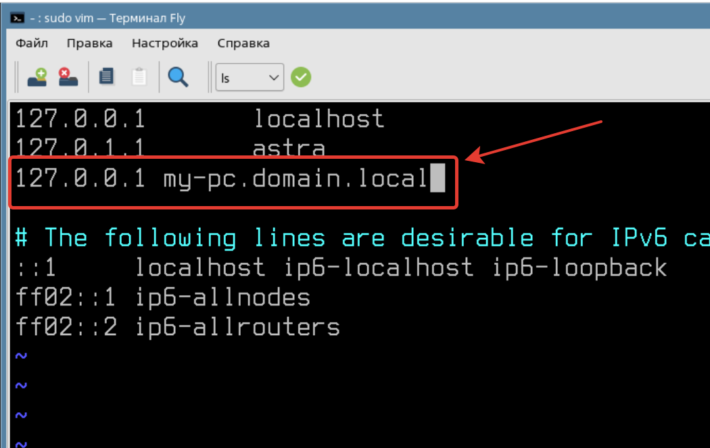

Любую запись можно добавить по формуле: 

```
IP-адрес доменное_имя
```

## А если я настроил DNS-сервер и у меня есть запись в зоне domain.local, но все равно не работает? 

Тогда нужно проверить, какой DNS-сервер у вас указан для работы. 

Файл с такими сведениями находится по пути - **/etc/resolv.conf** (при условии, если используете NMTUI или графический интерфейс Fly для настройки IP-адреса)

Если работает на сервере, где отсутствует графический интерфейс и не установлен пакет NetworkManager, тогда сведения о DNS-сервере будут в файле **/etc/network/interfaces**.

Для проверки корректной работы DNS удобно использовать команду **host**, например:

```
host ya.ru
```

В указанной команде выше обращение происходит к тому серверу, что указан в конфигурационных файлах DNS (**/etc/resolv.conf** и **/etc/network/interfaces**).

Если вам необходимо проверить работоспособность конкретного DNS-сервера, команда может быть:

```
host ya.ru 8.8.8.8
```

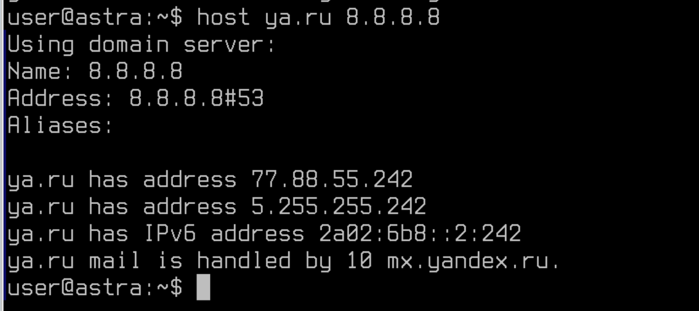

В этом случае запрос будет сформирован на адрес, указанный в команде.

Узнать подробнее о команде **host** можно через встроенную справку.

```
man host
```

Или

```
host --help
```

# Настройте IP-адресацию на ВСЕХ хостах

Имя настроили, теперь необходимо выйти в компьютерную сеть. Для этого нам предстоит настроить IP-адресацию на сетевых интерфейсах нашего компьютера. 

Посмотрим, какие сетевые интерфейсы существуют на нашей виртуальной машине

```
ip --br a
```


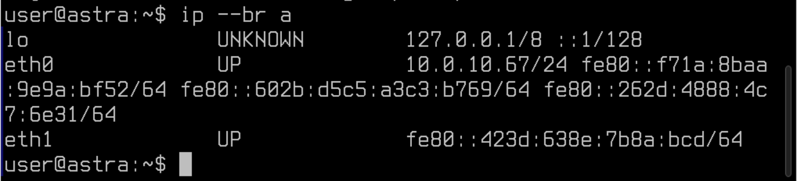

Первый интерфейс "lo", с ним все понятно.

Зачем Loopback нужен
----------
Интерфейс loopback (или lo) является виртуальным интерфейсом, который используется для тестирования сетевого соединения на уровне сетевого протокола. Он позволяет установить локальное соединение между устройством и самим собой, что полезно для диагностики и отладки сетевых проблем.

Этот интерфейс также используется для тестирования и настройки различных сетевых сервисов, например, для проверки работоспособности сетевых приложений, настроенных на слушание определенного IP-адреса.


Второй - eth0. Он служебный и используется в инфраструктуре системы виртуализации, его точно не будем трогать.

Третий - eth1. Интерфейс включен (на что нам указывает строчка **UP**). Но имеет только IPv6-Local адрес. Настроим его. 

## Инструменты настройки сети

Вероятно, если вы опытный пользователь Linux и уже испробовали множество разных дистрибутивов, то знаете - что вариантов как настроить сеть множество.

Можно пользоваться инструментом **nmcli**, **nmtui**, настройкой в файле **/etc/network/interfaces** или утилита **ip**. Все эти инструменты достойны внимание, но стоит помнить одну истину: 

**Ни в коем случае нельзя использовать несколько инструментов настройки сетевых реквизитов одновременно**.

Проверим эту истину на практике. Сконфигурируем наш eth1 интерфейс через файл **/etc/network/interfaces**.

1. Откройте указанный выше файл и внесите следующие значения:

```
auto eth1
iface eth1 inet static
address 172.16.1.1/24
```

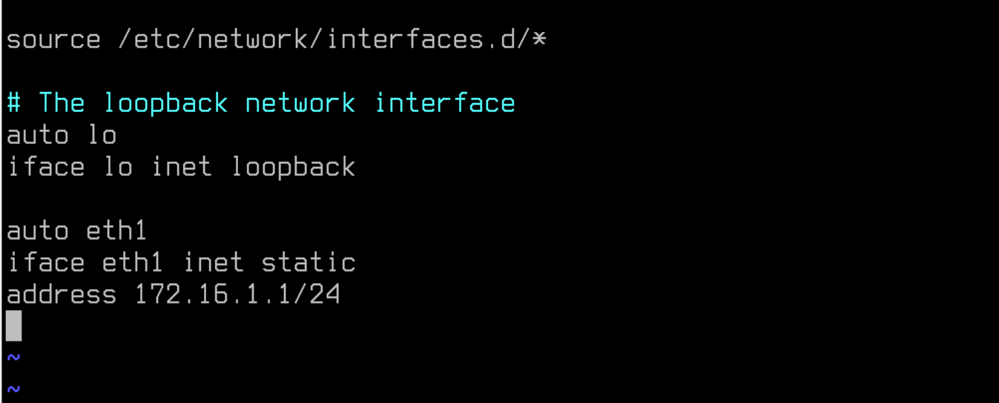

Описание выше является стандартной формой описания интерфейса. Прокомментируем описанные параметры:

1. **auto** - добавить интерфейс в автозагрузку

2. **iface** - указываем обращение к конкретному интерфейсу

3. **inet** - для настройки IPv4-адреса, если бы указали **inet6** - был бы IPv6

4. **static** - для настройки статического адреса.

5. **address** - IPv4 адрес с маской подсети.

После выполненных настроек необходимо перезагрузить службу сети командой - 

```
systemctl restart networking
```

При этом соединение по RDP пропасть не должно!

И через команду **ip a** проверьте адрес

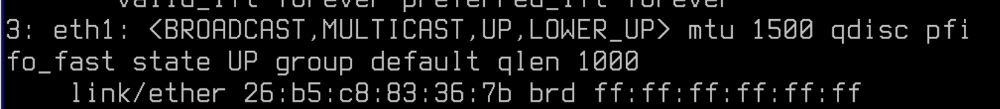

Адреса нет! Хотя вроде бы все настроили правильно, но что случилось? 

Откроем **nmtui**.

Перейдите в "Изменить соединения"

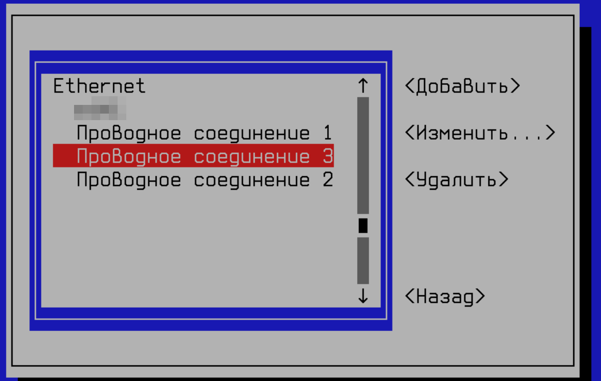

И здесь, обратите внимание, несколько разных соединений - в одном из них прячется наш eth1! В нашем случае - "Проводное соединение 3".

**Обратите внимание, что на вашем рабочем месте номер соединения может отличаться от представленного на скриншотах ниже!**

Это значит, что NetworkManager (nmtui) автоматически подключил данный сетевой интерфейс в управление и выполненные вами настройки в файле **/etc/network/interfaces** не применились. Чтобы исправить это, необходимо удалить данное соединение.

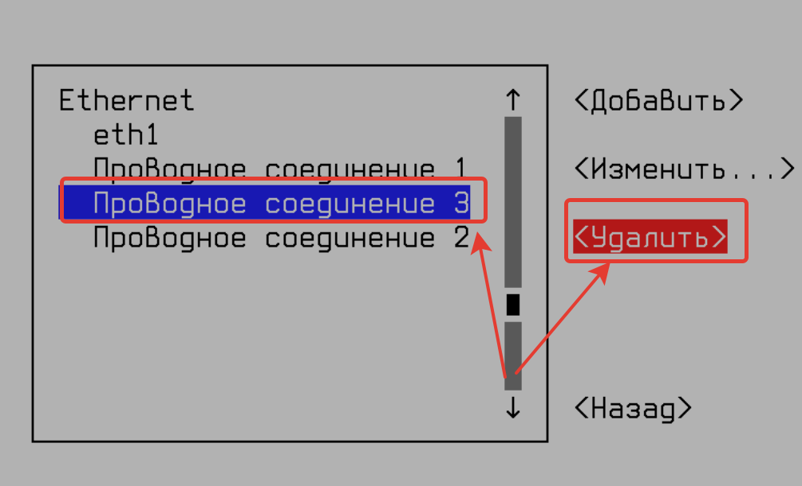

После удаления соединения перезагрузите службу networking, и убедитесь в корректных настройках eth1

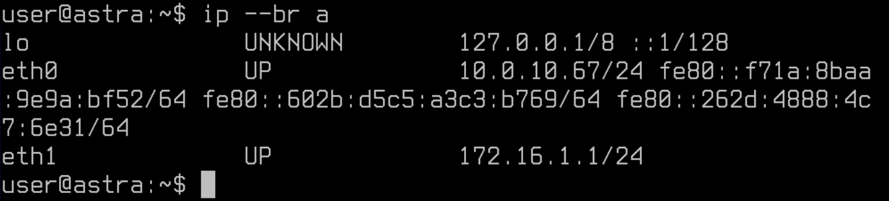

### А если я хочу наоборот, переехать с network/intefaces на nmtui?

Тогда операция выполняется в обратном порядке, удалите все упоминание интерфейсов из **/etc/network/interfaces**, перезапустите службу **networking**, а затем выполните новые настройки в **nmtui**.

### Неужели в /etc/network/interfaces можно только адрес указать? А как же шлюз или DNS?

Конечно можно, просто в нашей инфраструктуре, с учетом подключения по RDP это может стать причиной потери соединения до виртуальной машины.

Примеры как еще можно настроить /etc/network/interfaces ниже:

1. Пример настройки для статического IP адреса:

```
auto eth0
iface eth0 inet static
    address 192.168.1.100
    netmask 255.255.255.0
    gateway 192.168.1.1
```

2. Пример настройки для DHCP:

```
auto eth0
iface eth0 inet dhcp
```

3. Пример настройки для VLAN-tag:

```
auto eth0.100
iface eth0.100 inet static
    address 192.168.1.100
    netmask 255.255.255.0
    vlan-raw-device eth0
```

4. Пример настройки для сетевого моста:

```
auto br0
iface br0 inet static
    address 192.168.1.100
    netmask 255.255.255.0
    gateway 192.168.1.1
    bridge_ports eth0
    bridge_stp off
```

5. Пример настройки с post-up скриптом, который выполняется после поднятия интерфейса:

```
auto eth0
iface eth0 inet static
    address 192.168.1.100
    netmask 255.255.255.0
    gateway 192.168.1.1
    post-up /path/to/script.sh
```

6. Пример настройки с post-down скриптом, который выполняется после выключения интерфейса:

```
auto eth0
iface eth0 inet static
    address 192.168.1.100
    netmask 255.255.255.0
    gateway 192.168.1.1
    post-down /path/to/script.sh
```

# Вернемся в имена. Как выяснить, в каком порядке Linux обрабатывает имена, которые так часто встречаются в ежедневной работе?  

Файл **/etc/nsswitch.conf** (Name Service Switch configuration file) используется в операционных системах Unix и Unix-подобных системах для настройки порядка разрешения имён иследования служб для поиска информации о пользователе (например, пароли, uid, gid) и группах, хостах, сетях и других служб.

Основной задачей файла /etc/nsswitch.conf является указание системе, в какой последовательности она должна обращаться к различным службам для разрещения имен. Например, файл может содержать информацию о том, что сначала необходимо искать информацию в локальной базе данных, а затем в файле /etc/hosts. 

В /etc/nsswitch.conf можно настроить различные службы, такие как passwd (пользовательская информация), group (информация о группе), hosts (информация об IP адресах), networks (информация о сети) и другие.

Пример содержимого файла /etc/nsswitch.conf:

```
passwd:     files ldap
group:      files ldap
shadow:     files ldap
hosts:      files dns
networks:   files
services:   db files
protocols:  db files
rpc:        db files
ethers:     db files
netgroup:   files
```

Этот пример указывает системе обращаться сначала к локальным файлам (files), а затем к службам LDAP для разрешения пользовательской информации, информации о группах и других службах.

А вот строка 

```
hosts:      files dns
```

Указывает на то, что для разрешения доменных имен сначала используется файл **/etc/hosts**, а затем настроенный DNS-сервер на стороне клиента. 
Если планируется сменить данную настройку, то это можно сделать так:

```
hosts:      dns files
```

Просто смените порядок в файле - и настройка выполнена. 

# Параметры ядра. 

Файл **/etc/sysctl.conf** — это конфигурационный файл в операционной системе Linux, который используется для настройки параметров ядра системы через интерфейс sysctl. Этот файл позволяет администратору системы изменять различные параметры ядра, такие как сетевые настройки, безопасность, производительность и другие.

Параметры, определяемые в файле **/etc/sysctl.conf**, применяются при загрузке системы. Многие настройки по умолчанию задаются в файлах, расположенных в директории - **/etc/sysctl.d/**, но администратор может добавлять свои собственные параметры в **/etc/sysctl.conf**.

Примеры параметров, которые можно настроить в **/etc/sysctl.conf**, включают:

- Включение или отключение IP Forwarding
- Увеличение максимального количества открытых файлов
- Настройка TCP/IP стека
- Управление сетевыми буферами
- Настройки безопасности, такие как защита от определенных атак

Пример настройки параметров в файле /etc/sysctl.conf:

```
# Запретить IP Forwarding
net.ipv4.ip_forward = 0

# Увеличение максимального количества открытых файлов
fs.file-max = 100000

# Настройка TCP/IP стека
net.ipv4.tcp_syncookies = 1
net.ipv4.tcp_fin_timeout = 30

# Настройка сетевых буферов
net.core.rmem_max = 16777216
net.core.wmem_max = 16777216
```

Чтобы применить изменения, внесенные в файл /etc/sysctl.conf, после его редактирования можно выполнить команду sysctl -p, которая перечитает файл и применит новые параметры к текущему состоянию ядра системы.

## Примеры "тюнинга" файла /etc/sysctl.conf

1. Игнорировать все запросы ICMP ECHO и TIMESTAMP, отправленные на компьютер через широковещательную/многоадресную рассылку.

```
net.ipv4.icmp_echo_ignore_broadcasts = 1
```

2. Предотвратить распространенную атаку Syn Flood [Подробнее тут](https://ru.wikipedia.org/wiki/SYN-%D1%84%D0%BB%D1%83%D0%B4).

```
net.ipv4.tcp_syncookies = 1
```

3. Применить исправление RFC 1337

```
net.ipv4.tcp_rfc1337= 1
```

4. Увеличить лимит дескрипторов системных файлов = 65535

```
fs.file-max = 65535
```

А это зачем? 
-----
Увеличение лимита на количество дескрипторов файлов (file descriptors) в системе может быть необходимо по нескольким причинам:

1. Управление большим количеством открытых файлов: Приложения и сервисы могут требовать большое количество открытых файлов для обработки больших объемов данных. Увеличение лимита на количество дескрипторов файлов позволяет обеспечить нормальную работу таким приложениям.

2. Повышение производительности: Увеличение лимита на количество дескрипторов файлов может улучшить производительность системы при обработке большого количества одновременных соединений или операций ввода-вывода.

3. Предотвращение ошибок из-за исчерпания ресурсов: При достижении лимита на количество дескрипторов файлов система может начать отклонять запросы на открытие новых файлов, что может привести к ошибкам в работе приложения или сервиса.


# Практическая работа

1) На полученной виртуальной машине установите имя по формуле: "вашеимя-любоечисло-pc". Например, ivan-9-pc;

2) Настройте файл **/etc/nsswitch.conf** так, чтобы сначала информация запрашивалась на DNS сервер, а затем в файл hosts;

3) Примените исправление RFC 1337 на вашей виртуальной машине; 

4) Исправьте ошибку "Unable to resolve" при обращении к sudo после смены имени компьютера самостоятельно. 


# Дополнительная информация:
1) Малоизвестные настройки sysctl [Ссылка](https://www.opennet.ru/docs/RUS/LARTC/x1727.html)
2) Что такое nsswich? [Ссылка](https://itisgood.ru/2022/06/29/chto-takoe-fajl-etc-nsswitch-conf-v-sistemah-linux/)
3) Как так Linux выдумывает имена сетевым интерфейсам? [Ссылка](https://www.freedesktop.org/wiki/Software/systemd/PredictableNetworkInterfaceNames/)


