# Лабораторная работа №2. Тема: "Конфигурация сетевой инфраструктуры"
Цель работы
----------

познакомиться с настройкой DNS-сервера на базе Astra Linux;

познакомиться с настройкой Zabbix-сервера для мониторинга за компьютерами на базе Astra Linux.


Оборудование, ПО:
----------
Виртуальная машина под управлением ОС Astra Linux 1.7  в режиме защищенности "Воронеж"


Ход работы:
----------
В этой теме мы изучим основные принципы и инструменты, необходимые для создания и управления пользовательскими политиками в Astra Linux. Узнаем, как работать с настройками локальных пользователей и политик. 


# Для выполнения задач по работе с пользователями AstraLinux использует следующие модули

**Индентификация и аутентификация**

Для задачи индентификации и аутентификации используется механизм PAM (Pluggable Authentication Modules), который представляет собой набор разделяемых библиотек, с помощью которых реализуется вход пользователей в систему. Параметры входа в систему описывается через файлы в директории /etc/pam.d. Например, система контролирует Kerberos-ключи, если компьютер был введен в домен LDAP. PAM может выполнять процедуру монтирования файловых ресурсов, исходя из прав доступа пользователя, контролировать функциональные возможности пользователя в системе, организовывать систему сквозной аутентификации.


**Дискреционное управление доступом**

Решение задачи дискреционного управления доступом выполняется стандартным механизмом для Linux-систем.
В системе присутствуют индентификаторы субъектов - индентификатор пользователя (UID) и индентификатор группы (GID), имеющих доступ к сущностям (чтение, запись, исполнение). Используя данный способ можно назначать права доступа на различных файлы и директории ФС.

**Мандатное управление доступом и мандатный контроль целостности**

Для понимания механизма мандатного управления доступом определены следующие термины:
 - Субьект доступа - тот, кто выполняет операцию (например, пользователь или процесс)
 - Объект доступа - то, с чем выполняется операция, которую контролирует мандатный контроль целостности (например, файл, архив и т.д.)
 - Контейнер - сущность доступа, который состоит из множества объектов доступа внутри (например, каталог с файлами).

 Каждому объекту и контейнеру могут быть присвоены определенные мандатные атрибуты:
 * Уровень конфиденциальности - определяет степень секретности документа (файла или каталога)  и уровень доступа у пользователя, который обращается к этому файлу. Субъекту с определенным уровнем целостности разрешено читать документы с таким же уровнем целостности или ниже.
 Уровни конфиденциальности бывают (размещено в порядке возрастания конфиденциальности):
   + Не секретно
   + ДСП (для служебного пользования)
   + Секретно
   + Совершенно секретно


Данный механизм называется "Модель безопасности Белла-ЛаПадулы".


Её визуализация представлена на рисунке ниже.

 

Как можно заметить, система несовершенна и имеет ряд недостатков.

С целью сделать её более гибкой, в AstraLinux внедрена система категорий конфиденциальности.

Постараемся привести  пример данной модели, из документа "Руководство по КСЗ. Часть 1 РУСБ.10015-01 97 01-1".

Представим, что у нас есть две категории "Яблоки" и "Апельсины". Мы наделили персонал, с уровнем доступа "Секретно"", полномочиями работать только с документами категории "Яблоки". Обращаться к документами категории "Апельсины", с тем же уровнем доступа "Секретно", данный персонал не сможет, ровно также как и передавать данные о документах "Яблоки" тем пользователям, кто работает с "Апельсинами". При этом, вероятно нам нужно дать универсальный доступ пользователю "Начальник", который может работать с документами любых категорий.

Итак, с помощью параметров  уровень конфиденциальности и категории конфиденциальности AstraLinux обеспечивает защиту от несанкционированной передачи информации:

* Невозможность прочитать информацию, к которой не предоставлен доступ:
  +  "нижним" уровням запрещено читать информацию с "верхних" уровней;
  +   всем запрещено читать информацию, на которую нет разрешенной категории конфиденциальности;
* Невозможность  передать информацию тому, кому не предоставлен доступ:
  +  "верхним" уровням запрещено записывать свою информацию на "нижние" уровни;
  +  всем запрещено передавать информацию тем, у кого нет соответствующей категории конфиденциальности.

**Целостность**

Атрибут Целостности в AstraLinux был применен на основе аналогичной модели 2007 года - MIC (Mandatory Integrity Control) всех ОС семейства Microsoft.

В общем, требование защиты целостности выглядит так:

**Субъект (процесс или пользователь), работающий на некотором уровне целостности, может записывать (изменять) только сущности (объекты) своего, или более низкого уровня (запись "вверх" запрещена).**

Чем-то похоже на уже описанный выше механизм уровней целостности, правда?

Основное отличие лишь в сфере применения. Атрибут целостности в AstraLinux призван защищать не информацию, хранимую на этом компьютере, а вычислительную машину в целом и её внутренние компоненты.

Классификацию уровней целостности легко представить в виде таблицы.

| Порядковый номер | Значение | Битовая маска | Комментарий
| -----------------| -------- | ------------- | -----------
| 0  | 000 | 0000 0000 | Нулевой уровень. "Низкий" |
| 1  | 001 | 0000 0001 | Уровень для сетевых сервисов |
| 2  | 002 | 0000 0010 | Уровень для Виртуализации |
| 3  | 004 | 0000 0100 | Уровень для специального ПО |
| 4  | 008 | 0000 1000 | Уровень графического сервера |
| 5  | 016 | 0001 0000 | По-умолчанию свободен, может быть использован для СУБД |
| 6  | 032 | 0010 0000 | Свободен |
| 7  | 064 | 0100 0000 | Высокий уровень. Уровень администратора |
| 8  | 128 | 1000 0000 | Высокий уровень. Уровень администратора в системах виртуалиации Брест |

**Внедрение ЭЦП**

Инструменты замкнутой программной среды позволяют использовать в AstraLinux  ЭЦП - электронную цифровую подпись.
В ядро Linux, применяемое в данном дистрибутиве, реализован модуль ядра digsig_verif, который поддерживает функционал загрузки, чтения и аутентификации в информационных системах черех ЭЦП (RuToken, Jacarta и т.п.)

**Системные ограничения и блокировки**

В операционной системе есть механизм блокировки действий пользователя. Основные настройки:
- Запрет установки ключа (бита) исполнения;
- блокировка консоли для пользователей;
- блокировка интерпретаторов;
- блокировка макросов;
- блокировка strace и ptrace;

Полный перечень ограничивающих функций безопасности и их описание приведены в РУСБ.10015-01 97 01-1.

# Перейдем к практической работе и знакомству с указанными модулями. 

Начнем с чего-то простого, например, давайте установим максимальное количество допустимых ошибок при вводе пользовательского пароля. 

По-умолчанию, в Astra Linux это значение равно 8. 

Предположим, что изменить планируется на 4 ошибки, как это сделать? 

Перейдем в файл **/etc/pam.d/common-auth**.

Обратите внимание на строку, выделенную на скриншоте - 

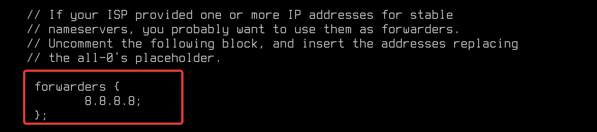

Именно она (среди прочих строчек, каждая из которых отвечает за разные настройки) регулирует количество допустимых ошибок при вводе пароля. 

Поменяем значение на 4

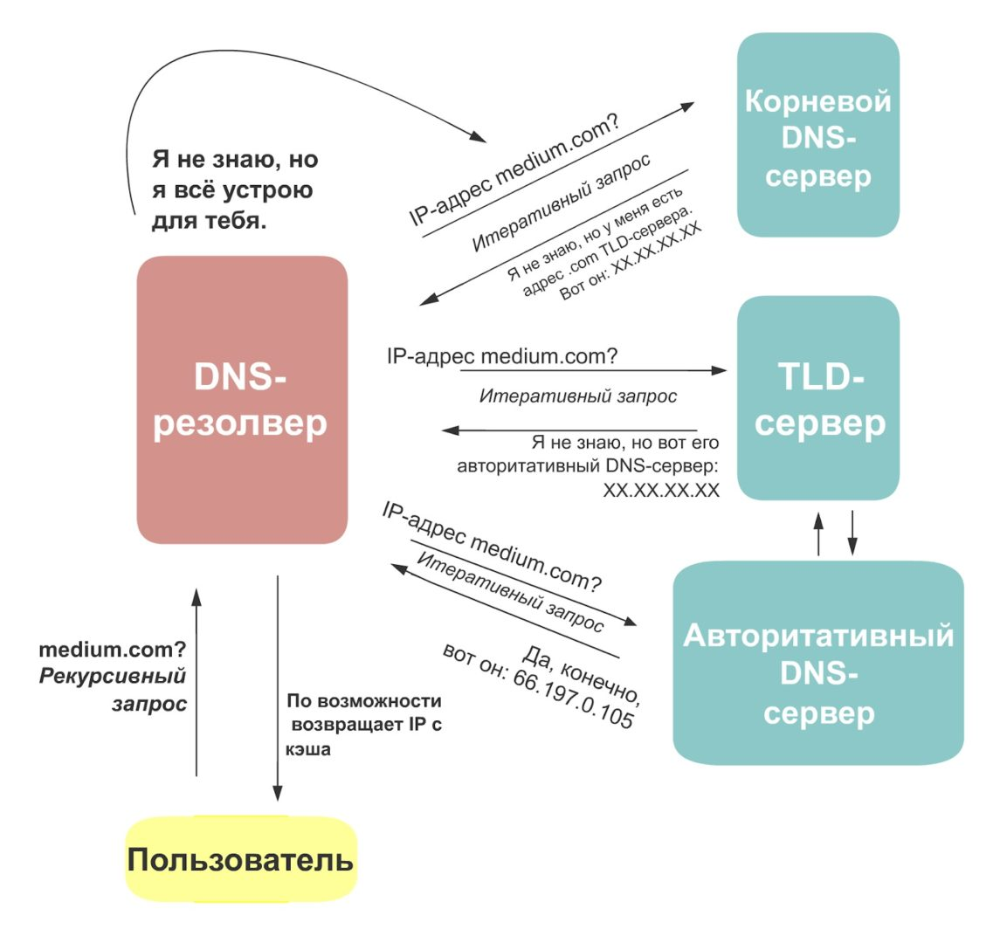

Затем изменения в файле нужно сохранить.

Казалось, идем проверять?

Но нет, если мы попытаемся зайти под пользователем, то ничего не изменится и учетная запись не будет заблокирована даже после десятка ошибок.

А причина в том, что еще необходимо настроить период блокировки, а также окончательной разблокировки пользователя.

В этом же файле добавьте строки, как указано на скриншоте - 

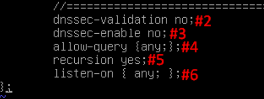

В этом случае, если пользователь в течение 5 секунд совершил 4 ошибки при вводе пароля, его учетная запись будет заблокирована на 10 секунд.

Аналогичные настройки нужно также сделать в файле **/etc/pam.d/common-account**

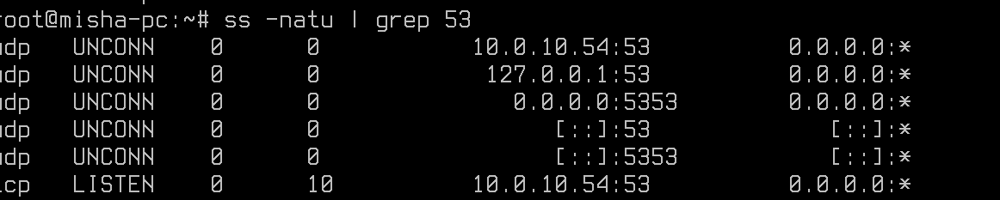

Теперь все работает и настроено, можем проверять! 

Через команду Login, прямо через терминал можно проверить. 

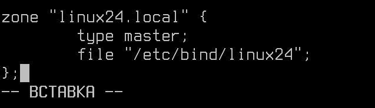

И вот результат! 3 попытки мы совершили ошибку, на 4-ую система уже заблокировала нас. 

Также, проверить выполнение настроек можно через графический интерфейс.

Для этого перейдем в графическую утилиту "Политика безопасности".

Откройте меню "Пуск" --> "Системные" --> "Политика безопасности".

Далее в интерфейсе программы выберите "Политика учетной записи" --> "Блокировка".

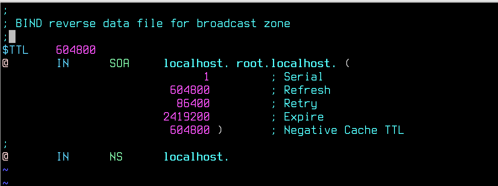

Наблюдаем настроенные параметры. 

Стоит заметить, что при изменении параметров в файле они автоматически менюятся и в графической утилите.

# Рассмотрим следующую политику

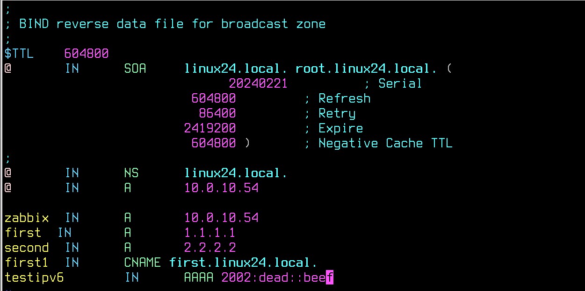

Её описание вполне подробное. Вход локальным пользователям рекомендуется выключать, если компьютер под управлением ОС Astra Linux подключен к домену, в котором настроено делигирование или выдача привелегий локального админстратора для доменных учетных записей. 

В ином случае, если таких настроек нет, мы не рекомендуем вам полностью отключать локальные учетные записи. 


# Хорошо, а что с парольной политикой? 

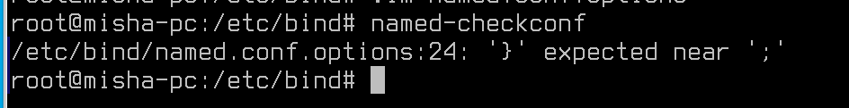

Разберем настройки. 

### Проверка имени пользователя

Этим параметром система проверяет состоит ли пароль пользователя из имени этого пользователя. 

### Проверка GECOS 

GECOS (сокращение от "General Electric Comprehensive Operating Supervisor") в Linux - это строка в файле /etc/passwd, которая содержит информацию о пользователе, такую как его имя, номер кабинета или квартиры, номер телефона и другие дополнительные данные. По умолчанию, эта информация обычно не используется, но может быть полезной для администраторов системы.

Соответственно, данная настройка отвечает, не указано ли в пароле пользователя его телефона, имени, или адреса проживания. 

### Применять для пользователя root

Здесь все просто, по-умолчанию, пароль для пользователя root не привязан к настройками пользователей, а значит может содержать разное количество символов и не соответсовать общим настройкам.

### Настройки сложности пароля

Далее идет настройка паролей - количество заглавных букв, строчных букв, цифр и спец.символов.

Эти параметры, кстати, можно также увидеть (и настроить) в настройках файла - 

**/etc/pam.d/common-password**

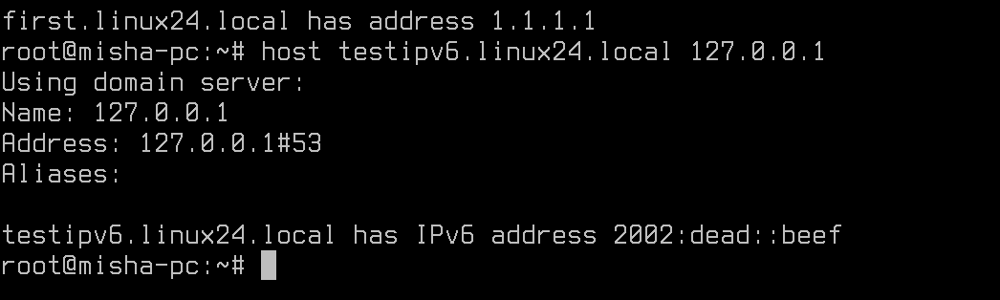

Например, в строке - **password requisite pam cracklib.so** допустимо установить значение minlen=8 и добавить параметры dcredit=-1, ucredit=-1 и lcredit=-1;

После выполнения указанных настроек, мы получим:

1. Минимальная длина пароля — 8 символов;

2. Минимальное количество строчных букв в новом пароле - 1 символ;

3. Минимальное количество заглавных букв в новом пароле - 1 символ;

4. Минимальное количество цифр в новом пароле - 1 символ;


### Настройка срока действия пароля

В Astra Linux есть файл - /etc/login.defs. В нем также допустимо выставлять значения о паролях и времени жизни, но это не рекомендуется. 

Например:

В файле /etc/login.defs для переменной PASS_MAX_DAYS установить значение 90, для переменной LOGIN_RETRIES установить значение 6 и для переменной LOGIN_TIMEOUT установить значение 1800.

Переменная PASS_WARN_AGE 7, указывает на число дней, когда пользователь будет предупрежден о смене пароля. 

При настройке этих значений мы получим - 

1. Максимальное количество дней между сменами пароля и в числовом поле - «90 дней»;

2. Неуспешных попыток и в числовом поле - 6;

3. Период блокировки и в числовом поле - 1800 секунд;

4. Число дней выдачи предупреждения до смены пароля - 7. 

### Шаблоны устаревания

Это возможность шаблонизировать настройки паролей. Обычно, не требуется.

### История

История паролей, необходима для того, чтобы не позволять пользователям указывать пароли повторно.

Настройка данного параметра также возможна через командную строку - 

Запретить повторное использование последних четырех паролей, откорректировав файл /etc/pam.d/common-password. Для этого в указанном файле в строке «...pam_unix.so» добавить параметр remember=4;

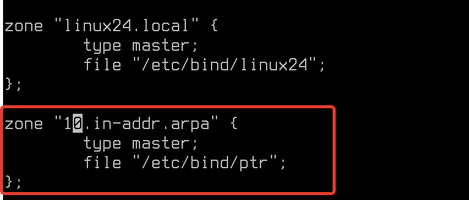


### А как можно посмотреть, какие попытки входа были в систему? 

Команда 

```
faillog
```

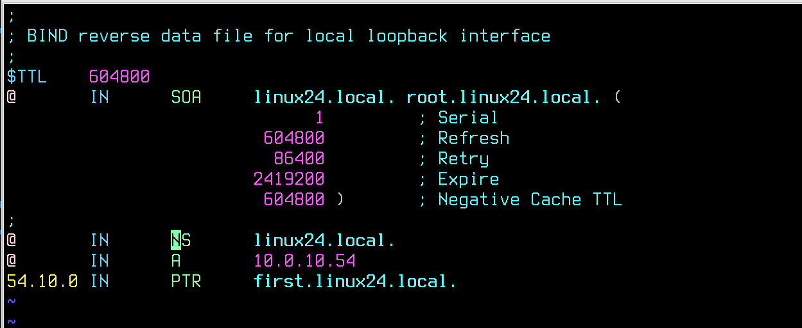

Также, через графический интерфейс это тоже можно увидеть. 

Меню Пуск --> Политика безопасности --> Пользователи

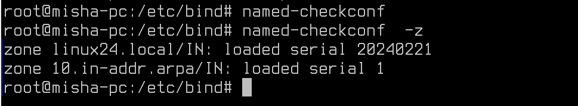

И вот, например, наш тестовый пользователь Lihanov несколько раз ошибся в вводе пароля. 

К слову, обратите внимание, что значение на "3", как мы и настраивали в конфигурационных файлах. 

Если мы сбросим это значение, под этим пользователем вновь можно будет зайти.

# Политика создания пользователей

А что же это за параметр? 

Вероятно, вы несколько раз использовали команду adduser. Данная команда создает пользователя, формирует ему домашнюю папку и добавляет пользователей в группы по-умолчанию. 

Вы можете повлиять на все эти настройки именно в этом параметре "Политики безопасности". 

## А настроить через консоль это можно? 

Конечно!

Файл - **/etc/adduser.conf**


Вот, например, настройки в какие группы добавить пользователя при создании.

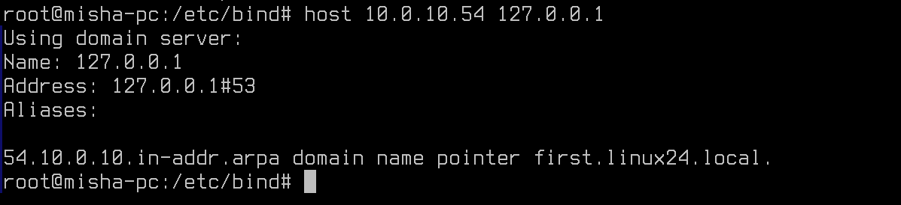


Или откуда копировать содержимое домашних папок (**/etc/skel**)

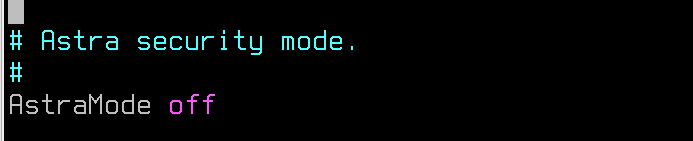

# А что с sudo? 

Sudo (от англ. "superuser do") - это команда в операционной системе UNIX и UNIX-подобных системах, которая позволяет пользователю выполнять команды от имени суперпользователя или другого пользователя с повышенными привилегиями. Она позволяет пользователям выполнять задачи, которые требуют административных привилегий, такие как установка программ, изменение конфигурационных файлов и прочее, при этом обеспечивая безопасность и контроль доступа. Sudo также позволяет администраторам отслеживать, кто и когда выполнил привилегированную команду, что помогает обеспечить безопасность системы.

Настраивать **sudo** очень просто, через команду - visudo. 

Данная команда откроет конфигурационный файл **/etc/sudoers**.

В файле регулируется право на выполнение команды **sudo**.

По умолчанию, в Astra Linux пользователь **root** напрямую заблокирован. Попасть туда можно только через другого привилегированного пользователя. 

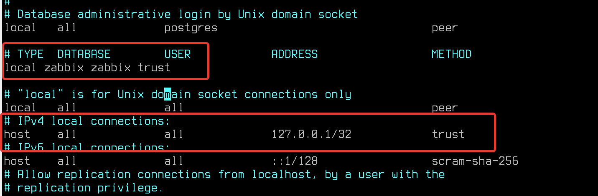

В примере выше, мы наблюдаем, что доступ к **sudo** есть только у пользователей в группах sudo, astra-admin и root. 

В этих настройках NOPASSWD: ALL означает, что пользователям из этой группы (в нашем примере astra-admin) могут вводить любые команды sudo без дополнительного ввода пароля (достаточно первичного)

## А что еще можно настроить? 

Настроек, на самом деле, очень много. Разберем самое интересное и применимое на практике. 

### Настройки по ФСТЭК
 Так, например, ФСТЭК рекомендует выполнять следующие настройки:

```
Defaults! sudoedit env_delete+="SUDO_EDITOR VISUAL EDITOR"
Cmnd_Alias EDITMOTD=sudoedit /etc/motd
Defaults! EDIT_MOTD env_delete+="SUDO_EDITOR VISUAL EDITOR"
user ALL=EDITMOTD
```

Этот комплекс мер, призван устранить уязвимость в Linux, которая дает возможность злоумышленникам удаленно повышать привилегии с помощью альтернативных текстовых редакторов. 

### Рекомендации от Astra Linux

Astra Linux считает, что файл в целом настроен корректно, но предлагает добавить в него строку:

```
Defaults timestamp_timeout=0
```

Данная строка регулирует использование механизма sudo таким образом, чтобы пароль не запоминался для выполнения последующих команд и запрашивался для каждой команды.

### А что бывает полезно на практике? 

Если при работе появится задача выполнять какие-то работы обычному пользователю через **sudo** (хотя, лучше от этой идеи отказаться).

Лучше не выдавать пользователю привилегии группы astra-admin или аналогичных. 

Желательно сделать так - 

```
%user ALL=NOPASSWD: /usr/bin/virt-manager,/usr/sbin/lpadmin
```

В этом случае, пользователь получит доступ к команде sudo без ввода пароля, но только к крайне ограниченному списку команд. 

### А как проверить, что все настроено хорошо и безопасно?

С помощью невероятного инструмента "Этичного хакера" - linpeas.sh

Воспользоваться им можно так - 

```
curl -L https://github.com/carlospolop/PEASS-ng/releases/latest/download/linpeas.sh | sh
```

Данный скрипт автоматически просканирует вашу операционную систему и найдет основные популярные ошибки и "дыры" в настроенной информационной безопасности вашей системы. 

Где-то оставленный в чистом виде пароль или файл с максимальным уровнем доступа (помните, никогда не ставьте права на файл 777), или может быть слишком большие привилегии как раз в sudo.

Стоит добавить, что скрипт также проверяет уязвимые версии ПО, известные CVE и PVE, так что однозначно стоит добавить его в свою библиотеку инструментов. 

Так, например, команда по проверке  **sudo** на его настройку.

```
sudo -l 
```

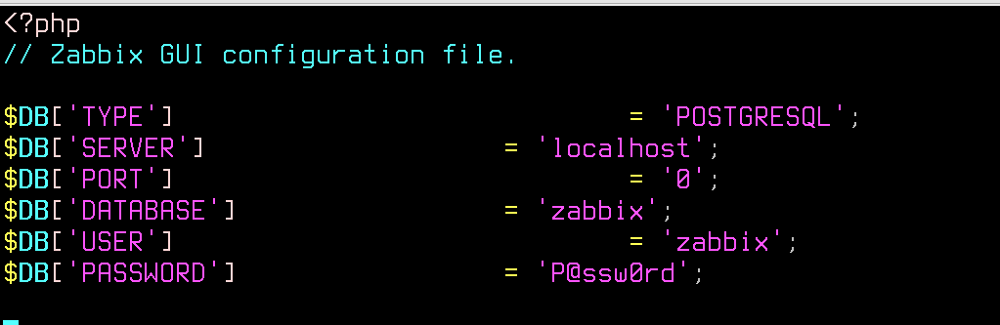

Таким образом мы получаем информацию о доступности sudo для пользователей, который эту команду выполнил. 


# А что с монтированием дисков? 

Выполнение операции "ручного" (с помощью команды mount, имеется ввиду) монтирования произвольных устройств в произвольные каталоги с помощью команды mount по умолчанию запрещено пользователям, и доступно только администраторам с правами суперпользователя. При этом:

* Участие пользователей в специальных группах cdrom и disk  позволяет этим пользователям выполнять операции чтения/записи на устройствах /dev/srX (приводах оптических дисков) и /dev/fdX (приводах гибких дисков), однако право монтировать эти устройства не предоставляет. Специальная группа floppy используется в Astra Linux Special Edition для разрешения полуавтоматического монтирования.

* в стандартной таблице монтирования (файл /etc/fstab) присутствует запись, разрешающая пользователям монтировать компакт-диски в каталог /media/cdrom0:

```
/dev/sr0        /media/cdrom0   udf,iso9660 user,noauto     0       0
```

При выполнении монтирования с помощью команды mount порядок монтирования определяется правилами, хранящимися в файле /etc/fstab.pdac. 

Так, например, для  носителей с ФС iso9660 (оптических дисков или  внешние дисководы) для того, чтобы пользователи могли выполнять их полуавтоматическое монтирование следует в файл /etc/fstab.pdac добавить строку:

```
/dev/sr*                /run/user/*/media/*     iso9660,udf     user,noauto             0       0
```

Если планируется использовать внешний NVME-накопитель, то строка должна быть:

```
/dev/nvme*                /run/user/*/media/*     <параметры>     user,noauto             0       0
```


# Погодите, но ведь все что мы обсуждали тут - неактуально для доменных групп и пользователей? 

Это действительно так, и для того чтобы исправить это необходимо настроить синхронизацию локальной группы с доменной. 

Выполнить это можно, если ввести Astra Linux в домен через инструмент - **astra-ad-sssd-client**

А потом ввести команду - 

```
sudo sss_override group-add domain-group -n local_group -g id_local_group
```

Например, у вас есть доменная группа astra_users, и локальная группа astra-local (с уникальным GID в 1001), команда будет иметь следующий вид: 

```
sudo sss_override group-add astra_users -n astra_local -g 1001
```


# Практическая работа

1) На полученной виртуальной машине создайте пользователя engineer, настройте шаблон пользователей так, чтобы он был автоматически добавлен в группу astra-admin.

2) Установите минимальную длину пароля - 10 символов;

3) Установите минимальное количество строчных букв в новом пароле - 2 символа;

4) Установите минимальное количество заглавных букв в новом пароле - 2 символа;

5) Установите минимальное количество цифр в новом пароле - 5 символов;

6) Пользователям из группы IT (создайте её, если такой нет) разрешите доступ к команде tar с использованием sudo.


# Дополнительная информация:
1) Информация о репозиториях Astra Linux [Ссылка](https://wiki.astralinux.ru/pages/viewpage.action?pageId=158598882)
2) Информация о уровнях конфиденциальности [Ссылка](https://wiki.astralinux.ru/pages/viewpage.action?pageId=27362553)
3) Подборка материалов по Системам защиты информации в Astra Linux [Ссылка](https://telegra.ph/Podborka-materialov-po-SZI-Astra-Linux-11-25)
4) Документация [Ссылка](https://wiki.astralinux.ru/pages/viewpage.action?pageId=137563555)
5) Как переключать режимы защищенности в Astra Linux? [Ссылка](https://wiki.astralinux.ru/pages/viewpage.action?pageId=109020865)
