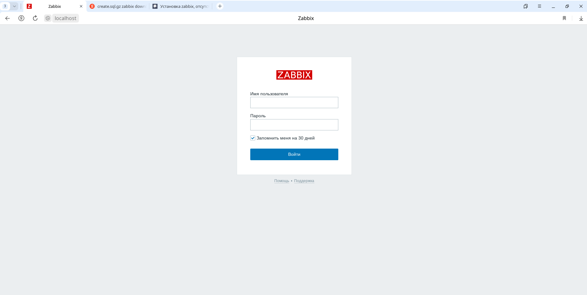
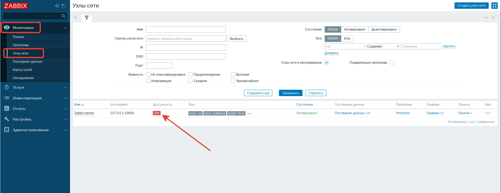
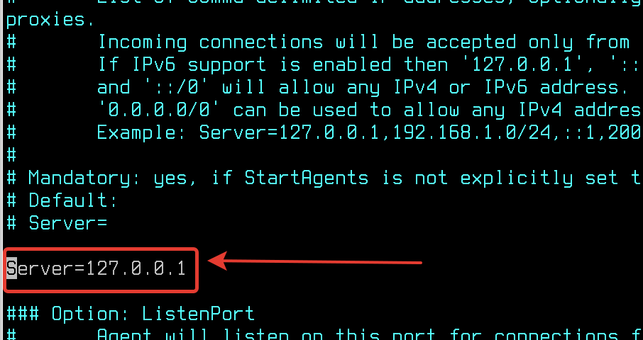
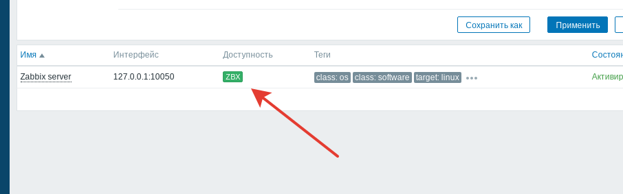
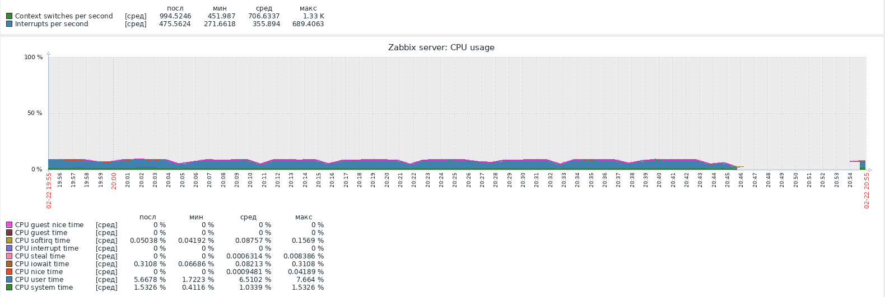
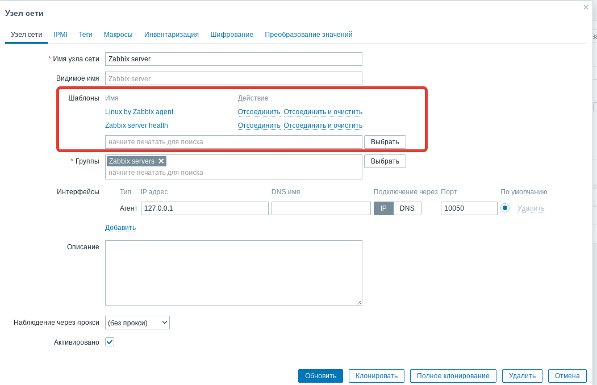

# Лабораторная работа №2. Тема: "Конфигурация сетевой инфраструктуры"
Цель работы
----------

познакомиться с настройкой DNS-сервера на базе Astra Linux;

познакомиться с настройкой Zabbix-сервера для мониторинга за компьютерами на базе Astra Linux.


Оборудование, ПО:
----------
Виртуальная машина под управлением ОС Astra Linux 1.7  в режиме защищенности "Воронеж"


Ход работы:
----------
В ходе лабораторной работы вы узнаете, как настроить DNS-сервер на основе операционной системы Astra Linux. Также вы изучите процесс настройки Zabbix-сервера для мониторинга компьютеров и серверов.


# Установка и настройка DNS

DNS-сервер в Linux можно реализовать на основе двух популярных пакетов: 

1. dnsmasq

2. bind9

Первый инструмент - отличный вариант, если нужно сделать быстро и без специфических настроек. 

Второй инструмент - именно тот, на котором большинство крупнейших DNS-серверов работает и хостится. Очень серьезный инструмент для создания сложной DNS-инфраструктуры с многочисленными настройками. Изучим именно его. 

## Сервер должен обслуживать зону linux24.local

1. Установим сервер bind9:

```
apt install bind9
```

2. После установки bind9 перейдем в первый конфигурационный файл - **/etc/bind/named.conf.options**. Это файл с основными опциями Bind9, для начала работы нам потребуется отредактировать некоторые параметры: 

## Начнем с **forwarders**


* Предположим, что ваш сервер будет обслуживать зону linux24.local - для этого вы создадите отдельные файлы, наполните их смыслом  - и дело сделано! Но что, если в вашей инфраструктуре есть еще DNS-зоны и сервера? И вы наверняка бы хотели, чтобы настройка клиентской стороны сводилась только к указанию одного конкретного сервера, а он уже в свою очередь перенаправлял запросы о других DNS-зонах (например, **.ru**, **.rosatom**,**.com**). 

  Для этого выполняется настройка **forwarders**, где можно перечислить все адреса, которые будут использованы сервером в качестве "Глобального перенаправления". То есть в случае, когда сервер не знает о каком-то имени, он сначала обратится именно к этому адресу. Запрос, когда одному серверу необходимо "спросить" у другого сервера - называется **рекурсивным**. 


### Также, для наглядности рассмотрите картинку ниже. Она подробно иллюстрирует, как DNS выполняет рекурсивный запрос.


## Продолжим настройки.

По умолчанию, DNS сервера включают поддержку DNSSEC. В рамках нашего курса настройка данной технологии не входит. Потребуется внести правки в конфигурационный файл **/etc/bind/named.conf.options**:


Описание измененных параметров в конфигурационном файле
2,3 -- Отключить DNSSec;
4 – Разрешить запросы от всех клиентов. Если параметр не настроить - внешние клиенты не смогут пользоваться данным сервером. Ключевое слово **any** даст доступ всем. В этом параметре допускается конкретно указать адреса или подсети клиентов, например, allow-query {10.0.10.0/24, 10.0.20.0/24;};
5 -- Разрешить рекурсивные запросы. Как раз о чем говорили выше, по умолчанию, рекурсивные запросы запрещены;
6 – Ожидать соединение по порту 53 (стандартный для DNS) на всех интерфейсах.

После выполнения настроек - перезагрузим сервер DNS

```
systemctl restart bind9
```

После перезагрузки службы, убедитесь что порт 53 прослушивается на сервере.

```
ss -natu | grep 53
```


## Переходим к настройке DNS-зон

Откройте конфигурационный файл - **/etc/bind/named.conf.default-zones**


Данными настройками мы объявили зону **linux24.local**, также указали в каком файле содержится зона. 

## Подготовим файл DNS-зоны.

Данный файл имеет специфический формат - писать его вручную будет неудобно и долго. Поэтому, мы скопируем шаблон командой - 

```
cp /etc/bind/db.0 /etc/bind/linux24
```

А затем откроем файл **/etc/bind/linux24**


Встречает нас файл со сложной конструкцией, но не стоит его пугаться - вносить значения в данный файл просто. 

**Serial** - это номер версии файла зоны, который увеличивается каждый раз, когда происходят изменения в DNS-зоне.

**Refresh** - это время через которое клиент выполняет обновление записей из мастер-сервера.

**Retry** - это время через которое клиент попробует повторно обновить записи в случае неудачи при предыдущей попытке.

**Expire** - это время после которого зона считается недействительной, если не получила обновление от мастер-сервера.

**Negative** - это время кеширования неудачных или заблокированных ответов для данной зоны. То есть, например, если "соседний" сервер недоступен или не отвечает, то это значение укажет сколько "наш" сервер будет помнить об этой неисправности.

Затем укажем настройки наших DNS-зон


### Что мы сейчас написали? 

Первым значением мы указываем имя записи. Условный символ "@" указывает на сам сервер - его имя и IP-адрес. Также вместо "@" мы писали название DNS-записи, например, first. К ней автоматически добавится DNS-суффикс "linux24.local", получается что полное DNS-имя будет - first.linux24.local. 

Далее "IN"  - "internet protocol". В 99% случаев вы всегда будете писать именно данную аббревиатуру, определяя назначение DNS-записи.

Далее указывается тип записи. Их [много](https://ru.wikipedia.org/wiki/%D0%A2%D0%B8%D0%BF%D1%8B_%D1%80%D0%B5%D1%81%D1%83%D1%80%D1%81%D0%BD%D1%8B%D1%85_%D0%B7%D0%B0%D0%BF%D0%B8%D1%81%D0%B5%D0%B9_DNS), но мы рассмотрим лишь самые популярные: 

| Тип | Описание | Употребимость | 
| ---| -------- | ------------- | 
| А (Address)  | адресная запись, соответствие между именем и IP-адресом; только латиница, цифры и дефис | одна из самых часто используемых записей |
| AAAA  | адрес в формате IPv6	 | эквивалент А для IPv6; только латиница и дефис	 | 
| CNAME (Canonical Name)  | каноническое (альтернативное) имя для псевдонима домена (одноуровневая переадресация); для написания национальными символами	 | широко используется (но имеет ограничения по применению) | 
| MX | адрес почтового шлюза для домена: состоит из двух частей — приоритета (чем число больше, тем ниже приоритет), и адреса узла	 | критически важна для SMTP-протокола, основа маршрутизации почты в Интернете |
| NS | адрес узла, отвечающего за доменную зону: критически важна для функционирования самой системы доменных имён	 | Необходимая запись |
| PTR	| соответствие адреса — имени: обратное соответствие для A и AAAA	 | широко используется для IPv4-адресов в домене in-addr.arpa, для IPv6 — в ip6.arpa | 
| SOA (Start of authority	)  | указание на авторитетность информации, используется для указания на новую зону	 | Необходимая запись |
| TXT(Text string	)  | запись произвольных двоичных данных, до 255 байт в размере	 | Редко | 

## Проверим, что DNS работает? 

Для начала, стоит выполнить проверки синтаксиса. Наверняка, вы обратили внимание на обилие пробелов, знаков препинания и фигурных скобок в конфигурационных файлах bind9.

Для проверки файлов **named.conf.** используйте команду:

```
named-checkconf
```

Если в ответ пустой вывод - синтаксических ошибок нет.

Специально сделаем ошибку в файле **/etc/bind/named.conf.options**


И система нас уведомит о ошибках. Удобно проверять перед внедрением и запуском в работу.

Проверить корректность файлы зон допустимо командой:

```
named-checkconf -z
```

После проверки конфигурационных файлов, в случае, если ошибок нет - перезагрузите сервис bind9.

```
systemctl restart bind9
```

Ошибок нет? 

Отлично, тогда можем проверять!

```
host first.linux24.local 127.0.0.1
```

А также - 

```
host testipv6.linux24.local
```


### Так, с прямой зоной разобрались, а что там про обратную? 

**Вспомним теорию**

Обратная DNS-зона - это область в доменной системе имен (DNS), которая используется для преобразования IP-адресов в доменные имена. Например, если у вас есть IP-адрес компьютера и вы хотите узнать его доменное имя, вы можете использовать обратную DNS-зону.

Прямая DNS-зона, наоборот, используется для преобразования доменных имен в IP-адреса. Например, если у вас есть доменное имя и вы хотите узнать его IP-адрес, вы можете использовать прямую DNS-зону.

Для обратной зоны используется особый системный поддомен - in-addr.arpa.

Его применение тоже необычно - для каждой подсети создается отдельная обратная зона.

Так, например, если у вас есть подсеть - 192.168.10.0/24. Вы можете создать под неё следующие поддомены:

1. 192.in-addr.arpa

2. 168.192.in-addr.arpa

3. 10.168.192.in-addr.arpa

Как можно заметить, список выше сформирован по принципу от "самой большой" до "самой малой" зоны. Получается, что IP-адрес - 192.168.20.10 попадет в зону п.1 и п.2, но для п.3 уже будет недопустим.

Помните, во время работы с прямой зоной мы обсуждали тему DNS-суффиксов. Тогда к записям в файле зоны автоматически подставляется DNS-суффикс. В случае обратной зоны это правило также актуально.

Предположим, у вас адрес 192.168.10.10 указывающий на DNS-имя first.linux24.local.

Тогда, если у вас зона настроена п.1, тогда запись имеет вид:

```
10.10.168 IN PTR first.linux24.local
```

Запись записывается в зеркально. 

Если зона настроена, как в п.2:

```
10.10 IN PTR first.linux24.local
```

Если зона настроена, как в п.3:

```
10 IN PTR first.linux24.local
```

### Фух, нелегко! Попробуем настроить? 

Перейдем в файл **/etc/bind/named.conf.default-zones**. Опишем конструкцию нашей обратной DNS-зоны.


Скопируем шаблон:

```
cp /etc/bind/db.127 /etc/bind/ptr
```

А затем приведем файл обратной зоны к следующему виду:


После настройки, проверим файлы на ошибки:

```
named-checkconf
```

И

```
named-checkonf -z
```


Перезапустите службу bind9

```
systemctl restart bind9
```

А затем проверим работу обратной зоны:


# Настройка Zabbix

Zabbix - это популярная и мощная система мониторинга с открытым исходным кодом, которая позволяет отслеживать состояние различных компонентов IT-инфраструктуры, таких как серверы, сети, базы данных и приложения. Она предоставляет возможность мониторить производительность, доступность и надежность различных устройств и служб, а также предупреждать об их возможных проблемах и отказах. Zabbix также поддерживает различные методы уведомления, такие как электронная почта, SMS и мессенджеры, чтобы оперативно информировать администраторов о проблемах.

Zabbix, по умолчанию, используется ALD Pro, так что продукт популярный и получил применение в Astra Linux.

Начнем работу с Zabbix с установки ПО:

```
sudo apt install zabbix-server-pgsql zabbix-frontend-php php-pgsql
```

После установки ПО, первым делом нам необходимо выключить AstraMode

Откроем файл **/etc/apache2/apache2.conf**


Zabbix использует локальную (или удаленную, смотря что требуется) базу данных для хранения информации о хостах. В нашем случае, мы создадим пользователя zabbix с доступом к базе данных zabbix. Пароль пользователю назначьте самостоятельно (в лабораторных целях допускается использования пароля - P@ssw0rd) 

Введите команду для создания пользователя:

```
sudo -u postgres createuser --pwprompt zabbix
```

Затем создайте базу данных. Владельцем БД укажем выше созданного пользователя zabbix

```
sudo -u postgres createdb -O zabbix -E unicode -T template0 zabbix
```

База данных создана, но не заполнена ни одной строкой и колонкой. Мы заполним её из шаблона, который предоставляю разработчики Zabbix, но перед этим - разрешим безпарольный локальный доступ до БД. 

Для этого откройте файл **/etc/postgresql/X/main/pg_hba.conf**, где X - это номер установленной версии PostgreSQL.

Необходимо привести файл к состоянию, как на скриншоте - 


Перезагрузите службу postgresql после внесённых правок:

```
systemctl restart postgresql
```

## После подготовки базы данных и основных конфигурационных параметров - импортируем таблицы.

В каталогах **/usr/share/doc** или **/usr/share** часто можно встретить одноименные с установленными пакетами директории. В этих директориях часто можно встретить шаблоны конфигураций, подсказки от разработчиков и прочую справочную информацию.

Zabbix - не исключение. В каталоге **/usr/share/zabbix-server-pgsql** можно встретить шаблоны schema, images, data. 

Загрузить их можно с помощью команды:

```
zcat /usr/share/zabbix-server-pgsql/{schema,images,data}.sql.gz | psql -h localhost zabbix zabbix
```

А затем подключить модуль zabbix-frontend-php для Apache2:

```
sudo a2enconf zabbix-frontend-php
sudo systemctl reload apache2
```

Далее необходимо скопировать PHP-конфигурационный файл Zabbix

```
sudo cp /usr/share/zabbix/conf/zabbix.conf.php.example /etc/zabbix/zabbix.conf.php
```

В скопированном файле **/etc/zabbix/zabbix.conf.php** внесите информацию о используемой базе данных, её адресе, названии базы данных, а также сведения о пользователе с доступом к БД.


После выполнения всех настроек перезагрузим Apache2

```
systemctl reload apache2
```

### Ура, Zabbix готов, откроем браузер!

В браузере перейдите на адрес - localhost/zabbix. Логин и пароль,по умолчанию, Admin (с заглавной буквы) и пароль - zabbix.



Перейдем в "Мониторинг" --> "Узлы сети" 



Единственный наш хост - Zabbix Server и недоступен! Исправить это легко - необходимо настроить Zabbix-агент. 

**Если у вас система на английском и везде уведомления о сломанных кодировках, перейдите в пункт меню: "Администрирование" --> "Общие" --> "Язык по умолчанию" --> "Русский (ru_RU)"**

Zabbix-агент можно установить командой: 

```
apt install zabbix-agent
```

А настроить в файле **/etc/zabbix/zabbix_agentd.conf**

Если не требуется использовать авторизацию агентов, то подключение происходит редактированием одной строки - Server. Укажите адрес вашего Zabbix (или 127.0.0.1, если планируете подключать сервер к самому себе)



Спустя время красная строка ZBX сменится зеленой - значит теперь хост мониторится нашим Zabbix



Теперь мы можем контроллировать нагрузку нашего сервера, получать оперативные уведомления о ошибках и наблюдать за его ежедневной работой.



# Заключение

В ходе проведения лабораторной работы были изучены DNS-сервер bind9 и система мониторинга Zabbix. Мы рассмотрели основные принципы работы и настройки DNS-сервера, а также способы мониторинга его работы с использованием Zabbix.

# Практическая работа

1) Создайте DNS записи в соответствии с таблицей:

| Имя | Тип записи | Адрес |
| --- | ---------- | ----- |
| br-rtr.linux24.local | A, PTR | 192.168.2.1 |
| cr-rtr.linux24.local  | A,PTR | 192.168.3.1 |
| cr-cli.linux24.local  | A | 192.168.3.100 |
| cr-srv.linux24.local  | A,PTR | 192.168.3.10 |
| web.linux24.local  | CNAME | br-srv2.linux24.local |
| webfiles.linux24.local  | CNAME | br-srv2.linux24.local |
| mail.linux24.local  | MX | br-srv2.linux24.local |

2) Подключите для Zabbix Server мониторинг блочных устройств через настройку шаблона.




# Дополнительная информация:
1) Установка системы мониторинга Zabbix на Astra Linux SE [Ссылка](https://wiki.astralinux.ru/pages/viewpage.action?pageId=38699775)
2) BIND9  в качестве DNS-сервера в частных сетях [Ссылка](https://www.digitalocean.com/community/tutorials/how-to-configure-bind-as-a-private-network-dns-server-on-ubuntu-18-04-ru)
3) Zabbix-шаблоны [Ссылка](https://www.zabbix.com/documentation/current/ru/manual/config/templates)
4) Руководство по Zabbix [Ссылка](https://www.zabbix.com/documentation/current/ru/manual)

