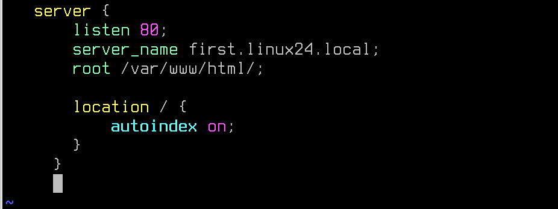
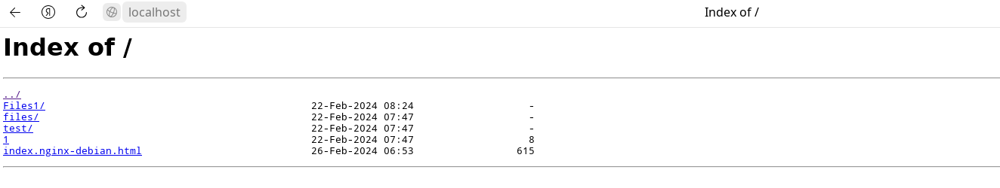
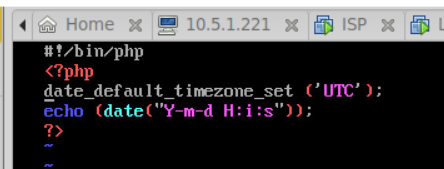

# Лабораторная работа №3. Тема: "Конфигурация веб-служб"
Цель работы
----------

познакомиться с настройкой веб-серверов на базе apache2 и nginx.


Оборудование, ПО:
----------
Виртуальная машина под управлением ОС Astra Linux 1.7  в режиме защищенности "Воронеж"


Ход работы:
----------
Целью данной лабораторной работы является ознакомление с настройкой веб-серверов на основе Apache2 и Nginx. В ходе работы мы узнаем, как устанавливать и настраивать эти два популярных веб-сервера на базе ОС Astra Linux 


# Общий обзор

[Источник](https://habr.com/ru/articles/267721/)

Прежде чем погрузиться в различия между Apache и Nginx давайте бегло взглянем на предысторию каждого из этих проектов.

## Apache

Apache HTTP Server был разработан Робертом Маккулом в 1995 году, а с 1999 года разрабатывается под управлением Apache Software Foundation — фонда развития программного обеспечения Apache. Так как HTTP сервер это первый и самый популярный проект фонда его обычно называют просто Apache.

Веб-север Apache был самым популярным веб-сервером в интернете с 1996 года. Благодаря его популярности у Apache сильная документация и интеграция со сторонним софтом.

Администраторы часто выбирают Apache из-за его гибкости, мощности и широкой распространенности. Он может быть расширен с помощью системы динамически загружаемых модулей и исполнять программы на большом количестве интерпретируемых языков программирования без использования внешнего программного обеспечения.

## Nginx

В 2002 году Игорь Сысоев начал работу над Nginx для того чтобы решить проблему C10K — требование к ПО работать с 10 тысячами одновременных соединений. Первый публичный релиз был выпущен в 2004 году, поставленная цель была достигнута благодаря асинхронной event-driven архитектуре.

Nginx начал набирать популярность с момента релиза благодаря своей легковесности (light-weight resource utilization) и возможности легко масштабироваться на минимальном железе. Nginx превосходен при отдаче статического контента и спроектирован так, чтобы передавать динамические запросы другому ПО предназначенному для их обработки.

Администраторы часто выбирают Nginx из-за его эффективного потребления ресурсов и отзывчивости под нагрузкой, а также из-за возможности использовать его и как веб-сервер, и как прокси.

# А что есть в Astra Linux, и зачем это сетевому администратору? 

В Astra Linux есть как nginx, так и Apache2. Для работы можно выбрать любой инструмент. 

А умение работать с веб-сервером, поможет вам при внедрении различных веб-приложений, например, Zabbix из темы прошлой лабораторной работы или множество других прикладных приложений, которые могут быть полезны - NextCloud, GrayLog и другие. 

# Приступим к Apache2

1. Установим веб-сервер Apache2:

```
apt install apache2
```

2. После установки Apache2 перейдем в первый конфигурационный файл - **/etc/apache2/apache2.conf**. Это файл с основными опциями Apache2, для начала работы нам потребуется отредактировать единственный, но критический параметр:


Это AstraMode и его нужно выключить.

3. После отключения AstraMode, перезагрузить веб-сервер:

```
systemctl restart apache2
```


4. Откроем файл **/etc/apache2/site-enabled/000-default.conf**. Удалим его содержимое и заменим своми: 


## Что мы наделали? 

Сделали VirtualHost (виртуальный хостинг нашего сервера) на стандартном для протокола HTTP порту 80. 

DocumentRoot - информация для администраторов, ровно как и ServerName. Можно не указывать, но в большинстве примеров и форумов такие строчки требуются. 

Directory - уже не просто так. Явно указали директорию где будут опубликованы файлы нашего веб-сервера. 

### Немного отойдем от темы

Стоит сказать, что между веб-сервером и файловым проводником довольно много общего.

1. Оба веб-сервер и файловый проводник предоставляют доступ к файлам и ресурсам.

2. Как и файловый проводник, веб-сервер позволяет пользователям просматривать и управлять файлами и папками.

3. И веб-сервер, и файловый проводник имеют пользовательский интерфейс, позволяющий пользователям взаимодействовать с файлами и данными.

4. Подобно тому, как файловый проводник показывает иерархическую структуру файлов и папок на компьютере, веб-сервер отображает иерархию веб-страниц и других ресурсов.

5. Оба инструмента позволяют пользователям выполнять различные действия с файлами, такие как загрузка, удаление, обновление и просмотр (в случае веб-сервера, конечно, если исполняемый код веб-приложения это способен)

## А что там под Directory еще написано?

1. Options Indexes - это директива конфигурации веб-сервера Apache, которая позволяет отображать список файлов и папок, если в запрашиваемой директории отсутствует индексный файл (например, index.html). Если эта опция включена, то пользователь увидит список файлов и папок, находящихся в запрашиваемой директории, что может быть полезно при просмотре содержимого папки через браузер.

2. MultiViews - эта директива конфигурации Apache позволяет веб-серверу автоматически выбирать правильный документ на основе имени запрашиваемого файла и типа содержимого. Например, если запрос делается на file.php, а такого файла нет, но есть file.html и file.txt, то MultiViews позволит веб-серверу выбрать наиболее подходящий файл для отображения.

3. FollowSymlinks - эта директива позволяет веб-серверу следовать символическим ссылкам (symbolic links), что позволяет создавать ссылки на файлы и папки, находящиеся в других местах файловой системы, и при этом сохранять доступ к ним через веб-сервер.

**Require all granted** 

Директива "Require all granted" в Apache2 используется для указания, что доступ к ресурсу или директории должен быть разрешен для всех пользователей без каких-либо дополнительных ограничений. По сути, это директива, которая позволяет разрешить доступ ко всему контенту в указанной части конфигурации Apache2 для всех пользователей без каких-либо дополнительных ограничений на авторизацию.

## После настроек, проверим конфигурацию

```
apache2ctl -t
```

Команда выше проверит конфигурационные файлы Apache2 на синтаксис и укажет на ошибки, если они будут.


Перезапустите Apache2.

```
systemctl restart apache2
```


Затем, перейдите каталог **/var/www/html** оттуда потребуется удалить файл **index.html**, и наполнить директорию различными каталогами, файлами и т.п.


### Посмотрим, что получилось? 


Сайт готов! Теперь его можно использовать как сервер-дистрибютор, для организации удобного доступа и хранения файлов с общим доступом.

# А как сделать такое же на nginx? 

Для начала, если работаете на сервере где уже был Apache2 его нужно:

Удалить - 

```
apt purge apache2
```

Или выключить - 

```
systemctl disable --now apache2
```

1. Установим Nginx: 

```
apt install nginx -y
```

2. Проверить, что он работает можно сразу. Даже не потребуется выключать **AstraMode**.


3. Конфигурация нашего сервера - **/etc/nginx/sites-enabled/default** 



4. Проверить, что конфигурация написана без ошибок - 

```
nginx -t
```


5. Нам остается только перезагрузить Nginx и отправиться проверять: 

```
systemctl restart nginx
```




# Практическая работа

1) На полученной виртуальной машине установите и настройте веб-сервер (любой, какой будет удобнее):

  * Директория веб-сервера - **/var/www/html/out**

  * Порт работы сервера - 8088

  * Сайт предоставляет доступ к двум файлами:
      
      1. **index.html**, где указано "Privet from server!"

      2. date.php с содержимым: 

        

2) Убедитесь, что сервер корректно показывает содержимое **index.html**, а также текущее время через **date.php**


# Дополнительная информация:
1) Параметр AstraMode в Apache2 [Ссылка](https://wiki.astralinux.ru/pages/viewpage.action?pageId=238749508)
2) Apache2 vs Nginx  [Ссылка](https://habr.com/ru/articles/267721/)
3) NGINX в Astra Linux [Ссылка](https://wiki.astralinux.ru/pages/viewpage.action?pageId=147162407)
