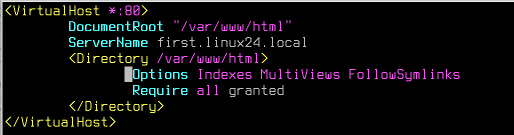
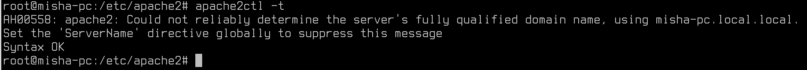
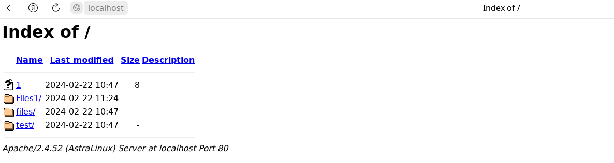

# Лабораторная работа №3. Тема: "Конфигурация веб-служб"
Цель работы
----------

познакомиться с настройкой веб-серверов на базе apache2 и nginx.


Оборудование, ПО:
----------
Виртуальная машина под управлением ОС Astra Linux 1.7  в режиме защищенности "Воронеж"


Ход работы:
----------
В ходе лабораторной работы вы узнаете, как настроить DNS-сервер на основе операционной системы Astra Linux. Также вы изучите процесс настройки Zabbix-сервера для мониторинга компьютеров и серверов.


# Установка и настройка DNS

DNS-сервер в Linux можно реализовать на основе двух популярных пакетов: 

1. dnsmasq

2. bind9

Первый инструмент - отличный вариант, если нужно сделать быстро и без специфических настроек. 

Второй инструмент - именно тот, на котором большинство крупнейших DNS-серверов работает и хостится. Очень серьезный инструмент для создания сложной DNS-инфраструктуры с многочисленными настройками. Изучим именно его. 

## Сервер должен обслуживать зону linux24.local

1. Установим сервер bind9:

```
apt install bind9
```

2. После установки bind9 перейдем в первый конфигурационный файл - **/etc/bind/named.conf.options**. Это файл с основными опциями Bind9, для начала работы нам потребуется отредактировать некоторые параметры: 

## Начнем с **forwarders**


* Предположим, что ваш сервер будет обслуживать зону linux24.local - для этого вы создадите отдельные файлы, наполните их смыслом  - и дело сделано! Но что, если в вашей инфраструктуре есть еще DNS-зоны и сервера? И вы наверняка бы хотели, чтобы настройка клиентской стороны сводилась только к указанию одного конкретного сервера, а он уже в свою очередь перенаправлял запросы о других DNS-зонах (например, **.ru**, **.rosatom**,**.com**). 

  Для этого выполняется настройка **forwarders**, где можно перечислить все адреса, которые будут использованы сервером в качестве "Глобального перенаправления". То есть в случае, когда сервер не знает о каком-то имени, он сначала обратится именно к этому адресу. Запрос, когда одному серверу необходимо "спросить" у другого сервера - называется **рекурсивным**. 


### Также, для наглядности рассмотрите картинку ниже. Она подробно иллюстрирует, как DNS выполняет рекурсивный запрос.



## Продолжим настройки.

По умолчанию, DNS сервера включают поддержку DNSSEC. В рамках нашего курса настройка данной технологии не входит. Потребуется внести правки в конфигурационный файл **/etc/bind/named.conf.options**:



Описание измененных параметров в конфигурационном файле
2,3 -- Отключить DNSSec;
4 – Разрешить запросы от всех клиентов. Если параметр не настроить - внешние клиенты не смогут пользоваться данным сервером. Ключевое слово **any** даст доступ всем. В этом параметре допускается конкретно указать адреса или подсети клиентов, например, allow-query {10.0.10.0/24, 10.0.20.0/24;};
5 -- Разрешить рекурсивные запросы. Как раз о чем говорили выше, по умолчанию, рекурсивные запросы запрещены;
6 – Ожидать соединение по порту 53 (стандартный для DNS) на всех интерфейсах.

После выполнения настроек - перезагрузим сервер DNS

```
systemctl restart bind9
```

После перезагрузки службы, убедитесь что порт 53 прослушивается на сервере.

```
ss -natu | grep 53
```


## Переходим к настройке DNS-зон

Откройте конфигурационный файл - **/etc/bind/named.conf.default-zones**



Данными настройками мы объявили зону **linux24.local**, также указали в каком файле содержится зона. 

## Подготовим файл DNS-зоны.

Данный файл имеет специфический формат - писать его вручную будет неудобно и долго. Поэтому, мы скопируем шаблон командой - 

```
cp /etc/bind/db.0 /etc/bind/linux24
```

А затем откроем файл **/etc/bind/linux24**


Встречает нас файл со сложной конструкцией, но не стоит его пугаться - вносить значения в данный файл просто. 

**Serial** - это номер версии файла зоны, который увеличивается каждый раз, когда происходят изменения в DNS-зоне.

**Refresh** - это время через которое клиент выполняет обновление записей из мастер-сервера.

**Retry** - это время через которое клиент попробует повторно обновить записи в случае неудачи при предыдущей попытке.

**Expire** - это время после которого зона считается недействительной, если не получила обновление от мастер-сервера.

**Negative** - это время кеширования неудачных или заблокированных ответов для данной зоны. То есть, например, если "соседний" сервер недоступен или не отвечает, то это значение укажет сколько "наш" сервер будет помнить об этой неисправности.


# Практическая работа

1) На полученной виртуальной машине создайте пользователя engineer, настройте шаблон пользователей так, чтобы он был автоматически добавлен в группу astra-admin.

2) Установите минимальную длину пароля - 10 символов;

3) Установите минимальное количество строчных букв в новом пароле - 2 символа;

4) Установите минимальное количество заглавных букв в новом пароле - 2 символа;

5) Установите минимальное количество цифр в новом пароле - 5 символов;

6) Пользователям из группы IT (создайте её, если такой нет) разрешите доступ к команде tar с использованием sudo.


# Дополнительная информация:
1) Информация о репозиториях Astra Linux [Ссылка](https://wiki.astralinux.ru/pages/viewpage.action?pageId=158598882)
2) Информация о уровнях конфиденциальности [Ссылка](https://wiki.astralinux.ru/pages/viewpage.action?pageId=27362553)
3) Подборка материалов по Системам защиты информации в Astra Linux [Ссылка](https://telegra.ph/Podborka-materialov-po-SZI-Astra-Linux-11-25)
4) Документация [Ссылка](https://wiki.astralinux.ru/pages/viewpage.action?pageId=137563555)
5) Как переключать режимы защищенности в Astra Linux? [Ссылка](https://wiki.astralinux.ru/pages/viewpage.action?pageId=109020865)
