# Лабораторная работа №4. Тема: "Конфигурация служб хранения данных"
Цель работы
----------

познакомиться с настройкой служб хранения данных на базе LVM;

обеспечим доступ к созданным массивам данных через Samba (SMB,CIFS) и NFS.


Оборудование, ПО:
----------
Виртуальная машина под управлением ОС Astra Linux 1.7  в режиме защищенности "Воронеж"


Ход работы:
----------
Мы поговорим о том как настраивать хранение данных с помощью LVM. Также мы обсудим как обеспечить доступ к своим файлам через Samba (SMB,CIFS) и NFS.


# Начнем с начала, как в Linux в целом рабротает хранение данных? 

Добавляя в систему новый диск (под словом диск, в рамках этой работы мы понимаем любой блочный накопитель - SSD, HDD, NVME) он отображается в системе уникальной буквой.

В Linux диски называются sda, sdb, sdc и так далее в соответствии с схемой именования дисков SCSI/SATA/USB. Буква "sd" означает, что это SCSI/SATA/USB устройство, а буква после "d" обозначает порядковый номер устройства в системе. Так, sda обычно относится к первому SCSI/SATA/USB диску, sdb - ко второму, sdc - к третьему, и т.д.

Стоит обратить внимание, что наименование может отличаться в зависимости от сервера\компьютера\драйверов и специфики аппартной части!

## А что у нас на стендах? 

Команда **lsblk** укажет информацию о всех доступных блочных устройствах. Обратите внимание на **sdb**, **sdc**, **sdd**.


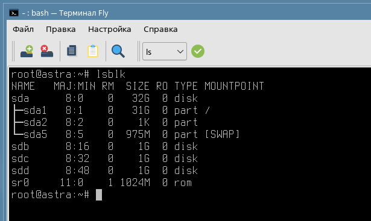

На каждой виртуальной машине есть 3 диска по 1Гб - это тренировочные диски, которые очень пригодятся нам для экспериментов с LVM.

Сам по себе диск не может хранить информации, если не будет создан раздел и не будет установлена файловая система. 

Раздел на диске может быть произвольного объема, а также может быть несколько разделов (максимум 4).

Например, разметим **/dev/sdb** на один единый раздел, объемом на весь диск. Сделать это можно тремя инструментами: 

* fdisk;

* cfdisk;

* gparted. 

Как это сделать через [fdisk](https://losst.pro/komanda-fdisk-v-linux), а как через [gparted](https://help.ubuntu.ru/wiki/gparted)

А в рамках данной лабораторной работы мы рассмотрим инструмент cfdisk.

Испольуем команду:

```
cfdisk /dev/sdb
```

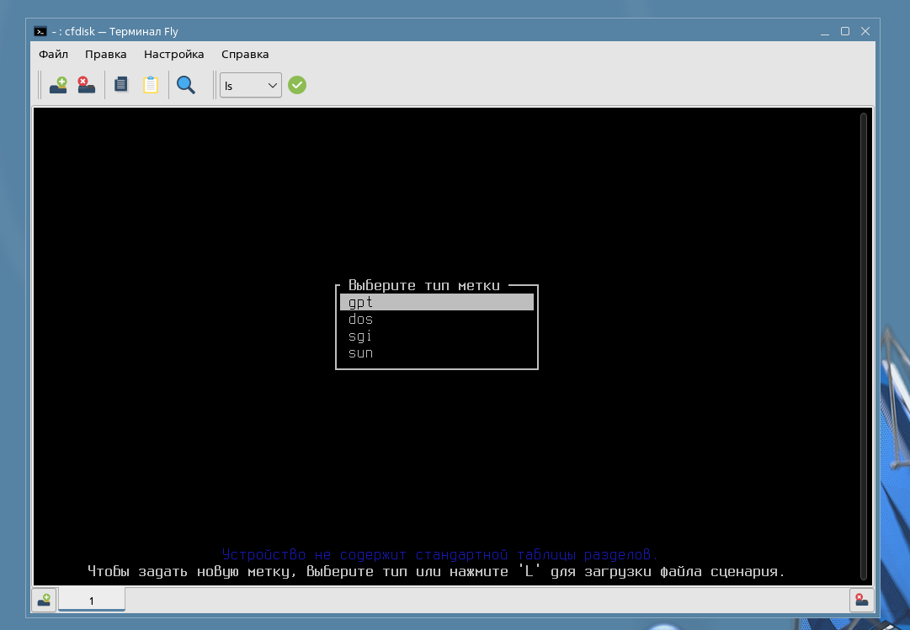

В качестве метки выбираем GPT.

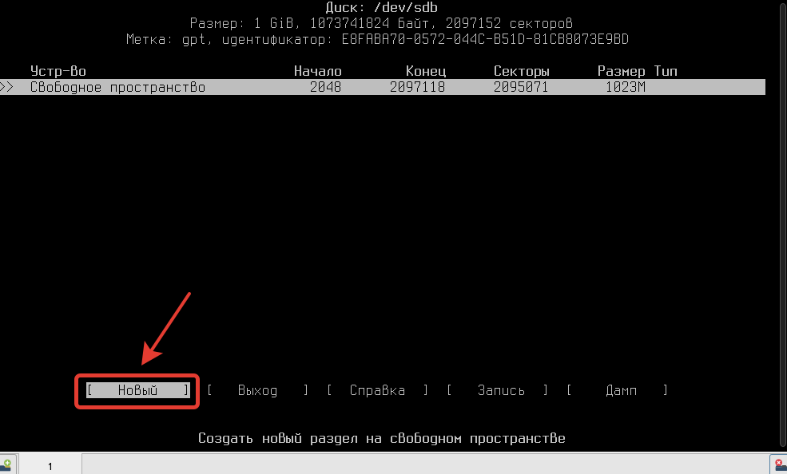

Размер раздела - 1Гб (или 1023Мб, как выбрано, по умолчанию)

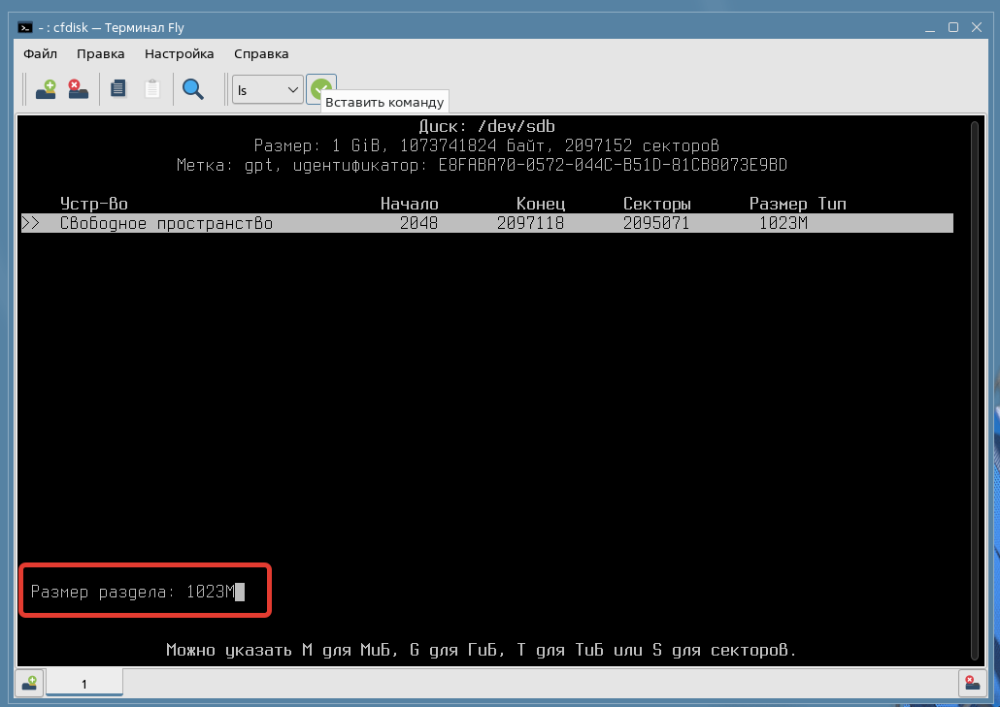

Далее необходимо выбрать тип раздела - Linux LVM

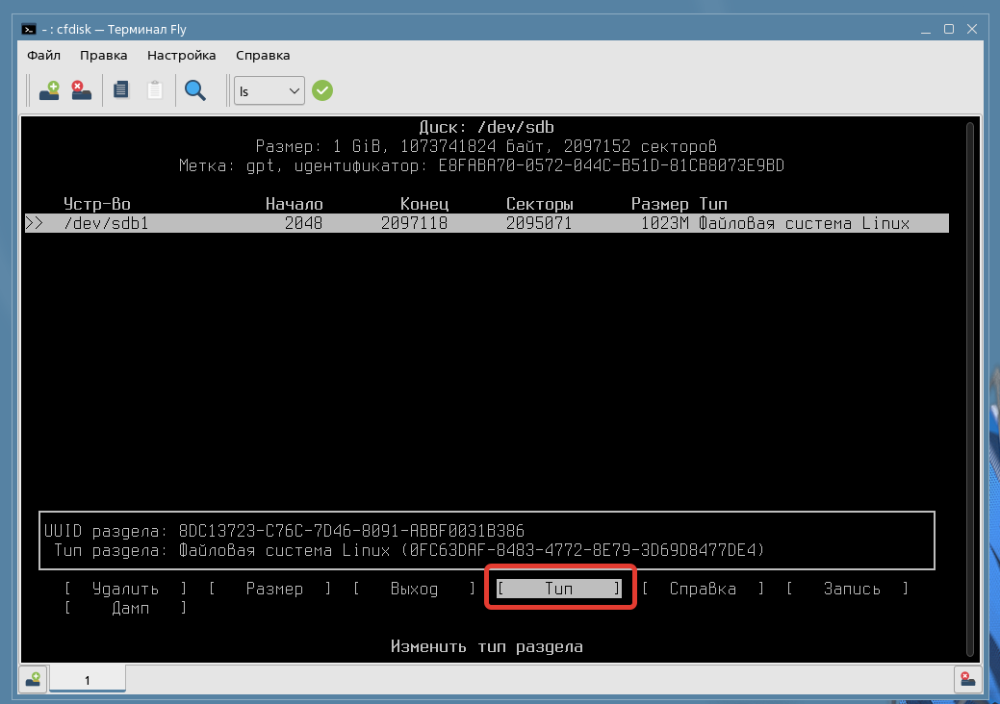

И в списке доступных разделов и форматов:

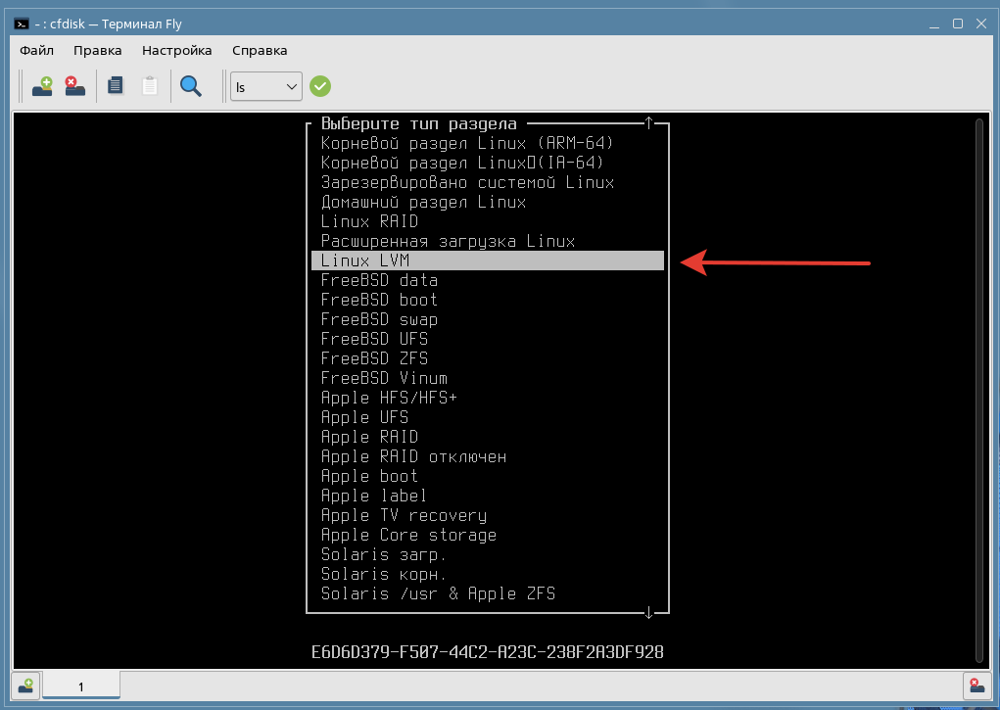

И в конце - "Запись"

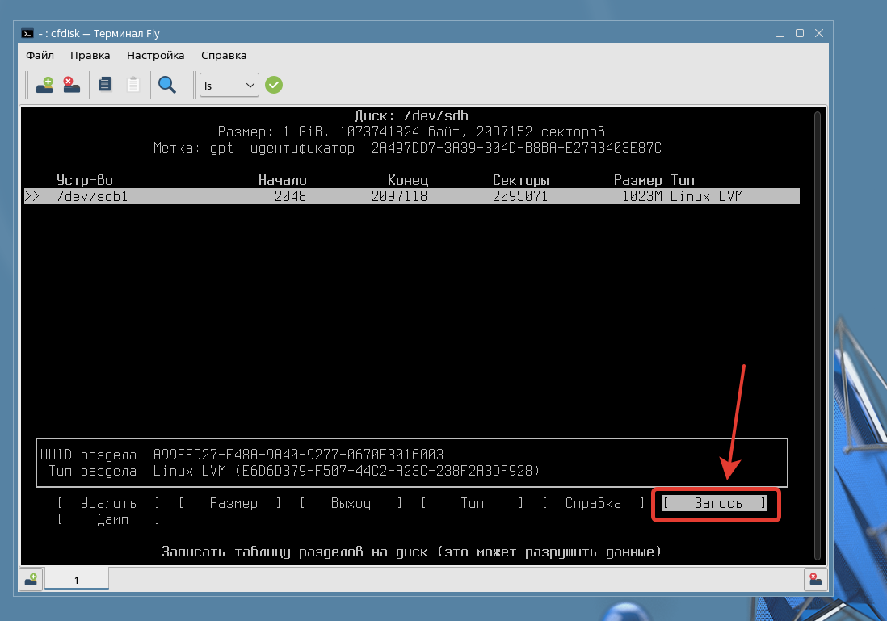

Подтвердите операцию командой "yes". Проверить, что все работает можно командой: 

```
lsblk
```

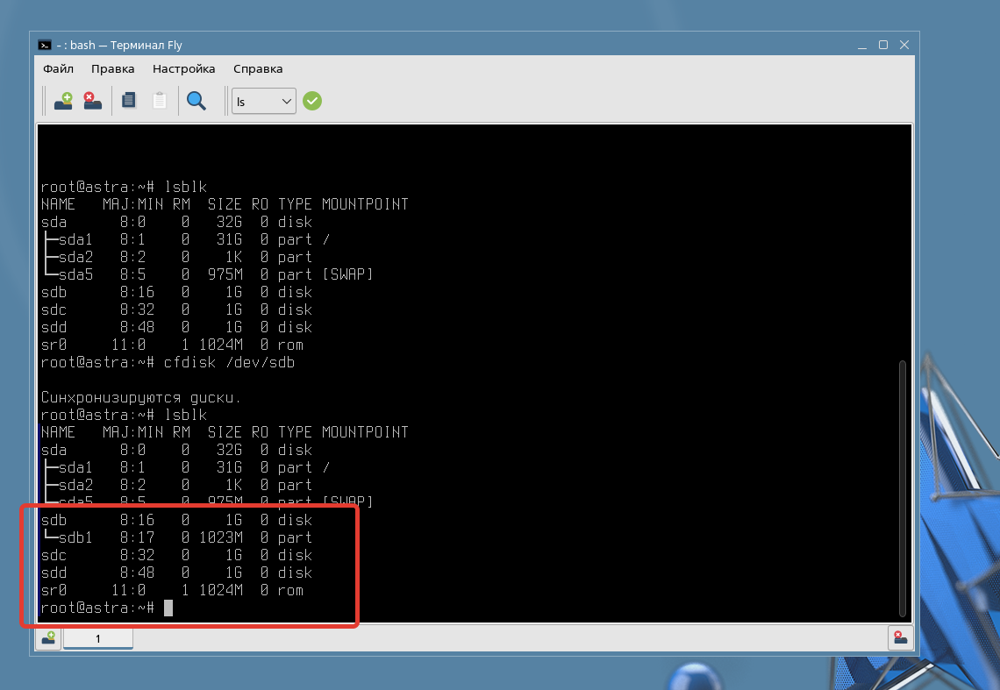

Повторите создание раздела для всех дисков. 

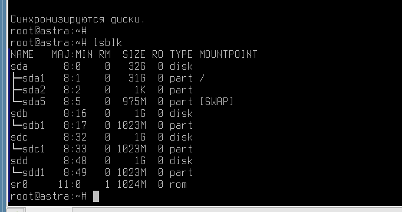

# Отлично, теперь у нас три диска с разделами. Пора поговорить о LVM.

Логические тома (Logical Volumes) в LVM - это виртуальные разделы диска, которые создаются на базе физических дисков. Они могут быть изменены без необходимости переноса данных, в отличие от обычных разделов.

Группы томов (Volume Groups) в LVM объединяют несколько физических дисков или RAID массивов в одну логическую единицу. Группы томов служат для управления большим объемом дискового пространства и деления его на логические тома для удобства управления и обеспечения отказоустойчивости.

Таким образом, логические тома создаются внутри групп томов, что позволяет гибко управлять дисками, изменять их размеры, создавать резервные копии, устанавливать зеркальное отражение данных и многое другое. Использование LVM позволяет эффективно управлять дисками и обеспечивает высокую гибкость и надежность системы хранения данных.

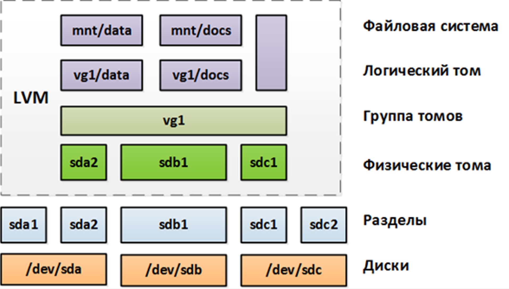

Поговорим о данной архитектуре. 

Читаем снизу вверх. 

1. Диски - это ваши основные физические блочные устройства. 

2. Разделы - разметили таблицу разделов, создали файловую систему. Получился готовый раздел. Его можно использовать для монтирования в различные каталоги Astra Linux.

3. Физические тома. Теперь мы говорим о LVM. В этом контексте - физический том это любой раздел на диске, который был проинициализирован для использования LVM-массивом. 

4. Группы томов. Проинициализированные диски добавляем в общую группу томов. Объем всех дисков суммируется в общее пространство памяти.

5. Логический том. Большое пространство группы томов мы можем разделять на логические тома (словно как разделы на блочных дисках). 

6. Файловая система. Логический том требует установленной в него файловой системы. После её установки мы можем монтировать данный логический том в директории нашей хостовой ОС для хранения информации.

LVM  является удобным и мощным инструментом для управления хранилищем данных в Linux. Вот несколько плюсов и минусов использования LVM:

Плюсы:
1. Гибкое управление: с помощью LVM вы можете легко изменять размеры логических разделов, создавать снимки файловой системы, объединять различные устройства хранения в один "пул данных" и многое другое без даунтайма вашего сервера.

2. Высокая надежность: использование LVM позволяет создавать резервные копии данных, восстанавливаться после сбоев и улучшить производительность хранилища.

3. Возможность разделения на логические тома: это позволяет изолировать данные и при необходимости управлять ими отдельно.

Минусы:
1. Сложность настройки: для новичков может быть непросто разобраться во всех возможностях LVM и настроить его правильно.

2. Риск потери данных: неправильная конфигурация LVM может привести к потере доступа к данным или их полной потере.

3. Дополнительные нагрузки на систему: использование LVM может повлечь за собой дополнительное потребление ресурсов системы и снижение производительности.

В целом, несмотря на некоторые сложности, LVM является мощным инструментом для управления хранилищем данных в Linux и может значительно упростить администрирование системы.

## С теорией понятно, приступим к практике? 

Для работы с LVM помните "трёх китов", на которых держится данная технология: 

1. Физические тома (Physical Volume)

2. Группы томов (Volume Group)

3. Логические тома (Logical Volume)


* Установить lvm2 - набор утилит для работы с технологией:

```
apt install lvm2
```


* Инициализация физического тома: 

```
pvcreate /dev/sdb1 /dev/sdc1/ /dev/sdd1
```

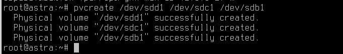

Проверить состояние физических томов можно командами: 

```
pvs
```

или более подробная 

```
pvdisplay
```


* Создать группу томов **vg-group**

```
vgcreate vg-group /dev/sdb1 /dev/sdc1 /dev/sdd1
```

**Вместо vg-group, конечно, можно написать другое имя желаемой группы томов**

Проверить состояние группы томов можно командами: 

```
vgs
```

или более подробная 

```
vgdisplay
```


* Создать логический том можно командами: 

Но перед началом, давайте посмотрим справку по команде **lvcreate**

```
lvcreate --help
```

Справка - огромная! Всю информацию в рамках нашей лабораторной работы изучить будет нереально. Рассмотрим две команды для создание логического тома. 

Например, команда ниже создаст логический том объемом в 350 Мб. -

```
lvcreate -L 350m -n Data vg-group
```

Другая команда, создаст логический том в размере 40% от всего свободного пространства нашей группы томов.

```
lvcreate -l 40%FREE -n Storage vg-group
```

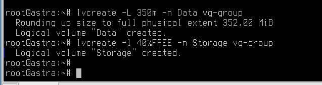

Посмотреть статус логических томов:

```
lvs
```

Или более подробный

```
lvdisplay
```

### Фух, сколько дел! Теперь можно на LVM хранить информацию?

Нет! А как же без файловой системы? 

Команда mkfs в Linux используется для создания файловых систем на различных устройствах хранения данных, таких как жесткие диски, флэш-накопители и т. д. Скрипты mkfs позволяют автоматизировать этот процесс, делая его более удобным и эффективным.

Многие администраторы систем используют скрипты mkfs для создания файловых систем с определенными параметрами и настройками. Например, скрипт mkfs.ext4 создаст файловую систему ext4 с выбранными опциями, такими как размер индексов, дополнительные параметры целостности данных и т. д.

**Для установки ФС на логический том Data, команда будет**

```
mkfs.ext4 /dev/mapper/vg--group-Data
```

Для Storage аналогичная. Теперь разделы готовы к работе!

Создайте каталоги **/storage** и **/data**, примонтируйте логические LVM-тома в созданные директории

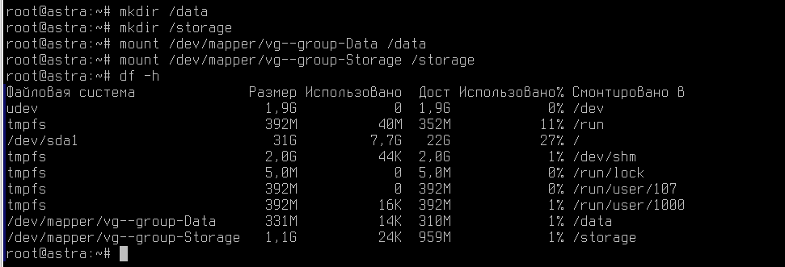

# А теперь поговорим о создании доступа до этих каталогов?

Samba и NFS - это два популярных протокола для совместного использования файлов и ресурсов в сетях с использованием Linux.

Samba:
1. Samba - это протокол для обмена файлами и ресурсами между устройствами в сети, поддерживающий работу с Windows и Linux.
2. С помощью Samba вы можете создавать общие папки и принтеры, управлять пользователями и группами доступа, а также обеспечивать доступ к файлам и папкам по сети через протоколы SMB/CIFS.
3. Samba позволяет взаимодействовать между компьютерами с различными операционными системами, обеспечивая совместимость и удобство использования общих ресурсов.

NFS:
1. NFS (Network File System) - это протокол для удаленного доступа к файловой системе через сеть, который широко используется в UNIX-подобных системах, включая Linux.
2. С помощью NFS вы можете монтировать удаленные каталоги как локальные на своем компьютере, обеспечивая доступ к файлам и данным на удаленных серверах.
3. NFS обладает высокой производительностью и эффективностью, и интегрируется непосредственно в файловую систему операционной системы, что упрощает работу с удаленными данными.

Кратко говоря, Samba обеспечивает совместимость с Windows и Linux, позволяя обмениваться файлами и ресурсами между ними, в то время как NFS предоставляет удаленный доступ к файлам на сервере по сети в UNIX-подобных системах. Оба протокола могут быть полезны в среде Linux для обеспечения совместного доступа к данным и ресурсам.


## Начнем с Samba.


# Практическая работа

1) На полученной виртуальной машине установите и настройте веб-сервер (любой, какой будет удобнее):

  * Директория веб-сервера - **/var/www/html/out**

  * Порт работы сервера - 8088

  * Сайт предоставляет доступ к двум файлами:
      
      1. **index.html**, где указано "Privet from server!"

      2. date.php с содержимым: 

        

2) Убедитесь, что сервер корректно показывает содержимое **index.html**, а также текущее время через **date.php**


# Дополнительная информация:
1) Параметр AstraMode в Apache2 [Ссылка](https://wiki.astralinux.ru/pages/viewpage.action?pageId=238749508)
2) Apache2 vs Nginx  [Ссылка](https://habr.com/ru/articles/267721/)
3) NGINX в Astra Linux [Ссылка](https://wiki.astralinux.ru/pages/viewpage.action?pageId=147162407)

