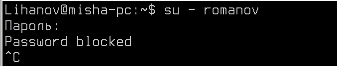

# Лабораторная работа №5. Тема: "Конфигурация параметров аутентификации и прав доступа"
Цель работы
----------

Освоить ключевые навыки настройки параметров аутентификации и прав доступа на базе ОС Astra Linux.


Оборудование, ПО:
----------
Виртуальная машина под управлением ОС Astra Linux 1.7  в режиме защищенности "Воронеж"


Ход работы:
----------
В рамках данной лабораторной работы разберем функционал управления аутентификацией, авторизацией в Astra Linux.

# Начнем с чего-то базового. Запретим некоторой группе пользователей входить в систему

Подготовим лабораторную инфраструктуру: 

1. Создайте группу "deny-user".

2. Также создайте пользователя "romanov". Добавьте его в указанную группу.

Для выполнения данной задачи вам понадобятся команды **usermod**, **groupadd** и **adduser**.

## Отлично, группа есть, запретим пользователям из этой группы доступ к нашему компьютеру.

Для этого создайте файл **/etc/login.group.deny**. Содержимое:

```
deny-user
```

Также, можно с новой строки перечислить все группы, которым доступ нужно запретить или наоборот - можно указать список тех, кому доступ будет разрешен. (не смотря на название файла, конкретно в данный момент он ничего не решает)

После создания файла, перейдем в конфигурацию PAM.

## А что такое PAM? 

PAM (Pluggable Authentication Modules) - это система аутентификации для UNIX-подобных операционных систем, которая позволяет настраивать способы проверки подлинности пользователей. PAM позволяет администраторам гибко управлять методами аутентификации, такими как пароли, ключи, биометрические данные и другие. PAM является стандартом в большинстве современных UNIX-систем и обеспечивает безопасный доступ к системе и защиту пользовательских данных.

## Окей, а как в этом PAM попасть? 

Он представляет собой сразу несколько различных конфигурационных файлов, каждый отвечат за отдельный компонент аутентификации. Например: 

1. Файл "common-auth" отвечает за аутентификацию пользователей. В этом файле можно настраивать правила для проверки подлинности пользователя, такие как использование пароля, проверка ключей, запрет на вход в систему и т.д.

2. Файл "common-account" отвечает за проверку аккаунтов пользователей. В нем задаются правила для проверки активности учетной записи, ограничения по времени доступа и другие аспекты управления аккаунтами.

3. Файл "common-password" управляет правилами для установки и изменения паролей пользователей. В нем можно задать требования к сложности паролей, срок действия паролей и другие политики безопасности паролей.

4. Файл "common-session" определяет правила для управления сеансом пользователя. В нем можно задать настройки для выдачи различных привилегий пользователю во время сеанса, настройки окружения и т.д.

И еще множество разных файлов. Подробнее об этом можно почитать [тут](https://redos.red-soft.ru/base/manual/safe-redos/pam/)

Нам, исходя из информации выше, потребуется **common-auth**.

Откроем **/etc/pam.d/common-auth** и после всех комментариев добавим строку: 

```
auth required pam_listfile.so onerr=fail item=group sense=deny file=/etc/login.group.allowed
```

Строка выше буквально запрещает всем группам, указанным в файле /etc/login.group.allowed доступ в систему. 

Проверить, что работает можно попытавшись войти в систему - 



Допустимо сделать правило иначе


```
auth required pam_listfile.so onerr=fail item=group sense=allow file=/etc/login.group.allowed
```

В этом случае доступ будет разрешен только указанным в файле группам. 

# Доступ запретили, теперь поработаем с командами или функционалом, которые пользователю доступен. 

И тут вопрос сложный, да мы можем запретить пользователю вводить команды в терминале, но "обходить" эти ограничения довольно просто.

Как правило, в случае если вам потребуется запретить пользователю некоторые команды, это можно реализовать через: 

1. Режим "Киоска" в Astra Linux [Подробнее](https://wiki.astralinux.ru/pages/viewpage.action?pageId=57443245);

2. Ограничение переменных окружения. 
 

Вариант через киоск, учитывая текущий способ подключения к виртуальным машинам - невозможен.

## Разберем функционал ограничения через переменные окружения.


Файл /etc/bash.bashrc является глобальным файлом настройки оболочки bash для всех пользователей системы. В большинстве дистрибутивов Linux в файле /etc/bash.bashrc содержатся общие настройки, которые применяются ко всем пользователям при входе в систему и запуске оболочки bash.

В этом файле обычно содержатся определения переменных среды, алиасов, функции и другие настройки, которые будут доступны для всех пользователей системы. Таким образом, изменения в файле /etc/bash.bashrc будут влиять на работу оболочки bash для всех пользователей.

Аналогичный файл .bash.bashrc вы найдете в домашнем каталоге любого пользователя Astra Linux. Он отвечает за специфические системные настройки окружения в ОС. 

### А есть же еще какой-то файл по аналогии с bash.bashrc?

Да, файл /etc/profile и директория /etc/profile.d также являются частями системы настройки оболочки bash в большинстве дистрибутивов Linux.

- /etc/profile: Этот файл обычно содержит глобальные настройки для всех пользователей системы при их входе в систему. В нем могут содержаться настройки переменных среды, путей поиска, установка переменных и другие глобальные настройки оболочки.

- /etc/profile.d: Это директория, в которой обычно хранятся скрипты настройки (sh-скрипты) для оболочки bash. Все скрипты, расположенные в этой директории и имеющие расширение ".sh", будут автоматически загружаться при входе в систему и обрабатываться оболочкой bash. Каждый скрипт может содержать отдельные настройки, переменные, алиасы и другие средства настройки.

Комбинация файла /etc/profile и директории /etc/profile.d позволяет системному администратору глобально управлять общими настройками оболочки для всех пользователей системы. Все эти настройки применяются при входе в систему и при запуске оболочки bash.

Подобно файлу /etc/bash.bashrc, изменения в файлах /etc/profile и скриптах из /etc/profile.d также должны производиться с осторожностью, чтобы не нарушить работу системы или настроек других пользователей.


### Перейдем к настройке.

В файл **/etc/bash.bashrc** добавьте в конец: 


```
if groups | grep -q '\bIT\b'; then
 export PATH=/test
 else
  true
fi
```

 **Что скрипт делает?**

Проверяет, входит ли пользователь в указанную группу. Мы используем группу IT. И если да, то назначается новая переменная окружения PATH=/test

Переменная PATH является одной из важнейших переменных среды в Unix-подобных операционных системах, таких как Linux. Она содержит список директорий, в которых операционная система будет искать исполняемые файлы команд при вводе их имен в оболочке.

Когда вы вводите имя команды в оболочке, операционная система ищет исполняемый файл этой команды по всем папкам, указанным в переменной PATH. Если исполняемый файл находится в одной из этих папок, он выполняется. Если же файл не найден, вы получите сообщение об ошибке "command not found".

Получается, что после выполнения скрипта, всем пользователям из группы IT будет назначена новая переменная.

### Как переменная PATH выглядит изначально? 

```
echo $PATH
```


### Создать каталог /test

```
mkdir /test
```

Затем каталог **/test**, который теперь играет роль каталога для исполняемых файлов команд,  доступные нашим пользователям, необходимо заполнить.

С помощью команды **whereis** можно определить путь до исполняемых файлов и встроенной справки. 


Получается, что если мы скопируем исполняемый файл для ls в /test - мы позволим пользователям выполнять команду ls

```
sudo cp /usr/bin/ls /test
```

По аналогии, наполните **PATH** командами nano, ping.

На наших рабочих станциях пользователь для группы IT - Lihanov.


Как можно заметить, команды недоступны! 

### Но почему это ненадежно? 

Команда host, может и недоступна, но если вы укажите полный путь до команды:

```
/usr/bin/host
```

Или, например, проициниализируете PATH еще раз - 

```
export PATH=/usr/bin
```

То "защита" спадет, и команды можно будет снова выполнять. Так что данная защита сработает только от "неопытного" пользователя.

# Ладно, что мы все о запретах. PAM ведь еще что-то умеет? 

Да, [тут большая статья](https://losst.pro/nastrojka-pam-v-linux?ysclid=lt4ao0sm6f787955745)

Мы обсудим вопрос монтирование сетевых папок, ведь не зря в прошлой лабораторной работе мы их настраивали? 

## Установка ПО 

```
apt install libpam-mount
```

libpam-mount - это модуль PAM  для монтирования файловых систем при аутентификации пользователей в Linux. PAM предоставляет стандартизированный механизм аутентификации с возможностью динамической настройки.

libpam-mount позволяет автоматически монтировать файловые системы (например, сетевые ресурсы, удаленные диски и т. д.) при входе пользователей в систему с использованием различных методов аутентификации, таких как пароли, ключи ssh и другие.

Этот модуль позволяет настроить автоматическое монтирование ресурсов для пользователей на уровне системы, а не для каждого пользователя индивидуально. Это может быть полезно для установки общих сетевых ресурсов или других файловых систем, доступных для всех пользователей системы.

### Перейдем к настройке.

Откроем файл **/etc/security/pam_mount.conf.xml** и добавьте конструкцию монтирования сетевой папки:

```
<volume
    fstype="cifs"
    server="127.0.0.1"
    path="shared_folder"
    mountpoint="~/Desktop/folder" />
```


После этого выполните перелогин в систему, и обратите внимание на рабочий стол! 


Папка есть! 

### А можно как-то настроить разделение по группам? 

Можно, например, если бы папка была доменная, то на доменном контроллере мы бы настроили права доступа, а **libpam-mount** монтировал директорию в соотвествии с настройкам.

В нашем случае домена нет, но можно настроить монтирование папки только в случае, если пользователь входит в группу IT.

```
<volume
    fstype="cifs"
    server="127.0.0.1"
    path="shared_folder"
    mountpoint="~/Desktop/folder"
    sgrp="IT" />
```

Проверяем!

Если зайдем под пользователем userX, который не входит в группу IT


А вход под пользователем из группы IT - Lihanov.

. 

Вот и результат автомонтирования!

Кстати, если пригодится монтировать доменные папки через Kerberos:

```
<volume
    fstype="cifs"
    server="dc1.example.local"
    path="Share"
    mountpoint="~/Desktop/folder"
    options="user=%(USER),cruid=%(USER),sec=krb5,rw,uid=%(USER),gid=%(GROUP),actimeo=15" />
```


# Практическая работа

1) Создайте группуу "super-admins", разрешите им использование команды sudo с максимальными привилегиях;

2) Затем создайте группу "super-deny", запретите данной группе авторизовываться в компьютере;

3) Для группы "super-console" разрешите выполнять только команды:

    * nano
    
    * grep

    * vim


# Дополнительная информация:
1) PAM-MOUNT в Astra Linux [Ссылка](https://wiki.astralinux.ru/pages/viewpage.action?pageId=44893440)
2) SUDO в Astra Linux  [Ссылка](https://wiki.astralinux.ru/pages/viewpage.action?pageId=8618025)
3) Переменная PATH в Linux  [Ссылка](https://losst.pro/peremennaya-path-v-linux)
4) Что делает bashrc? [Ссылка](https://www.8host.com/blog/chto-delaet-fajl-bashrc-v-linux/)


