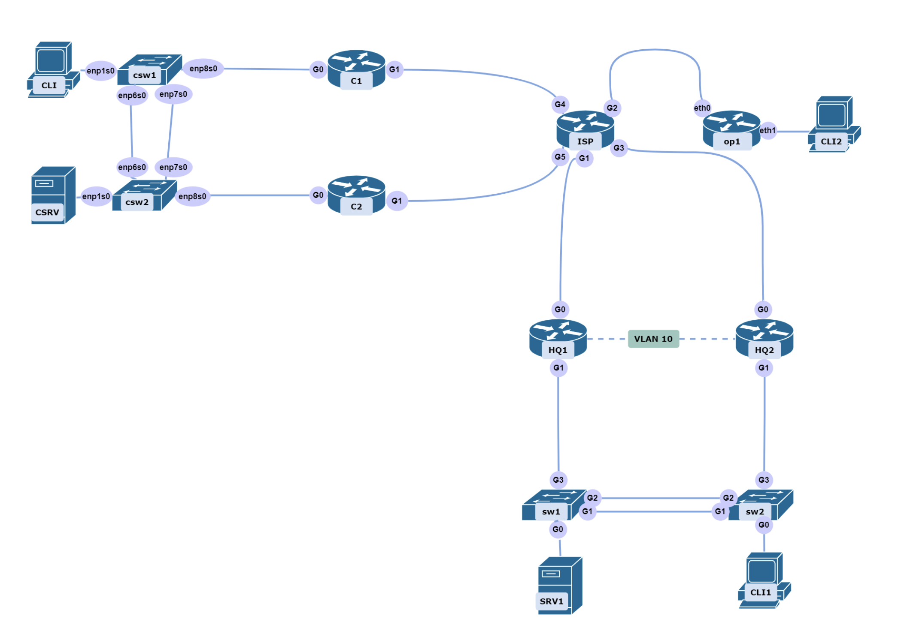
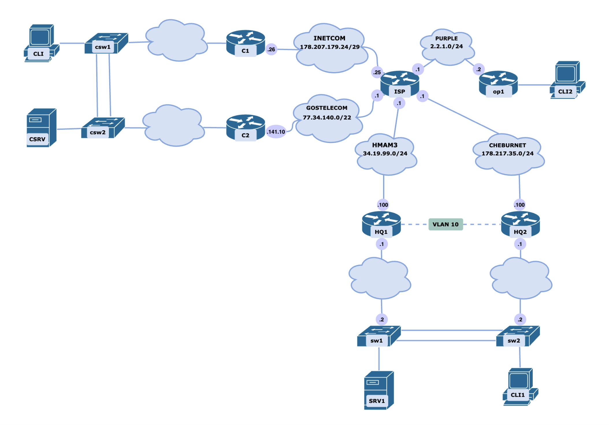

# Модуль С: «Пусконаладка телекоммуникационного оборудования»

# ИНСТРУКЦИИ ДЛЯ УЧАСТНИКА

В первую очередь необходимо прочитать задание полностью.

Следует обратить внимание, что задание составлено не в хронологическом порядке. Некоторые секции могут потребовать действий из других секций, которые изложены ниже.

На вас возлагается ответственность за распределение своего рабочего времени. Не тратьте время, если у вас возникли проблемы с некоторыми заданиями. Вы можете использовать временные решения (если у вас есть зависимости в технологическом стеке) и продолжить выполнение других задач.

Рекомендуется тщательно проверять результаты своей работы.

Участники не имеют права пользоваться любыми устройствами, за исключением находящихся на рабочих местах устройств, предоставленных организаторами.

Участники не имеют права приносить с собой на рабочее место заранее подготовленные текстовые материалы.

В итоге участники должны обеспечить наличие и функционирование в соответствии с заданием служб и ролей на указанных виртуальных машинах.

При этом участники могут самостоятельно выбирать способ настройки того или иного компонента, используя предоставленные им ресурсы по своему усмотрению.

**Проверка будет осуществляться с клиентов каждой из сетей, в конце задания необходимо заполнить таблицу.**

1.	Произведите базовую настройку сетевых устройств и серверов

2.	Разработайте план IP адресации. Учитывайте, что в центре обработки данных количество устройств может доходить до 1024, а в центральном офисе не превышает 20 в каждом VLAN.

3.	Настройте аутентификацию на маршрутизаторах в центральном офисе через RADIUS. В роли RADIUS-сервера выступает SRV1. Убедитесь, что маршрутизатор поддерживает вход под локальными учетными записями, если отсутствует связность с сервером аутентификации.  
       + Настройку SRV1 в качестве RADIUS-сервера выполните самостоятельно.
       + Создайте пользователя reauser локально с паролем P@ssw0rd с максимальными привилегиями
       + Создайте пользователя showuser на radius сервере с паролем P@ssw0rd и уровнем привилегий 5
         * Разрешите доступ к настройке интерфейса lo0
         * Должен быть разрешен полный набор команд ip

4.	На каждом устройстве настройте адреса во VLAN 400 для обеспечения административного доступа. Административный доступ должен быть возможен только по адресам VLAN 400. Подключение по протоколам удаленного доступа на остальные интерфейсы должно быть запрещено.

5.	На коммутаторах сконфигурируйте таблицу VLAN. Каждая подсеть выделяется в отдельный VLAN. Разрешите трафик только используемых VLAN. На маршрутизаторах сконфигурируйте соответствующие подинтерфейсы.
       + В качестве native vlan используйте 666
       + Таблица VLAN для офиса должна соответствовать:
         * 10 - Routing
         * 100 - Clients
         * 200 - Servers
         * 300 - Voice
         * 400 - Management
       + Таблица VLAN для ЦОДа должна соответствовать:
         * 100 - Clients
         * 200 - Servers
         * 400 - Management
       + Добавьте устройства в соответствующие vlan

6.	Сконфигурируйте агрегирование каналов между коммутаторами. В центральном офисе используйте проприетарный протокол агрегирования, а в центре обработки данных – открытый.
       + Используйте балансировку по MAC-адресам источника и назначения
       + В центральном офисе используйте номер портовой группы - 1, в ЦОДе - 2

7.	В центральном офисе сконфигурируйте сервер автоматической конфигурации хостов. Пул должен быть объемом не менее 5 адресов. Клиент всегда должен получать предпоследний адрес в подсети.
       + Выполните настройку DHCP-Snooping на коммутаторах центрального офиса для подсети клиентских ПК.
       + Выполните настройку ARP Inspection для клиентской подсети

8.	В центральном офисе сконфигурируйте протокол отказоустойчивого шлюза. Используйте последний адрес в подсети, прочие параметры на ваше усмотрение.

9.	Настройте второй интернет-канал в центральном офисе через маршрутизатор HQ2.
       + Второй канал используется в качестве резервного
       + Переключение на резерв в случае сбоя основного канала на HQ1 должно происходить автоматически и занимать не более 40 секунд. Для проверки соединения используйте адрес 14.88.22.8.
       + При восстановлении интернет-соединения на HQ1 выполните обратную настройку интернет-канала через HQ1.

10.	Настройте синхронизацию времени между сетевыми устройствами по протоколу NTP.
       + В качестве сервера должен выступать роутер HQ1 со стратумом 5
       + Используйте Loopback интерфейс HQ1, как источник сервера времени
       + Все остальные устройства и сервера должны синхронизировать свое время с HQ1
       + Все устройства и сервера настроены на московский часовой пояс (UTC +3)

11.	Подключитесь к BGP автономным системам ваших провайдеров в центральном офисе и ЦОД по сведениям из таблицы:
       + AS провайдера 65000
       + Установите соседство, но не объявляйте сети
       + Между роутерами HQ1 - HQ2 установите соседство по протоколу iBGP
         * Соседство должно быть установлено только через VLAN 10

| Провайдер | Адрес IPv4/Маска | Шлюз IPv4 | AS |
| --------- | ---------------- | --------- | -- |
| HMAM3     | 34.19.99.100/24	 | 34.19.99.1| 65020 |
| PURPLE	  | 2.2.1.2/24	     | 2.2.1.1	| - |
| CHEBURNET	| 178.217.35.100/24	| 178.217.35.1 | 65100 |
| INETCOM	| 178.207.179.26/29	| 178.207.179.25	| 65010 |
| GOSTELECOM | 77.34.141.10/22 | 77.34.140.1	| 65010 |

12.	Порты, которые на коммутаторах являются портами доступа, должны сразу переходить в состояние Forwarding, но блокироваться если на них приходит BPDU. Отключите DTP в явном виде.

13.	Обеспечьте возможность выхода в интернет устройств центрального офиса, центра обработки данных и домашней сети. Для проверки доступа используйте адрес 10.113.38.250

14.	В случае попытки подбора пароля на маршрутизаторах центра обработки данных (не менее 3 раз за 15 секунд) они должны временно блокировать доступ по SSH со стороны интернета на 2 минуты. Доступ со стороны локальной сети должен сохраняться.

15.	На сетевом оборудовании cisco сконфигурируйте резервное сохранение конфигурации на сервер в центре обработки данных. Следует сохранять конфигурацию всего сетевого оборудования. Сохранение должно производиться при записи.
       + Имя файла с конфигурацией должно содержать имя устройства, дату и время
       + Конфигурация должна сохраняться на CSRV

16.	На всех сетевых устройствах обеспечьте централизованный сбор журналов на сервер в центре обработки данных. Логи следует сохранять в каталоге /opt/logs/<hostname>.log
       + Логи уровня важности 5 и более важные следует отправлять на сервера
       + Логи должны сохраняться на CSRV

17.	Настройте мониторинг по SNMP всего сетевого оборудования центрального офиса.
       + Используйте SNMPv3 со строкой сообщества **reaskills2023**
       + Опрос по SNMP нужно разрешить для сервера SRV
       + Для опроса по snmp следует использовать учетную запись snmpuser/snmppass

18.	Между центром обработки данных и центральным офисом сконфигурируйте Phase 3 DMVPN. Защитите его при помощи ipsec ikev2 с использованием сертификатов. Центр сертификации необходимо развернуть на сервере в центральном офисе. CN=ReaSkills2023 Root CA

19.	Сконфигурируйте OpenVPN на машине OP1, чтобы иметь доступ к клиентскому компьютеру CLI2 с центрального офиса.
       + Вход по сертификатам с машины CLI1 через OpenVPN клиент
       + Реализуйте подключение через команду - **start_vpn.sh**, скрипт сохраните в **/bin/start_vpn.sh**.
       + Вход на машину CLI2 реализуйте по RDP. Убедитесь, что после подключения по VPN rdp соединение стабильно работает.

20.	Настройте маршрутизацию поверх защищенного DMVPN  с использованием OSPF
       + Используйте область 0
       + Все интерфейсы, через которые не предусмотрено соседство, должны быть в режиме Passive.

21.	В центре обработки данных на обоих маршрутизаторах сконфигурируйте списки контроля доступа для обработки входящего трафика.
       + Разрешите только используемые в рамках задания порты, весь остальной трафик должен быть запрещен
       + Сконфигурируйте пограничные маршрутизаторы таким образом, чтобы по портам 2222 и 443 был возможен доступ до сервера в ЦОДе
       + Разрешите ssh подключение из интернета

22.	Включите поддержку протокола LLDP на всех устройствах центрального офиса.
       + Со стороны сетевого оборудования LLDP-пакеты должны распространяться только на внутренние устройства. Отключите отправку в провайдера
       + Со стороны серверов также настройте отправку LLDP. Убедитесь, что сервера получают информацию о сетевом оборудовании и наоборот.

# Характеристики ВМ
| name | os           |
| ---- | ------------ |
| HQ1	| Cisco router |
| HQ2	| Cisco router |
| SW1	| Cisco switch |
| SW2	| Cisco switch |
| OP1	| openwrt |
| C1	| Cisco router |
| C2	| Cisco router |
| CSW1 | 	debian |
| CSW2 |	debian |
| SRV1 | debian |
| CLI1, CLI2, CLI	| Astra linux |

# Топология L1

# Топология L3

