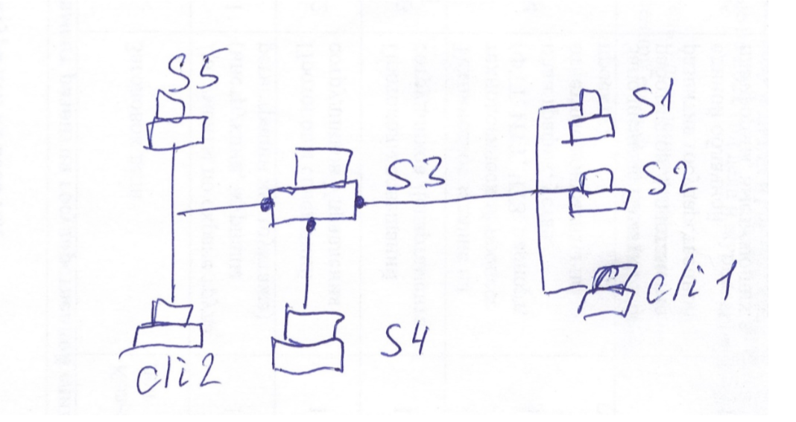

# Модуль B: «Пусконаладка ОС семейства Windows»

# ИНСТРУКЦИИ ДЛЯ УЧАСТНИКА

В первую очередь необходимо прочитать задание полностью.

Следует обратить внимание, что задание составлено не в хронологическом порядке. Некоторые секции могут потребовать действий из других секций, которые изложены ниже.

На вас возлагается ответственность за распределение своего рабочего времени. Не тратьте время, если у вас возникли проблемы с некоторыми заданиями. Вы можете использовать временные решения (если у вас есть зависимости в технологическом стеке) и продолжить выполнение других задач.

Рекомендуется тщательно проверять результаты своей работы.

Участники не имеют права пользоваться любыми устройствами, за исключением находящихся на рабочих местах устройств, предоставленных организаторами.

Участники не имеют права приносить с собой на рабочее место заранее подготовленные текстовые материалы.

В итоге участники должны обеспечить наличие и функционирование в соответствии с заданием служб и ролей на указанных виртуальных машинах. 

При этом участники могут самостоятельно выбирать способ настройки того или иного компонента, используя предоставленные им ресурсы по своему усмотрению.

**Список серверов и АРМ**

| Имя сервера	| DNS имя	| IP адрес1	| IP адрес2 |	IP адрес3 |    |
| ----------- | ------- | --------- | --------- | --------- | --- |
| S1 | DC |	11.11.11.1 |	     |     | Windows Server 2022 GUI | 
| S2 | Member |	11.11.11.2 |     |    |		Windows Server 2022 GUI |
| S3 | RRAS |	11.11.11.254 | 192.168.100.254 |	8.8.8.100 |	Windows Server 2022 GUI |
| S4 |	WAP |	192.168.100.1 |    |    |			Windows Server 2022 GUI |
| S5 |	ISP |	8.8.8.8 |    |    |			Windows Server 2022 GUI |
| CLI1 |	CLI1 |	DHCP 11.11.11.x |    |    |			Windows 10 |
| CLI2 |	CLI2 |	DHCP 8.8.8.х |    |    |			Windows 10 |
	

**Предустановленные учетные записи:**

| Имя сервера	| DNS имя	| IP адрес1	|
| ----------- | ------- | --------- |
| S1 |	Rea23\Administrator |	P@ssw0rd |
| S2 |	Rea23\Administrator, Member\Administrator |	P@ssw0rd |
| S3 |	RRAS\Administrator |	P@ssw0rd |
| S4 |	WAP\Administrator |	P@ssw0rd |
| S5 |	ISP\Administrator |	P@ssw0rd |
| CLI1 |	Rea23\Administrator, CLI1\User |	P@ssw0rd |
| CLI1 |	Rea23\User1, Rea23\User2 |	P@ssw0rd1, P@ssw0rd2 |
| CLI2 |	CLI2\User |	P@ssw0rd |

**ТОПОЛОГИЯ: ТОПОЛОГИЮ МЕНЯТЬ ЗАПРЕЩЕНО**

Ваша компания имеет внутренний домен rea23.local и внешний домен reaskills.ru.

Внешний ip-адрес организации 8.8.8.100. 

**ЗАДАЧИ:**

1. На сервере S1 развернуть корпоративный центр сертификации с именем REA23-CA и сроком жизни корневого сертификата 4 года.

2. Обеспечить публикацию списков отзыва CRL по адресу crl.reaskills.ru. Обеспечить возможность загрузки всех листов отзыва. Прописать эту точку распространения в выдаваемых сертификатах.

3. Обеспечить публикацию информации о сертификатах AIA по адресу aia.reaskills.ru. Прописать эту точку распространения в выдаваемых сертификатах.

4. На сервере S2 развернуть RDS, опубликовать Calculator, дать доступ всем пользователям домена. Подписать все необходимые роли сертификатом, выданным REA23-CA.

5. Обеспечить доступ к веб-интерфейсу RDWeb по протоколу HTTPS. По протоколу HTTP подключаться не должно. Подключение должно быть по имени rds.reaskills.ru  использованием SSO с CLI1 (Internet Explorer) под доменным пользователем без ввода логина и пароля. Не должно возникать никаких предупреждений информационной безопасности.

6. Расширьте возможность подключения по имени rds.reaskills.ru с использованием SSO с CLI1 (Google Chrome) под доменным пользователем без ввода логина и пароля. Не должно возникать никаких предупреждений информационной безопасности.

7. Обеспечить запуск приложения Calculator с CLI1 (Internet Explorer) под доменным пользователем без ввода логина и пароля. Не должно возникать никаких предупреждений информационной безопасности.

8. На сервере S2 развернуть сервер федерации ADFS. Настроить его работу в доменной инфраструктуре.

9. На сервере S4 развернуть Web Application Proxy, привязать к серверву федерации домена. Создать на нем необходимые публикации.

10. На сервере S3 настроить службу RRAS таким образом, чтобы пользователи из сети «Интернет» смогли получить доступ к ресурсам.

11. Настроить S5 (ISP) с учетом публикации внешних ресурсов от имени провайдера.

12. Обеспечить доступ с CLI2 к веб-интерфейсу RDWeb с пред-аутентификацией через ADFS сервер (ввод логина и пароля) по имени rds.reaskills.ru, причем аутентификация на самом сервере должна проходить в формате SSO с предоставлением токена от ADFS. Не должно возникать никаких предупреждений информационной безопасности.

13. С CLI2 должен быть обеспечен доступ до crl.reaskills.ru и aia.reaskills.ru для работы с сертификатами после истечения срока проверки списков отзыва. Менять стандартные сроки отзыва и отключать проверку запрещено.

14. На CLI2 обеспечте возможность запуска программы Calculator, расположенного на RDS.

**Органичения:**

1. Запрещено менять топологию сети;

2. Запрещено вводить в домен сервера S3 и S5, а также АРМ CLI2;

3. Запрещено публиковать в «Интернет» внутренние адреса компании;

4. Запрещено использовать на S4 интернет ip адрес;

5. Запрещено направлять веб-запросы из «Интернет» напрямую во внутреннюю сеть организации.

