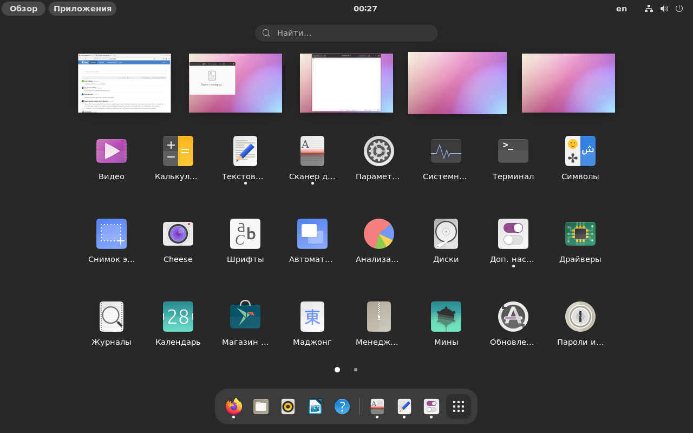
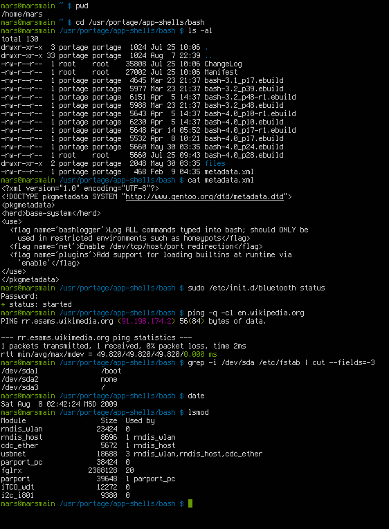
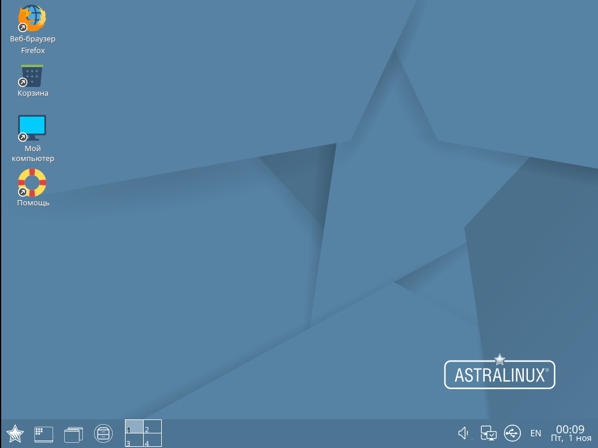

# Статья №1.

# Что такое Linux?

Ежедневно мы мы с вами работаем за компьютером, это уже часть нашей повседневной жизни.
Многие из нас каждое утро открывают ленту новостей со своего телефона. И наверное, многие из вас даже и не задумывались, что в Интернете практически каждый сайт или приложение, да и сам смартфон работает на базе ядра Linux.

Ого! Удивительное открытие, правда?

Практически 80% веб-сайтов в интернете используют операционную систему семейства Linux.

Рынок мобильных устройств также широко использует Linux в качестве ядра для операционных систем в смартфонах, планшетах. Например, Android.

Игровые консоли, суперкомпьютеры, домашние роутеры, устройства умного дома, электромобили Tesla - это все использует Linux!

**Почему?**
Использовать Linux выгодно и удобно, потому что эта операционная система бесплатна, а также открыта для использования каждому.

Теперь, когда мы понимаем насколько Linux широко представлен в окружающем нас мире высоких технологий, стоит познакомиться с ним поближе.

---------------

Linux - это одновременно общее понятие для двух вещей:
* Название ядра операционной системы (проще говоря, ядро - инструмент, который отвечает за базовый функционал операционной системы, а также занимается обработкой команд пользователя и передачи их в аппаратную часть компьютера)

* Название целого семейства операционных систем - это более тысячи различных сборок систем под уникальные задачи (например, специальная операционная система от Яндекса для умных станций)

---------------

Linux - был разработан программистом Линусом Торвальдсом. Первая версия проекта представлена 17 сентября 1991 года.

Ядро Linux позволяет:
* Управлять памятью - например, при запуске программы ядро должно выделить место в оперативной памяти компьютера. После окончания работы программы, наоборот, освободить место под другие задачи.
* Управлять процессами - например, запустить процесс печати документов или открыть браузера
* Управлять аппаратной частью - в ядро уже встроены драйверы для работы с процессорами различных производителей, для корректной работы материнских плат, устройств хранения и т.д.
* Обмен информацией между запущенными процессами, службами и программами - ядро обеспечивает возможность программы отправлять запрос на другие процессы - например, когда браузер запрашивает открыть веб-страницу ядру необходимо запустить службу работы в Интернете.

Ядро для пользователя прозрачно. Достаточно сложно (без применения особых утилит, конечно) обратиться к ядру напрямую. Ядро работает самостоятельно, мы как пользователи, видим лишь результат её деятельности.

Поверх ядра Linux разные разработчики сделали свои операционные системы - Debian, Ubuntu, Astra Linux и множество других.

**Вот и получается, что ядро в основе - одно, а дистрибутивов Linux - много.**

Дистрибутив - это когда берут ядро Linux, а поверх разрабатывают определенный набор программ - графические оболочки, драйверы и прочее.

# Linux и Unix - это что?

Учитывая, что названия очень похожи - запутатьтся легко.

Unix - коммерческий проект компании AT&T, который был создан Кеном Томпсоном, Деннисом Ритчи и другими сотрудниками Bell Labs. Проект был проприетарным, а лицензия на использование ОС распорстранялась на платной основе.

Linux же был создан как открытая и бесплатная альтернатива. В Linux используются многие принципы и стандарты из Unix, но код другой.

Идеи, заложенные в основу Unix, оказали огромное влияние на развитие компьютерных операционных систем. В настоящее время Unix-системы признаны одними из самых исторически важных ОС.

# Так, получается Linux - это точно бесплатно?

В основном, да. Есть, конечно, коммерческие сборки дистрибутивов Linux - например, Red Hat. В этом случае покупатели получают ОС, где есть некоторый уникальный набор программ и утилит, а также техническая поддержка и сопровождение пользователя.

Именно такой подход и повлиял на широкую распространенность Linux:
* Бесплатность и доступность
* Гибкость в настройке

# А как Linux выглядит?

Как угодно! Система же открытая и каждый может настроить её внешний вид и функционал под свои задачи.

Когда вы открываете окна в вашей операционной системы, на самом деле вы работаете в специальной программе-менеджере, которая рисует вам панели задач и прочее.

В операционных системах Windows и macOS есть собственные оконные менеджеры, которые вы менять не можете, а в Linux можно!

Например, оконный менеджер KDE - один из сотен тысяч вариантов.

Или, не менее популярный, GNOME

Или, например, Xfce - стоит кстати заметить, что из всех трёх рассказанных ранее, он самый нетребовательный к характеристикам ПК. Если компьютер слабенький, рекомендуем установить именно этот оконный менеджер.

А можно и совсем не пользоваться графическими окружениями, а полностью управлять компьютером используя командную строчку. Так, например, делают на всех серверах под управлением Linux.

# Хорошо, а что по специальному ПО, например, Photoshop там как?

Здесь сложности есть, утаивать не будем.

На Linux есть множество альтернативного ПО для работы с графикой, видео и звуком.

Конечно, это не такие крупные и известные программы как у Abode или Apple, но в целом работают приемлимо.

Постепенно производители специализированного ПО понимают влияние Linux и выпускают свои продукты на данную платформу. Например, программа для видеомонтажа Davinci от компании Blackmagick уже получила свой релиз на Linux.

# Окей, а видеокарты все работать будут? А процессоры все поддерживаются?

И здесь тоже не все так радужно.

Есть устройства которые на Linux вообще работать не будут, но это лишь пока.
Спустя некоторое время программисты напишут драйвер для новенького процессора, например, и он также будет поддерживать Linux.

Внимательно изучайте техническую документацию на комплектующие, если собираетесь совершенствовать ваш ПК под управлением Linux.

# Так, если представлено такое разнообразие дистрибутивов, то есть ли какие-то стандарты, чтобы контролировать разработчиков?

Да, такое есть.

Стандарты позволяют исключить проблему несовместимости разных продуктов на разных системах.

Каждый Linux дистрибутив имеет минорные отличия от любого другого, для каждого приложения эти отличия приходится учитывать.

3 основных стандарта, используемых в GNU/Linux:

* **POSIX (Portable Operating System Interface for uniX)** - это стандарт, описывающий интерфейс между операционной системой и прикладной программой. Другими словами, данный стандарт определяет через какие инструменты операционная система общается с программой и каким образом происходит обмен данными между ними.
* **Linux Standard Base (LSB)** -- совместный проект семейства операционных систем, основанных на Linux, при организации Linux Foundation, целью которого является стандартизация их внутренней структуры.
LSB предписывает поставлять программные пакеты в формате RPM, но не навязывает операционным системам, какой формат им использовать для собственных пакетов. Стандарт требует наличия пользователя с именем root в группе root, который является администратором системы с полным набором привилегий

* **FHS**
Filesystem Hierarchy Standard - определяет типовые места хранения в файловой системе Linux для того, чтобы как разработчики, так и пользователи могли делать обоснованные предположения относительно местонахождения тех или иных файлов

Вы можете быть уверены в том, что файлы с пользователем на любом дистрибутиве будет - /etc/passwd
Или например, что конфигурационные файлы будут хранится в директории - /etc/

Также, стоит сказать, что существуют дистрибутивы, которые считаются фундаментальными.

Такой статус они получили благодаря своим уникальным разработкам и нововведениям.
Имеено используя опыт этих трёх дистрибутивов, в дальнейшем появляются новые версии:

* **SlackWare Linux** - один из самых самобытных и сложных дистрибутивов, разрабатывается практически в одиночку одним энтузиастом - Патриком Фолькердингом. Дистрибутив очень легковесный и позволяет адаптировать его совершенно под любую задачу.

* **Debian** имеет наибольшее среди всех дистрибутивов хранилище пакетов — готовых к использованию программ и библиотек, — и если даже не по их числу, то по числу поддерживаемых архитектур: начиная с ARM, используемой во встраиваемых устройствах, наиболее популярных x86-64 и PowerPC, и заканчивая IBM S/390, используемой в мейнфреймах. Для работы с хранилищем разработаны разные средства, самое популярное из которых — Advanced Packaging Tool (APT).

Debian стал основой целого ряда дистрибутивов. Самые известные из них — antiX, Kali Linux, Knoppix, Linux Mint, Maemo, SteamOS (до версии 3), TAILS, Ubuntu.

* Red Hat - компания и их дистрибутив Red Hat Linux - первая попытка коммерческого выпуска Linux.

# А есть российские дистрибутивы?

Конечно, и много!

Самые известные из них:
* Astra Linux
* ALT Linux
* Calculate Linux
* RED OS
* Rosa Linux

В рамках нашего курса мы поработаем с Astra Linux.

# Astra Linux - что это?

Astra Linux - операционная система на базе ядра Linux, которая разрабатывается в России в качестве альтернативы Microsoft Windows.
Astra Linux проект АО "РусБИТех", начатый в 2008 году. К 2013 году Astra Linux была принята в Министерстве обороны РФ.

С 2010 года Astra Linux система внедряется в федеральные бюджетные учреждения, в качестве опять же альтернативы для Windows систем.

Система базируется на базе Debian.

Существует 2 версии Astra Linux: Common Edition (CE) бесплатная, для общего использования и Special Edition (SE), предназначенная для рабочих мест в защищенном исполнении, обрабатывающих информацию со степенью секретности “Совершенно секретно” или ниже.

Система при загрузке нетребовательна к ресурсам — порядка 250-300 МБ RAM для минимальной работы ОС.

В качестве оконного менеджера используется графическая оболочка Fly.

Astra Linux также может быть установлена на планшеты, смартфоны вместо Android.

**Перейдем к первой лабораторной работе "Установка ОС Astra Linux"**
