# Статья №2.

# Astra Linux -  начальная работа с операционной системой.

# Навыки работы с консолью, получение прав администратора
Итак, мы установили Astra Linux, включили компьютер и теперь нас встречает российская операционная система!

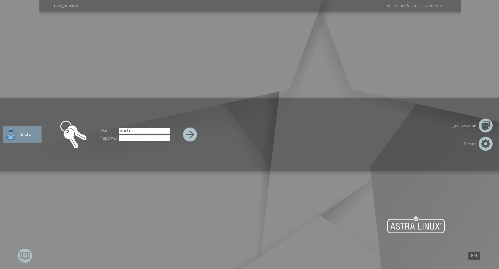


Система потребует ввести логин и пароль пользователя, который вы установили при установке операционной системы.
Следует отметить, что этот пользователь будет иметь привелегии администратора системы.

В операционных системах на базе Linux есть  пользователь, который всегда выполняет роль администратора системы с максимальными привелегиями - root.
В некоторых дистрибутивах - Astra Linux, Debian, Ubuntu и т.д. данный пользователь скрыт и зайти в систему под ним нельзя.

Выполнять команды с максимальными привелегиями можно через команду **sudo**.  Доступ к этой команде есть только у пользователя, которого мы создали в момент установки ОС.
Конечно, если потребуется, можно будет создать и других пользователей с возможностью выполнять команды через **sudo**.

---------------

sudo (англ. Substitute User and do, дословно «подменить пользователя и выполнить»)

---------------

Продемонстрируем это нагляднее, для этого давайте откроем терминал командной строки.
Откройте Меню Пуск --> Системные --> Терминал Fly.

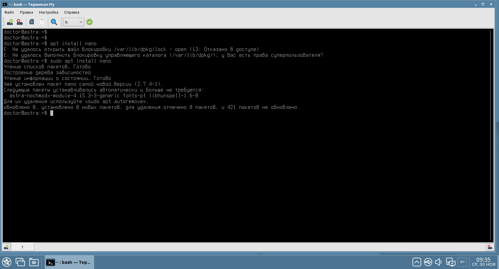

В нашем примере мы попытались установить программу nano - это консольный текстовый редактор.
Первую команду ввели без **sudo**.

Во втором случае мы применили команду **sudo**, если указывать данную команду без ключей, то выполнение произойдет от пользователя root.

Некоторые администраторы ошибочно предполагают, что команда **sudo** используется только для получения прав администратора **root**.
Но если мы воспользуемся встроенной справкой в Linux, то узнаем, какие функции умеет выполнять команда.

Для получения справки введите:
```console
$ sudo -h
```

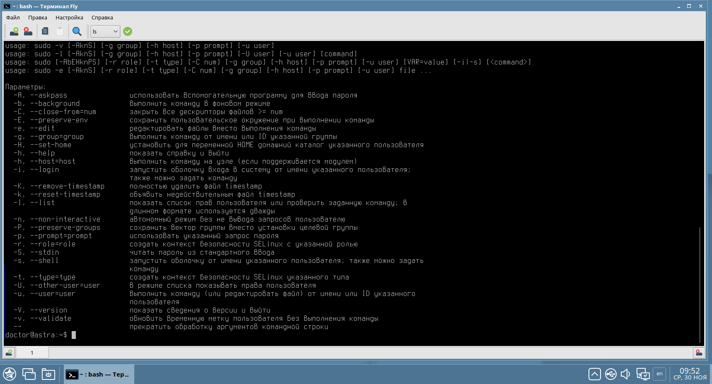

Как можно заметить, у команды sudo встречается ключ -u, который позволяет выполнять команды под именем любого пользователя в системе.

Такая справка встречается для любой команды в Linux, если вам такой справки недостаточно, можно получить развернутую инструкцию прямо в ОС! Для этого даже не требуется соединение с Интернетом. Вся информация хранится уже на вашем компьютере.
Попробуйте ввести команды:
```console
$ man sudo
```

```console
$ info sudo
```

Стоит отметить, что пользователя **root**, по необходимости, можно разблокировать. Достаточно установить ему пароль, сделать это можно с помощью команды:
```console
$ sudo passwd
```


В таком случае пользователь **root** будет доступен. Зайти в графическом интерфейсе под ним нельзя, но зато через терминал - точно получится. Например, есть команда которая позволяет сменить пользователя в терминале!
Называется команда - **su**

---------------

su (сокр. от англ. Substitute User, Set UID, Switch User — замена пользователя, переключение пользователя)

---------------

Давайте попробуем зайти в систему под пользователем root. Введем команду
```console
$ su
```

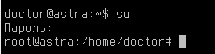

Напоминаем вам, что команда **su**, как и **sudo** предназначена не только для получения доступа к учетной записи **root**! По умолчанию, если не указывать никаких ключей или имен других пользователей, переключение происходит в **root**.

Как можно заметить, теперь мы попали в систему под **root**. А еще, мы почему-то оказались в домашнем каталоге пользователя **doctor** (это пользователь, который автор статьи использует в качестве основного).

Давайте разберем разницу в приветственном сообщении двух пользователей в консоли.

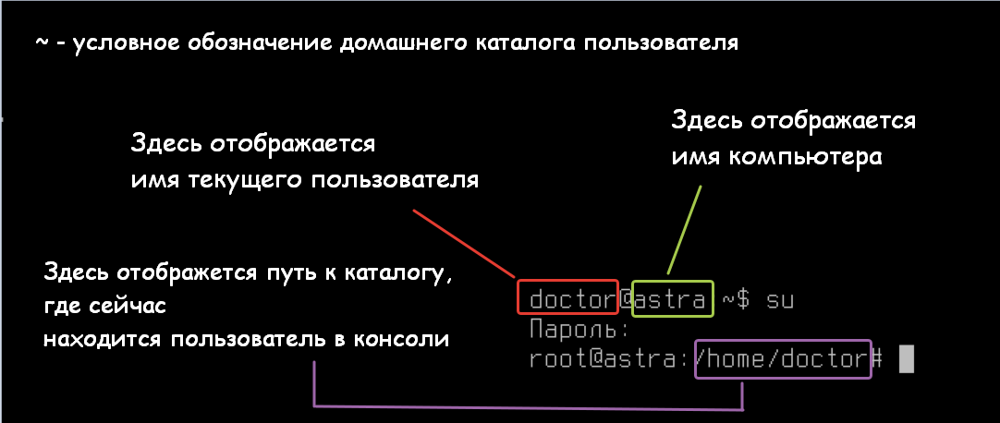

Также, прошу обратить ваше внимание, что в конце сообщения у пользователя **doctor** отображается символ $, а у пользователя **root** символ #. Это также указывает, что у данных пользователей разные привелегии в системе.

Но как так получилось, что мы оказались в каталоге пользователя **doctor**?

Ответ кроется в самой команде **su**.  

Согласно «man su»:
Опции "-, -l, --login" означают "запускать оболочку, как регистрационную ". Получается, что при переходе с помощью «su -» запускается командная строка с настройками, как если бы вы изначально вошли в систему (логинились) под указанного пользователя. В то время как просто «su» — запускает терминал от указанного пользователя и при этом многие переменные окружения наследуются от пользователя, который был до этого.

Пойдем по порядку!

---------------

Переменные окружения (Environmental Variables) - это переменные, которые определены для текущей оболочки и наследуются любыми дочерними оболочками или процессами. Переменные окружения используются для передачи информации в процессы, которые порождаются из оболочки.

Например, вы задумывались, как так получается, что запуская программу на компьютере, она сразу же открывается в том языке, который указан в качестве основного на вашем рабочем месте?
Это благодаря переменным окружения!
Они точно знают, какой у вас часовой пояс, язык системы, разрешение экрана и как вас зовут (и многое другое, к слову).
Эти значения они передают всем запускаемым программам.

Оболочкой называется пространство, где работает пользователь. Бывает две оболочки:
* Графическая - помните, из прошлой статьи различные графические интерфейсы - GNOME,KDE,FLY, XFCE. Это как раз и есть графические оболочки операционной системы.
* Консольная (командная) - это терминал, который вы открыли в начале нашей статьи. Там вас встретила одна из наиболее популярных современных оболочек под Linux - Bash. Это интерпретатор команд, которые вы вводите в терминале.

Если представить себе ядро Linux как центральную часть сферы, то оболочка предстанет в виде внешнего слоя, окружающего ядро.

---------------

Покиньте сессию пользователя **root**
```console
$ exit
```

Теперь давайте проверим, что будет если мы введем команду
```console
$ su -
```

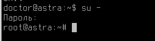

Результат изменился.
"И что?" - возможно подумали вы. Объясняю, в этом случае у вас не "просто сменился каталог", система подключила к вам переменные окружения которые свойственны именно пользователю **root**, а значит изменился и функциональный стек задач, которые вы можете выполнить под этой учетной записью.
Получается **root** на максимальных настройках!

Докажем это еще одним ярким примером. Вернемся в нашего обычного пользователя с помощью известной команды
```console
$ exit
```

Объявим в пользователе **doctor** переменную.
Создать пользовательскую переменную окружения можно с помощью команды export:
```console
$ export A=123
```

Проверить, что переменная действительно появилась, можно с помощью команды:
```console
$ echo $A
```

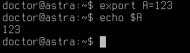

Через $  в Bash происходит обращение к переменным. Запомните эту комбинацию, в ходе будующих работ нам эти знания пригодятся.

Переменная есть. Проверяем что будет, если введем команду
```console
$ su
```

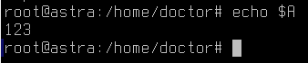

Переменная на месте! Пользователь **root** получил её. Хотя, данную переменную мы задавали только для пользователя **doctor**.

Проверим, что будет в случае применения команды:
```console
$ su -
```

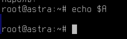

Переменная пропала! Потому что теперь мы полностью сменили окружение для пользователя. Получив, полноценного **root**.

Иногда, в ходе использования системы вы можете столкнуться с тем, что какие-то операции под **root** не выполняются, ссылаясь на ошибку в уровне доступа.
Если такое происходит, убедитесь, что вы не попали в систему через обычный **su**.

# Установка программного обеспечения

Теперь, когда вы научились получать права администратора и знаете его особенности в Astra Linux.
Давайте попробуем что-нибудь установить?

Наверное, вы думаете, что сейчас мы будем скучно открывать браузер, в поисковой системе искать нужную нам программу и потом устаналивать её как на Windows.

Но это не так!
В Linux системах придумали и внедрили пакетные менеджеры - это специальные программы для установки программ.
В каждом дистрибутиве пакетные менеджеры разные:
* В Debian, Astra Linux, Ubuntu и производных дистрибутивах - используется apt
* В CentoS, Red Hat, Fedora - используется dnf
* В SUSE  - используется packman
Каждый пакетный менеджер имеет свои приемущества и недостатки, но объединяет их одно - все они используют для установки программ специальные сервера, где расположены программы - репозитории.

---------------

Репозиторий (от англ. repository — хранилище) — место, где хранятся и поддерживаются какие-либо данные. Чаще всего данные в репозитории хранятся в виде файлов, доступных для дальнейшего распространения по сети.
Репозитории поддерживаются разработчиками ОС. Опубликованные там программы проверены на работоспособность и надежны для применения в работе.

---------------

В Astra Linux воспользоваться пакетным менеджером для установки ПО можно через консольный интерфейс или графическую программу - Synaptic.
Рассмотрим оба варианта.

Начнем с графической программы.
Открыть её можно из Меню Пуск --> Системные --> Менеджер пакетов Synaptic.
При открытии данной программы потребуется ввести пароль от пользователя, ведь установка ПО требует прав администратора системы (не пользователя **root**).

Интерфейс программы Synaptic выглядит вот так.

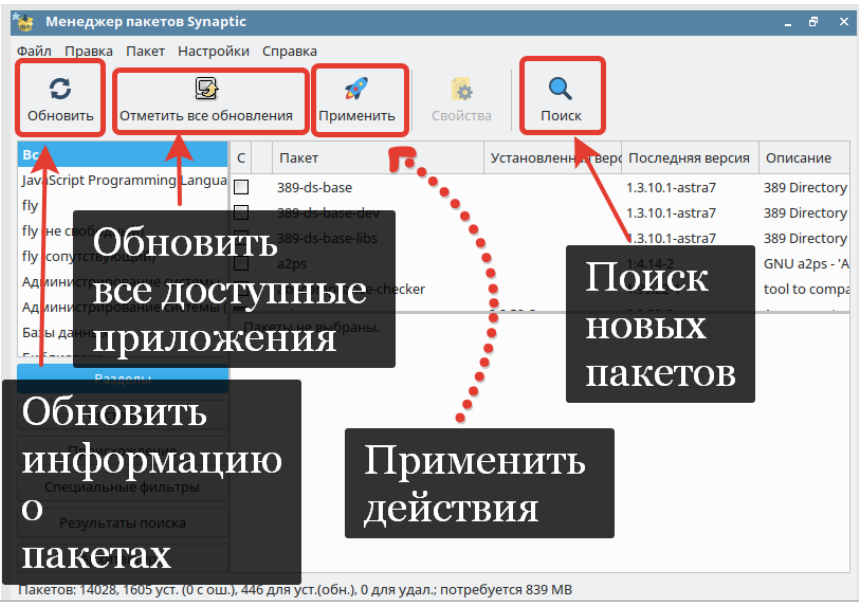

Давайте попробуем установить программу Chromium.

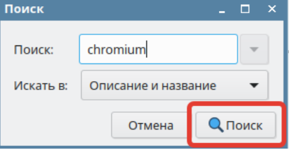

Загружается список всех программных продуктов, которые связаны с Chromium. Выбираем первый пакет с таким названием.
Кликните по "чек-боксу" рядом с названием пакета.

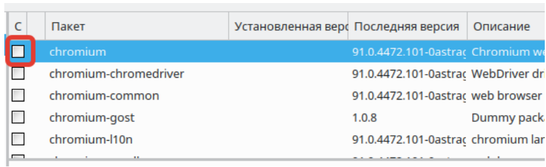

Кроме самого Chromium будут также установлены библиотеки и зависимости программного обеспечения.


Помните, как в Windows вам приходилось скачивать множество разных библиотек и утилит с сайтов?
В Linux это предусмотрели и теперь программы сами знают где и что скачать - чудеса же!

После выбора всех необходимых пакетов, в интерфейсе программы Synaptic они получат зеленое оформление.


Нажмите "Применить" и программы будут установлены на ваш компьютер.

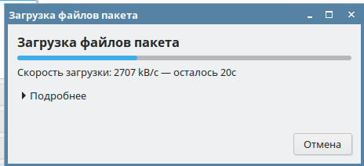

После установки, давайте проверим результат.
Найдите в меню Пуск или вызовете через терминал Chromium
```console
$ chromium
```

Теперь, давайте выполним удаление через Synaptic.
Для этого сделайте всё те же действия, что при установке, но кликните по chromium правой кнопкой мыши.
Далее выберите пункт - отметить для удаления.

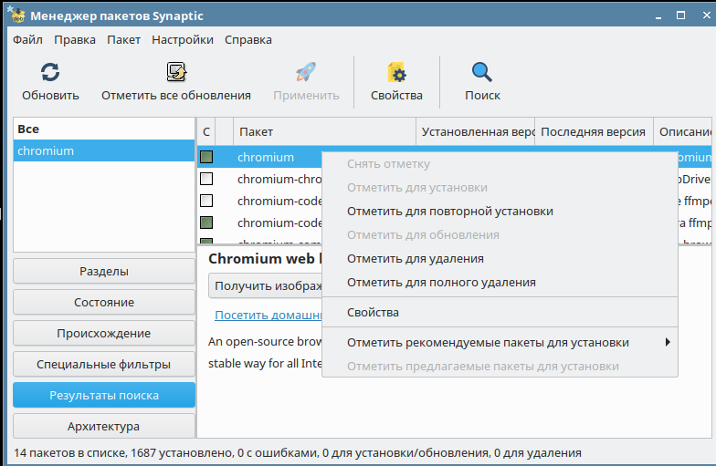

Примените задачу в Synaptic и убедитесь, что программа Chromium была удалена с вашего компьютера.

# А где эти репозитории находятся?

Хороший вопрос!

Данные репозитории являются сетевыми и доступны через компьютерную сеть.
Многие организации делают внутренние репозитории, которые сами и поддерживают. Это безопасно и быстро, а также позволяет организовать непрерывную доступность пакетов, даже если разработчик ОС ведет какие-то работы на своих сетевых репозиториях.
Это также актуально для организации, которые в целом имеют очень ограниченный доступ к Интернет сети. В таком случае создание своего репозитория - это необходимость!

Получить информацию о том, к каким репозиториям подключен ваш компьютер можно из файла:
```console
$ /etc/apt/sources.list
```

А также из директории
```console
$ /etc/apt/sources.list.d/
```

Иногда некоторые программы (например, Яндекс.Браузер или Visual StudioCode на Linux) подключают свои собственные репозитории для обновления. Как раз в /etc/apt/sources.list.d/ они и прописываются.
В этой директории работают только те файлы, которые в названии оканчиваются на слово .list.
Например:
```console
$ yandex.list
```

Давайте посмотрим, как выглядит наш список репозиториев.
С помощью команды cat, посмотрим содержимое документа /etc/apt/sources.list
```console
$ cat /etc/apt/sources.list
```
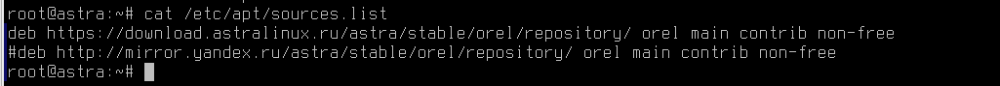

Как можно заметить по скриншоту, у нас подключен репозиторий от разработчиков Astra Linux - download.astralinux.ru

Давайте попробуем установить тот же Chromium через командную строку:
```console
$ apt install chromium
```

Проверьте, что после выполнения команды в Меню Пуск также появился ярлык браузера.

# Настройка браузера.

Теперь, давайте попробуем установить расширения в бразуер Chromium.
Согласитесь, пользоваться Google Store было бы слишком просто?
Мы попробуем установить расширения из уже распакованных шаблонов.
Скачайте архив с шаблонами тут:


Разархивируйте архив средствами вашего файлового менеджера.
Для этого кликните по архиву правой кнопкой мыши --> Распаковать.


Введем команду создания директории.
```console
$ mkdir /opt/plugins
```
В эту директорию необходимо будет перенести все файлы из архива. Сделайте это при помощи файлового менеджера.

По итогу, в вашем каталоге /opt/plugins должны быть файлы, как на скриншоте:

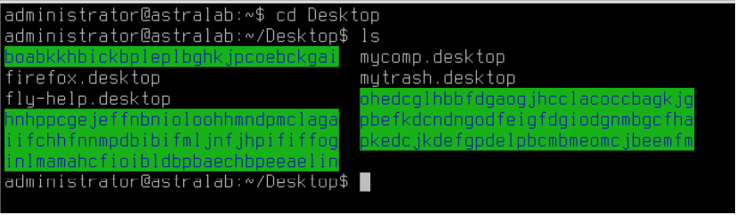

После этого необходимо перейти в конфигурационный файл - **/etc/chromium/default**
И в конце этого файла добавьте строчку
```console
$ export CHROMIUM_FLAGS="$CHROMIUM_FLAGS --load-extensions=`ls -dm /opt/plugins/* 2>/dev/null | tr -d '\n'`"
```
Обратите внимание, что в данной строчке используются одинарные кавычки ‘,
двойные кавычки “, а также гравис - ` (в русском языке гравис используется
крайне редко, найти вы его можете там же где буква Ё на русской раскладке)

Далее попробуйте запустить Chromium и убедиться, что у вас появились новые расширения в браузере!

Убедитесь в том, что расширения были загружены.

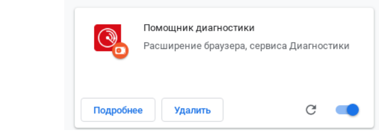

# Как создать оффлайн установщик расширений для браузера?

Алгоритм работы в такой ситуации может быть следующим:
* На компьютер   с доступом в интернет установите желаемое
расширение в браузер
* Найдите файлы расширений на вашем компьютере (в Linux -
$HOME/.config/chromium/Default/Extensions;)
* Перенесите файлы  уже на целевой машине скопируйте в
аналогичную папку /opt/plugins (или другую, описанную вами в файле
/etc/chromium/default)
* Данная настройка применяется на всех пользователей в системе по-умолчанию

# Теперь вы имеете базовое представление о операционной системе Astra Linux, научились устанавливать и удалять ПО, а также выполнять его настройку!
# В следующем уроке мы разберем, как решать проблемы с зависимостями программного обеспечения в Linux, если сам пакетный менеджер не справляется. Узнаете, что такое низкоуровневый и высокоуровневые пакетные менеджеры.
