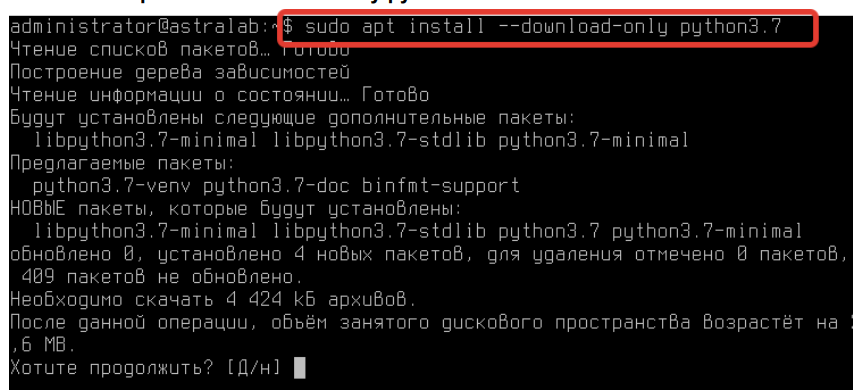
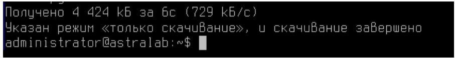
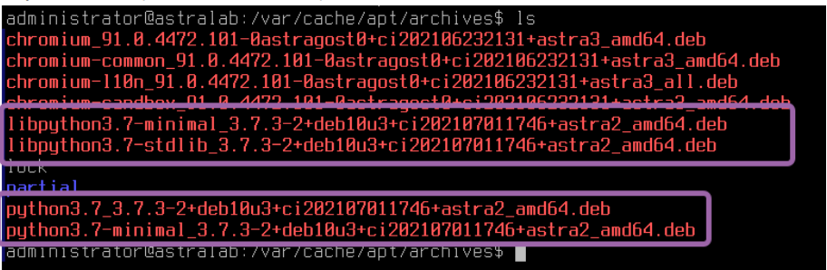
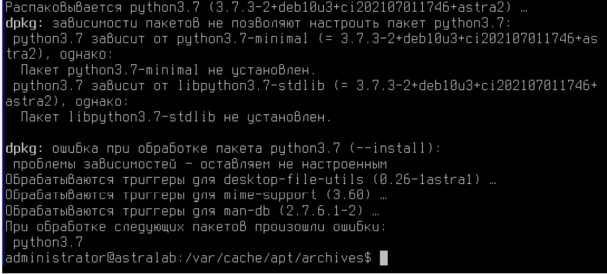

# Статья №3.

# Astra Linux -  базовая работа с пакетным менеджером

# Установка ПО
В прошлой статье мы обсуждали установку и удаление программ через консольную утилиту APT, а также через графический интерфейс данной программы - SYNAPTIC.

Стоит еще раз напомнить, что обе программы испольузют единой хранилище репозиториев:
```console
$ /etc/apt/sources.list/
```
И
```console
$ /etc/apt/sources.list.d/
```

Давайте потренируемся еще. Установите программу remmina.
---------------
Remmina - это клиент удаленного рабочего стола для компьютерных операционных
систем на базе POSIX. Он поддерживает протоколы удаленного рабочего стола,
VNC, NX, XDMCP, SPICE, RDP.
---------------

# А можно ли программу только скачать, но без установки?

Да, такое возможно!

Это полезно, в случае, если вам необходимо перенести установочные пакеты на
машину, которая не имеет доступа в интернет или для того чтобы удовлетворить
некоторые пакетные зависимости.

Введите команду:
```console
$ sudo apt install --download-only python3
```



Обратите внимание, что в конце выполнения команды система сообщила вам о выборе режиме "Только скачивание"



Куда же сохранились все скачанные документы?

Все программные компоненты Python3 были скачаны в директорию:
```console
$ /var/cache/apt/archives
```



Обратите внимание на формат данных файлов - .deb.

---------------
deb (сокращение от Debian) — расширение имён файлов «бинарных»
пакетов для распространения и установки программного обеспечения в
операционной системе проекта Debian, и других, использующих систему
управления пакетами dpkg.
---------------

---------------
dpkg — это программное обеспечение, являющееся основой системы
управления пакетами в Debian и ряде других операционных систем,
основанных на Debian, например Astra Linux. dpkg используется для установки,
удаления, и получения информации о .deb пакетах. dpkg является довольно
низкоуровневой утилитой.
---------------

# Получается, что в системе присутствует два инструмента управленния программами - это APT и DPKG?

Да, и они гармонично дополняют друг друга.

На самом деле, когда APT устанавливает пакет, он фактически использует dpkg для установки. APT в данном примере выступает в роли удобного интерфейса для работы с DPKG.
При этом, сам DPKG не умеет подключаться к репозиториям - это заслуга системы APT.

Помните, в прошлой статье мы упомянули, что множество программ в Linux имеют зависимости?
Это в случае, когда программа использует другие библиотеки или языки программирования для своей работы (например, если устанавливаете LibreOffice - это популярная офисная программа на Linux, то для её работы требуется Python определенных версий)

Так вот, DPKG не умеет самостоятельно находить зависимости. Он умеет лишь информировать вас, как пользователя системы, что в момент установки произошли проблемы. APT - берет решение данных неудобств на себя.

Из-за того, что DPKG не работает с зависимостями, он также плохо удаляет программы с компьютера, так как не способен в полной мере разобраться с компонентами удаляемой программы. APT - с этим справится идеально!

Вот и причина, по которой DPKG - низкоуровневый пакетный менеджер, а APT - высокоуровневый.

Умение работать с DPKG - важный навык, давайте попробуем установить скачанные ранее .deb пакеты.

Для этого перейдите в каталог с deb-пакетами воспользуйтесь командой:
```console
$ dpkg -i python3....
```

Как вы можете заметить, название файлов Python3 достаточно большое, вручную писать такое название - будет  долго. Нажмите клавишу <Tab> и тогда произойдет автозаполнение названия файлов.
Пользуйтесь данной функцией, она сэкономит сотни часов в вашей работе за компьютером.

---------------
Следует напомнить, что каждая команда в Linux имеет встроенную справку, с
которой можно познакомиться с помощью команд:
1) **<название_команды> -h** - ключ -h (от англ. Help - помощь)
2) **<название_команды> --help** - ключ --help (от англ. Help - помощь)
3) **man <название_команды>** - man (от англ. manual - мануал)
---------------

Обратите внимание, после попытки установить программу система выдала ошибку с зависимостями.



Исправить её можно двумя способами:
* Обратиться к высокоуровневому APT через ключ -f.
Данный ключ удовлетворяет программные зависимости системы.
```console
$ apt install -f
```

Стоит обратить ваше внимание, что APT, в случае если не способен найти зависимости для программы - просто удалит её. Внимательно читайте вывод пакетного менеджера, перед тем как соглашаться на его предложения.

* Установить пакеты вручную. Видите, в нашем примере программа жалуется на отсутствие некоторых библиотек?
Как удачно, что они уже скачаны в каталоге /var/cache/apt/archives. Установите их также, через dpkg.

Обратите внимание,что DPKG можно передать сразу несколько файлов для установки


Установилось?

Давайте проверим это, запуститесь Python3 командой
```console
$ python3
```
Или
```console
$ python3.7
```
